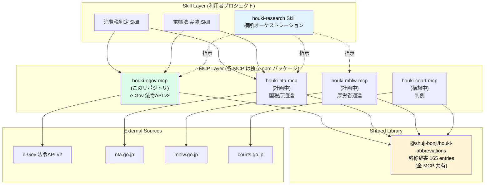

# 設計ノート

## 設計の3原則

1. **コアは薄く、責務は分担** — e-Gov 担当はこのリポジトリ。通達・判例は別 MCP。略称辞書は別パッケージ
2. **共有は npm パッケージで** — `@shuji-bonji/houki-abbreviations` を共通ライブラリとして再利用
3. **bulk DL + FTS5 を差別化価値に** — API 方式では出せない横断検索精度（Phase 2）

## 想定利用シーン — なぜ6分野を網羅するのか

### 実装実現調査の丸投げ問題

日本の SI・自社開発の現場では、**オーナーからエンジニアへの実装依頼の背後に、本来エンジニアの範囲外である法令調査が潜んでいる**ことが多い。

| ありがちな依頼 | 裏で調べる必要があった法令 |
|---|---|
| 「請求書を電子化して」 | 電帳法・インボイス制度（消法57条の4）・適格請求書要件・JIIMA認証 |
| 「契約書を電子化して」 | 電子署名法2条・3条、立会人型/当事者型、長期保存、タイムスタンプ |
| 「本人確認を実装して」 | 犯収法・e-KYC ガイドライン（ホ方式/ワ方式） |
| 「決済を入れて」 | 資金決済法・割販法・景表法・特商法 |
| 「チャット問い合わせ」 | 個情法・プロ責法・特電法（メルマガあり） |
| 「車関連のデータ収集」 | 道交法・道運法・個情法・位置情報ガイドライン |
| 「モデレーションを実装」 | 著作権法・プロ責法・青少年ネット環境整備法 |
| 「フリーランスに発注」 | フリーランス新法（2024年11月施行） |

houki-egov-mcp は、**この「壁を越えるコスト」を下げる**ために、分野を横断的にカバーする辞書とコアを提供する。LLM と併せれば、エンジニアが「まずは何を読めばいいか」を数秒で把握できる。

### 分野ごとのカバー範囲

| シーン | 必要になる法令例 | houki-egov-mcp のカバー |
|---|---|---|
| EC・サブスクサービス開発 | 特商法・景表法・割販法・消契法・個人情報保護法 | ✓ commercial / administrative |
| UGC・SNS サービス開発 | プロバイダ責任制限法・著作権法・個人情報保護法 | ✓ commercial / administrative |
| 決済・暗号資産サービス | 資金決済法・金商法・犯収法 | ✓ commercial |
| ヘルステック・フードテック | 薬機法・食衛法・医師法 | ✓ administrative |
| HRテック・副業マッチング | 派遣法・職安法・労基法・個人情報保護法 | ✓ labor / administrative |
| 不動産テック・建設テック | 宅建業法・建基法・都計法 | ✓ administrative |
| モビリティ・配送 | 道交法・道運法 | ✓ administrative |
| フリーランス青色申告 | 所法・消法・措法 | ✓ tax |
| スタートアップ創業 | 会社法・金商法・独禁法 | ✓ commercial |
| 労務管理・36協定 | 労基法・安衛法・育介法 | ✓ labor |

どのシーンでも「一次情報を引く」「LLM に論点整理させる」「必要なら有資格者に渡す」という使い方は共通。houki-egov-mcp は**最初の「引く」ステップ**に特化する。

通達・判例まで踏み込みたい場合は、houki-hub family の他 MCP（`houki-nta-mcp` / `houki-mhlw-mcp` / `houki-court-mcp` 等）を併用する。

## アーキテクチャ — Architecture E

このリポジトリ（緑）は **e-Gov 担当**。各 MCP は独立 npm パッケージとして配布され、Skill 層が複数の MCP を組み合わせる。

## 既存 MCP からの継承マトリクス

| 機能 | 取り込み元 | 改良ポイント |
|---|---|---|
| 略称辞書 | tax-law / labor-law | **6分野 165エントリ** + `category` / `source_mcp_hint` 拡張。houki-abbreviations に独立 |
| 条/項/号部分取得 | tax-law | API v2 の `article` 指定を正しく利用（`30_2` 形式対応） |
| 目次モード | tax-law | 全ツールに装備 |
| 全文検索 | e-gov-law（思想） | bulkDL + SQLite FTS5 で再実装（Phase 2） |
| 版指定（時点の法令） | e-Gov v2 仕様 | `at=YYYY-MM-DD` |
| 改正履歴取得 | e-Gov v2 仕様 | `get_law_revisions`（v0.1.1 で追加） |
| Markdown整形 | tax-law / labor-law | デフォルト。JSON はフラグ切替 |
| `legal_analysis_instruction` 的プロンプト注入 | e-gov-law | **排除** |

## API vs Bulk の戦略

| モード | 起動 | オフライン | 全文検索精度 | 初回DL | 用途 |
|---|---|---|---|---|---|
| API（デフォルト） | 即時 | × | API準拠 | 0 | 単発条文引き |
| Bulk（Phase 2、`HOUKI_EGOV_BULK_CACHE=1`） | 初回遅 | ○ | FTS5 | 数百MB〜 | Skill 常用 |

起動時に Bulk モードが有効なら、バックグラウンドで月次アーカイブを取得→SQLite にインデックス。Bulk にある条文は Bulk から即返す。

## 略称辞書のポリシー

略称辞書は v0.2.0 から `@shuji-bonji/houki-abbreviations` に独立しています。

- `law_id` は **e-Gov で動作確認済みのもののみ**格納。未確認は `null`
- v0.1.0 時点で6分野・**165エントリ**
- エントリには `category`（`law` / `cabinet-order` / `kihon-tsutatsu` 等）と `source_mcp_hint`（`houki-egov` / `houki-nta` 等）を持たせ、各 MCP が「自分の管轄」を識別できる

詳細・貢献方法は [houki-abbreviations の README](https://github.com/shuji-bonji/houki-abbreviations) と [CONTRIBUTING](https://github.com/shuji-bonji/houki-abbreviations/blob/main/CONTRIBUTING.md) を参照。

## デジタル庁公式 MCP との共存シナリオ

| 公式 MCP の内容 | houki ファミリーの進化 |
|---|---|
| 条文のみ（通達・判例なし） | houki-egov-mcp のコアを公式に委譲、通達・判例系の MCP は継続 |
| 条文＋通達 | 競合しない領域（裁決・下級裁・自治体条例 等）に注力 |
| 薄いまま公開されない | houki-egov-mcp が引き続きコア役 |

どのシナリオでも **MCP を独立に分けた Architecture E** なら、特定 MCP の役割を入れ替えるだけで済み、無駄な作業はほぼゼロ。

## 開発フェーズ

| Phase | 内容 | 状態 |
|---|---|---|
| Phase 0 | スケルトン整備 | ✅ 2026-04-23 完了 |
| Phase 1 | e-Gov 法令API v2 コア実装 + 7ツール | ✅ 2026-04-25〜04-26 完了 |
| **Architecture E 転換** | houki-egov-mcp / houki-abbreviations / 各 MCP に分離 | ✅ 2026-04-27 (v0.2.0) |
| Phase 2 | bulkDL + SQLite FTS5（`search_fulltext` 本実装） | 計画中 |
| Phase 3 | houki-hub family の他 MCP リリース（nta / mhlw / court 等） | 進行中 |
| Phase 4 | デジタル庁公式 MCP とのアダプタ層 | 公式リリース時 |

## houki-hub family のロードマップ

各 MCP は **独立 npm パッケージ**として実装し、houki-abbreviations を共有依存とする。

### 通達・告示・Q&A 系

既存の個人 OSS 実装（`kentaroajisaka/tax-law-mcp` / `labor-law-mcp`）の作法を参考に、各省庁・審判機関のスクレイピング系として整備する。

| パッケージ | 対象 | 主な実務テーマ |
|---|---|---|
| `@shuji-bonji/houki-nta-mcp` | 国税庁 基本通達・措置法通達・取扱通達・Q&A・タックスアンサー | 電帳法・インボイス・税務全般 |
| `@shuji-bonji/houki-mhlw-mcp` | 厚生労働省 通達・告示 | 労務・社保 |
| `@shuji-bonji/houki-jaish-mcp` | 安全衛生情報センター 通達 | 労安全衛 |
| `@shuji-bonji/houki-saiketsu-mcp` | 国税不服審判所 公表裁決事例 | 税務争訟 |
| `@shuji-bonji/houki-meti-mcp` | 経済産業省 通達・告示・ガイドライン | 電子契約・下請法 |
| `@shuji-bonji/houki-soumu-mcp` | 総務省 通達・告示 | 電気通信事業・サイバーセキュリティ |
| `@shuji-bonji/houki-moj-mcp` | 法務省 通達・通知 | 登記・会社法・民事 |
| `@shuji-bonji/houki-ppc-mcp` | 個人情報保護委員会 ガイドライン・Q&A | 個情法・マイナンバー |
| `@shuji-bonji/houki-fsa-mcp` | 金融庁 監督指針 | 金商法・資金決済・銀行・保険 |

各 MCP は **`{namespace}_search` / `{namespace}_get` / `{namespace}_list`** の3ツールに `type` パラメータ（`tsutatsu` / `kokuji` / `qa` / `guideline` 等）を渡してフィルタする統一 I/F を採用予定。

### `@shuji-bonji/houki-court-mcp`（民事判決等）

判決検索は **2026年度から状況が大きく変わる**ため、3段階で設計する。

| Stage | 内容 | 入手手段 | 想定時期 |
|---|---|---|---|
| **Stage A** | 裁判所サイトの公開判決（数百〜2万件規模）をスクレイピング | `courts.go.jp/app/hanrei_jp/` | 構想中 |
| **Stage B** | **民事判決オープンデータ API**（年間約20万件公開予定）を叩く | 日弁連法務研究財団／最高裁が提供する公式 API | **2026年度〜（API 仕様公開待ち）** |
| **Stage C** | API ベースの bulk 取得 + ローカル SQLite FTS5（コア層と同じ分散型 ground truth 思想を判例まで拡張） | bulk DL 提供があれば | 将来構想 |

> Stage B は外部要因依存。日弁連法務研究財団が主導する民事判決オープンデータ化が 2026年度から運用開始予定。AI でマスキングした判決を年間約20万件公開する方針。API 仕様が公開されたら houki-court-mcp として実装する。

### 自治体・国際

| パッケージ | 対象 | 想定時期 |
|---|---|---|
| `@shuji-bonji/houki-jorei-{県名}-mcp` | 都道府県条例 | 未定 |
| `@shuji-bonji/houki-intl-{国名}-mcp` | 日本語訳付き他国法令 | 未定 |

### Skill 層

houki-hub family を組み合わせた業務ドメイン特化 Skill を、別途 `.claude/skills/houki-research/` 等に整備する予定。

- 「houki ファミリーの全体像」「どの MCP を使えばいいか」のオーケストレーション知識を持たせる
- 業法独占規定（弁護士法72条等）への注意は Skill レイヤに置く（v0.1.x まで houki-egov-mcp 内にあった `explain_business_law_restriction` は v0.2.0 で削除）

## 開発着手前の必須工程（Phase 2 以降）

各 MCP の本実装に入る前に、**2週間の実運用痛点ログ**（`docs/PAIN-POINTS-TEMPLATE.md`）を houki-egov-mcp + 既存 MCP で実施。「本当に必要な機能だけ」で MVP スコープを絞ってから着手する。

---

## 業法との関係

houki-hub family の立ち位置は「個人利用のセカンドオピニオン・ツール」であり、以下の業法で定める **業務独占**を尊重する設計を採る。

### 関連する業法

| 法 | 条文 | 独占業務の要件 |
|---|---|---|
| 弁護士法 | 第72条 | 有償 × 個別具体の**法律事務**の業としての取扱い |
| 税理士法 | 第52条 | 有償 × **税務代理・税務書類作成・税務相談**の業としての提供 |
| 社会保険労務士法 | 第27条 | **労働社会保険諸法令に基づく申請書等の作成・提出代行**の業としての提供 |

共通して **「有償性」×「個別具体性」×「業としての反復継続」** が揃った場合に発動する。

### houki-hub family の設計への反映

1. **判断ロジックを内蔵しない**  
   条文・通達・裁決を取得して返すのみ。「課税か非課税か」「割増賃金はいくらか」といった判断は LLM と利用者の領分。MCP 側は事実に徹する。

2. **一次情報は必ず出典 URL 付きで返却**  
   「AI がそう言った」ではなく「e-Gov のこの URL にこう書かれている」と利用者が確認できるようにする。

3. **利用範囲を DISCLAIMER で明示**  
   業として使う場合は有資格者の監督下でという方針を、各 MCP の README / DISCLAIMER に明記。技術で強制せず、**設計と文書で誘導**する。

4. **業法独占規定の注意は Skill 層で**  
   v0.1.x まで `explain_business_law_restriction` ツールとして houki-egov-mcp に同梱していたが、これは「使う側の注意点」であって e-Gov の責務ではないため、Skill 層（`.claude/skills/houki-research/business-law-caution.md` 予定）に移設する。

### 「個人が自分の案件に使うこと」は業法の規制外

個人が自分自身の案件を調べるために AI を使うこと自体は、上記の業法の規制対象ではない。有償性が無く、他人の業務として提供しているわけではないため。

ただし、**裁判所・税務署・労働基準監督署は「AI がそう言った」を根拠として受け付けない**。そのため、houki-hub family は一次情報の URL を返すことを重視している。利用者が必要なら自分で一次情報に飛んで確認できる。

### 権威レイヤとの役割分担

| レイヤ | 提供者 | 性格 |
|---|---|---|
| **権威** | デジタル庁公式 MCP（将来）/ LegalOn / MNTSQ | 「正しさの基準」。有資格者の監修付き、商用ライセンス |
| **セカンドオピニオン** | houki-egov-mcp / houki-nta-mcp / kentaroajisaka/tax-law-mcp 等 | ノンベンダー個人 OSS。網羅性・横断性で補完 |
| **判断** | 有資格者（弁護士・税理士・社労士） / 利用者自身 | 最終責任 |

houki-hub family はセカンドオピニオン層に徹することで、権威レイヤとも判断レイヤとも**競合しない**。それぞれの強みを尊重する。
