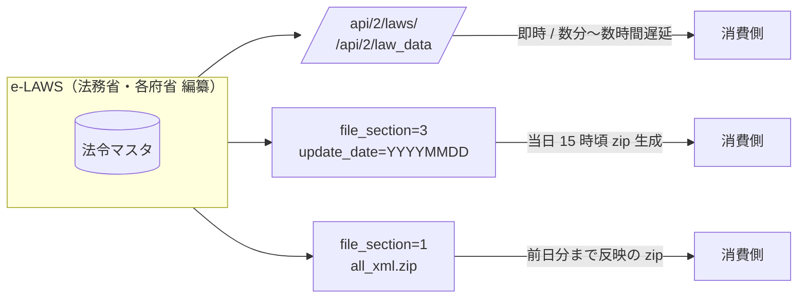

# Phase 2 Spike — e-Gov bulk download / 差分取得 仕様調査

**実施日:** 2026-05-08
**対象:** e-Gov 法令検索 XML 一括ダウンロード ([https://laws.e-gov.go.jp/bulkdownload/](https://laws.e-gov.go.jp/bulkdownload/)) と 法令API v2 ([https://laws.e-gov.go.jp/api/2/swagger-ui/lawapi-v2.yaml](https://laws.e-gov.go.jp/api/2/swagger-ui/lawapi-v2.yaml))

## 結論サマリ

| 項目 | 結論 |
|---|---|
| HTTP-level conditional GET (Last-Modified / ETag) | **使えない** — `cache-control: no-cache, no-store` の動的 PHP レスポンス |
| 差分取得手段 | **`file_section=3&update_date=YYYYMMDD` で日付指定の差分 zip を取得可能（過去 3 ヶ月分）** |
| 全件アーカイブ | **`file_section=1` → `all_xml.zip` (約 285 MB / 約 3.2 GB 展開、20,411 ファイル、10,205 法令)** |
| カテゴリ別アーカイブ | `file_section=2&category_cd={1-42}` で 42 カテゴリに分割可能 |
| 法令メタデータ | 各 zip 同梱の `all_law_list.csv` (10,206 行 / 14 列) をマニフェストとして使える |
| /laws API の `updated_from` 等 | **未対応**（パラメータ無視され total_count 不変を実証） |
| API と bulk DL の同期 | **同じ e-LAWS マスタ**から派生。**長期一致 / 短期は最大 24h ずれる**（§6.4 で実証） |
| spike 結論 | houki-nta-mcp の HTTP 304 戦略は流用不可。**`update_date` パラメータでアプリケーション層の差分取得**を採用する |

## 1. 全件 bulk download

### 1-1. エンドポイント

```
GET https://laws.e-gov.go.jp/bulkdownload?file_section=1&only_xml_flag=true
```

### 1-2. レスポンスヘッダ実測

```
HTTP/2 200
content-type: application/octet-stream
content-disposition: attachment; filename="all_xml.zip"
cache-control: max-age=0, no-cache, no-store
pragma: no-cache
date: Fri, 08 May 2026 14:02:28 GMT
```

注目点:

- **`Last-Modified` / `ETag` / `Content-Length` のいずれも返ってこない**
- `cache-control: no-cache, no-store` — 毎回動的生成
- CloudFront の `x-cache: Miss from cloudfront` だが、エッジには載らない構成

→ **HTTP 304 ベースの conditional GET は事実上使えない**。houki-nta-mcp Phase 6-2 で採用した `If-Modified-Since` 戦略をそのまま流用することはできない。

### 1-3. ペイロード実測

| 項目 | 値 |
|---|---|
| 圧縮済みサイズ | **285,803,544 byte（約 285 MB）** |
| 展開後の合計サイズ | **約 3.17 GB** (`3,172,721,529 byte`) |
| ファイル数 | **20,411 ファイル**（10,205 ディレクトリ + 10,205 XML + `all_law_list.csv`） |
| zip 内タイムスタンプ | `2026-05-07 15:01〜15:02`（前日に再生成） |

### 1-4. zip 構造

```
all_xml.zip
├── all_law_list.csv             (5.85 MB / 10,206 行 = 1 header + 10,205 法令)
├── 105DF0000000337_18721109_000000000000000/
│   └── 105DF0000000337_18721109_000000000000000.xml
├── 322AC0000000149_20250601_504AC0000000068/
│   └── 322AC0000000149_20250601_504AC0000000068.xml
└── ... (10,205 法令分)
```

ディレクトリ名・ファイル名のフォーマットは:

```
{lawId}_{enforcementDate:YYYYMMDD}_{revisionLawId or 000000000000000}
```

- **`lawId`**: e-Gov の法令 ID（例: `322AC0000000149`）
- **`enforcementDate`**: 施行日（YYYYMMDD）
- **`revisionLawId`**: 改正法令 ID（新規制定の場合は zero-padding）

### 1-5. all_law_list.csv の列構造

`UTF-8 with BOM`、CRLF、14 列:

| 列 | 内容 | 例 |
|---|---|---|
| 1 | 法令種別 | `政令` / `法律` / `府省令` |
| 2 | 法令番号 | `明治五年太政官布告第三百三十七号` |
| 3 | 法令名 | `明治五年太政官布告第三百三十七号（改暦ノ布告）` |
| 4 | 法令名読み | `かいれきのふこく` |
| 5 | 旧法令名 | (空文字 or 旧称) |
| 6 | 公布日 | `明治五年十一月九日`（和暦テキスト） |
| 7 | 改正法令名 | (空文字 or 改正名) |
| 8 | 改正法令番号 | (空文字 or 改正番号) |
| 9 | 改正法令公布日 | `平成十四年八月十二日` |
| 10 | 施行日 | `明治五年十一月九日` |
| 11 | 施行日備考 | (空文字 or 備考) |
| 12 | 法令ID | `105DF0000000337` |
| 13 | 本文URL | `https://laws.e-gov.go.jp/law/105DF0000000337/18721109_000000000000000` |
| 14 | 未施行 | (空文字 or `未施行`) |

**Phase 2 implications:**

- 列 12「法令ID」と列 13「本文URL」が DB primary key 候補。
- 列 6/9/10 は **和暦テキスト**で扱う必要があり、API v2 の `promulgation_date: "1872-11-09"`（西暦）とは形式が違う。**API レスポンスをマニフェストに利用するか、和暦パーサを作るか**の判断が必要。
- 列 14「未施行」は **施行待ちの改正法令**を識別するためのフラグ。FTS で除外するか別ステータスとして扱う。

## 2. カテゴリ別 bulk download

### 2-1. エンドポイント

```
GET https://laws.e-gov.go.jp/bulkdownload?file_section=2&category_cd={1-42}&only_xml_flag=true
```

### 2-2. カテゴリ一覧（実測 42 カテゴリ）

| cd | 名称 | cd | 名称 | cd | 名称 |
|---|---|---|---|---|---|
| 1 | 憲法 | 15 | 電気通信 | 29 | 外国為替・貿易 |
| 2 | 刑事 | 16 | 国家公務員 | 30 | 厚生 |
| 3 | 財務通則 | 17 | 国土開発 | 31 | 地方自治 |
| 4 | 水産業 | 18 | 事業 | 32 | 道路 |
| 5 | 観光 | 19 | 商業 | 33 | 文化 |
| 6 | 国会 | 20 | 労働 | 34 | 陸運 |
| 7 | 警察 | 21 | 行政手続 | 35 | 社会福祉 |
| 8 | 国有財産 | 22 | 土地 | 36 | 地方財政 |
| 9 | 鉱業 | 23 | 国債 | 37 | 河川 |
| 10 | 郵務 | 24 | 金融・保険 | 38 | 産業通則 |
| 11 | 行政組織 | 25 | 環境保全 | 39 | 海運 |
| 12 | 消防 | 26 | 統計 | 40 | 社会保険 |
| 13 | 国税 | 27 | 都市計画 | 41 | 司法 |
| 14 | 工業 | 28 | 教育 | 42 | 災害対策 |

実装上の注意: `file_section=2` のレスポンスは `27_xml.zip` のような **`{category_cd}_xml.zip`** 命名。

## 3. 差分 bulk download（Phase 2 のキー機能）

### 3-1. エンドポイント

```
GET https://laws.e-gov.go.jp/bulkdownload?file_section=3&update_date=YYYYMMDD&only_xml_flag=true
```

> 公式注釈: 「更新法令データの取得範囲は過去 **3 ヶ月** です」

### 3-2. 実測例（2026-05-07 の差分）

| 項目 | 値 |
|---|---|
| URL | `?file_section=3&update_date=20260507&only_xml_flag=true` |
| ファイル名 | `R080507_xml.zip`（Reiwa 8 年 5 月 7 日） |
| 圧縮済みサイズ | **2,288,858 byte（約 2.2 MB）** |
| 展開後合計 | 約 22.5 MB |
| ファイル数 | **83 ファイル**（41 法令 × 2 + `R080507.csv`） |

### 3-3. 差分 zip の構造

全件 zip と同じ構造で、当日更新分の法令フォルダのみが入る。`R080507.csv` は当日更新分の法令だけのマニフェスト（21 KB / フォーマットは `all_law_list.csv` と同等）。

### 3-4. Phase 2 differential 戦略

houki-nta-mcp の HTTP 304 の代わりに、**「最後に同期した日付」を DB に持って毎日 N 日分の `update_date` を取得**する設計が適切:

```sql
-- houki-egov-mcp の sync_state テーブル
CREATE TABLE sync_state (
  id INTEGER PRIMARY KEY,
  last_sync_date TEXT NOT NULL,        -- '2026-05-07'
  last_full_dl_at TEXT NOT NULL,       -- '2026-05-01T00:00:00+09:00'
  bulk_source TEXT NOT NULL DEFAULT 'all_xml',  -- 'all_xml' | 'category_27' | etc
  total_laws INTEGER NOT NULL DEFAULT 0
);
```

擬似コード:

```ts
// 1. last_sync_date 〜 today の差分を順次取り込む
const today = formatYmd(new Date());
const lastSyncDate = await db.get('SELECT last_sync_date FROM sync_state');

for (const date of dateRange(lastSyncDate, today)) {
  const zip = await fetchEgovBulk({ file_section: 3, update_date: date });
  if (!zip) continue;
  await ingestZip(db, zip);
  await db.run('UPDATE sync_state SET last_sync_date = ?', date);
}

// 2. 3 ヶ月以上遡れない場合は全件 DL に fallback
if (daysSince(lastSyncDate) > 90) {
  warn('差分取得範囲を超えました。全件 DL に fallback します');
  await fullBulkDl();
}
```

## 4. /api/2/laws の `updated` フィールドと差分

### 4-1. swagger 確認

OpenAPI 仕様 (`https://laws.e-gov.go.jp/api/2/swagger-ui/lawapi-v2.yaml`) で `/laws` のパラメータを確認した結果:

サポートされている filter:

- `law_id` / `law_num` / `law_num_era` / `law_num_num` / `law_num_type` / `law_num_year`
- `law_title` / `law_title_kana`
- `law_type` (複数指定可)
- `amendment_law_id`
- `promulgation_date_from` / `promulgation_date_to` （※公布日基準）
- `category_cd`
- `mission` / `current_revision_status` / `repeal_status`
- `limit` / `offset` / `response_format`

**`updated_from` / `updated_to` は仕様に存在せず**、実測でも `updated_from=2026-01-01` を付けても `total_count` が変わらず（9,490 件のまま）= パラメータ無視。

### 4-2. /laws レスポンスの `revision_info.updated`

```json
{
  "revision_info": {
    "law_revision_id": "105DF0000000337_18721109_000000000000000",
    "law_title": "明治五年太政官布告第三百三十七号（改暦ノ布告）",
    "updated": "2024-02-15T10:24:49+09:00",
    ...
  }
}
```

各法令には ISO 8601 形式の `updated` が入っている。**bulk DL でなく、API 側で「全件取得 → updated でフィルタ」も技術的には可能**だが、9,490 件 × 1 リクエスト = 大量 API call になるため非推奨。`file_section=3&update_date=` の方が圧倒的に効率的。

## 5. houki-nta-mcp Phase 6-2 との比較

| 観点 | houki-nta-mcp | houki-egov-mcp Phase 2 |
|---|---|---|
| データ源 | 国税庁 HP の HTML スクレイピング | e-Gov 公式 bulk download (zip) |
| 全件サイズ | 数百ページ × HTML ≒ 数十 MB | **285 MB zip / 3.2 GB 展開** |
| Last-Modified | **使える** (HTML レスポンスに付与) | **使えない** (no-cache で配信) |
| ETag | あれば使う | なし |
| 差分取得 | `If-Modified-Since` で 304 を返してもらう | **`update_date` URL parameter で日付指定 zip** |
| 差分粒度 | ページ単位 | **日付単位** (1 日分の更新法令を含む zip) |
| catch-up 上限 | なし（baseline の content_hash 比較） | **過去 3 ヶ月**（3 ヶ月超は全件 DL） |
| sync_state | section.fetched_at / etag / last_modified | **`last_sync_date` (YYYY-MM-DD) を 1 列だけ持てば十分** |

## 6. Phase 2 設計への含意

### 6-1. 維持できる houki-nta-mcp パターン

- **schema migration の additive ALTER TABLE**: そのまま流用
- **content_hash で no-op 判定**: zip 内の各 XML について計算して持つ
- **freshness 判定 (StalenessLevel)**: `last_sync_date` を `fetched_at` 相当として houki-abbreviations の純関数を流用
- **CLI の `--bulk-download-everything` / `--bulk-download-incremental` の使い分け**: そのまま採用

### 6-2. 新規に必要な実装

1. **zip 展開 + CSV パース層** (houki-nta-mcp は HTML パース、ここは XML パース + CSV 検証)
2. **`update_date` ループ処理** (`last_sync_date` から today まで日次 fetch)
3. **3 ヶ月超 catch-up の fallback** (差分 → 全件 DL に切替えるロジック)
4. **法令 XML → SQLite FTS5 取り込み** (e-Gov 法令標準 XML スキーマの主要要素を DB schema に落とし込む)

### 6-3. 不要 / 別実装になるもの

- **HTTP `If-Modified-Since` ハンドラ**: 不要（ヘッダがそもそも来ない）
- **last_modified / etag DB 列**: 不要（`last_sync_date` のみで足りる）
- **ページ単位の content_hash diff**: 法令単位での content_hash diff に置換

## 6.4 ライフサイクルと API / bulk DL の同期実態（2026-05-08 実証）

### 6.4.1 同じデータソース（e-LAWS）から派生する 3 経路



API と bulk DL は **同じ e-LAWS マスタ DB を上流に持つが、配信タイミングは独立**しています。
bulk DL の zip は 1 日 1 回（観測上 15 時前後）にバッチ再生成され、API は法令登録ごとに（観測上 1〜数時間以内に）反映されます。

### 6.4.2 実証データ — `revision_id` の一致と timestamp の前後関係

2026-05-07 差分 zip 内の 5 法令について、API v2 の `revision_info.updated` と zip 内ファイルの mtime を比較:

| 法令ID | API `updated` | zip mtime | revision_id | 関係 |
|---|---|---|---|---|
| `346AC0000000034` 預金保険法 | 2026-05-07 **11:25:55** | 2026-05-07 15:02 | `..._20260507_508AC0000000015` | API が zip より **3.6h 早い**（zip に反映済み） |
| `348AC0000000053` 農水産業協同組合貯金保険法 | 2026-05-07 **12:00:01** | 2026-05-07 15:02 | `..._20260507_508AC0000000015` | API が zip より **3h 早い**（zip に反映済み） |
| `414AC0000000190` | 2026-05-07 **14:12:41** | 2026-05-07 15:02 | `..._20260507_508AC0000000015` | API が zip より **50min 早い**（ギリギリ反映） |
| `508M60000400028` | 2026-05-07 **16:01:19** | 2026-05-07 15:02 | `..._20260331_000000000000000` | **API のほうが zip より 1h 遅い** = zip に未反映 |
| `413AC0000000093` | 2026-05-**08 00:01:48** | 2026-05-07 15:02 | `..._20260508_508AC0000000016` | **API が翌日 0 時に更新** = 同日 zip に未反映 |

実証結果の含意:

- **同じ法令を bulk と API で取得すると `revision_id` は完全一致**（`law_revision_id` フォーマット `{lawId}_{enforcementDate}_{amendmentLawId}` まで含めて）
- **XML 構造も同一**（`<Law Lang="ja" Era="Showa" ...>` 始まりで TOC 構造、`abbrev`、`law_num` まで完全一致）
- ただし **API のほうが zip より新しい瞬間がある**（zip 生成時刻 = 観測上 15:02 以降、当日 23:59 までの API 更新は **翌日 zip まで反映されない**）

### 6.4.3 zip 生成時刻の観測

`file_section=3&update_date=20260507` で取得した zip を `unzip -l` で見ると、**41 法令すべての mtime が `2026-05-07 15:01〜15:02`** と狭い範囲に集中。これは「**zip 生成バッチが当日 15 時頃に走る**」ことを示唆。同様に `file_section=1` の全件 zip も同タイムスタンプ。

→ **bulk DL は 1 日 1 回 15 時前後**にバッチ更新される（観測上の仮説。公式アナウンスはなし）

### 6.4.4 「常に同期されているか？」への回答

| 観点 | 回答 |
|---|---|
| 同じ法令を取得した時に **データ内容（XML / revision_id）が一致するか** | **長期的には完全一致** (24 時間以上経った法令は両者で同じデータが取れる) |
| **データソース** | **同じ e-LAWS マスタ** (公式仕様書 + 観測の両方で確認) |
| **更新タイミング** | **独立** — API は 1〜数時間内、bulk zip は 1 日 1 回（観測上 15:00 頃） |
| **短期的な乖離** | **最大 24 時間** API > bulk になる瞬間がある（zip 生成後の API 更新は翌日 zip まで未反映） |
| **法令単位での齟齬** | **revision_id 単位で API ⊇ bulk が成立**（API のほうが新しい revision を持つ場合がある） |
| **再現可能性** | `update_date` パラメータで過去 3 ヶ月分の差分 zip を引き直せるので、**遅延した bulk は翌日以降の差分 zip で必ず追いつく** |

### 6.4.5 Phase 2 設計への含意

実証ベースで以下が houki-egov-mcp 設計の柱になります:

1. **「最新性必須」の問い合わせは API フォールバック必須** — bulk DB は最大 24h 遅れる可能性があるため、`asof` を伴う最新法令取得・公布日が当日の法令検索などは API ヒットを優先する design が安全
2. **日次差分 DL は朝走らせる** — 前日 15 時頃に bulk zip が更新されているので、cron は **翌日 06:00 JST** に `file_section=3&update_date={昨日}` を取る運用が経済的
3. **`revision_id` を DB の主キーに採用** — `lawId_enforcementDate_amendmentLawId` の組で API と bulk を identity 一致させられる
4. **`updated` (ISO 8601) を DB に保存** — API レスポンスに含まれるので bulk から拾えなくても law_data API で 1 件ずつ補える。差分検出時の `last_sync_date` フィルタとして再利用可能
5. **「bulk DB は何時時点」を MCP レスポンスに付与** — staleness の判定（houki-abbreviations v0.4.1 の `StalenessLevel`）はここに自然に乗る

これは **houki-nta-mcp の Phase 6-2 で確立した「`fetched_at` を最古 / 最新で持つ」と同じパターン** が e-Gov でも有効、という結論。

## 7. オープン課題（Phase 2 着手前に詰めるもの）

1. **DB schema 設計**: 法令メタ（law_info / revision_info）+ 本文（FTS5 用）+ 改正履歴の正規化粒度
2. **法令 XML → 検索可能テキスト**: 条/項/号 単位で FTS5 に流し込むか、法令単位で 1 ドキュメントにするか
3. **未施行 / 廃止法令の扱い**: `mission` / `repeal_status` を DB に持つか、検索時にフィルタするか
4. **all_xml.zip ダウンロードの concurrency / resume**: 285 MB を 1 リクエストで取り切る（resume なし）か、HTTP Range で分割するか
5. **CLI コマンド命名**: `houki-egov --bulk-download-everything` / `--bulk-download-incremental` / `--rebuild-fts` 等の整備
6. **2 週間 PAIN-POINTS ログ実施の可否**: DESIGN.md は実運用痛点ログを Phase 2 着手の必須前提としているが、houki-nta-mcp の経験で代替できるか shuji さんと相談

## 8. 次タスク候補

spike をベースに DESIGN.md / PHASE2-DESIGN.md を作成し、サブタスク分解に進む。houki-nta-mcp Phase 6-2 のサブタスク分解 (`docs/PHASE6-2-PLAN.md` 相当) を雛型にする。

---

**実証コマンド（再現可能性のため記録）:**

```bash
# 全件 zip サイズ
curl -sI "https://laws.e-gov.go.jp/bulkdownload?file_section=1&only_xml_flag=true"

# 全件 DL
curl "https://laws.e-gov.go.jp/bulkdownload?file_section=1&only_xml_flag=true" -o all_xml.zip

# 差分 DL (2026-05-07)
curl "https://laws.e-gov.go.jp/bulkdownload?file_section=3&update_date=20260507&only_xml_flag=true" -o R080507_xml.zip

# /laws の updated_from 無視を実証
curl -s "https://laws.e-gov.go.jp/api/2/laws?limit=1" | jq .total_count
# → 9490
curl -s "https://laws.e-gov.go.jp/api/2/laws?updated_from=2026-01-01&limit=1" | jq .total_count
# → 9490 (フィルタされていない)
```
