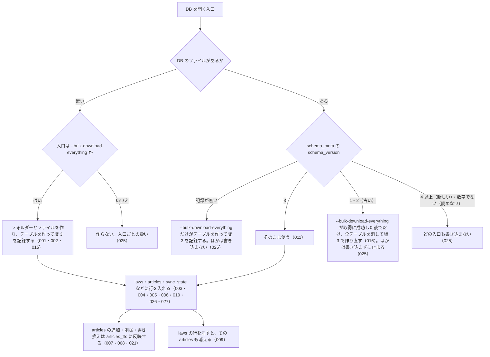

# 差分: db_schema（20261003-db-cli）

`specs/current/db_schema/spec.md` に対する差分です。見出しの単位で置き換えます。

- `MODIFIED` の見出しは、current の同じ見出しの本文をこの本文で置き換える
- `ADDED` の `### SPEC-…` は、current の「できること」の末尾に足す
- `REMOVED` の見出しは、current の「できること」から消す
- 冒頭の「関連する Issue」を `houki-egov-mcp #59・#60・#71（0.19.0 のスキーマの版 3）` にする
- 「入力」の表の `CLI --bulk-download-everything / --sync` の行を「`CLI --bulk-download-everything` は DB を作る・古い版の DB を作り直す唯一の入口。`--sync` / `--bulk-download-by-date` は版が同じ DB にだけ書き込む（SPEC-EGOV-DB-SCHEMA-025）」に、`CLI --status` の行を「DB を読むだけ。DB のファイルを作らない（SPEC-EGOV-DB-SCHEMA-025）」に、`ツール search_fulltext` の行を「呼び出しごとに DB を読むだけで開き、閉じる。DB のファイルを作らない（SPEC-EGOV-DB-SCHEMA-025）」にする
- 「処理の流れ」の図を次に置き換える

- 「できないこと」の「スキーマの版を 1 つずつ上げる移行（版が違う DB は作り直す。未決 3）」を「スキーマの版を 1 つずつ上げる移行（古い版の DB は `--bulk-download-everything` が作り直す。新しい版・読めない版の DB はどの入口も書き換えない。SPEC-EGOV-DB-SCHEMA-025）」にする。「DB を消したり中身を空にしたりする CLI やツールは無い（空にするには利用者がファイルを消す）」はそのまま残す（全データを消す入口は作らない。#60）
- 「未決」の 3・4・5・7・10（→ #60・#71）の行を消す

## MODIFIED

### SPEC-EGOV-DB-SCHEMA-001 DB を作るとスキーマの版 3 を記録する

`--bulk-download-everything` が新しい DB を作ると、`schema_meta` テーブルに `key = 'schema_version'`、`value = '3'` の行を記録する。v0.19.0 のスキーマの版は 3 である（v0.5.0〜v0.18.x は 2）。

### SPEC-EGOV-DB-SCHEMA-011 同じ DB を開き直しても壊れない

版 3 の DB をどの入口（CLI・`search_fulltext`）で何度開いても、テーブルは残り、`schema_version` は 3 のまま変わらない。

### SPEC-EGOV-DB-SCHEMA-012 `HOUKI_EGOV_DB_PATH` があれば、その場所の DB を使う

環境変数 `HOUKI_EGOV_DB_PATH` に空でない値があれば、どの入口もそのパスのファイルを DB として使う。`XDG_CACHE_HOME` があっても `HOUKI_EGOV_DB_PATH` を優先する。

例: `HOUKI_EGOV_DB_PATH=<一時ディレクトリ>/a/b/x.db`、`XDG_CACHE_HOME=<一時ディレクトリ>/xdg` で `--bulk-download-everything` を実行すると、`<一時ディレクトリ>/a/b/x.db` ができる。`<一時ディレクトリ>/xdg/houki-egov-mcp/laws.db` はできない。

### SPEC-EGOV-DB-SCHEMA-013 `HOUKI_EGOV_DB_PATH` が無ければ `$XDG_CACHE_HOME/houki-egov-mcp/laws.db` を使う

`HOUKI_EGOV_DB_PATH` が無いか空文字で、`XDG_CACHE_HOME` に空でない値があれば、DB の場所を `$XDG_CACHE_HOME/houki-egov-mcp/laws.db` にする。

例: `HOUKI_EGOV_DB_PATH` が空文字、`XDG_CACHE_HOME=<一時ディレクトリ>/xdg` で `--bulk-download-everything` を実行すると、`<一時ディレクトリ>/xdg/houki-egov-mcp/laws.db` ができる。

### SPEC-EGOV-DB-SCHEMA-014 どちらも無ければ `~/.cache/houki-egov-mcp/laws.db` を使う

`HOUKI_EGOV_DB_PATH` と `XDG_CACHE_HOME` がどちらも無いか空文字なら、DB の場所をホームディレクトリの `.cache/houki-egov-mcp/laws.db` にする。`XDG_CACHE_HOME` が空文字のときも、無いときと同じに扱う。

例: `HOME=<一時ディレクトリ>`、`HOUKI_EGOV_DB_PATH` と `XDG_CACHE_HOME` を空文字にして `--bulk-download-everything` を実行すると、`<一時ディレクトリ>/.cache/houki-egov-mcp/laws.db` ができる。2 つの環境変数を消したときも同じ場所になる。同じ環境で `--status` を実行すると、`  DB: ` の行にこの場所が出る。

### SPEC-EGOV-DB-SCHEMA-015 DB の置き場所のフォルダーを作るのは `--bulk-download-everything` だけ

`--bulk-download-everything` は、DB の置き場所のフォルダーが無ければ、途中のフォルダーも含めて作ってから DB のファイルを作る。ほかの入口（`--sync`・`--bulk-download-by-date`・`--status`・`search_fulltext`）は、フォルダーもファイルも作らない（SPEC-EGOV-DB-SCHEMA-025）。

例: `<一時ディレクトリ>/a` が無い状態で `HOUKI_EGOV_DB_PATH=<一時ディレクトリ>/a/b/x.db` として `--bulk-download-everything` を実行すると、`<一時ディレクトリ>/a/b/` ができ、その中に `x.db` ができる。同じ状態で `--status` を実行しても、`--sync` を実行しても、`search_fulltext` を呼んでも、`<一時ディレクトリ>/a` はできない（v0.18.x までは `--status` と `search_fulltext` もフォルダーと空の DB を作っていた）。

### SPEC-EGOV-DB-SCHEMA-016 版 1・2 の DB は、`--bulk-download-everything` が取得に成功した後でだけ作り直す

`schema_meta` の `schema_version` が `1` または `2`（v0.18.x 以前で作った DB）のファイルは、`--bulk-download-everything` が全件の zip の取得に成功した後でだけ、`laws`・`articles`・`revisions_meta`・`sync_state`・`laws_fts`・`articles_fts` を消して版 3 のテーブルで作り直し、`schema_version` を `3` にしてから取り込む。取得に失敗したとき（SPEC-EGOV-CLI-BULK-DOWNLOAD-004）は、古い DB をそのまま残す。ほかの入口は版 1・2 の DB を作り直さない（SPEC-EGOV-DB-SCHEMA-025）。

例: `laws` に 1 行、`articles` に 2 行、`sync_state` に 1 行を入れた DB の `schema_version` を `2` に書き換え、法令 1 件（条 1 つ）の zip を返すようにして `--bulk-download-everything` を実行すると、終わった後の `schema_meta` は `schema_version = '3'` の 1 行、`laws` は zip の 1 行だけ、`articles` は 1 行、`sync_state` の列は SPEC-EGOV-DB-SCHEMA-020 の 5 つ。取得に HTTP 503 が返って終了コード 1 で終わったときは、`schema_version` は `2` のままで、`laws` の 1 行・`articles` の 2 行も残る。

### SPEC-EGOV-DB-SCHEMA-017 版 1・2 の DB から作り直した後も、7 つのテーブルと articles_fts への反映が使える

SPEC-EGOV-DB-SCHEMA-016 で作り直した DB は、SPEC-EGOV-DB-SCHEMA-002 の 7 つのテーブルを持ち、`articles` に入れた条は SPEC-EGOV-DB-SCHEMA-007 と同じく `articles_fts` で引ける。

例: 作り直した DB の `laws` に 1 行、`articles` に `body` が `再作成後の本文QWERTY` の行を入れると、`articles_fts MATCH 'QWERTY'` は 1 件。

### SPEC-EGOV-DB-SCHEMA-020 sync_state テーブルの列

`sync_state` は `id`・`last_sync_date`・`last_full_dl_at`・`total_laws`・`bulk_source` の列を持つ。スキーマの版は `schema_meta` だけが持つ（v0.18.x までの `sync_state.schema_version` 列は、既定値 2 のまま版に連動せず、取り込みも書かなかったので外した。#60）。

例: sqlite3 で `PRAGMA table_info(sync_state)` を見ると、この 5 列がこの順に並び、`schema_version` の列は無い。

## ADDED

### SPEC-EGOV-DB-SCHEMA-025 DB の状態と入口ごとの扱い

DB を開く入口は、DB の状態によって次のように扱う。DB を作る・作り直すのは `--bulk-download-everything` だけで、`--status` と `search_fulltext` は DB のファイル・フォルダー・テーブル・`schema_meta` を作らず書き換えない（DB があるときに SQLite が `-wal` / `-shm` のファイルを置くことはある）。「版」は `schema_meta` の `schema_version` の値で、この版の houki-egov-mcp の版は 3。

| DB の状態 | `--bulk-download-everything` | `--sync` / `--bulk-download-by-date` | `--status` | `search_fulltext` |
| --- | --- | --- | --- | --- |
| ファイルが無い（置き場所のフォルダーも無いときを含む） | フォルダーとファイルを作り、版 3 を記録して取り込む（001・015） | 作らない。全件の取り込みを促して終了コード 1（SPEC-EGOV-CLI-SYNC-009、SPEC-EGOV-CLI-BULK-DOWNLOAD-030） | 作らない。DB が無いことを出して終了コード 0（SPEC-EGOV-CLI-STATUS-010） | 作らない。`search_law` に切り替える（SPEC-EGOV-SEARCH-FULLTEXT-039） |
| ファイルはあるが版の記録が無い（0 バイトのファイルなど） | テーブルを作り、版 3 を記録して取り込む | 書き込まない。ファイルが無いときと同じ | 書き込まない。ファイルが無いときと同じ | 書き込まない。ファイルが無いときと同じ |
| 版が同じ（3） | 取り込む | 取り込む | 表示する | 引く |
| 版が古い（1・2） | 取得に成功してから作り直して取り込む（016）。取得の前に `  DB の版 (<版>) が古いため、取得の後で作り直します（取り込んだ中身は消えます）` を出す | 書き込まない。古い版のエラーで終了コード 1 | 書き込まない。古い版のエラーで終了コード 1 | 使わない。`search_law` に切り替え、作り直しを案内する（SPEC-EGOV-SEARCH-FULLTEXT-040） |
| 版が新しい（4 以上の整数） | 取得の前に止める。新しい版のエラーで終了コード 1 | 書き込まない。新しい版のエラーで終了コード 1 | 書き込まない。新しい版のエラーで終了コード 1 | 使わない。`search_law` に切り替え、houki-egov-mcp の更新を案内する（040） |
| 版を読めない（整数でない値・空文字） | 取得の前に止める。読めない版のエラーで終了コード 1 | 書き込まない。読めない版のエラーで終了コード 1 | 書き込まない。読めない版のエラーで終了コード 1 | 使わない。`search_law` に切り替える（040） |
| 開けない（SQLite でないファイル、フォルダー、パスの途中が普通のファイル、権限が無い） | 取得の前に止める。`[ERROR] DB を開けません: <エラーの文>` で終了コード 1 | `[ERROR] DB を開けません: <エラーの文>` で終了コード 1 | SPEC-EGOV-CLI-STATUS-006 | SPEC-EGOV-SEARCH-FULLTEXT-027 |

CLI のエラーの文は、標準エラー出力に次のとおり出す（`<DB の版>` は `schema_version` の値、`<DB の場所>` は `  DB: ` の行と同じ）。

| 場面 | 文 |
| --- | --- |
| 古い版 | `[ERROR] DB の版 (<DB の版>) が古いため使えません。houki-egov-mcp --bulk-download-everything で作り直してください（取り込んだ中身は消え、全件の zip 約 290 MB を取り直します）` |
| 新しい版 | `[ERROR] DB の版 (<DB の版>) がこの houki-egov-mcp の版 (3) より新しいため、DB を変更しません。houki-egov-mcp を新しい版に更新するか、HOUKI_EGOV_DB_PATH で別のファイルを指定してください` |
| 読めない版 | `[ERROR] DB の版を読めないため (schema_version: <値>)、DB を変更しません。DB ファイル (<DB の場所>) を消してから houki-egov-mcp --bulk-download-everything を実行してください` |

例: `schema_version` を `4` に書き換えた DB で `--bulk-download-everything` を実行すると、zip を取得せずに新しい版の文を出して終了コード 1 で終わり、`schema_version` は `4` のまま、`laws` の行も残る（v0.18.x では全テーブルを消して作り直していた）。`schema_version` を `abc` に書き換えた DB で `--status` を実行すると、`[status] …`・`  DB: …` の 2 行の後に `[ERROR] DB の版を読めないため (schema_version: abc)、…` を出して終了コード 1（v0.18.x では `UNIQUE constraint failed: schema_meta.key` の例外）。DB ファイルの無い場所で `search_fulltext` を呼んでも `--status` を実行しても、ファイルはできない。

### SPEC-EGOV-DB-SCHEMA-026 laws.law_revision_id は NULL を受け付けない

`laws.law_revision_id` は主キーで、`NULL` の行は入らない（書き込みがエラーになる）。SQLite の `TEXT PRIMARY KEY` は `NOT NULL` を書かないと `NULL` を許すので、版 3 で `NOT NULL` を付けた（#71）。

例: sqlite3 で `PRAGMA table_info(laws)` を見ると、`law_revision_id` の `notnull` が 1、`pk` が 1。`law_revision_id` を `NULL` にした `INSERT` は `NOT NULL constraint failed: laws.law_revision_id` のエラーになる（v0.18.x では入った）。

### SPEC-EGOV-DB-SCHEMA-027 laws.promulgation_date は NULL を受け付ける

`laws.promulgation_date` は、公布日を XML から作れないときに `NULL` を入れられる（SPEC-EGOV-CLI-BULK-DOWNLOAD-011）。作れるときは `YYYY-MM-DD`。

例: sqlite3 で `PRAGMA table_info(laws)` を見ると、`promulgation_date` の `notnull` が 0（v0.18.x では 1 で、作れないときは `0001-01-01` を入れていた。#59）。

## REMOVED

### SPEC-EGOV-DB-SCHEMA-024 0.16.0 はスキーマの版 2 のままで、既存の行の検索用列を入れ直さない

外す理由: 0.19.0 でスキーマの版を 3 に上げるので、版 2 の DB を開いても版 2 のまま使うことはない（SPEC-EGOV-DB-SCHEMA-025）。0.16.0 より前に取り込んだダッシュ類の残る本文は、`--bulk-download-everything` で版 3 に作り直すときに揃え直す（SPEC-EGOV-SEARCH-FULLTEXT-036）。
