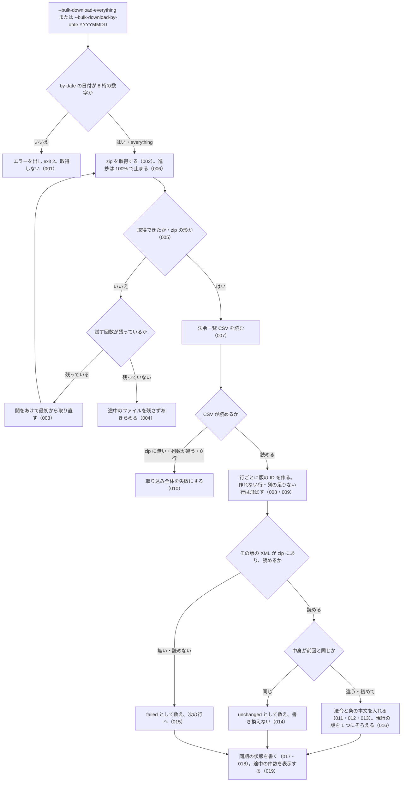

# 機能: cli_bulk_download（e-Gov の一括ダウンロードの zip を取得してローカル DB に取り込む）

- 機能 ID: EGOV
- 種類: CLI
- 版: current
- 承認日:
- 起こした元: v0.15.1 の `src/cli/index.ts`、`src/config.ts`、`src/services/bulk/zip-fetcher.ts`、`src/services/bulk/csv-parser.ts`、`src/services/bulk/xml-parser.ts`、`src/services/bulk/ingester.ts`、`src/cli/index.test.ts`、`src/services/bulk/zip-fetcher.test.ts`、`src/services/bulk/csv-parser.test.ts`、`src/services/bulk/xml-parser.test.ts`、`src/services/bulk/ingester.test.ts`
- 関連する Issue: houki-egov-mcp #21（同じ法令の現行の版を 1 つにする変更は、#21 の `--sync` と同じ 0.8.0 で入った）

この文書は「このコマンドは何をするか」を書きます。どう実装しているか（関数名・テーブル名）は書きません。

## アクター

- 利用者（ターミナルから `houki-egov-mcp --bulk-download-everything` または `--bulk-download-by-date YYYYMMDD` を実行する人）。e-Gov 法令の一括ダウンロード（`https://laws.e-gov.go.jp/bulkdownload`）から zip を取得し、ローカル DB に法令と条の本文を入れる。入れた DB は `search_fulltext` などのツールが引く

## 入力

| フラグ・環境変数 | 必須 | 内容 |
|---|---|---|
| `--bulk-download-everything` | どちらか 1 つ | 全件の zip（約 290 MB）を取得して取り込む。初回と、最終同期から差分で追える日数を超えたときに使う |
| `--bulk-download-by-date YYYYMMDD` | どちらか 1 つ | 指定した 1 日分の差分の zip を取得して取り込む（デバッグ用）。日付は 8 桁の数字 |
| `HOUKI_EGOV_DB_PATH` | 任意 | DB ファイルの場所。既定は `${XDG_CACHE_HOME:-~/.cache}/houki-egov-mcp/laws.db` |
| `HOUKI_EGOV_BULK_RETRY` | 任意 | 取得に失敗したときに試す回数（既定 3） |

## 処理の流れ

実行してから終わるまでに、何をどの順で行うかを示します。図の中の番号は「できること」の仕様 ID の末尾 3 桁です。

## できること

### SPEC-EGOV-CLI-BULK-DOWNLOAD-001 `--bulk-download-by-date` は 8 桁の日付が無ければ取りに行かない

`--bulk-download-by-date` の次の引数が無いとき、または 8 桁の数字でない（例: `2026-05-07`）ときは、標準エラー出力に `ERROR: --bulk-download-by-date は YYYYMMDD 形式の日付を必要とします (例: 20260507)` を出し、何も取得せずに終了コード 2 で終わる。

### SPEC-EGOV-CLI-BULK-DOWNLOAD-002 取得先の URL

- `--bulk-download-everything` は `https://laws.e-gov.go.jp/bulkdownload?file_section=1&only_xml_flag=true`（全件）を取得する
- `--bulk-download-by-date YYYYMMDD` は `https://laws.e-gov.go.jp/bulkdownload?file_section=3&update_date=YYYYMMDD&only_xml_flag=true`（その日の差分）を取得する

### SPEC-EGOV-CLI-BULK-DOWNLOAD-003 取得に失敗したら最初から取り直す

通信の失敗、2xx 以外の HTTP 応答（例: 503）、zip の形でない応答のときは、途中まで取ったものを捨て、間をあけて（1 秒、2 秒、4 秒…と倍にする）最初から取り直す。試す回数は `HOUKI_EGOV_BULK_RETRY`（既定 3）までで、途中で成功すればそれを使う。

### SPEC-EGOV-CLI-BULK-DOWNLOAD-004 試す回数を使い切ったら、途中のファイルを残さずにあきらめる

SPEC-EGOV-CLI-BULK-DOWNLOAD-003 の回数をすべて失敗したときは取得をあきらめ、取り込みに進まない。保存先に zip も途中のファイルも残さない。

### SPEC-EGOV-CLI-BULK-DOWNLOAD-005 zip の形であることを確かめてから取り込みに進む

取得したファイルの先頭 4 バイトが zip の印（`PK\x03\x04`）のときだけ取り込みに進む。先頭が違うとき、または 4 バイトに満たないときは、zip の形でないという失敗として扱い、途中のファイルを残さない。

### SPEC-EGOV-CLI-BULK-DOWNLOAD-006 取得の進捗は 100% を超えない

取得中は、取得したバイト数と推定の総バイト数（全件は約 290 MB、1 日分の差分は約 5 MB）に対する割合を表示する。e-Gov は総バイト数を返さないので推定と実際がずれるが、割合は 100% で止まり、取得が終わった時点の表示は 100% である。

### SPEC-EGOV-CLI-BULK-DOWNLOAD-007 e-Gov の法令一覧 CSV を読む

zip に入っている法令一覧 CSV（14 列）を次のとおり読む。

- 先頭の BOM を除く
- 行の終わりは CRLF でも LF でもよい。最後の行に改行が無くても取り込む。空行は飛ばす
- `"` で囲んだ欄の中のコンマ・改行・`""`（`"` 1 文字）は欄の一部として扱う（例: 旧法令名が複数並ぶ欄）
- 未施行の欄の `○` は「未施行」と読む
- 行は CSV の並びのとおりに扱う

### SPEC-EGOV-CLI-BULK-DOWNLOAD-008 CSV の本文 URL から版の ID を作り、zip の XML と対応させる

CSV の本文 URL（`https://laws.e-gov.go.jp/law/<法令ID>/<施行日>_<改正法令ID>`）から、版の ID `<法令ID>_<施行日>_<改正法令ID>` を作る。改正の無い法令の改正法令ID は `000000000000000`。英数字の混ざる改正法令ID（例: `126M10000001002`）も読む。URL の末尾のクエリ・フラグメント・スラッシュは無視する。zip の中の `<版の ID>.xml` を、その行の法令の本文として取り込む（フォルダーの中にあってもよい）。

### SPEC-EGOV-CLI-BULK-DOWNLOAD-009 形の合わない CSV の行は飛ばして残りを取り込む

列の数が足りない行と、本文 URL が上の形でなく版の ID を作れない行は、その行だけを飛ばし、残りの行を取り込む。

### SPEC-EGOV-CLI-BULK-DOWNLOAD-010 CSV が使えないときは取り込み全体を失敗にする

次のときは法令を 1 件も取り込まずに失敗する。

- zip に CSV が無い
- CSV の見出しの行が 14 列でない
- CSV を読んだ結果が 0 行（空の CSV を含む）

### SPEC-EGOV-CLI-BULK-DOWNLOAD-011 取り込む法令の情報

1 つの版について、XML から法令名・法令番号・法令名の読み・略称（XML にあれば。無ければ空）・法令種別（例: `CabinetOrder`）を、CSV から版の ID・法令ID・施行日（`YYYY-MM-DD`）・未施行かどうかを取り込む。公布日は XML の元号・年・月・日から西暦の `YYYY-MM-DD` にする（例: 明治 5 年 11 月 9 日 → `1872-11-09`）。未施行の欄が `○` の版は「未施行」（`UnEnforced`）、それ以外は「現行」（`CurrentEnforced`）として入る。CSV に複数の法令があれば全部を入れる。

### SPEC-EGOV-CLI-BULK-DOWNLOAD-012 条ごとの本文を取り込む

XML の条（`Article`）を 1 つずつ、条番号・条の見出し（例: `（目的）`）・編章節の見出しの並び・本文とともに取り込む。

- 編章節の見出しの並びは空白 1 つでつなぐ（例: `第一編　総則 第一章　通則`、`第二章　預金保険機構 第一節　総則`）。編（`Part`）の下にある条も拾う
- 枝番号の条の番号は `_` でつなぐ（例: 第一条の二 → `1_2`）
- 本文には項・号・号の細分の文を含む。条の見出し・条名（例: `第二条`）・目次は含まない
- 附則の条は、番号を `Suppl<附則の順番>_<条番号>`（例: `Suppl1_1`）、編章節の見出しを附則の見出し（例: `附　則`）にして取り込む
- 別表は、番号を `Appendix<別表の順番>`（例: `Appendix1`）、見出しを別表の題（例: `別表第一（第三条関係）`）にして取り込む。題は本文に含まない

### SPEC-EGOV-CLI-BULK-DOWNLOAD-013 本文は検索用にそろえたものと原文の両方を持つ

条の本文と、法令名・読み・略称・法令番号は、全角の英数字・記号・空白を半角にそろえたもの（例: `第１２条　ＰＬ法－２` → `第12条 PL法-2`）で全文検索の索引に入れる。表示に使う条の本文と法令名は原文のまま持つ。取り込んだ法令は、条の本文の語（例: `預金者`）でも、法令名や略称（例: `預保法`）でも索引から引ける。

### SPEC-EGOV-CLI-BULK-DOWNLOAD-014 中身が前回と同じ法令は書き換えない

同じ版の ID の法令を前に取り込んでいて、XML の中身が同じときは、その法令を書き換えず（取得日時も前回のまま）、`unchanged` として数える。XML の中身が変わっていれば、法令の情報を更新し、その版の条の本文をすべて入れ替え、`upsert` として数える。取り込みのしかた（XML の読み方や文字のそろえ方）が変わった版の houki-egov-mcp で `--bulk-download-everything` をやり直すと、XML が同じでも全件を入れ直す。

### SPEC-EGOV-CLI-BULK-DOWNLOAD-015 XML が無い・読めない法令は数えて飛ばす

- zip にあって CSV に無い XML は取り込まない
- CSV の行に対応する XML が zip に無いときと、XML が読めないとき（根が `<Law>` でない、`LawBody` が無い、`LawNum` が無いか空、XML として壊れている）は、その法令を `failed` として数え、残りの法令の取り込みは続ける

### SPEC-EGOV-CLI-BULK-DOWNLOAD-016 同じ法令の現行の版は、施行日が最も新しい 1 つだけにする

現行の版を取り込むとき、同じ法令ID に施行日がそれより前の現行の版があれば、それを「前の版」（`PreviousEnforced`）にする。逆に、施行日がより新しい現行の版がすでにあれば、取り込んだ版のほうを「前の版」にする。1 つの zip の中で同じ法令の新しい版が先、古い版が後に並んでいても、新しい版が現行として残る。未施行の版を取り込んでも、現行の版はそのまま残る。施行日の無い版はこの比較をしない。

### SPEC-EGOV-CLI-BULK-DOWNLOAD-017 全件の取り込みの後の同期の状態

`--bulk-download-everything` の取り込みが終わると、同期の状態（`--status` と `--sync` が読むもの）を次にする。

- `last_sync_date`: 取り込みを始めた時刻の日付（`YYYY-MM-DD`）
- `last_full_dl_at`: 取り込みを始めた時刻
- 法令の総数: CSV の行数
- 取り込み元: `all_xml`

### SPEC-EGOV-CLI-BULK-DOWNLOAD-018 1 日分の差分の取り込みでは、全件の取り込みの時刻を保つ

`--bulk-download-by-date` の取り込みが終わると、同期の状態の `last_full_dl_at` は前の全件の取り込みの時刻のまま保つ。法令の総数は差分の CSV の行数ではなく、取り込んだ後の DB にある法令の数にする。取り込み元は `incremental` にする。

### SPEC-EGOV-CLI-BULK-DOWNLOAD-019 取り込みの途中で件数を表示する

`--bulk-download-everything` の取り込み中は、まとめて書き込むたびに、読んだ法令の数と CSV の行数（`ingest: <読んだ数> / <CSV の行数> laws`）を表示する。最後の表示で読んだ数は、XML を読めた法令の数に達する。

## できないこと

- 途中から取得を再開すること（e-Gov が範囲指定に応じないため、失敗したら最初から取り直す）
- カテゴリ別の zip（`file_section=2`）を取得すること
- 前の版・廃止を e-Gov の履歴から正確に判定すること（現行・未施行は CSV の未施行の欄から、前の版は SPEC-EGOV-CLI-BULK-DOWNLOAD-016 で決めるだけ。廃止は扱わない）
- 法令の分類（カテゴリ）や改正法令の公布日を取り込むこと（CSV・XML から取らない）
- 取り込み済みの法令のうち、zip に無くなったものを消すこと

## 未決

初版起こしで見つけた、意図か不具合かを人が決める項目です。決まったら「できること」に ID を振るか、`specs/changes/` の差分にします。

意図か不具合かの判断が要る項目は houki-egov-mcp の Issue に移し、ここには題と Issue の番号だけを残します。今の振る舞いのままでよくテストが無いだけの項目は、受入テストを書いてから「できること」に ID を振ります。

1. **コマンドとしての表示・終了コード・後片付け。** 取得と取り込みの経過（`[1/2] zip ダウンロード中...`、`DL 完了: <サイズ> / <時間>`、`ingest 完了: <n> 件 upsert, <n> 件 unchanged, <n> 件 failed (<時間>)`、`[完了] 全体 <時間>`）を標準エラー出力に出して終了コード 0 で終わること、失敗したときは `[ERROR] <エラーの文>` を出して終了コード 1 で終わること、どちらでも一時フォルダーの zip を消すこと、`HOUKI_EGOV_DB_PATH` と `XDG_CACHE_HOME` で DB の場所が変わり、無いフォルダーは作ること。部品ごとのテストはあるが、コマンドを通したテストが無い。ID を振るのは受入テストを書いてから。
2. **`--bulk-download-by-date` は `last_sync_date` を、指定した日ではなく実行した日にする。** 例えば今日 `--bulk-download-by-date 20260801` を実行すると、`last_sync_date` が今日の日付になる。その後の `--sync` は今日からしか確かめないので、8 月 2 日から昨日までの差分を取り込まないまま「最新」と扱う。指定した日にするか、`last_sync_date` を動かさないか、今のままにするかを決める必要がある。
3. **`last_sync_date` に書く日付が UTC の日付である。** 取り込みを始めた時刻を UTC の日時で持ち、その先頭 10 文字を `last_sync_date` にする。日本時間の 0 時から 9 時の間に実行すると、前日の日付になる。`--sync` は日本時間で日付を数える（cli_sync）ので、1 日余分に確かめることになる。日本時間にそろえるかを決める必要がある。
4. **条を持たない法令は、本文の行を作らない。** 本則が条（`Article`）でなく段落（`Paragraph`）だけの法令（例: 改暦ノ布告）は、法令としては取り込むが条の本文を 1 つも作らないので、全文検索で本文から見つからない。テスト `Article がない場合でも articles=[] でパースできる (本文 Paragraph 直下)` はこの動きを確かめている。段落だけの本文も取り込むかを決める必要がある。
5. **差分の無い日を `--bulk-download-by-date` で指定すると失敗になる。** e-Gov は差分の無い日に HTTP 500 を返す（`--sync` はこれを「差分なし」と扱う）が、`--bulk-download-by-date` は 500 を失敗として `HOUKI_EGOV_BULK_RETRY` 回取り直し、`[ERROR] HTTP 500 ...` を出して終了コード 1 で終わる。「差分なし」と表示して 0 で終わるかを決める必要がある。
6. **公布日が XML から作れないときに `0001-01-01` を入れる。** 元号・年・月・日のどれかが無いとき、または元号が明治・大正・昭和・平成・令和のどれでもないときは、公布日を `0001-01-01` にする。空にするかを決める必要がある。
7. **法令種別が XML に無いときの決め方。** XML に法令種別が無いときは CSV の和文の種別（`法律` → `Act`、`政令` → `CabinetOrder`、`府省令` → `MinisterialOrdinance` など）から決め、どれにも当たらないときは `Act` にする。テストが無い。ID を振るのは受入テストを書いてから。
