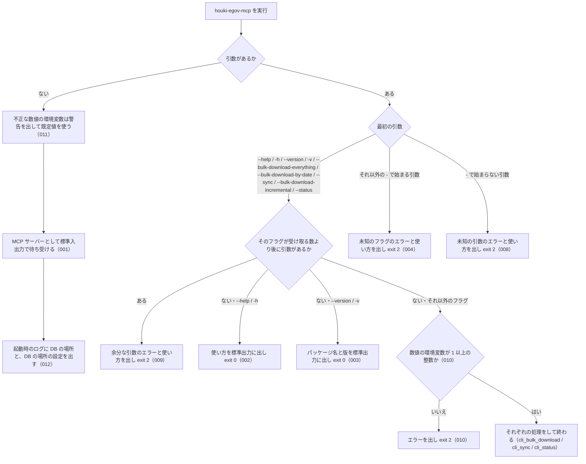

# 機能: cli_entry（`houki-egov-mcp` コマンドの起動と引数の振り分け）

- 機能 ID: EGOV
- 種類: CLI
- 版: current
- 承認日: 2026-09-28（PR #50）。差分 `20260928-undecided-to-issues` は 2026-09-28（PR #68）。差分 `20260928-untested-behaviors` は 2026-09-28（PR #76）。差分 `20261003-t5-docs-mismatch` は 2026-10-03（PR #92）。差分 `20261003-db-cli` は 2026-10-03（PR #100）。差分 `20261003-db-cli-followup` は 2026-10-03（PR #103）。差分 `20261004-db-location` は 2026-10-04（PR #114）
- 起こした元: v0.15.1 の `src/index.ts`、`src/cli/index.ts`、`src/config.ts`、`src/cli/index.test.ts`
- 関連する Issue: houki-egov-mcp #61（0.19.0）、houki-egov-mcp #102（0.19.0）、houki-egov-mcp #108（0.20.0）

この文書は「このコマンドは何をするか」を書きます。どう実装しているか（関数名・テーブル名）は書きません。

## アクター

- 利用者（ターミナルから `houki-egov-mcp` を実行する人）。フラグを付けずに実行して MCP サーバーを起動するか、フラグを付けて使い方・版を見る、またはローカル DB を作る・最新化する・状態を見る
- MCP クライアント（Claude Desktop などの設定で `houki-egov-mcp` を引数なしで起動し、標準入出力で MCP のやり取りをする）

## 入力

| フラグ                                   | 必須 | 内容                                        |
| ---------------------------------------- | ---- | ------------------------------------------- |
| （なし）                                 | 任意 | MCP サーバーとして起動する                  |
| `--help` / `-h`                          | 任意 | 使い方を出して終わる                        |
| `--version` / `-v`                       | 任意 | パッケージ名と版を出して終わる              |
| `--bulk-download-everything`             | 任意 | 全件の取り込み（cli_bulk_download）         |
| `--bulk-download-by-date YYYYMMDD`       | 任意 | 1 日分の差分の取り込み（cli_bulk_download） |
| `--sync` / `--bulk-download-incremental` | 任意 | 日次差分での最新化（cli_sync）              |
| `--status`                               | 任意 | 同期の状態と DB の件数の表示（cli_status）  |

フラグは 1 回の実行で 1 つだけ受け付ける。`--bulk-download-by-date` だけが値（日付）を 1 つ取る。それ以外の引数は SPEC-EGOV-CLI-ENTRY-004・008・009 のエラーにする。

| 環境変数                            | 使う処理                                                            | 既定 | 受け付ける値 |
| ----------------------------------- | ------------------------------------------------------------------- | ---- | ------------ |
| `HOUKI_EGOV_BULK_RETRY`             | 一括ダウンロードの zip の取得（cli_bulk_download・cli_sync）        | 3    | 1 以上の整数 |
| `HOUKI_EGOV_INCREMENTAL_LIMIT_DAYS` | `--sync` の上限の日数、`--status` と `search_fulltext` の警告の日数 | 90   | 1 以上の整数 |
| `HOUKI_EGOV_CONCURRENCY`            | e-Gov 法令 API への同時リクエスト数の上限（MCP サーバーのツール）   | 4    | 1 以上の整数 |

## 処理の流れ

起動してから、MCP サーバーとして待ち受けるか、フラグの処理をして終わるかを決める順を示します。図の中の番号は「できること」の仕様 ID の末尾 3 桁です。



## できること

### SPEC-EGOV-CLI-ENTRY-001 引数なしで実行すると MCP サーバーとして起動する

引数を付けずに実行したときは、フラグの処理（使い方・版・取り込み・状態の表示）を何もせず、MCP サーバーとして標準入出力で待ち受ける。

### SPEC-EGOV-CLI-ENTRY-002 `--help` と `-h` は使い方を出して exit 0

最初の引数が `--help` または `-h` のときは、使い方を標準出力に出し、MCP サーバーを起動せずに終了コード 0 で終わる。使い方には、各フラグ（`--bulk-download-everything` / `--sync` / `--bulk-download-by-date YYYYMMDD` / `--status` / `--version` / `--help`）と環境変数 `HOUKI_EGOV_DB_PATH` / `HOUKI_EGOV_BULK_RETRY` / `HOUKI_EGOV_INCREMENTAL_LIMIT_DAYS` / `HOUKI_EGOV_CONCURRENCY` の説明が並ぶ。数値の 3 つには「1 以上の整数」と既定値を書く。`--help` は環境変数の値を検査しない（SPEC-EGOV-CLI-ENTRY-010）。

例: 使い方に `HOUKI_EGOV_CONCURRENCY` の行がある（v0.18.x の使い方には無かった。#102）。

### SPEC-EGOV-CLI-ENTRY-003 `--version` はパッケージ名と版を出して exit 0

最初の引数が `--version` のときは、`<パッケージ名> v<版>`（例: `@shuji-bonji/houki-egov-mcp v0.15.1`）の 1 行を標準出力に出し、MCP サーバーを起動せずに終了コード 0 で終わる。

### SPEC-EGOV-CLI-ENTRY-004 未知のフラグはエラーにして exit 2

最初の引数が `-` で始まり、上の入力の表のどれでもないときは、標準エラー出力に `ERROR: 未知のフラグ: <フラグ>` を出し、続けて使い方を標準出力に出して、MCP サーバーを起動せずに終了コード 2 で終わる。打ち間違えたフラグのまま MCP サーバーが起動して待ち続けることはない。

### SPEC-EGOV-CLI-ENTRY-005 `-v` も `--version` と同じ 1 行を出して exit 0

最初の引数が `-v` のときも、SPEC-EGOV-CLI-ENTRY-003 と同じ `<パッケージ名> v<版>` の 1 行を標準出力に出し、MCP サーバーを起動せずに終了コード 0 で終わる。

例: v0.15.1 で `houki-egov-mcp -v` を実行すると、標準出力は `@shuji-bonji/houki-egov-mcp v0.15.1` の 1 行だけで、終了コードは 0。

### SPEC-EGOV-CLI-ENTRY-006 MCP サーバーは SIGINT / SIGTERM を受けると接続を閉じる

引数なしで MCP サーバーとして起動すると、標準エラー出力に `[server] <パッケージ名> v<版> started` を出して待ち受ける。その後 SIGINT または SIGTERM を受けると、標準入出力の接続を閉じる。シグナルを受けるたびに接続を閉じる処理を 1 回行う。

例: v0.15.1 を引数なしで起動すると標準エラー出力に `[server] @shuji-bonji/houki-egov-mcp v0.15.1 started` が出る。SIGINT を送ると接続を閉じる処理が 1 回、続けて SIGTERM を送るともう 1 回行われる。

### SPEC-EGOV-CLI-ENTRY-007 MCP サーバーの起動中に想定外の例外が起きたら exit 1

MCP サーバーとして起動する途中で想定外の例外が起きたときは、標準エラー出力に `[server] fatal error` を出し、終了コード 1 で終わる。例外の文そのものは出さない（環境変数 `DEBUG` が `1` または `true` のときだけ、続けてスタックトレースを出す）。

例: 標準入出力の接続を作るところで `Error('boom')` が起きると、標準エラー出力は `[server] fatal error` の 1 行で、終了コードは 1。

### SPEC-EGOV-CLI-ENTRY-008 `-` で始まらない最初の引数はエラーにして exit 2

最初の引数が `-` で始まらない（例: `status`・`sync`）ときは、標準エラー出力に `ERROR: 未知の引数: <引数>` を出し、続けて使い方を標準出力に出して、MCP サーバーを起動せずに終了コード 2 で終わる（SPEC-EGOV-CLI-ENTRY-004 の未知のフラグと同じ形）。

例: `houki-egov-mcp status` は `ERROR: 未知の引数: status` と使い方を出して終了コード 2（v0.18.x ではエラーを出さずに MCP サーバーとして起動し、入力を待ち続けた。#61）。

### SPEC-EGOV-CLI-ENTRY-009 フラグの後の余分な引数はエラーにして exit 2

最初の引数が入力の表のフラグで、そのフラグが受け取る数より後に引数があるときは、そのフラグの処理を何もせず（DB を開かず、e-Gov にも接続せず）、標準エラー出力に `ERROR: 余分な引数: <最初の余分な引数>` を出し、続けて使い方を標準出力に出して、終了コード 2 で終わる。フラグが受け取る数は、`--bulk-download-by-date` が 1 つ（日付）、ほかのフラグは 0。`--bulk-download-by-date` の日付が無い・形が違うときは、余分な引数より先に SPEC-EGOV-CLI-BULK-DOWNLOAD-001 のエラー（終了コード 2）にする。

例:

| 実行 | 標準エラー出力 | 終了コード |
| --- | --- | --- |
| `houki-egov-mcp --status extra` | `ERROR: 余分な引数: extra` | 2 |
| `houki-egov-mcp --help --version` | `ERROR: 余分な引数: --version` | 2 |
| `houki-egov-mcp --sync --status` | `ERROR: 余分な引数: --status` | 2 |
| `houki-egov-mcp --bulk-download-by-date 20260917 extra` | `ERROR: 余分な引数: extra` | 2 |
| `houki-egov-mcp --bulk-download-by-date 2026-09-17 extra` | `ERROR: --bulk-download-by-date は YYYYMMDD 形式の日付を必要とします (例: 20260507)` | 2 |

v0.18.x では 2 番目以降の引数を見なかったので、上の 4 行目までは最初のフラグの処理をして終わっていた（`--sync --status` は差分の同期をした。#61）。

### SPEC-EGOV-CLI-ENTRY-010 CLI は数値の環境変数が 1 以上の整数でなければ、何もせずに exit 2

最初の引数が `--bulk-download-everything`・`--bulk-download-by-date`・`--sync`・`--bulk-download-incremental`・`--status` のときは、引数の検査（SPEC-EGOV-CLI-ENTRY-009、SPEC-EGOV-CLI-BULK-DOWNLOAD-001）の後、DB を開く前・e-Gov に接続する前に、`HOUKI_EGOV_BULK_RETRY`・`HOUKI_EGOV_INCREMENTAL_LIMIT_DAYS`・`HOUKI_EGOV_CONCURRENCY` の値を確かめる。どのコマンドでも 3 つとも確かめる（そのコマンドが使わない変数も）。

- 無い・空文字: 既定値を使う
- `1` 以上の整数を 10 進の数字だけで書いたもの（`^[1-9][0-9]*$`）: その値を使う
- それ以外（`0`・負の数・小数・`abc`・`90days`・前後の空白を含むもの）: 標準エラー出力に `ERROR: <変数名> は 1 以上の整数で指定してください: <値>` を出し、終了コード 2 で終わる。値が不正な変数が複数あるときは、上の順で最初の 1 つだけを出す

`--help`・`-h`・`--version`・`-v` は値を確かめない。

例: `HOUKI_EGOV_INCREMENTAL_LIMIT_DAYS=-5 houki-egov-mcp --sync` は `ERROR: HOUKI_EGOV_INCREMENTAL_LIMIT_DAYS は 1 以上の整数で指定してください: -5` を出して終了コード 2 で、DB を開かず e-Gov にも接続しない（v0.18.x では上限 `-5` で計算し、毎回「日次差分の公開範囲 (-5 日) を超えている」で終了コード 1）。`HOUKI_EGOV_BULK_RETRY=0` は v0.18.x では既定の 3 として動いたが、0.19.0 では同じエラーで終了コード 2。`HOUKI_EGOV_BULK_RETRY=1.5 houki-egov-mcp --status` も終了コード 2（`--status` は取得しないが、3 つとも確かめる）。`HOUKI_EGOV_BULK_RETRY=abc houki-egov-mcp --help` は使い方を出して終了コード 0。

### SPEC-EGOV-CLI-ENTRY-011 MCP サーバーは不正な数値の環境変数に既定値を使い、警告を出して起動する

引数なしで MCP サーバーとして起動するときは、SPEC-EGOV-CLI-ENTRY-010 と同じ 3 つの環境変数を確かめる。1 以上の整数でない値（空文字と無いときは除く）は、その変数の既定値（`HOUKI_EGOV_BULK_RETRY` は 3、`HOUKI_EGOV_INCREMENTAL_LIMIT_DAYS` は 90、`HOUKI_EGOV_CONCURRENCY` は 4）に置き換え、変数ごとに標準エラー出力へ `[server] 警告: <変数名> は 1 以上の整数で指定してください: <値>（既定値 <既定値> を使います）` を 1 行出して、起動を続ける（`[server] … started` の行より前）。終了しない。

例: `HOUKI_EGOV_CONCURRENCY=-1` で起動すると、`[server] 警告: HOUKI_EGOV_CONCURRENCY は 1 以上の整数で指定してください: -1（既定値 4 を使います）` を出して起動し、e-Gov への同時リクエスト数の上限は 4（v0.18.x では `createLimit: concurrency must be >= 1, got -1` の例外で、ツールを呼ぶ前に起動に失敗した。コードを読んで分かったことで、実行して確かめていない）。`HOUKI_EGOV_INCREMENTAL_LIMIT_DAYS=abc` で起動すると警告を出して 90 を使い、`search_fulltext` の `freshness.warning` は `最終同期から 90 日を超えていれば`（SPEC-EGOV-SEARCH-FULLTEXT-023）。

### SPEC-EGOV-CLI-ENTRY-012 MCP サーバーは起動時のログに、DB の絶対パスと DB の場所の設定を出す

引数なしで MCP サーバーとして起動すると、`[server] <パッケージ名> v<版> started` の行（SPEC-EGOV-CLI-ENTRY-006）の次に、標準エラー出力へ次の 1 行を出す。

```
[server] DB: <DB の絶対パス>（DB の場所の設定: <設定の名前>）
```

`<DB の絶対パス>` と `<設定の名前>` は SPEC-EGOV-DB-SCHEMA-028 のとおり（ホームディレクトリを `~` に置き換えない）。この行のために DB を開かず、ファイルがあるかも確かめない（`search_fulltext` は呼び出しごとに DB を開くので、起動した後に CLI で作った DB も使える。起動時の有無を出すと古い情報になる）。MCP の応答（tools/list とツールの応答）は変わらない。

例: 環境変数を付けずに、ホームディレクトリが `/Users/bonji` の環境で起動すると、標準エラー出力は `[server] @shuji-bonji/houki-egov-mcp v0.20.0 started` の次に `[server] DB: /Users/bonji/.cache/houki-egov-mcp/laws.db（DB の場所の設定: 既定）`。`HOUKI_EGOV_DB_PATH=/Users/bonji/.cache/houki-egov-mcp/laws.v3.db` を付けて起動すると `[server] DB: /Users/bonji/.cache/houki-egov-mcp/laws.v3.db（DB の場所の設定: HOUKI_EGOV_DB_PATH）`（v0.19.x では `… started` の 1 行だけで、どのファイルを開くかはログから分からなかった。houki-egov-mcp #108 の追記）。

## できないこと

- フラグを組み合わせること（`--sync --status` は余分な引数のエラー。SPEC-EGOV-CLI-ENTRY-009）
- MCP サーバーを標準入出力以外（HTTP など）で起動すること
- 設定ファイルを読むこと（設定は環境変数だけ）

## 未決

初版起こしで見つけた、意図か不具合かを人が決める項目です。決まったら「できること」に ID を振るか、`specs/changes/` の差分にします。

意図か不具合かの判断が要る項目は houki-egov-mcp の Issue に移し、ここには題と Issue の番号だけを残します。今の振る舞いのままでよくテストが無いだけの項目は、受入テストを書いてから「できること」に ID を振ります。

1. **`-v` も `--version` と同じ。** → SPEC-EGOV-CLI-ENTRY-005
3. **MCP サーバーの終わり方。** → SPEC-EGOV-CLI-ENTRY-006・SPEC-EGOV-CLI-ENTRY-007
