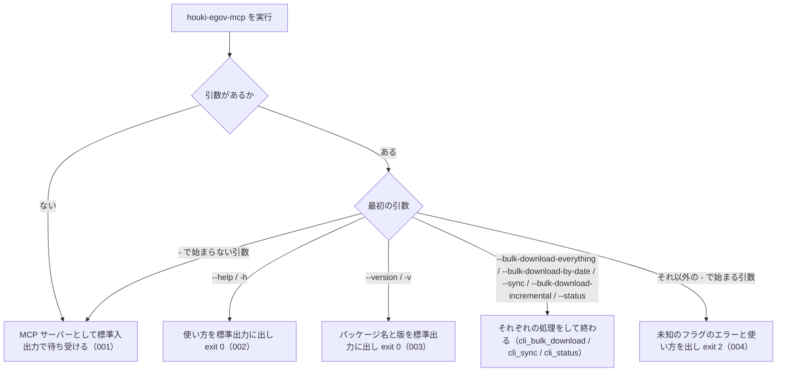

# 機能: cli_entry（`houki-egov-mcp` コマンドの起動と引数の振り分け）

- 機能 ID: EGOV
- 種類: CLI
- 版: current
- 承認日: 2026-09-28（PR #50）。差分 `20260928-undecided-to-issues` は 2026-09-28（PR #68）。差分 `20260928-untested-behaviors` は 2026-09-28（PR #76）
- 起こした元: v0.15.1 の `src/index.ts`、`src/cli/index.ts`、`src/config.ts`、`src/cli/index.test.ts`
- 関連する Issue: なし

この文書は「このコマンドは何をするか」を書きます。どう実装しているか（関数名・テーブル名）は書きません。

## アクター

- 利用者（ターミナルから `houki-egov-mcp` を実行する人）。フラグを付けずに実行して MCP サーバーを起動するか、フラグを付けて使い方・版を見る、またはローカル DB を作る・最新化する・状態を見る
- MCP クライアント（Claude Desktop などの設定で `houki-egov-mcp` を引数なしで起動し、標準入出力で MCP のやり取りをする）

## 入力

| フラグ                                   | 必須 | 内容                                        |
| ---------------------------------------- | ---- | ------------------------------------------- |
| （なし）                                 | 任意 | MCP サーバーとして起動する                  |
| `--help` / `-h`                          | 任意 | 使い方を出して終わる                        |
| `--version` / `-v`                       | 任意 | パッケージ名と版を出して終わる              |
| `--bulk-download-everything`             | 任意 | 全件の取り込み（cli_bulk_download）         |
| `--bulk-download-by-date YYYYMMDD`       | 任意 | 1 日分の差分の取り込み（cli_bulk_download） |
| `--sync` / `--bulk-download-incremental` | 任意 | 日次差分での最新化（cli_sync）              |
| `--status`                               | 任意 | 同期の状態と DB の件数の表示（cli_status）  |

見るのは最初の引数だけである。

## 処理の流れ

起動してから、MCP サーバーとして待ち受けるか、フラグの処理をして終わるかを決める順を示します。図の中の番号は「できること」の仕様 ID の末尾 3 桁です。

## できること

### SPEC-EGOV-CLI-ENTRY-001 引数なしで実行すると MCP サーバーとして起動する

引数を付けずに実行したときは、フラグの処理（使い方・版・取り込み・状態の表示）を何もせず、MCP サーバーとして標準入出力で待ち受ける。

### SPEC-EGOV-CLI-ENTRY-002 `--help` と `-h` は使い方を出して exit 0

最初の引数が `--help` または `-h` のときは、使い方を標準出力に出し、MCP サーバーを起動せずに終了コード 0 で終わる。使い方には、各フラグ（`--bulk-download-everything` / `--sync` / `--bulk-download-by-date YYYYMMDD` / `--status` / `--version` / `--help`）と環境変数 `HOUKI_EGOV_DB_PATH` / `HOUKI_EGOV_BULK_RETRY` / `HOUKI_EGOV_INCREMENTAL_LIMIT_DAYS` の説明が並ぶ。

### SPEC-EGOV-CLI-ENTRY-003 `--version` はパッケージ名と版を出して exit 0

最初の引数が `--version` のときは、`<パッケージ名> v<版>`（例: `@shuji-bonji/houki-egov-mcp v0.15.1`）の 1 行を標準出力に出し、MCP サーバーを起動せずに終了コード 0 で終わる。

### SPEC-EGOV-CLI-ENTRY-004 未知のフラグはエラーにして exit 2

最初の引数が `-` で始まり、上の入力の表のどれでもないときは、標準エラー出力に `ERROR: 未知のフラグ: <フラグ>` を出し、続けて使い方を標準出力に出して、MCP サーバーを起動せずに終了コード 2 で終わる。打ち間違えたフラグのまま MCP サーバーが起動して待ち続けることはない。

### SPEC-EGOV-CLI-ENTRY-005 `-v` も `--version` と同じ 1 行を出して exit 0

最初の引数が `-v` のときも、SPEC-EGOV-CLI-ENTRY-003 と同じ `<パッケージ名> v<版>` の 1 行を標準出力に出し、MCP サーバーを起動せずに終了コード 0 で終わる。

例: v0.15.1 で `houki-egov-mcp -v` を実行すると、標準出力は `@shuji-bonji/houki-egov-mcp v0.15.1` の 1 行だけで、終了コードは 0。

### SPEC-EGOV-CLI-ENTRY-006 MCP サーバーは SIGINT / SIGTERM を受けると接続を閉じる

引数なしで MCP サーバーとして起動すると、標準エラー出力に `[server] <パッケージ名> v<版> started` を出して待ち受ける。その後 SIGINT または SIGTERM を受けると、標準入出力の接続を閉じる。シグナルを受けるたびに接続を閉じる処理を 1 回行う。

例: v0.15.1 を引数なしで起動すると標準エラー出力に `[server] @shuji-bonji/houki-egov-mcp v0.15.1 started` が出る。SIGINT を送ると接続を閉じる処理が 1 回、続けて SIGTERM を送るともう 1 回行われる。

### SPEC-EGOV-CLI-ENTRY-007 MCP サーバーの起動中に想定外の例外が起きたら exit 1

MCP サーバーとして起動する途中で想定外の例外が起きたときは、標準エラー出力に `[server] fatal error` を出し、終了コード 1 で終わる。例外の文そのものは出さない（環境変数 `DEBUG` が `1` または `true` のときだけ、続けてスタックトレースを出す）。

例: 標準入出力の接続を作るところで `Error('boom')` が起きると、標準エラー出力は `[server] fatal error` の 1 行で、終了コードは 1。

## できないこと

- フラグを組み合わせること（見るのは最初の引数だけ。`--sync --status` は `--sync` だけを行う）
- MCP サーバーを標準入出力以外（HTTP など）で起動すること
- 設定ファイルを読むこと（設定は環境変数だけ）

## 未決

初版起こしで見つけた、意図か不具合かを人が決める項目です。決まったら「できること」に ID を振るか、`specs/changes/` の差分にします。

意図か不具合かの判断が要る項目は houki-egov-mcp の Issue に移し、ここには題と Issue の番号だけを残します。今の振る舞いのままでよくテストが無いだけの項目は、受入テストを書いてから「できること」に ID を振ります。

1. **`-v` も `--version` と同じ。** → SPEC-EGOV-CLI-ENTRY-005
2. **`-` で始まらない引数や、2 番目以降の引数を黙って無視する。** → houki-egov-mcp #61
3. **MCP サーバーの終わり方。** → SPEC-EGOV-CLI-ENTRY-006・SPEC-EGOV-CLI-ENTRY-007
4. **使い方の `DOCS:` 欄が、npm のパッケージに入っていないファイルを案内している。** → houki-egov-mcp #56
5. **使い方に `--bulk-download-incremental` と `-v` が載っていない。** → houki-egov-mcp #56
