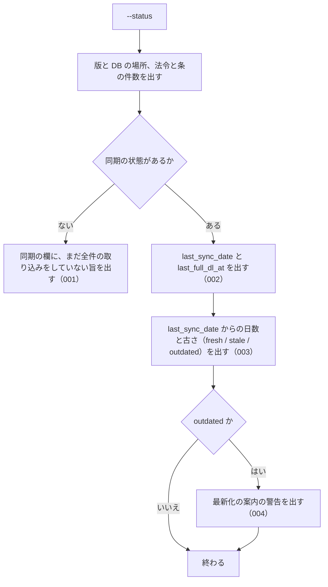

# 機能: cli_status（ローカル DB の同期の状態と件数を表示する）

- 機能 ID: EGOV
- 種類: CLI
- 版: current
- 承認日: 2026-09-28（PR #50）。差分 `20260928-undecided-to-issues` は 2026-09-28（PR #68）。差分 `20260928-untested-behaviors` は 2026-09-28（PR #76）。差分 `20260930-bugfix-batch` は 2026-09-30（PR #81）
- 起こした元: v0.15.1 の `src/cli/index.ts`、`src/services/freshness.ts`、`src/config.ts`、`src/services/freshness.test.ts`
- 関連する Issue: houki-egov-mcp #21（`--status` の案内を `--sync` に変えた）

この文書は「このコマンドは何をするか」を書きます。どう実装しているか（関数名・テーブル名）は書きません。

## アクター

- 利用者（ターミナルから `houki-egov-mcp --status` を実行する人）。ローカル DB がいつまで同期されているか、どれだけ古いか、次に何を実行すればよいかを見る

## 入力

| フラグ・環境変数     | 必須 | 内容                                                                           |
| -------------------- | ---- | ------------------------------------------------------------------------------ |
| `--status`           | 必須 | 同期の状態と DB の件数を表示する                                               |
| `HOUKI_EGOV_DB_PATH` | 任意 | DB ファイルの場所。既定は `${XDG_CACHE_HOME:-~/.cache}/houki-egov-mcp/laws.db` |

## 処理の流れ

実行してから表示を終えるまでに、何をどの順で確かめるかを示します。図の中の番号は「できること」の仕様 ID の末尾 3 桁です。



## できること

### SPEC-EGOV-CLI-STATUS-001 全件の取り込みがまだなら、その旨を出す

同期の状態が無い（`--bulk-download-everything` をまだ一度も終えていない）ときは、同期の欄に日付・古さを出さず、`sync:     (まだ bulk DL されていません — --bulk-download-everything を実行)` を出す。

### SPEC-EGOV-CLI-STATUS-002 最後に同期した日と、最後に全件を取り込んだ時刻を出す

同期の状態があるときは、`last_sync_date`（最後に同期した日。`YYYY-MM-DD`）と `last_full_dl_at`（最後に全件を取り込んだ時刻）を、DB に記録された値のまま出す。

例: `last_sync_date` が `2026-05-07`、`last_full_dl_at` が `2026-05-01T03:00:00+09:00` なら、その 2 つをそのまま出す。

### SPEC-EGOV-CLI-STATUS-003 最後に同期した日からの日数と古さを出す

`days_since_sync` に `last_sync_date` から今までの日数を、`staleness` に次の古さを出す。

| `days_since_sync`  | `staleness` |
| ------------------ | ----------- |
| 7 日未満           | `fresh`     |
| 7 日以上 30 日未満 | `stale`     |
| 30 日以上          | `outdated`  |

例: 2026-05-09 に `last_sync_date` が `2026-05-08` なら `days_since_sync` は 1、`staleness` は `fresh`。`2026-04-01` なら `outdated`。

### SPEC-EGOV-CLI-STATUS-004 `outdated` のときだけ最新化の警告を出す

`staleness` が `outdated` のときは、次の警告を出す。

```
  ⚠ bulk DB が <日数> 日前のデータです。最新化するには `houki-egov-mcp --sync` (最終同期から 90 日を超えていれば `--bulk-download-everything`) を実行してください
```

`fresh` と `stale` のときはこの警告を出さない。

### SPEC-EGOV-CLI-STATUS-005 版・DB の場所・件数と同期の欄を標準出力に出して exit 0

`--status` は、次の行を順に標準出力に出し、終了コード 0 で終わる。標準エラー出力には何も出さない。

1. `[status] <パッケージ名> v<版>`
2. `  DB: <DB ファイルの場所>`（`HOUKI_EGOV_DB_PATH` を指定していればその値）
3. `  laws:     <法令の行の件数>`
4. `  articles: <条の行の件数>`
5. 同期の欄（同期の状態が無ければ SPEC-EGOV-CLI-STATUS-001 の 1 行。あれば `  sync:` の行に続けて、`    last_sync_date:  <値>`・`    last_full_dl_at: <値>`・`    days_since_sync: <日数>`・`    staleness:       <古さ>` の 4 行）

例: `HOUKI_EGOV_DB_PATH=/tmp/x/laws.db` で、法令 1 件・条 2 件を取り込み、`last_sync_date` が `2026-05-08`、`last_full_dl_at` が `2026-05-01T03:00:00.000Z` の DB に、2026-05-09（日本時間）に実行すると、標準出力は次のとおりで終了コードは 0。

```
[status] @shuji-bonji/houki-egov-mcp v0.15.1
  DB: /tmp/x/laws.db
  laws:     1
  articles: 2
  sync:
    last_sync_date:  2026-05-08
    last_full_dl_at: 2026-05-01T03:00:00.000Z
    days_since_sync: 1
    staleness:       fresh
  差分を取り込むには --sync を実行してください
```

同期の状態が無く空の DB なら、`laws:     0`・`articles: 0` に続けて `  sync:     (まだ bulk DL されていません — --bulk-download-everything を実行)` を出して終了コード 0。

### SPEC-EGOV-CLI-STATUS-006 DB を開けないときは exit 1

`HOUKI_EGOV_DB_PATH` の場所の DB を開けないときは、1・2 行目（`[status] …` と `  DB: …`）を標準出力に出した後、標準エラー出力に `[ERROR] DB を開けません: <エラーの文>` を出し、件数と同期の欄を出さずに終了コード 1 で終わる。

例: `HOUKI_EGOV_DB_PATH` に SQLite でない中身のファイルを指定すると `[ERROR] DB を開けません: file is not a database`、フォルダーを指定すると `[ERROR] DB を開けません: unable to open database file` を出して終了コード 1。

### SPEC-EGOV-CLI-STATUS-007 `outdated` でなく 1 日以上たっていれば `--sync` を案内する

同期の状態があり、`staleness` が `outdated` でなく（SPEC-EGOV-CLI-STATUS-004 の警告を出さず）、`days_since_sync` が 1 以上のときは、同期の欄の後に `  差分を取り込むには --sync を実行してください` を出す。`days_since_sync` が 0 のときと、`outdated` のとき（警告を出すとき）はこの行を出さない。

例: 2026-05-09（日本時間）に実行したとき、`last_sync_date` が `2026-05-08`（`fresh`、1 日）と `2026-04-20`（`stale`、19 日）ではこの行を出す。`2026-05-09`（0 日）と `2026-04-01`（`outdated`、38 日）では出さない。

### SPEC-EGOV-CLI-STATUS-008 件数の 3 桁の区切りは環境の言語設定によらず `,`

SPEC-EGOV-CLI-STATUS-005 の 3・4 行目に出す `laws:` と `articles:` の件数は、1,000 以上のとき 3 桁ごとに `,` で区切る（`1,234,567`）。区切りの文字は、実行する環境の言語設定（`LANG`・`LC_ALL` など）によらず `,` で、小数点や桁の区切りにほかの文字を使う言語設定（`de_DE.UTF-8` など）でも変わらない。1,000 未満の件数は区切りなし（`0`・`1`・`999`）。

例: 法令の行が 1,234 件・条の行が 5 件の DB では、環境の言語設定が英語（`en_US`）でもドイツ語（`de_DE`）でも、`  laws:     1,234` と `  articles: 5` を出す。

（v0.15.3 までは、環境の言語設定に従って区切っていたため、`LANG=de_DE.UTF-8` では `1.234.567` になった。houki-egov-mcp #74）

## できないこと

- 同期や取り込みをすること（表示するだけ。最新化は `--sync`、作り直しは `--bulk-download-everything`）
- e-Gov 側に新しい差分があるかを確かめること（ネットワークに出ない）
- 法令ごとの取得日時や、未施行・前の版の内訳を出すこと

## 未決

初版起こしで見つけた、意図か不具合かを人が決める項目です。決まったら「できること」に ID を振るか、`specs/changes/` の差分にします。

意図か不具合かの判断が要る項目は houki-egov-mcp の Issue に移し、ここには題と Issue の番号だけを残します。今の振る舞いのままでよくテストが無いだけの項目は、受入テストを書いてから「できること」に ID を振ります。

1. **コマンドとしての表示と終了コード。** → SPEC-EGOV-CLI-STATUS-005・SPEC-EGOV-CLI-STATUS-006
2. **`fresh` / `stale` で 1 日以上たっていれば `--sync` を案内する。** → SPEC-EGOV-CLI-STATUS-007
3. **DB ファイルが無いときに空の DB を作る。** → houki-egov-mcp #60
4. **`laws` の件数は法令の数ではなく版の数である。** → houki-egov-mcp #61
5. **警告の「90 日」は `HOUKI_EGOV_INCREMENTAL_LIMIT_DAYS` を変えても 90 のまま。** → houki-egov-mcp #61
