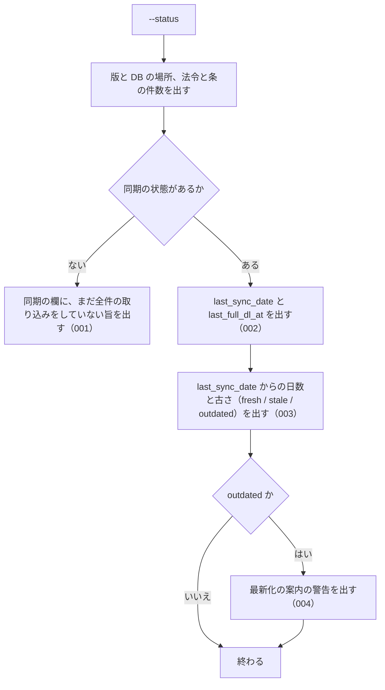

# 機能: cli_status（ローカル DB の同期の状態と件数を表示する）

- 機能 ID: EGOV
- 種類: CLI
- 版: current
- 承認日: 2026-09-28（PR #50）
- 起こした元: v0.15.1 の `src/cli/index.ts`、`src/services/freshness.ts`、`src/config.ts`、`src/services/freshness.test.ts`
- 関連する Issue: houki-egov-mcp #21（`--status` の案内を `--sync` に変えた）

この文書は「このコマンドは何をするか」を書きます。どう実装しているか（関数名・テーブル名）は書きません。

## アクター

- 利用者（ターミナルから `houki-egov-mcp --status` を実行する人）。ローカル DB がいつまで同期されているか、どれだけ古いか、次に何を実行すればよいかを見る

## 入力

| フラグ・環境変数     | 必須 | 内容                                                                           |
| -------------------- | ---- | ------------------------------------------------------------------------------ |
| `--status`           | 必須 | 同期の状態と DB の件数を表示する                                               |
| `HOUKI_EGOV_DB_PATH` | 任意 | DB ファイルの場所。既定は `${XDG_CACHE_HOME:-~/.cache}/houki-egov-mcp/laws.db` |

## 処理の流れ

実行してから表示を終えるまでに、何をどの順で確かめるかを示します。図の中の番号は「できること」の仕様 ID の末尾 3 桁です。



## できること

### SPEC-EGOV-CLI-STATUS-001 全件の取り込みがまだなら、その旨を出す

同期の状態が無い（`--bulk-download-everything` をまだ一度も終えていない）ときは、同期の欄に日付・古さを出さず、`sync:     (まだ bulk DL されていません — --bulk-download-everything を実行)` を出す。

### SPEC-EGOV-CLI-STATUS-002 最後に同期した日と、最後に全件を取り込んだ時刻を出す

同期の状態があるときは、`last_sync_date`（最後に同期した日。`YYYY-MM-DD`）と `last_full_dl_at`（最後に全件を取り込んだ時刻）を、DB に記録された値のまま出す。

例: `last_sync_date` が `2026-05-07`、`last_full_dl_at` が `2026-05-01T03:00:00+09:00` なら、その 2 つをそのまま出す。

### SPEC-EGOV-CLI-STATUS-003 最後に同期した日からの日数と古さを出す

`days_since_sync` に `last_sync_date` から今までの日数を、`staleness` に次の古さを出す。

| `days_since_sync`  | `staleness` |
| ------------------ | ----------- |
| 7 日未満           | `fresh`     |
| 7 日以上 30 日未満 | `stale`     |
| 30 日以上          | `outdated`  |

例: 2026-05-09 に `last_sync_date` が `2026-05-08` なら `days_since_sync` は 1、`staleness` は `fresh`。`2026-04-01` なら `outdated`。

### SPEC-EGOV-CLI-STATUS-004 `outdated` のときだけ最新化の警告を出す

`staleness` が `outdated` のときは、次の警告を出す。

```
  ⚠ bulk DB が <日数> 日前のデータです。最新化するには `houki-egov-mcp --sync` (最終同期から 90 日を超えていれば `--bulk-download-everything`) を実行してください
```

`fresh` と `stale` のときはこの警告を出さない。

## できないこと

- 同期や取り込みをすること（表示するだけ。最新化は `--sync`、作り直しは `--bulk-download-everything`）
- e-Gov 側に新しい差分があるかを確かめること（ネットワークに出ない）
- 法令ごとの取得日時や、未施行・前の版の内訳を出すこと

## 未決

初版起こしで見つけた、意図か不具合かを人が決める項目です。決まったら「できること」に ID を振るか、`specs/changes/` の差分にします。

意図か不具合かの判断が要る項目は houki-egov-mcp の Issue に移し、ここには題と Issue の番号だけを残します。今の振る舞いのままでよくテストが無いだけの項目は、受入テストを書いてから「できること」に ID を振ります。

1. **コマンドとしての表示と終了コード。** 標準出力に `[status] <パッケージ名> v<版>`、`DB: <DB ファイルの場所>`、`laws: <件数>`、`articles: <件数>`（件数は 3 桁ごとにコンマ）と同期の欄を出して終了コード 0 で終わること、DB を開けないときは標準エラー出力に `[ERROR] DB を開けません: <エラーの文>` を出して終了コード 1 で終わること。古さの判定のテストはあるが、コマンドを通したテストが無い。ID を振るのは受入テストを書いてから。
2. **`fresh` / `stale` で 1 日以上たっていれば `--sync` を案内する。** 警告の無いとき（`outdated` でないとき）に `days_since_sync` が 1 以上なら、`差分を取り込むには --sync を実行してください` を出す。テストが無い。ID を振るのは受入テストを書いてから。
3. **DB ファイルが無いときに空の DB を作る。** `--status` は状態を見るだけのコマンドだが、DB ファイル（とそのフォルダー）が無いときは作ってから件数 0 を表示し、ファイルが残る。作らずに「DB がありません」と出すかを決める必要がある。
4. **`laws` の件数は法令の数ではなく版の数である。** `laws:` に出る件数は、前の版（`PreviousEnforced`）や未施行の版も 1 件として数えた数で、同じ法令の版が複数あれば重ねて数える。見出しどおり法令の数にするか、版の数であることを表示に書くかを決める必要がある。
5. **警告の「90 日」は `HOUKI_EGOV_INCREMENTAL_LIMIT_DAYS` を変えても 90 のまま。** SPEC-EGOV-CLI-STATUS-004 の警告の文は 90 日と書いてあり、`--sync` が使う上限の日数（`HOUKI_EGOV_INCREMENTAL_LIMIT_DAYS`）を変えても変わらない。設定した日数を出すかを決める必要がある。
