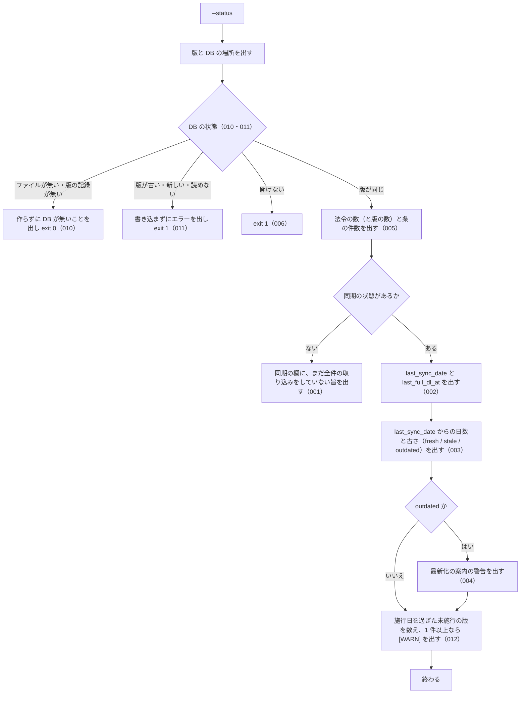

# 機能: cli_status（ローカル DB の同期の状態と件数を表示する）

- 機能 ID: EGOV
- 種類: CLI
- 版: current
- 承認日: 2026-09-28（PR #50）。差分 `20260928-undecided-to-issues` は 2026-09-28（PR #68）。差分 `20260928-untested-behaviors` は 2026-09-28（PR #76）。差分 `20260930-bugfix-batch` は 2026-09-30（PR #81）。差分 `20261001-t2-error-codes` は 2026-10-01（PR #85）。差分 `20261003-db-cli` は 2026-10-03（PR #100）。差分 `20261004-ingest-redistributed-revisions` は 2026-10-04（PR #112）
- 起こした元: v0.15.1 の `src/cli/index.ts`、`src/services/freshness.ts`、`src/config.ts`、`src/services/freshness.test.ts`
- 関連する Issue: houki-egov-mcp #21（`--status` の案内を `--sync` に変えた）、houki-egov-mcp #60・#61（0.19.0）、houki-egov-mcp #107（0.19.1）

この文書は「このコマンドは何をするか」を書きます。どう実装しているか（関数名・テーブル名）は書きません。

## アクター

- 利用者（ターミナルから `houki-egov-mcp --status` を実行する人）。ローカル DB がいつまで同期されているか、どれだけ古いか、次に何を実行すればよいかを見る

## 入力

| フラグ・環境変数                    | 必須 | 内容                                                                           |
| ----------------------------------- | ---- | ------------------------------------------------------------------------------ |
| `--status`                          | 必須 | 同期の状態と DB の件数を表示する                                               |
| `HOUKI_EGOV_DB_PATH`                | 任意 | DB ファイルの場所。既定は `${XDG_CACHE_HOME:-~/.cache}/houki-egov-mcp/laws.db` |
| `HOUKI_EGOV_INCREMENTAL_LIMIT_DAYS` | 任意 | 警告の文に出す日数。既定 90（SPEC-EGOV-CLI-STATUS-004）                        |

## 処理の流れ

実行してから表示を終えるまでに、何をどの順で確かめるかを示します。図の中の番号は「できること」の仕様 ID の末尾 3 桁です。



## できること

### SPEC-EGOV-CLI-STATUS-001 全件の取り込みがまだなら、その旨を出す

同期の状態が無い（`--bulk-download-everything` をまだ一度も終えていない）ときは、同期の欄に日付・古さを出さず、`sync:     (まだ bulk DL されていません — --bulk-download-everything を実行)` を出す。

### SPEC-EGOV-CLI-STATUS-002 最後に同期した日と、最後に全件を取り込んだ時刻を出す

同期の状態があるときは、`last_sync_date`（最後に同期した日。`YYYY-MM-DD`）と `last_full_dl_at`（最後に全件を取り込んだ時刻）を、DB に記録された値のまま出す。

例: `last_sync_date` が `2026-05-07`、`last_full_dl_at` が `2026-05-01T03:00:00+09:00` なら、その 2 つをそのまま出す。

### SPEC-EGOV-CLI-STATUS-003 最後に同期した日からの日数と古さを出す

`days_since_sync` に `last_sync_date` から今までの日数を、`staleness` に次の古さを出す。

| `days_since_sync`  | `staleness` |
| ------------------ | ----------- |
| 7 日未満           | `fresh`     |
| 7 日以上 30 日未満 | `stale`     |
| 30 日以上          | `outdated`  |

例: 2026-05-09 に `last_sync_date` が `2026-05-08` なら `days_since_sync` は 1、`staleness` は `fresh`。`2026-04-01` なら `outdated`。

### SPEC-EGOV-CLI-STATUS-004 `outdated` のときだけ最新化の警告を出す

`staleness` が `outdated` のときは、次の警告を出す。`<上限>` は `HOUKI_EGOV_INCREMENTAL_LIMIT_DAYS` の値（既定 90。`--sync` が差分で追える日数の上限。SPEC-EGOV-CLI-SYNC-003）。

```
  ⚠ bulk DB が <日数> 日前のデータです。最新化するには `houki-egov-mcp --sync` (最終同期から <上限> 日を超えていれば `--bulk-download-everything`) を実行してください
```

`fresh` と `stale` のときはこの警告を出さない。

例: `HOUKI_EGOV_INCREMENTAL_LIMIT_DAYS=60` で、`last_sync_date` が 38 日前の DB では、警告に `(最終同期から 60 日を超えていれば` が入る。環境変数が無いときは `(最終同期から 90 日を超えていれば`（v0.18.x では環境変数によらず 90。#61）。

### SPEC-EGOV-CLI-STATUS-005 版・DB の場所・件数と同期の欄を標準出力に出して exit 0

版が同じ DB（SPEC-EGOV-DB-SCHEMA-025）のとき、`--status` は次の行を順に標準出力に出し、終了コード 0 で終わる。標準エラー出力には何も出さない。

1. `[status] <パッケージ名> v<版>`
2. `  DB: <DB ファイルの場所>`（`HOUKI_EGOV_DB_PATH` を指定していればその値）
3. `  laws:     <法令の数> (版: <版の数>)`。法令の数は `laws` の `law_id` の種類の数、版の数は `laws` の行の数（前の版・未施行の版を含む）
4. `  articles: <条の行の件数>`
5. 同期の欄（同期の状態が無ければ SPEC-EGOV-CLI-STATUS-001 の 1 行。あれば `  sync:` の行に続けて、`    last_sync_date:  <値>`・`    last_full_dl_at: <値>`・`    days_since_sync: <日数>`・`    staleness:       <古さ>` の 4 行）

例: `HOUKI_EGOV_DB_PATH=/tmp/x/laws.db` で、法令 1 件（版 1 つ）・条 2 件を取り込み、`last_sync_date` が `2026-05-08`、`last_full_dl_at` が `2026-05-01T03:00:00.000Z` の DB に、2026-05-09（日本時間）に実行すると、標準出力は次のとおりで終了コードは 0。

```
[status] @shuji-bonji/houki-egov-mcp v0.19.0
  DB: /tmp/x/laws.db
  laws:     1 (版: 1)
  articles: 2
  sync:
    last_sync_date:  2026-05-08
    last_full_dl_at: 2026-05-01T03:00:00.000Z
    days_since_sync: 1
    staleness:       fresh
  差分を取り込むには --sync を実行してください
```

同じ法令の現行の版と前の版の 2 行がある DB では `  laws:     1 (版: 2)`（v0.18.x では `  laws:     2` と出し、版の数を法令の数のように見せていた。#61）。同期の状態が無く空の DB なら、`  laws:     0 (版: 0)`・`  articles: 0` に続けて `  sync:     (まだ bulk DL されていません — --bulk-download-everything を実行)` を出して終了コード 0。

### SPEC-EGOV-CLI-STATUS-006 DB を開けないときは exit 1

`HOUKI_EGOV_DB_PATH` の場所の DB を開けないときは、1・2 行目（`[status] …` と `  DB: …`）を標準出力に出した後、標準エラー出力に `[ERROR] DB を開けません: <エラーの文>` を出し、件数と同期の欄を出さずに終了コード 1 で終わる。

例: `HOUKI_EGOV_DB_PATH` に SQLite でない中身のファイルを指定すると `[ERROR] DB を開けません: file is not a database`、フォルダーを指定すると `[ERROR] DB を開けません: unable to open database file` を出して終了コード 1。

### SPEC-EGOV-CLI-STATUS-007 `outdated` でなく 1 日以上たっていれば `--sync` を案内する

同期の状態があり、`staleness` が `outdated` でなく（SPEC-EGOV-CLI-STATUS-004 の警告を出さず）、`days_since_sync` が 1 以上のときは、同期の欄の後に `  差分を取り込むには --sync を実行してください` を出す。`days_since_sync` が 0 のときと、`outdated` のとき（警告を出すとき）はこの行を出さない。

例: 2026-05-09（日本時間）に実行したとき、`last_sync_date` が `2026-05-08`（`fresh`、1 日）と `2026-04-20`（`stale`、19 日）ではこの行を出す。`2026-05-09`（0 日）と `2026-04-01`（`outdated`、38 日）では出さない。

### SPEC-EGOV-CLI-STATUS-008 件数の 3 桁の区切りは環境の言語設定によらず `,`

SPEC-EGOV-CLI-STATUS-005 の 3・4 行目に出す法令の数・版の数・条の件数は、1,000 以上のとき 3 桁ごとに `,` で区切る（`1,234,567`）。区切りの文字は、実行する環境の言語設定（`LANG`・`LC_ALL` など）によらず `,` で、小数点や桁の区切りにほかの文字を使う言語設定（`de_DE.UTF-8` など）でも変わらない。1,000 未満の件数は区切りなし（`0`・`1`・`999`）。

例: 法令 1,234 件（どれも版 1 つ）・条の行が 5 件の DB では、環境の言語設定が英語（`en_US`）でもドイツ語（`de_DE`）でも、`  laws:     1,234 (版: 1,234)` と `  articles: 5` を出す。

（v0.15.3 までは、環境の言語設定に従って区切っていたため、`LANG=de_DE.UTF-8` では `1.234.567` になった。houki-egov-mcp #74）

### SPEC-EGOV-CLI-STATUS-009 同期の記録の日付を解釈できないときは `[ERROR]` を出して exit 1

`sync_state.last_sync_date` が日付・時刻として解釈できない（空文字、`2026/05/08`、`2026-02-30` など）ときは、1〜4 行目（`[status] …`・`  DB: …`・`  laws: …`・`  articles: …`）を標準出力に出した後、標準エラー出力に `[ERROR] 同期の記録を読めません: <last_sync_date の値>（houki-egov-mcp --bulk-download-everything で作り直してください）` を出し、同期の欄（SPEC-EGOV-CLI-STATUS-002〜004・007）を出さずに終了コード 1 で終わる（SPEC-EGOV-COMMON-ERRORS-031 の CLI での形）。例外のまま終わらない。

例: `sync_state.last_sync_date` を `2026/05/08` に書き換えた DB で `houki-egov-mcp --status` を実行すると、標準エラー出力に `[ERROR] 同期の記録を読めません: 2026/05/08（houki-egov-mcp --bulk-download-everything で作り直してください）` を出して終了コード 1。`2026-05-08` の DB では今までどおり同期の欄を出して終了コード 0。

### SPEC-EGOV-CLI-STATUS-010 DB が無いときは作らずに、そのことを出して exit 0

DB のファイルが無いとき（置き場所のフォルダーも無いときを含む）と、ファイルはあるが版の記録が無いときは、1・2 行目（`[status] …` と `  DB: …`）の後に `  (DB がまだありません — houki-egov-mcp --bulk-download-everything で作ります)` を標準出力に出し、件数と同期の欄を出さずに終了コード 0 で終わる。DB のファイル・フォルダー・テーブルを作らない（SPEC-EGOV-DB-SCHEMA-025）。

例: `HOUKI_EGOV_DB_PATH=<空のフォルダー>/a/laws.db` で `--status` を実行すると、標準出力は `[status] …`・`  DB: <空のフォルダー>/a/laws.db`・`  (DB がまだありません — houki-egov-mcp --bulk-download-everything で作ります)` の 3 行で終了コード 0、終わった後も `<空のフォルダー>/a` は無い（v0.18.x では `a/laws.db` を作ってから `laws:     0` を出し、ファイルが残った。#60）。

### SPEC-EGOV-CLI-STATUS-011 版が同じでない DB には書き込まずに exit 1

古い版・新しい版・読めない版の DB のときは、1・2 行目を標準出力に出した後、SPEC-EGOV-DB-SCHEMA-025 のエラーの文を標準エラー出力に出し、件数と同期の欄を出さずに終了コード 1 で終わる。DB を作り直さず、書き換えない。

例: `schema_version` が `2` の DB で `--status` を実行すると、`[ERROR] DB の版 (2) が古いため使えません。houki-egov-mcp --bulk-download-everything で作り直してください（…）` を出して終了コード 1 で、`schema_version` は `2` のまま、`laws` の行も残る（0.19.0 に上げた直後の利用者の DB はこの状態になる。v0.18.x の「版が違えば作り直す」をそのまま使うと、`--status` を実行しただけで取り込んだ中身が消える）。

### SPEC-EGOV-CLI-STATUS-012 施行日を過ぎても未施行のままの版があれば `[WARN]` で全件の取り込みを案内する

同期の状態があり、同期の欄（SPEC-EGOV-CLI-STATUS-002・003）を出せたときは、DB の `laws` のうち、`current_revision_status` が `UnEnforced` で、`amendment_enforcement_date` が `last_sync_date` より前（同じ日を含まない）の版を数える。1 件以上なら、同期の欄と、その後の警告（SPEC-EGOV-CLI-STATUS-004）または `--sync` の案内（007）の行の後に、標準出力に次の 1 行を出す。0 件なら出さない。終了コードは 0 のまま変えない。標準エラー出力には出さない。

```
[WARN] 施行日が last_sync_date (<last_sync_date>) より前なのに未施行 (UnEnforced) のままの版が <件数> 件あります。houki-egov-mcp --bulk-download-everything を 1 回実行すると直ります（全件の zip 約 290 MB を取得します。条の本文は入れ直しません）
```

文は SPEC-EGOV-CLI-SYNC-021 と同じ。数える条件も同じで、比べる日は今日ではなく `last_sync_date`（同期していない日の配り直しは `--sync` で取り込めるので、`--bulk-download-everything` を案内しない）。`amendment_enforcement_date` が `NULL` の版は数えない。同期の状態が無いとき（001）、DB が無いとき（010）、版が合わないとき（011）、DB を開けないとき（006）、同期の記録を読めないとき（009）は数えず、出さない。ネットワークには出ない。

例: `last_sync_date` が `2026-10-06` で、施行日 `2026-10-05` の `UnEnforced` の版が 5 つある DB に、2026-10-07（日本時間）に `--status` を実行すると、同期の欄（`days_since_sync: 1`、`staleness: fresh`）と `  差分を取り込むには --sync を実行してください` の後に、`[WARN] 施行日が last_sync_date (2026-10-06) より前なのに未施行 (UnEnforced) のままの版が 5 件あります。…` を出して終了コード 0。`last_sync_date` が `2026-10-05` なら、施行日 `2026-10-05` の版は数えない（同じ日を含まない）ので出さない。

## できないこと

- 同期や取り込みをすること（表示するだけ。最新化は `--sync`、作り直しは `--bulk-download-everything`）
- e-Gov 側に新しい差分があるかを確かめること（ネットワークに出ない）
- 法令ごとの取得日時や、未施行・前の版の内訳を出すこと
- DB を作ること・作り直すこと（`--bulk-download-everything`。SPEC-EGOV-DB-SCHEMA-025）

## 未決

初版起こしで見つけた、意図か不具合かを人が決める項目です。決まったら「できること」に ID を振るか、`specs/changes/` の差分にします。

意図か不具合かの判断が要る項目は houki-egov-mcp の Issue に移し、ここには題と Issue の番号だけを残します。今の振る舞いのままでよくテストが無いだけの項目は、受入テストを書いてから「できること」に ID を振ります。

1. **コマンドとしての表示と終了コード。** → SPEC-EGOV-CLI-STATUS-005・SPEC-EGOV-CLI-STATUS-006
2. **`fresh` / `stale` で 1 日以上たっていれば `--sync` を案内する。** → SPEC-EGOV-CLI-STATUS-007
