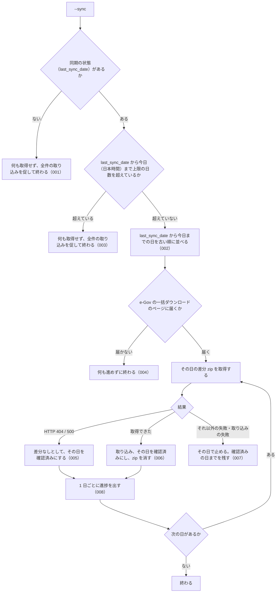

# 機能: cli_sync（全件取り込み済みのローカル DB を日次差分で最新化する）

- 機能 ID: EGOV
- 種類: CLI
- 版: current
- 承認日:
- 起こした元: v0.15.1 の `src/cli/index.ts`、`src/config.ts`、`src/services/bulk/sync.ts`、`src/services/bulk/zip-fetcher.ts`、`src/services/bulk/ingester.ts`、`src/services/bulk/sync.test.ts`
- 関連する Issue: houki-egov-mcp #21（`--sync` の追加）

この文書は「このコマンドは何をするか」を書きます。どう実装しているか（関数名・テーブル名）は書きません。

## アクター

- 利用者（ターミナルから `houki-egov-mcp --sync` を実行する人。定期実行に組み込む人を含む）。`--bulk-download-everything` で作ったローカル DB に、最後に同期した日から今日までの e-Gov の日次差分を取り込む

## 入力

| フラグ・環境変数 | 必須 | 内容 |
|---|---|---|
| `--sync` / `--bulk-download-incremental` | 必須 | 差分での最新化を行う。2 つは同じ動作 |
| `HOUKI_EGOV_INCREMENTAL_LIMIT_DAYS` | 任意 | 最後に同期した日から差分で追える日数の上限（既定 90。e-Gov が日次差分を公開している範囲） |
| `HOUKI_EGOV_DB_PATH` | 任意 | DB ファイルの場所。既定は `${XDG_CACHE_HOME:-~/.cache}/houki-egov-mcp/laws.db` |
| `HOUKI_EGOV_BULK_RETRY` | 任意 | 1 日分の zip の取得に失敗したときに試す回数（既定 3） |

## 処理の流れ

実行してから終わるまでに、何をどの順で確かめるかを示します。図の中の番号は「できること」の仕様 ID の末尾 3 桁です。

## できること

### SPEC-EGOV-CLI-SYNC-001 全件の取り込みがまだなら何も取得しない

同期の状態が無い（`--bulk-download-everything` をまだ一度も終えていない）ときは、e-Gov への接続の確認も差分の取得もしない。

### SPEC-EGOV-CLI-SYNC-002 最後に同期した日を含めて、今日（日本時間）までを 1 日ずつ確かめる

確かめる日は、同期の状態の `last_sync_date` から今日までの両端を含むすべての日で、古い順に並べる。今日は日本時間の日付で決める（UTC ではまだ前日の時刻でも、日本時間で日付が変わっていれば新しい日付）。月をまたいでも日を飛ばさない。`last_sync_date` が今日と同じなら、今日 1 日だけを確かめ直す（e-Gov の日次差分はその日の 15 時ごろに作られるので、午前に同期した日の差分を拾い直すため）。各日の差分は `update_date=YYYYMMDD`（例: 2026-09-07 → `20260907`）で取得する。

例: 日本時間 2026-09-19 12 時に、`last_sync_date` が `2026-09-17` の DB で実行すると、`2026-09-17`・`2026-09-18`・`2026-09-19` の 3 日を確かめる。

### SPEC-EGOV-CLI-SYNC-003 差分で追える日数を超えていたら何も取得しない

`last_sync_date` から今日までの日数が `HOUKI_EGOV_INCREMENTAL_LIMIT_DAYS`（既定 90）を超えているときは、e-Gov への接続の確認も差分の取得もしない。ちょうど上限の日数のときは差分で追う（既定なら 91 日を確かめる）。

例: 日本時間 2026-09-19 に `last_sync_date` が `2026-05-01` の DB では 141 日空いているので、何も取得しない。`2026-06-21` なら 90 日なので差分で追う。

### SPEC-EGOV-CLI-SYNC-004 e-Gov に届かなければ何も進めない

差分を取得する前に、e-Gov の一括ダウンロードのページ（`https://laws.e-gov.go.jp/bulkdownload/`）に届くことを確かめる。届かないときは、1 日分も取得せず、`last_sync_date` も動かさずに失敗する。

### SPEC-EGOV-CLI-SYNC-005 差分 zip の無い日は「差分なし」として飛ばす

その日の差分 zip の取得に HTTP 404 または 500 が返ったときは、失敗とせず「差分なし」として扱い、その日を確認済みにして次の日へ進む（e-Gov は差分の無い日に HTTP 500 を返す。SPEC-EGOV-CLI-SYNC-004 で e-Gov に届くことを確かめてあるので、障害とは見なさない）。HTTP 503 など 404・500 以外の応答と、通信の失敗は「差分なし」にしない。

### SPEC-EGOV-CLI-SYNC-006 差分のある日は取り込み、1 日ごとに `last_sync_date` を進める

差分 zip を取得できた日は、その zip を DB に取り込み（取り込みのしかたは `--bulk-download-by-date` と同じ。cli_bulk_download の SPEC-EGOV-CLI-BULK-DOWNLOAD-007〜016）、その日を確認済みにする。確認済みにするたびに、同期の状態を次にする。取り込んだ zip はその日のうちに消す。

- `last_sync_date`: 確認済みにした日
- `last_full_dl_at`: 前の全件の取り込みの時刻のまま
- 法令の総数: その時点の DB にある法令の数
- 取り込み元: `incremental`

例: `last_sync_date` が `2026-09-16` で、2026-09-16 と 2026-09-19 は差分なし、2026-09-17 と 2026-09-18 は差分ありのとき、4 日とも確認済みになり、`last_sync_date` は `2026-09-19` になる。消す zip は 09-17 と 09-18 の 2 つ。

### SPEC-EGOV-CLI-SYNC-007 差分なし以外の失敗が起きたら、その日で止めて確認済みの日までを残す

ある日の取得が「差分なし」以外の理由で失敗したとき、または取り込みに失敗したときは、その日と後の日を確かめずに止める。`last_sync_date` は最後に確認済みにした日のまま残るので、もう一度 `--sync` を実行するとその失敗した日から続ける。取り込みに失敗した日の zip も消す。

例: `last_sync_date` が `2026-09-16` で、2026-09-18 の取得が `bulk DL に 3 回失敗しました: ECONNRESET` で失敗したとき、09-16 と 09-17 が確認済みになり、`last_sync_date` は `2026-09-17` になる。

### SPEC-EGOV-CLI-SYNC-008 1 日ごとに進捗を出す

1 日を確かめ終わるごとに（差分なしの日も）、何日目か・全部で何日かとその日の結果を 1 行出す。

## できないこと

- 差分で追える日数を超えた DB を最新化すること（全件の取り込み `--bulk-download-everything` をやり直す）
- 全件の取り込みをしていない DB を差分だけで作ること
- 止まった日の続きを自動でやり直すこと（もう一度 `--sync` を実行する）

## 未決

初版起こしで見つけた、意図か不具合かを人が決める項目です。決まったら「できること」に ID を振るか、`specs/changes/` の差分にします。

意図か不具合かの判断が要る項目は houki-egov-mcp の Issue に移し、ここには題と Issue の番号だけを残します。今の振る舞いのままでよくテストが無いだけの項目は、受入テストを書いてから「できること」に ID を振ります。

1. **コマンドとしての表示と終了コード。** 次の表示と終了コードはテストが無い（日の決め方と進め方のテストはあるが、コマンドを通したテストが無い）。ID を振るのは受入テストを書いてから。
   - 同期の状態が無いとき: `[sync] まだ全件取り込みが行われていません。先に --bulk-download-everything を実行してください` を出して終了コード 1
   - 上限の日数を超えたとき: `[sync] last_sync_date <日付> から <日数> 日空いています。日次差分の公開範囲 (<上限> 日) を超えているので、--bulk-download-everything を実行してください` を出して終了コード 1
   - e-Gov に届かないとき: `[ERROR] e-Gov に接続できません (HTTP <status> from https://laws.e-gov.go.jp/bulkdownload/)` などを出して終了コード 1
   - 途中で止まったとき: `[ERROR] <日付>: <エラーの文>` と、確認済みの日までを記録したこと（または `last_sync_date` が変わらないこと）を出して終了コード 1
   - 終わったとき: `[完了] <日数> 日分を確認 (<開始日> 〜 <今日>)、…` に差分のあった日数・upsert と unchanged の件数・差分なしの日数・XML を読めず飛ばした件数と所要時間を続け、`last_sync_date: <日付>` を出して終了コード 0
   - 1 日ごとの行の形: `[<n>/<N>] <日付>: <n> 件 upsert, … (<サイズ>, <時間>)`、差分なしの日は `[<n>/<N>] <日付>: 差分なし`
2. **`--bulk-download-incremental` も `--sync` と同じ。** テストが無い。ID を振るのは受入テストを書いてから。
3. **差分の無い日も、取得を何度も試してから「差分なし」にする。** 差分の無い日の HTTP 500 も、1 日分の zip の取得では失敗として `HOUKI_EGOV_BULK_RETRY`（既定 3）回まで、1 秒・2 秒と間をあけて取り直してから「差分なし」になる。差分の無い日（日曜日など）1 日ごとに 3 秒ほど余計にかかり、90 日分を追うと数分になる。404・500 は 1 回目で「差分なし」とするかを決める必要がある。
4. **`last_sync_date` が今日より後の日付のとき。** 確かめる日が 0 日になり、何も取得せずに `[完了] 0 日分を確認 …` を出して終了コード 0 で終わる。テストが無い。ID を振るのは受入テストを書いてから。
