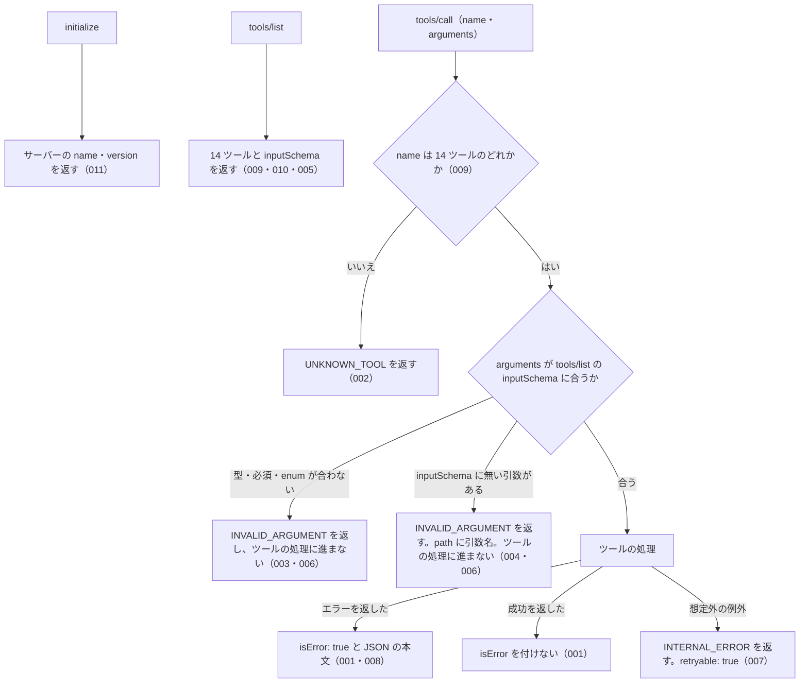

# 機能: common_errors（全ツールに共通するエラー応答の形と引数の検査、ツールの登録）

- 機能 ID: EGOV
- 種類: 共通
- 版: current
- 承認日: 2026-09-28（PR #50）
- 起こした元: v0.15.1 の `src/server.ts`、`src/errors.ts`、`src/tools/tool-args.ts`、`src/tools/handlers.ts`（ツールの登録の表）、`src/tools/definitions.ts`（tools/list の一覧）、`src/server.test.ts`、`src/errors.test.ts`、`src/tools/handlers.test.ts`
- 関連する Issue: なし

この文書は、複数のツールに共通する、tools/call のエラー応答の形と引数の検査、tools/list に出すツールの一覧を書きます。どう実装しているか（関数名・テーブル名）は書きません。

## アクター

- MCP クライアント（Claude などの LLM、または MCP を呼ぶプログラム）。initialize でサーバーの名前と版を受け取り、tools/list で呼べるツールと inputSchema を確かめ、tools/call でツール名と引数を渡す。エラーのときは `isError: true` と JSON の本文を受け取って、`code` で失敗の種類を見分け、`hint` と `next_actions` で次に何をするかを決める

## 入力

| 入力                      | 必須 | 内容                                                                                                        |
| ------------------------- | ---- | ----------------------------------------------------------------------------------------------------------- |
| tools/call の `name`      | 必須 | 呼ぶツールの名前。下の「対象」の 14 個のどれか                                                              |
| tools/call の `arguments` | 任意 | ツールの引数（JSON オブジェクト）。tools/list に出している、そのツールの inputSchema に合わなければならない |

## 対象

この規則は、tools/call で呼べる次の 14 ツールすべてに当てはまる。どのツールも、tools/list の inputSchema と同じものを使って引数を検査してから、ツールの処理に進む。表の順は tools/list が返す順である。

| ツール                   | 当てはまる場面                                            |
| ------------------------ | --------------------------------------------------------- |
| `search_law`             | 引数の検査、エラー応答の形、処理中の想定外の例外          |
| `get_law`                | 同上                                                      |
| `get_toc`                | 同上                                                      |
| `get_law_range`          | 同上                                                      |
| `search_fulltext`        | 同上                                                      |
| `resolve_abbreviation`   | 同上                                                      |
| `get_law_revisions`      | 同上                                                      |
| `explain_law_type`       | 同上                                                      |
| `get_related_laws`       | 同上                                                      |
| `get_article_references` | 同上                                                      |
| `verify_citations`       | 同上                                                      |
| `list_attachments`       | 同上                                                      |
| `get_attachment`         | 同上                                                      |
| `get_law_file`           | 同上                                                      |
| 上の 14 個以外の名前     | 存在しないツール名のエラー（SPEC-EGOV-COMMON-ERRORS-002） |

### エラー応答のフィールド

エラーの本文は、次のフィールドを持つ JSON オブジェクトである。`error` と `code` は必ず付き、ほかは値があるときだけ付く（SPEC-EGOV-COMMON-ERRORS-008）。

| フィールド     | 内容                                                                                                                                                                                                                           |
| -------------- | ------------------------------------------------------------------------------------------------------------------------------------------------------------------------------------------------------------------------------ |
| `error`        | 1 文のエラーの説明（人も LLM も読む）                                                                                                                                                                                          |
| `code`         | 失敗の種類を表す文字列（下の表）                                                                                                                                                                                               |
| `hint`         | 次に何を確かめるかの案内                                                                                                                                                                                                       |
| `next_actions` | 次に呼ぶツールや取る手段の候補の配列。要素は `action`（ツール名、または `list_tools` / `retry_later` / `visit_egov_site` / `delegate_to_mcp` のような手段の名前）・`reason`（どんなときに有効か）・`example`（引数の例。任意） |
| `retryable`    | `true` なら、時間をおいて同じ呼び出しをやり直すと結果が変わりうる                                                                                                                                                              |
| `detail`       | 調べるための詳細。`status`（HTTP ステータス）・`url`・`cause`（元の例外の文）・`issues`（引数の検査の問題の一覧）                                                                                                              |

### エラーの code

どの場面でどの code を返すかは、存在しないツール名・引数の検査・処理中の想定外の例外を除いて、各ツールの spec.md に書く。

| code                                                                                 | 失敗の種類                                                                                  |
| ------------------------------------------------------------------------------------ | ------------------------------------------------------------------------------------------- |
| `INVALID_ARGUMENT`                                                                   | 引数が inputSchema に合わない、または値の形がツールの受け付ける形でない（呼び出し側の誤り） |
| `INVALID_ARTICLE_NUM`                                                                | 条番号・号番号の書き方が受け付ける形でない                                                  |
| `UNKNOWN_TOOL`                                                                       | 存在しないツール名を呼んだ（呼び出し側の誤り）                                              |
| `OUT_OF_SCOPE`                                                                       | このサーバーの管轄でない資料を求めた（通達名など。別の MCP サーバーで取る）                 |
| `LAW_NOT_FOUND`                                                                      | 法令が見つからない                                                                          |
| `ARTICLE_NOT_FOUND`                                                                  | 法令はあるが、求めた条・項・号が無い                                                        |
| `RANGE_NOT_FOUND`                                                                    | 求めた編・章・節、または附則の番号が無い                                                    |
| `ATTACHMENT_NOT_FOUND`                                                               | 求めた添付ファイルが無い                                                                    |
| `SOURCE_API_ERROR` / `SOURCE_TIMEOUT` / `SOURCE_RATE_LIMITED` / `SOURCE_UNAVAILABLE` | e-Gov からの取得の失敗 / 時間切れ / 回数制限 / 接続できない                                 |
| `INTERNAL_ERROR`                                                                     | サーバー内部の失敗（処理中の想定外の例外）                                                  |

## 処理の流れ

tools/call を受けてから応答を返すまでに、何をどの順で確かめるかを示します。図の中の番号は「できること」の仕様 ID の末尾 3 桁です。

## できること

### SPEC-EGOV-COMMON-ERRORS-001 エラーは isError: true と JSON の本文で返し、成功には isError を付けない

ツールの処理がエラー（文字列の `error` と文字列の `code` を両方持つオブジェクト）を返したときは、tools/call の結果に `isError: true` を付け、`content` の先頭の `text` にそのエラーを JSON にした文字列を入れる。ツールの処理が付けた `code` や `hint` は、そのまま本文に入る。例: 処理が `code: "LAW_NOT_FOUND"`・`hint: "テスト用"` のエラーを返すと、結果は `isError: true` で、本文の `code` は `LAW_NOT_FOUND`、`hint` は `テスト用` である。

`error` と `code` の両方を文字列で持たない応答はエラーとして扱わない。`error` だけで `code` の無いオブジェクトもエラーとして扱わない。

ツールの処理が成功を返したときは、`isError` を付けない（例: `explain_law_type` に `name: "政令"` を渡すと、`isError` の無い結果で、本文は `name: "政令"` を持つ JSON の応答）。

### SPEC-EGOV-COMMON-ERRORS-002 存在しないツール名はエラー `UNKNOWN_TOOL`

tools/call の `name` が 14 ツールのどれでもないときは、エラー `UNKNOWN_TOOL` を返す（`isError: true`）。

- `hint` に、呼べるツール名の一覧（`search_law` など）を書く
- `next_actions` の先頭は `action: "list_tools"`（MCP の tools/list で呼べるツールを確かめる案内）

例: `name: "no_such_tool"` を呼ぶと、`code: "UNKNOWN_TOOL"` で、`hint` に `search_law` が含まれる。

### SPEC-EGOV-COMMON-ERRORS-003 inputSchema に合わない引数はエラー `INVALID_ARGUMENT`

引数の型が違う、必須の引数が無い、`enum` に無い値を渡した、のどれかのときは、エラー `INVALID_ARGUMENT` を返す（`isError: true`）。14 ツールすべてが、tools/list に出している inputSchema と同じものでこの検査を行う。

- `detail.issues` に問題の一覧を入れる。要素は `path`（問題のある引数名。入れ子なら `a.b` の形。特定できなければ空文字）と `message`

例: `explain_law_type` に `name: 123` を渡すと、`code: "INVALID_ARGUMENT"` で、`detail.issues[0].path` は `name`。`search_law` に引数を 1 つも渡さない（必須の `keyword` が無い）とき、`keyword: "消費税", law_type: "Bogus"` を渡したとき、`get_article_references` に `law_name: "所得税法"` だけを渡した（必須の `article` が無い）ときも、`INVALID_ARGUMENT` を返す。

### SPEC-EGOV-COMMON-ERRORS-004 inputSchema に無い引数はエラー `INVALID_ARGUMENT` で、`path` にその引数名を入れる

inputSchema の `properties` に無い引数を渡したときは、エラー `INVALID_ARGUMENT` を返す（`isError: true`）。`detail.issues` の `path` に、その引数の名前を入れる。

例: `explain_law_type` に `name: "政令", typo: 1` を渡すと、`code: "INVALID_ARGUMENT"` で、`detail.issues[0].path` は `typo`。`get_related_laws` に `law_name: "所得税法", mcp: "houki-egov"` を渡すと、`detail.issues[0].path` は `mcp`。

### SPEC-EGOV-COMMON-ERRORS-005 すべてのツールの inputSchema は、そこに無い引数を受け付けない

tools/list が返す 14 ツールの inputSchema には、どれも `additionalProperties: false` が付く。呼び出し側は tools/list を見て、どのツールでも inputSchema に無い引数は SPEC-EGOV-COMMON-ERRORS-004 のエラーになると分かる。

### SPEC-EGOV-COMMON-ERRORS-006 inputSchema に合わない引数では、ツールの処理に進まない

SPEC-EGOV-COMMON-ERRORS-003・004 のエラーを返すときは、ツールの処理に進まない。ツールの処理が返す応答の代わりに `INVALID_ARGUMENT` だけを返す。例: `explain_law_type` に `name: 123` を渡すと、知らない法令種別のときの応答（`found: false`）ではなく、`INVALID_ARGUMENT` のエラーを返す。

### SPEC-EGOV-COMMON-ERRORS-007 処理中の想定外の例外はエラー `INTERNAL_ERROR` で返す

ツールの処理の途中で想定外の例外が起きたときは、プロトコルのエラーにせず、tools/call の結果としてエラー `INTERNAL_ERROR` を返す（`isError: true`）。

- `retryable` は `true`
- `detail.cause` に、元の例外の文を入れる（例: 例外の文が `boom` なら `detail.cause` は `boom`）

### SPEC-EGOV-COMMON-ERRORS-008 エラーの本文には `error` と `code` が必ず付き、ほかのフィールドは値があるときだけ付く

エラーの本文には `error` と `code` が必ず付く。`hint`・`next_actions`・`retryable`・`detail` は、そのエラーで値を決めたときだけ付き、決めていないときはフィールドごと付かない。`next_actions` が空の配列になるときも付けない。

例: `hint`・`next_actions`・`retryable` を決めていない `LAW_NOT_FOUND` のエラーは `error` と `code` だけを持つ。`hint: "wait"`・`next_actions`（`retry_later` の 1 件）・`retryable: true`・`detail`（`status: 429`）を決めたエラーは、それらをすべて持つ。

### SPEC-EGOV-COMMON-ERRORS-009 tools/list と tools/call のツールは同じ 14 個

tools/list は「対象」の表の 14 ツールを返す。tools/call で呼べる名前も同じ 14 個で、それ以外の名前は SPEC-EGOV-COMMON-ERRORS-002 のエラーになる。v0.2.0 で外した `explain_business_law_restriction` は、どちらにも無い。

### SPEC-EGOV-COMMON-ERRORS-010 tools/list の inputSchema は JSON Schema のまま渡る

tools/list が返す各ツールの `inputSchema` は、`type: "object"` と `properties`・`required` を持つ JSON Schema である。例: `search_law` の `inputSchema` は `type: "object"`、`required: ["keyword"]`。

### SPEC-EGOV-COMMON-ERRORS-011 initialize でサーバーの名前と版を返す

initialize の応答の `serverInfo` は、`name` にパッケージ名（`@shuji-bonji/houki-egov-mcp`）、`version` にパッケージの版（v0.15.1 なら `0.15.1`）を持つ。

## できないこと

- ツール固有のエラー（`LAW_NOT_FOUND`・`ARTICLE_NOT_FOUND` など）をどの場面で返すかを決めること（各ツールの spec.md に書く）
- inputSchema で表せない値の検査（空のキーワード、条番号の書き方など）。これは各ツールの処理で行い、各ツールの spec.md に書く
- エラーの本文を JSON 以外の形で返すこと（`format` に `markdown` を指定した呼び出しでも、エラーの本文は JSON）
- `retryable: true` のエラーを自動でやり直すこと（やり直すかは呼び出し側が決める）
- `verify_citations` の `results[]` の件ごとの `code`。ツール全体のエラーではないので `isError` を付けない（`verify_citations` の spec.md に書く）

## 未決

初版起こしで見つけた、意図か不具合かを人が決める項目です。決まったら「できること」に ID を振るか、`specs/changes/` の差分にします。

意図か不具合かの判断が要る項目は houki-egov-mcp の Issue に移し、ここには題と Issue の番号だけを残します。今の振る舞いのままでよくテストが無いだけの項目は、受入テストを書いてから「できること」に ID を振ります。

1. **`arguments` を省いた呼び出し。** 空のオブジェクトを渡したものとして検査する（14 ツールとも必須の引数があるので `INVALID_ARGUMENT` になる）。テストが無い。ID を振るのは受入テストを書いてから。
2. **inputSchema の検査で返す `INVALID_ARGUMENT` の `error`・`hint`・`next_actions`。** `error` は `引数が tools/list の inputSchema に合いません: ` の後に `detail.issues` を `<path>: <message>` の形（`path` が空なら `<message>` だけ）で `; ` 区切りに続けたもの、`hint` は `tools/list の <ツール名> の inputSchema を確認してください (型・必須・enum・未知の引数)`、`next_actions` は `{ action: "list_tools", reason: "inputSchema で引数の型と必須項目を確認できます" }` の 1 件。テストは `code` と `detail.issues[0].path` しか確かめていない。テストが無い。ID を振るのは受入テストを書いてから。
3. **inputSchema の検査で返す `INVALID_ARGUMENT` に `tool` が付かない。** houki-nta-mcp は同じエラーに呼んだツールの名前を `tool` で付けるが、houki-egov-mcp は付けない。family で揃えるかは人が決める。
4. **必須の引数が無いときの `path` と、検査の `message` の言語。** 必須の引数が無いときは `detail.issues[0].path` が空文字で、どの引数が無いかは `message`（`must have required property 'name'`）の中にしか無い。型・enum の違反の `message` も英語（`must be string`、`must be equal to one of the allowed values`）で、inputSchema に無い引数の `message`（`inputSchema に無い引数です`）だけが日本語である。`path` に引数名を入れるか、`message` を日本語に揃えるかは人が決める。
5. **inputSchema に無い引数が 2 つ以上あるときの `path`。** `path` にそれらの名前がすべて `, ` 区切りで入り（例: `typo, foo`）、問題 1 件ごとにどの引数かを分けない。テストが無い。問題ごとに引数を分けるかは人が決める。
6. **`UNKNOWN_TOOL` の `error` の文面と `retryable`。** `error` は英語の `Unknown tool: <name>` で、ほかのエラーと違い日本語でない。`retryable` は付かないが、README の表は `false` と書く。文面を揃えるか、README に合わせて `retryable: false` を付けるかは人が決める。
7. **処理中の想定外の例外で返す `INTERNAL_ERROR` の `retryable` が README と違う。** 実際は `retryable: true` と `next_actions` に `retry_later` を付けるが、README の表は `INTERNAL_ERROR` の `retryable` を `false` と書く。また `hint` は「バグの可能性があります。再現手順を添えて GitHub issue でご報告ください」で、再試行の案内と報告の依頼が同じエラーに並ぶ。どちらに揃えるかは人が決める。
8. **処理中の想定外の例外で返す `INTERNAL_ERROR` の `error`・`hint`・`next_actions`。** `error` は `内部エラーが発生しました: <例外の文>`、`hint` は上の文、`next_actions` は `action: "retry_later"` の 1 件。テストは `code`・`retryable`・`detail.cause` しか確かめていない。テストが無い。ID を振るのは受入テストを書いてから。
9. **`hint` が空文字のときは付けない。** SPEC-EGOV-COMMON-ERRORS-008 のテストは `hint` を渡さない場合だけを確かめており、空文字を渡したときに付かないことは確かめていない。テストが無い。ID を振るのは受入テストを書いてから。
10. **どのツールも返さない code。** `ABBREVIATION_NOT_FOUND`（`resolve_abbreviation` は辞書に無い名前でもエラーにせず `resolved: null` を返す）と、v0.2.x までの `EGOV_API_ERROR`・`EGOV_TIMEOUT`・`EGOV_RATE_LIMITED` は、code の語彙に残っているが v0.15.1 ではどのツールも返さない。語彙から外すか残すかは人が決める。
11. **README の「まず試す」のツール数が実際と違う。** README は「9 ツールのうち 8 つはそのまま動きます」と書くが、tools/list が返すのは 14 ツールで、ローカル DB が要るのは `search_fulltext` の 1 つである（直後の表は 14 ツールを挙げている）。README を直すかは人が決める。
