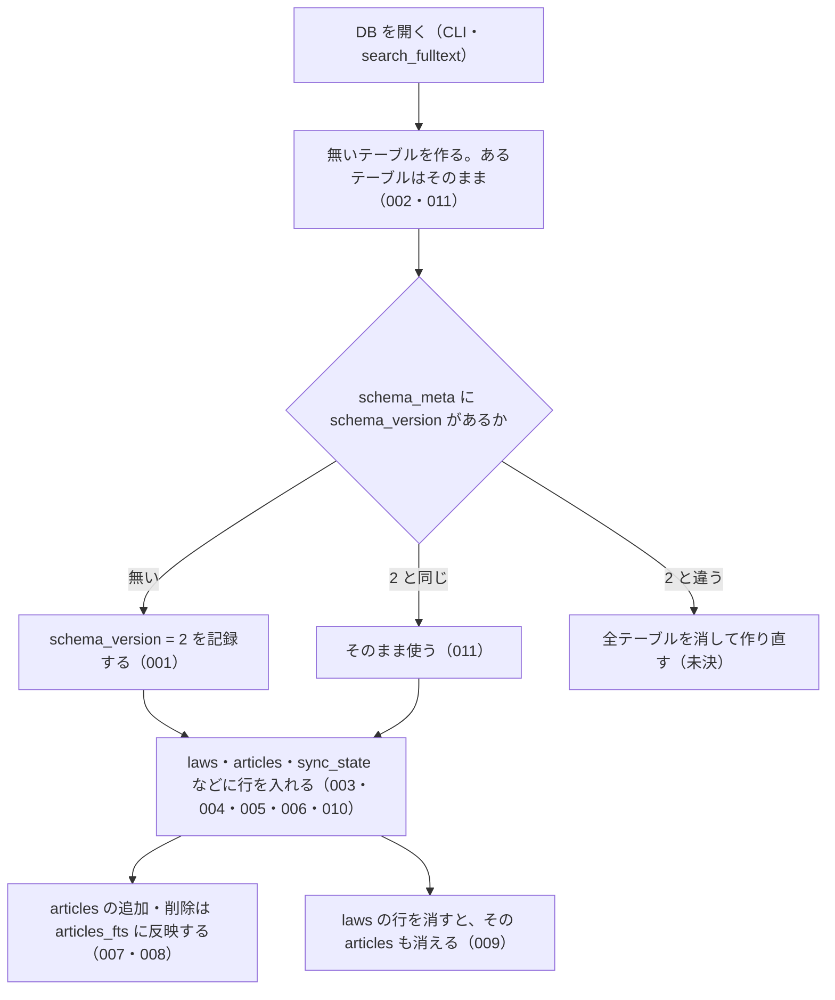

# 機能: db_schema（全文検索に使うローカル SQLite DB の置き場所とテーブル）

- 機能 ID: EGOV
- 種類: DB
- 版: current
- 承認日: 2026-09-28（PR #50）。差分 `20260928-undecided-to-issues` は 2026-09-28（PR #68）。差分 `20260928-untested-behaviors` は 2026-09-28（PR #PR-SPEC）
- 起こした元: v0.15.1 の `src/db/index.ts`、`src/db/schema.ts`、`src/config.ts`（`BULK_CONFIG`）、`src/cli/index.ts`（DB を開く箇所と `--help`）、`src/db/schema.test.ts`
- 関連する Issue: なし

この文書は「利用者の手元にできる DB が何を持ち、どう振る舞うか」を書きます。どう実装しているか（関数名）は書きません。DB のテーブル名・列名は、利用者が sqlite3 で開いて見られ、`--status` や `search_fulltext` の結果の元になる外から見える約束なので書きます。

## アクター

- 利用者（CLI の `--bulk-download-everything` / `--sync` で DB を作り・最新化し、`--status` で中身を確かめ、sqlite3 で直接開くこともある人）
- MCP クライアント（`search_fulltext` を呼ぶと、サーバーがこの DB を開いて引く）

## 入力

利用者がこの DB に触れる入口は次のとおり。

| 入口                                        | 必須 | 内容                                                                                                                                 |
| ------------------------------------------- | ---- | ------------------------------------------------------------------------------------------------------------------------------------ |
| 環境変数 `HOUKI_EGOV_DB_PATH`               | 任意 | DB ファイルのパスをまるごと指定する。ほかの指定より優先する                                                                          |
| 環境変数 `XDG_CACHE_HOME`                   | 任意 | `HOUKI_EGOV_DB_PATH` が無いとき、`$XDG_CACHE_HOME/houki-egov-mcp/laws.db` に置く。これも無いときは `~/.cache/houki-egov-mcp/laws.db` |
| CLI `--bulk-download-everything` / `--sync` | 任意 | DB に書き込む（取り込みの中身は CLI の spec.md に書く）                                                                              |
| CLI `--status`                              | 任意 | DB を開いて `laws` と `articles` の件数、同期の状態を表示する（CLI の spec.md に書く）                                               |
| ツール `search_fulltext`                    | 任意 | 呼び出しごとに DB を開いて引き、閉じる（`search_fulltext` の spec.md に書く）                                                        |

## 処理の流れ

DB を開いたときに何が起きるかを示します。図の中の番号は「できること」の仕様 ID の末尾 3 桁です。

## できること

### SPEC-EGOV-DB-SCHEMA-001 DB を開くとスキーマの版 2 を記録する

新しい DB を開くと、`schema_meta` テーブルに `key = 'schema_version'`、`value = '2'` の行を記録する。v0.15.1 のスキーマの版は 2 である。

### SPEC-EGOV-DB-SCHEMA-002 DB は 7 つのテーブルを持つ

DB を開くと、次のテーブルを作る。

| テーブル         | 内容                                         |
| ---------------- | -------------------------------------------- |
| `schema_meta`    | スキーマの版などを `key` と `value` で持つ   |
| `laws`           | 法令の履歴 1 件につき 1 行                   |
| `articles`       | 条（または別表）1 つにつき 1 行              |
| `revisions_meta` | 法令の履歴のメタ情報                         |
| `sync_state`     | 取り込みの同期の状態（1 行だけ）             |
| `laws_fts`       | 法令名・略称・法令番号・分類の全文検索の索引 |
| `articles_fts`   | 条の本文と見出しの全文検索の索引             |

### SPEC-EGOV-DB-SCHEMA-003 laws テーブルの列

`laws` テーブルは次の列を持つ。主キーは `law_revision_id`（法令の履歴の ID）。

| 分類       | 列                                                                                                                     |
| ---------- | ---------------------------------------------------------------------------------------------------------------------- |
| 識別子     | `law_revision_id`、`law_id`                                                                                            |
| 法令の情報 | `law_type`、`law_num`、`law_title`、`abbrev`、`category`                                                               |
| 日付       | `promulgation_date`、`amendment_promulgate_date`、`amendment_enforcement_date`、`amendment_scheduled_enforcement_date` |
| 状態       | `current_revision_status`、`repeal_status`、`repeal_date`、`remain_in_force`、`amendment_type`                         |
| 同期       | `updated`、`fetched_at`、`content_hash`                                                                                |

### SPEC-EGOV-DB-SCHEMA-004 articles テーブルの列（検索用の本文と表示用の本文を両方持つ）

`articles` テーブルは `id`、`law_revision_id`、`article_num`、`caption`、`chapter_path`、`ord`、`body`、`body_raw` の列を持つ。`body` は検索に使う本文、`body_raw` は表示に使う元の本文で、1 つの条に両方を持つ。

### SPEC-EGOV-DB-SCHEMA-005 laws.current_revision_status は 4 つの値だけを受け付ける

`laws.current_revision_status` に入る値は `CurrentEnforced`・`UnEnforced`・`PreviousEnforced`・`Repeal` のどれかで、ほかの値（例: `InvalidStatus`）の行は入らない（書き込みがエラーになる）。

### SPEC-EGOV-DB-SCHEMA-006 laws.repeal_status は 4 つの値だけを受け付ける

`laws.repeal_status` に入る値は `None`・`Repeal`・`LossOfEffectiveness`・`Expire` のどれかで、ほかの値（例: `BogusRepeal`）の行は入らない（書き込みがエラーになる）。

### SPEC-EGOV-DB-SCHEMA-007 articles に入れた条は articles_fts で部分一致で引ける

`articles` に行を入れると、その `body` と `caption` が `articles_fts` に入る。`articles_fts` は語の途中からでも引ける。例: `body` が `この法律は預金者を保護する` の条を入れると、`articles_fts MATCH '預金者'` でその条が当たる。

### SPEC-EGOV-DB-SCHEMA-008 articles から消した条は articles_fts からも消える

`articles` から行を消すと、その条は `articles_fts` でも当たらなくなる。例: `body` が `XYZUNIQUEWORD` の条を入れると `articles_fts MATCH 'XYZUNIQUEWORD'` は 1 件、その行を消すと 0 件。

### SPEC-EGOV-DB-SCHEMA-009 laws の行を消すと、その法令の articles も消える

`laws` の行を消すと、同じ `law_revision_id` を持つ `articles` の行も消える。

### SPEC-EGOV-DB-SCHEMA-010 sync_state は 1 行だけ

`sync_state` は `id = 1` の行だけを持てる。`id` が 1 でない行は入らない（書き込みがエラーになる）。

### SPEC-EGOV-DB-SCHEMA-011 同じ DB を開き直しても壊れない

既にスキーマのある DB を何度開いても、テーブルは残り、`schema_version` は 2 のまま変わらない。

### SPEC-EGOV-DB-SCHEMA-012 `HOUKI_EGOV_DB_PATH` があれば、その場所に DB を置く

環境変数 `HOUKI_EGOV_DB_PATH` に空でない値があれば、DB を開くとそのパスのファイルを DB として使う。`XDG_CACHE_HOME` があっても `HOUKI_EGOV_DB_PATH` を優先する。

例: `HOUKI_EGOV_DB_PATH=<一時ディレクトリ>/a/b/x.db`、`XDG_CACHE_HOME=<一時ディレクトリ>/xdg` で DB を開くと、`<一時ディレクトリ>/a/b/x.db` ができる。`<一時ディレクトリ>/xdg/houki-egov-mcp/laws.db` はできない。

### SPEC-EGOV-DB-SCHEMA-013 `HOUKI_EGOV_DB_PATH` が無ければ `$XDG_CACHE_HOME/houki-egov-mcp/laws.db` に置く

`HOUKI_EGOV_DB_PATH` が無いか空文字で、`XDG_CACHE_HOME` に空でない値があれば、DB を `$XDG_CACHE_HOME/houki-egov-mcp/laws.db` に置く。

例: `HOUKI_EGOV_DB_PATH` が空文字、`XDG_CACHE_HOME=<一時ディレクトリ>/xdg` で DB を開くと、`<一時ディレクトリ>/xdg/houki-egov-mcp/laws.db` ができる。

### SPEC-EGOV-DB-SCHEMA-014 どちらも無ければ `~/.cache/houki-egov-mcp/laws.db` に置く

`HOUKI_EGOV_DB_PATH` と `XDG_CACHE_HOME` がどちらも無いか空文字なら、DB をホームディレクトリの `.cache/houki-egov-mcp/laws.db` に置く。`XDG_CACHE_HOME` が空文字のときも、無いときと同じに扱う。

例: `HOME=<一時ディレクトリ>`、`HOUKI_EGOV_DB_PATH` と `XDG_CACHE_HOME` を空文字にして DB を開くと、`<一時ディレクトリ>/.cache/houki-egov-mcp/laws.db` ができる。2 つの環境変数を消したときも同じ場所になる。

### SPEC-EGOV-DB-SCHEMA-015 DB の置き場所のディレクトリが無ければ作る

DB を開くとき、置き場所のディレクトリが無ければ、途中のディレクトリも含めて作ってから DB のファイルを作る。

例: `<一時ディレクトリ>/a` が無い状態で `HOUKI_EGOV_DB_PATH=<一時ディレクトリ>/a/b/x.db` として DB を開くと、`<一時ディレクトリ>/a/b/` ができ、その中に `x.db` ができる。`HOME=<一時ディレクトリ>` で `.cache` が無い状態から SPEC-EGOV-DB-SCHEMA-014 の場所に開いたときも、`.cache/houki-egov-mcp/` を作る。

### SPEC-EGOV-DB-SCHEMA-016 スキーマの版が 1 の DB を開くと、中身を消して版 2 の空の DB にする

`schema_meta` の `schema_version` が `1`（v0.5.0 より前の版で作った DB）のファイルを開くと、`laws`・`articles`・`revisions_meta`・`sync_state`・`laws_fts`・`articles_fts` の行をすべて消した空の DB にし、`schema_version` を `2` にする。利用者は `--bulk-download-everything` をやり直して中身を入れ直す。

例: `laws` に 1 行、`articles` に 2 行、`sync_state` に 1 行、`laws_fts` に 1 行を入れた DB の `schema_version` を `1` に書き換えてから開き直すと、`laws`・`articles`・`sync_state`・`laws_fts` はどれも 0 行で、`schema_meta` は `schema_version = '2'` の 1 行だけになる。

### SPEC-EGOV-DB-SCHEMA-017 版 1 の DB から作り直した後も、7 つのテーブルと articles_fts への反映が使える

SPEC-EGOV-DB-SCHEMA-016 で作り直した DB は、SPEC-EGOV-DB-SCHEMA-002 の 7 つのテーブルを持ち、`articles` に入れた条は SPEC-EGOV-DB-SCHEMA-007 と同じく `articles_fts` で引ける。

例: 作り直した DB の `laws` に 1 行、`articles` に `body` が `再作成後の本文QWERTY` の行を入れると、`articles_fts MATCH 'QWERTY'` は 1 件。

### SPEC-EGOV-DB-SCHEMA-018 laws_fts テーブルの列（law_revision_id は索引に載せない）

`laws_fts` は `law_revision_id`・`law_title`・`law_title_kana`・`abbrev`・`law_num`・`category` の列を持つ。`law_revision_id` は `laws` の行を指すために持つだけで、全文検索の対象にしない。

例: `law_revision_id = 'L1_20200101_'`、`law_title = '消費税法'` の行を入れると、`laws_fts MATCH '消費税'` はその行（`law_revision_id` は `L1_20200101_`）を返し、`laws_fts MATCH '"L1_2020"'` は 0 件。

### SPEC-EGOV-DB-SCHEMA-019 revisions_meta テーブルの列

`revisions_meta` は `law_revision_id`・`law_id`・`mission`・`updated`・`raw_revision_info_json` の列を持つ。主キーは `law_revision_id`。

例: sqlite3 で `PRAGMA table_info(revisions_meta)` を見ると、この 5 列がこの順に並び、`law_revision_id` の `pk` が 1。

### SPEC-EGOV-DB-SCHEMA-020 sync_state テーブルの列

`sync_state` は `id`・`last_sync_date`・`last_full_dl_at`・`total_laws`・`bulk_source`・`schema_version` の列を持つ。

例: sqlite3 で `PRAGMA table_info(sync_state)` を見ると、この 6 列がこの順に並ぶ。

### SPEC-EGOV-DB-SCHEMA-021 articles の行を書き換えると、articles_fts も新しい本文と見出しに入れ替わる

`articles` の行の `body` や `caption` を書き換えると、`articles_fts` では古い本文・見出しでは当たらなくなり、新しい本文・見出しで当たる。

例: `id = 1`、`body` が `旧本文ABCDEF`、`caption` が `（目的）` の条を入れ、`body` を `新本文GHIJKL`、`caption` を `（趣旨）` に書き換えると、`articles_fts MATCH 'ABCDEF'` は 0 件、`articles_fts MATCH 'GHIJKL'` は `rowid = 1` の 1 件、`articles_fts MATCH '目的）'` は 0 件、`articles_fts MATCH '趣旨）'` は 1 件。

### SPEC-EGOV-DB-SCHEMA-022 DB は WAL で開く

DB を開くと、ジャーナルの形式を WAL にする。

例: DB を開いた後に `PRAGMA journal_mode` を読むと `wal`。

### SPEC-EGOV-DB-SCHEMA-023 書き込み中の DB も、別の接続から読める

1 つの接続が書き込みのトランザクションを開いたままでも、同じファイルを別の接続で開いて読める。読んだ側には、確定（COMMIT）した行だけが見え、確定する前の行は見えない。CLI が取り込んでいる間に `search_fulltext` で引けるのはこのため。

例: `articles` に 2 行ある DB で、接続 A が `BEGIN IMMEDIATE` の後に `articles` へ 1 行を入れ、まだ COMMIT していない間に、接続 B で同じファイルを開いて `SELECT count(*) FROM articles` を読むと、エラーにならず 2。接続 A が COMMIT した後に接続 B で読むと 3。

## できないこと

- DB を消したり中身を空にしたりする CLI やツールは無い（空にするには利用者がファイルを消す）
- スキーマの版を 1 つずつ上げる移行（版が違う DB は作り直す。未決 3）
- 法令の本文を DB から直接返すこと（`get_law` などは e-Gov API を呼び、この DB を使わない）
- `laws.category` による絞り込み（v0.15.1 では取り込み時に値を入れていない。`search_fulltext` の spec.md に書く）

## 未決

初版起こしで見つけた、意図か不具合かを人が決める項目です。決まったら「できること」に ID を振るか、`specs/changes/` の差分にします。

意図か不具合かの判断が要る項目は houki-egov-mcp の Issue に移し、ここには題と Issue の番号だけを残します。今の振る舞いのままでよくテストが無いだけの項目は、受入テストを書いてから「できること」に ID を振ります。

1. **DB の置き場所と環境変数。** → SPEC-EGOV-DB-SCHEMA-012・SPEC-EGOV-DB-SCHEMA-013・SPEC-EGOV-DB-SCHEMA-014・SPEC-EGOV-DB-SCHEMA-015
2. **版が違う DB を開いたときの作り直し。** → SPEC-EGOV-DB-SCHEMA-016・SPEC-EGOV-DB-SCHEMA-017
3. **新しい版の DB を古い版のサーバーで開くと、取り込んだ中身が消える。** → houki-egov-mcp #60
4. **MCP サーバーが DB に書き込む場面がある。** → houki-egov-mcp #60
5. **`sync_state.schema_version` 列。** → houki-egov-mcp #60
6. **`laws_fts`・`revisions_meta`・`sync_state` の列。** → SPEC-EGOV-DB-SCHEMA-018・SPEC-EGOV-DB-SCHEMA-019・SPEC-EGOV-DB-SCHEMA-020
7. **`laws` の既定値と必須の列。** `remain_in_force` の既定値は 0、`law_revision_id`・`law_id`・`law_type`・`law_num`・`law_title`・`promulgation_date`・`current_revision_status`・`repeal_status`・`updated`・`fetched_at`・`content_hash` は空にできない。テストが無い。ID を振るのは受入テストを書いてから。
8. **`articles` の行を書き換えたときの `articles_fts`。** → SPEC-EGOV-DB-SCHEMA-021
9. **取り込み中の読み取り。** → SPEC-EGOV-DB-SCHEMA-022・SPEC-EGOV-DB-SCHEMA-023
10. **全データを消す機能がテストにだけある。** → houki-egov-mcp #60
