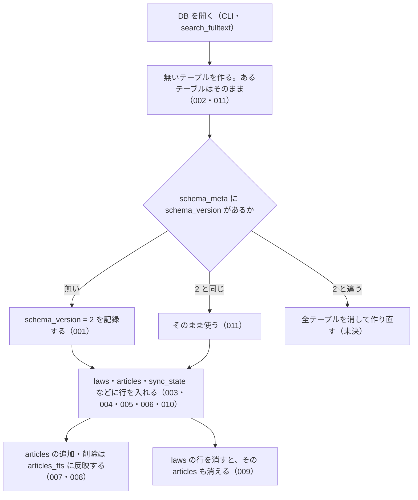

# 機能: db_schema（全文検索に使うローカル SQLite DB の置き場所とテーブル）

- 機能 ID: EGOV
- 種類: DB
- 版: current
- 承認日:
- 起こした元: v0.15.1 の `src/db/index.ts`、`src/db/schema.ts`、`src/config.ts`（`BULK_CONFIG`）、`src/cli/index.ts`（DB を開く箇所と `--help`）、`src/db/schema.test.ts`
- 関連する Issue: なし

この文書は「利用者の手元にできる DB が何を持ち、どう振る舞うか」を書きます。どう実装しているか（関数名）は書きません。DB のテーブル名・列名は、利用者が sqlite3 で開いて見られ、`--status` や `search_fulltext` の結果の元になる外から見える約束なので書きます。

## アクター

- 利用者（CLI の `--bulk-download-everything` / `--sync` で DB を作り・最新化し、`--status` で中身を確かめ、sqlite3 で直接開くこともある人）
- MCP クライアント（`search_fulltext` を呼ぶと、サーバーがこの DB を開いて引く）

## 入力

利用者がこの DB に触れる入口は次のとおり。

| 入口 | 必須 | 内容 |
| --- | --- | --- |
| 環境変数 `HOUKI_EGOV_DB_PATH` | 任意 | DB ファイルのパスをまるごと指定する。ほかの指定より優先する |
| 環境変数 `XDG_CACHE_HOME` | 任意 | `HOUKI_EGOV_DB_PATH` が無いとき、`$XDG_CACHE_HOME/houki-egov-mcp/laws.db` に置く。これも無いときは `~/.cache/houki-egov-mcp/laws.db` |
| CLI `--bulk-download-everything` / `--sync` | 任意 | DB に書き込む（取り込みの中身は CLI の spec.md に書く） |
| CLI `--status` | 任意 | DB を開いて `laws` と `articles` の件数、同期の状態を表示する（CLI の spec.md に書く） |
| ツール `search_fulltext` | 任意 | 呼び出しごとに DB を開いて引き、閉じる（`search_fulltext` の spec.md に書く） |

## 処理の流れ

DB を開いたときに何が起きるかを示します。図の中の番号は「できること」の仕様 ID の末尾 3 桁です。

## できること

### SPEC-EGOV-DB-SCHEMA-001 DB を開くとスキーマの版 2 を記録する

新しい DB を開くと、`schema_meta` テーブルに `key = 'schema_version'`、`value = '2'` の行を記録する。v0.15.1 のスキーマの版は 2 である。

### SPEC-EGOV-DB-SCHEMA-002 DB は 7 つのテーブルを持つ

DB を開くと、次のテーブルを作る。

| テーブル | 内容 |
| --- | --- |
| `schema_meta` | スキーマの版などを `key` と `value` で持つ |
| `laws` | 法令の履歴 1 件につき 1 行 |
| `articles` | 条（または別表）1 つにつき 1 行 |
| `revisions_meta` | 法令の履歴のメタ情報 |
| `sync_state` | 取り込みの同期の状態（1 行だけ） |
| `laws_fts` | 法令名・略称・法令番号・分類の全文検索の索引 |
| `articles_fts` | 条の本文と見出しの全文検索の索引 |

### SPEC-EGOV-DB-SCHEMA-003 laws テーブルの列

`laws` テーブルは次の列を持つ。主キーは `law_revision_id`（法令の履歴の ID）。

| 分類 | 列 |
| --- | --- |
| 識別子 | `law_revision_id`、`law_id` |
| 法令の情報 | `law_type`、`law_num`、`law_title`、`abbrev`、`category` |
| 日付 | `promulgation_date`、`amendment_promulgate_date`、`amendment_enforcement_date`、`amendment_scheduled_enforcement_date` |
| 状態 | `current_revision_status`、`repeal_status`、`repeal_date`、`remain_in_force`、`amendment_type` |
| 同期 | `updated`、`fetched_at`、`content_hash` |

### SPEC-EGOV-DB-SCHEMA-004 articles テーブルの列（検索用の本文と表示用の本文を両方持つ）

`articles` テーブルは `id`、`law_revision_id`、`article_num`、`caption`、`chapter_path`、`ord`、`body`、`body_raw` の列を持つ。`body` は検索に使う本文、`body_raw` は表示に使う元の本文で、1 つの条に両方を持つ。

### SPEC-EGOV-DB-SCHEMA-005 laws.current_revision_status は 4 つの値だけを受け付ける

`laws.current_revision_status` に入る値は `CurrentEnforced`・`UnEnforced`・`PreviousEnforced`・`Repeal` のどれかで、ほかの値（例: `InvalidStatus`）の行は入らない（書き込みがエラーになる）。

### SPEC-EGOV-DB-SCHEMA-006 laws.repeal_status は 4 つの値だけを受け付ける

`laws.repeal_status` に入る値は `None`・`Repeal`・`LossOfEffectiveness`・`Expire` のどれかで、ほかの値（例: `BogusRepeal`）の行は入らない（書き込みがエラーになる）。

### SPEC-EGOV-DB-SCHEMA-007 articles に入れた条は articles_fts で部分一致で引ける

`articles` に行を入れると、その `body` と `caption` が `articles_fts` に入る。`articles_fts` は語の途中からでも引ける。例: `body` が `この法律は預金者を保護する` の条を入れると、`articles_fts MATCH '預金者'` でその条が当たる。

### SPEC-EGOV-DB-SCHEMA-008 articles から消した条は articles_fts からも消える

`articles` から行を消すと、その条は `articles_fts` でも当たらなくなる。例: `body` が `XYZUNIQUEWORD` の条を入れると `articles_fts MATCH 'XYZUNIQUEWORD'` は 1 件、その行を消すと 0 件。

### SPEC-EGOV-DB-SCHEMA-009 laws の行を消すと、その法令の articles も消える

`laws` の行を消すと、同じ `law_revision_id` を持つ `articles` の行も消える。

### SPEC-EGOV-DB-SCHEMA-010 sync_state は 1 行だけ

`sync_state` は `id = 1` の行だけを持てる。`id` が 1 でない行は入らない（書き込みがエラーになる）。

### SPEC-EGOV-DB-SCHEMA-011 同じ DB を開き直しても壊れない

既にスキーマのある DB を何度開いても、テーブルは残り、`schema_version` は 2 のまま変わらない。

## できないこと

- DB を消したり中身を空にしたりする CLI やツールは無い（空にするには利用者がファイルを消す）
- スキーマの版を 1 つずつ上げる移行（版が違う DB は作り直す。未決 3）
- 法令の本文を DB から直接返すこと（`get_law` などは e-Gov API を呼び、この DB を使わない）
- `laws.category` による絞り込み（v0.15.1 では取り込み時に値を入れていない。`search_fulltext` の spec.md に書く）

## 未決

初版起こしで見つけた、意図か不具合かを人が決める項目です。決まったら「できること」に ID を振るか、`specs/changes/` の差分にします。

意図か不具合かの判断が要る項目は houki-egov-mcp の Issue に移し、ここには題と Issue の番号だけを残します。今の振る舞いのままでよくテストが無いだけの項目は、受入テストを書いてから「できること」に ID を振ります。

1. **DB の置き場所と環境変数。** `HOUKI_EGOV_DB_PATH` が最優先、無ければ `$XDG_CACHE_HOME/houki-egov-mcp/laws.db`（`XDG_CACHE_HOME` が空文字のときも無いものとして扱う）、それも無ければ `~/.cache/houki-egov-mcp/laws.db`。置き場所のディレクトリが無いときは作る。テストが無い。ID を振るのは受入テストを書いてから。
2. **版が違う DB を開いたときの作り直し。** `schema_version` が 2 でない DB を開くと、全テーブルを消して空のスキーマを作り直し、`schema_version` を 2 にする（CHANGELOG v0.5.0 と README は「旧 DB は起動時に自動初期化」と書く）。テストが無い。ID を振るのは受入テストを書いてから。
3. **新しい版の DB を古い版のサーバーで開くと、取り込んだ中身が消える。** 作り直しは版が「違う」ときに起き、DB の版がサーバーより新しいとき（利用者が houki-egov-mcp を古い版に戻したとき）も全テーブルを消す。約 290 MB の取り込みをやり直すことになる。新しい版の DB には触らずにエラーにするかは人が決める。
4. **MCP サーバーが DB に書き込む場面がある。** README は「書き込みは CLI だけが行い、MCP server は読むだけ」と書くが、`search_fulltext` が DB を開くと、DB ファイルやディレクトリが無ければ作り、スキーマを作り、版が違えば作り直す（未決 2・3）。`--status` も DB が無いと空の DB を作る。README を直すか、MCP サーバーからは作らない・作り直さないようにするかは人が決める。
5. **`sync_state.schema_version` 列。** `sync_state` は `schema_version` 列を持ち既定値は 2 だが、スキーマの版が上がってもこの既定値は連動せず、取り込みもこの列に書かない。スキーマの版は `schema_meta` だけが持つ。列を残すか外すかは人が決める。
6. **`laws_fts`・`revisions_meta`・`sync_state` の列。** `laws_fts` は `law_revision_id`（索引に載せない）・`law_title`・`law_title_kana`・`abbrev`・`law_num`・`category`、`revisions_meta` は `law_revision_id`・`law_id`・`mission`・`updated`・`raw_revision_info_json`、`sync_state` は `id`・`last_sync_date`・`last_full_dl_at`・`total_laws`・`bulk_source`・`schema_version` を持つ。テーブルがあることはテスト済み（SPEC-EGOV-DB-SCHEMA-002）だが、列はテストが無い。ID を振るのは受入テストを書いてから。
7. **`laws` の既定値と必須の列。** `remain_in_force` の既定値は 0、`law_revision_id`・`law_id`・`law_type`・`law_num`・`law_title`・`promulgation_date`・`current_revision_status`・`repeal_status`・`updated`・`fetched_at`・`content_hash` は空にできない。テストが無い。ID を振るのは受入テストを書いてから。
8. **`articles` の行を書き換えたときの `articles_fts`。** 書き換えると `articles_fts` も新しい本文に入れ替わる。追加と削除はテスト済み（SPEC-EGOV-DB-SCHEMA-007・008）だが、書き換えはテストが無い。ID を振るのは受入テストを書いてから。
9. **取り込み中の読み取り。** DB は WAL で開くので、CLI が取り込んでいる間も `search_fulltext` で読める（README に書いてある）。テストが無い。ID を振るのは受入テストを書いてから。
10. **全データを消す機能がテストにだけある。** `laws`・`articles`・`revisions_meta`・`sync_state` の行を消し、`schema_meta` を残す機能はテストで確かめているが、CLI にもツールにも呼び出す入口が無い。利用者に出す（たとえば CLI のフラグにする）か、テスト用の内部の機能として仕様から外すかは人が決める。
