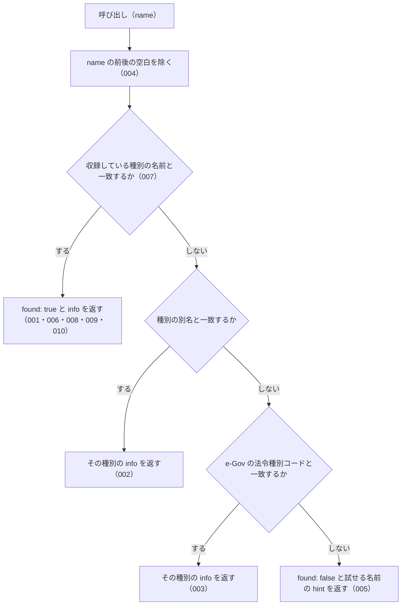

# 機能: explain_law_type（法令種別の制定主体・階層・拘束力を解説する）

- 機能 ID: EGOV
- 種類: ツール
- 版: current
- 承認日:
- 起こした元: v0.15.1 の `src/tools/definitions.ts`、`src/tools/handlers.ts`、`src/knowledge/law-hierarchy.ts`、`src/tools/handlers.test.ts`、`src/knowledge/law-hierarchy.test.ts`、`src/server.test.ts`
- 関連する Issue: なし

この文書は「このツールは何をするか」を書きます。どう実装しているか（関数名・テーブル名）は書きません。

## アクター

- MCP クライアント（Claude などの LLM、または CLI から呼ぶ人）。法令種別の名前（`政令`・`通達` など）を渡して、その種別を誰が定めるか・法令の階層のどこにあるか・国民を拘束するか・罰則を設けられるかの解説を受け取る。法務の専門家でない利用者が「政令と省令の違い」「通達は守らなくてよいのか」を確かめるのに使う

## 入力

| 引数 | 必須 | 内容 |
|---|---|---|
| `name` | 必須 | 法令種別の名前。例: `"法律"`、`"政令"`、`"省令"`、`"規則"`、`"条例"`、`"告示"`、`"通達"`、`"訓令"`、`"憲法"`。別名（`"施行令"`・`"施行規則"` など）と e-Gov の法令種別コード（`"Act"` など）も受け付ける |

## 処理の流れ

呼び出しを受けてから応答を返すまでに、何をどの順で確かめるかを示します。図の中の番号は「できること」の仕様 ID の末尾 3 桁です。

## できること

### SPEC-EGOV-EXPLAIN-LAW-TYPE-001 種別の名前から解説を返す

`name` が収録している種別の名前と一致するときは、エラーにせず（`isError` を付けず）、`name`（渡した値）・`found: true`・`info`（その種別の解説）を持つ応答を返す。

例: `name: "政令"` は `name: "政令"`・`found: true` で、`info.name: "政令"`・`info.enacting_body: "内閣"`・`info.binds_citizens: true`。

### SPEC-EGOV-EXPLAIN-LAW-TYPE-002 別名から、その種別の解説を返す

`name` が種別の別名と一致するときは、その種別の `info` を返す（`found: true`）。

例: `施行令` は `info.name: "政令"`、`施行規則` は `info.name: "省令"`、`日本国憲法` は `info.name: "憲法"`。

### SPEC-EGOV-EXPLAIN-LAW-TYPE-003 e-Gov の法令種別コードから、その種別の解説を返す

`name` が e-Gov の法令種別コードと一致するときは、その種別の `info` を返す（`found: true`）。

例: `Act` は `info.name: "法律"`、`CabinetOrder` は `info.name: "政令"`、`MinisterialOrdinance` は `info.name: "省令"`。

### SPEC-EGOV-EXPLAIN-LAW-TYPE-004 前後の空白を除いてから照合する

`name` の前後の空白を除いてから照合する。

例: `"  通達  "` は `info.name: "通達"` の解説を返す。

### SPEC-EGOV-EXPLAIN-LAW-TYPE-005 知らない名前は、エラーにせず `found: false` と試せる名前を返す

`name` が種別の名前・別名・法令種別コードのどれとも一致しないときは、エラーにせず（`isError` を付けず）、`name`（渡した値）・`found: false`・`hint` を持つ応答を返す。`hint` は `知らない法令種別です。試せる名前: ` の後に、収録している種別の名前を `, ` 区切りで並べる。

例: `架空法令` は `found: false` で、`hint` に `試せる名前` を含む。`存在しない法令種別`・`知らない種別` も `found: false`。

### SPEC-EGOV-EXPLAIN-LAW-TYPE-006 `info` のフィールド

どの種別の `info` も次のフィールドを持つ。

| フィールド | 内容 |
|---|---|
| `name` | 種別の名前（主名）。別名や法令種別コードで引いたときも主名 |
| `enacting_body` | 制定する者（例: `内閣`） |
| `hierarchy_rank` | 階層の順位を表す数。小さいほど上位 |
| `level` | 適用される範囲。`national` / `local` / `agency-internal` / `judicial` のどれか |
| `binds_citizens` | 国民を直接拘束するか（真偽値） |
| `can_set_penalties` | 罰則を新たに設けられるか（真偽値） |
| `description` | 説明（実務上の注意を含む） |
| `examples` | 具体例の配列。1 件以上 |
| `sources` | 取得元の配列 |

### SPEC-EGOV-EXPLAIN-LAW-TYPE-007 収録している種別

少なくとも `憲法`・`法律`・`政令`・`省令`・`規則`・`条例`・`告示`・`訓令`・`通達` の 9 種を収録する。SPEC-EGOV-EXPLAIN-LAW-TYPE-005 の `hint` に並べる名前は 9 個以上。

### SPEC-EGOV-EXPLAIN-LAW-TYPE-008 `hierarchy_rank` は憲法・法律・政令・省令の順に大きくなる

`hierarchy_rank` は `憲法` < `法律` < `政令` < `省令` の順に大きい。

### SPEC-EGOV-EXPLAIN-LAW-TYPE-009 通達と訓令は国民を直接拘束しない

`通達` と `訓令` の `info.binds_citizens` は `false`。

### SPEC-EGOV-EXPLAIN-LAW-TYPE-010 罰則を設けられるのは法律・政令・省令・条例で、通達と告示は設けられない

`info.can_set_penalties` は、`法律`・`政令`・`省令`・`条例` で `true`、`通達`・`告示` で `false`。

## できないこと

- 個々の法令（例: `消費税法施行令`）がどの種別かを判定すること（法令の種別は `search_law` や `get_law` の応答の `law_type`）
- 法令や通達の本文を返すこと
- 通達・条例・告示を e-Gov から取ること（`sources` で取得元を示すだけ）
- 個別の事案で、ある通達や告示に従う必要があるかを判断すること

## 未決

初版起こしで見つけた、意図か不具合かを人が決める項目です。決まったら「できること」に ID を振るか、`specs/changes/` の差分にします。

意図か不具合かの判断が要る項目は houki-egov-mcp の Issue に移し、ここには題と Issue の番号だけを残します。今の振る舞いのままでよくテストが無いだけの項目は、受入テストを書いてから「できること」に ID を振ります。

1. **`通知` は `通達` の別名に入っているが、`通知` という別の種別の解説を返す。** 収録している種別は 9 種のほかに `通知` があり（計 10 種）、`通達` の別名にも `通知` がある。名前の一致を別名より先に確かめるので、`name: "通知"` は `info.name: "通知"` を返し、`通達` の別名の `通知` は使われない。`通知` を独立の種別にするか、`通達` の別名にするかを人が決める。
2. **`Rule`・`ImperialOrdinance` などの法令種別コードを解決しない。** `search_law` の `law_type` が受け付ける `Rule`・`ImperialOrdinance` と、e-Gov が返す `Constitution` を渡すと `found: false`。コードで引けるのは `Act`・`CabinetOrder`・`MinisterialOrdinance` だけ（`規則` にはコードが結び付いていない）。`get_law` の応答の `law_type` をそのまま渡しても解説が返らない種別がある。コードを足すかを人が決める。
3. **`found: true` の応答の `related_tools` と `see_also`、`info` の任意のフィールド。** `related_tools: ["search_law", "get_law", "get_toc"]` と `see_also: "docs/LAW-HIERARCHY.md"` が付く。`info` には種別によって `aliases`（別名）・`law_type_code`（e-Gov の法令種別コード）・`notes`（補足の注意）が付き、`sources` の要素は `label` と `url`（空文字のことがある）を持つ。テストが無い。ID を振るのは受入テストを書いてから。
4. **`found: false` の応答の `next_actions` と `see_also`。** `next_actions` は `action: "list_known_law_types"` の 1 件で、`example.names` に収録している種別の名前の配列が入る。`see_also: "docs/LAW-HIERARCHY.md"` も付く。テストが無い。ID を振るのは受入テストを書いてから。
5. **応答の `name` は渡した値のまま返す。** `name: " 政令 "` は応答の `name` が `" 政令 "` で、`info.name` は `政令`。テストが無い。ID を振るのは受入テストを書いてから。
6. **大文字と小文字、全角と半角を区別する。** `act`・`ＡＣＴ` は `found: false`。テストが無い。ID を振るのは受入テストを書いてから。
7. **`see_also` がリポジトリの中の相対パスで、MCP クライアントからは開けない。** `docs/LAW-HIERARCHY.md` は npm パッケージを入れた利用者からは場所が分からず、URL でもない。URL にするか、外すかを人が決める。
8. **別名の一覧。** `省令` は `府令`・`内閣府令`・`施行規則`・`MinisterialOrdinance`、`政令` は `施行令`・`CabinetOrder`、`通達` は `基本通達`・`取扱通達`（と `通知`。未決 1）を別名に持ち、`府令` は `info.name: "省令"` を返す。テストが確かめているのは `施行令`・`施行規則`・`日本国憲法` だけ。ID を振るのは受入テストを書いてから。
