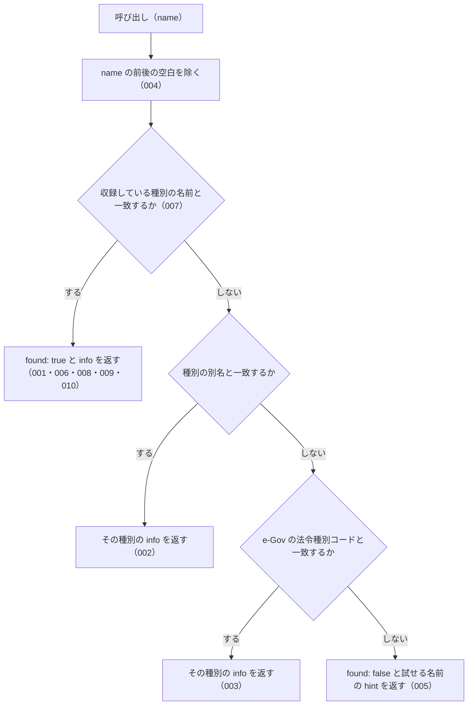

# 機能: explain_law_type（法令種別の制定主体・階層・拘束力を解説する）

- 機能 ID: EGOV
- 種類: ツール
- 版: current
- 承認日: 2026-09-28（PR #50）。差分 `20260928-undecided-to-issues` は 2026-09-28（PR #68）。差分 `20260928-untested-behaviors` は 2026-09-28（PR #76）。差分 `20260930-bugfix-batch` は 2026-09-30（PR #81）。差分 `20261001-t1-argument-guards` は 2026-10-01（PR #84）
- 起こした元: v0.15.1 の `src/tools/definitions.ts`、`src/tools/handlers.ts`、`src/knowledge/law-hierarchy.ts`、`src/tools/handlers.test.ts`、`src/knowledge/law-hierarchy.test.ts`、`src/server.test.ts`
- 関連する Issue: なし

この文書は「このツールは何をするか」を書きます。どう実装しているか（関数名・テーブル名）は書きません。

## アクター

- MCP クライアント（Claude などの LLM、または CLI から呼ぶ人）。法令種別の名前（`政令`・`通達` など）を渡して、その種別を誰が定めるか・法令の階層のどこにあるか・国民を拘束するか・罰則を設けられるかの解説を受け取る。法務の専門家でない利用者が「政令と省令の違い」「通達は守らなくてよいのか」を確かめるのに使う

## 入力

| 引数   | 必須 | 内容                                                                                                                                                                                                     |
| ------ | ---- | -------------------------------------------------------------------------------------------------------------------------------------------------------------------------------------------------------- |
| `name` | 必須 | 法令種別の名前。例: `"法律"`、`"政令"`、`"省令"`、`"規則"`、`"条例"`、`"告示"`、`"通達"`、`"訓令"`、`"憲法"`。別名（`"施行令"`・`"施行規則"` など）と e-Gov の法令種別コード（`"Act"` など）も受け付ける |

## 処理の流れ

呼び出しを受けてから応答を返すまでに、何をどの順で確かめるかを示します。図の中の番号は「できること」の仕様 ID の末尾 3 桁です。

## できること

### SPEC-EGOV-EXPLAIN-LAW-TYPE-001 種別の名前から解説を返す

`name` が収録している種別の名前と一致するときは、エラーにせず（`isError` を付けず）、`name`（渡した値）・`found: true`・`info`（その種別の解説）を持つ応答を返す。

例: `name: "政令"` は `name: "政令"`・`found: true` で、`info.name: "政令"`・`info.enacting_body: "内閣"`・`info.binds_citizens: true`。

### SPEC-EGOV-EXPLAIN-LAW-TYPE-002 別名から、その種別の解説を返す

`name` が種別の別名と一致するときは、その種別の `info` を返す（`found: true`）。

例: `施行令` は `info.name: "政令"`、`施行規則` は `info.name: "省令"`、`日本国憲法` は `info.name: "憲法"`。

### SPEC-EGOV-EXPLAIN-LAW-TYPE-003 e-Gov の法令種別コードから、その種別の解説を返す

`name` が e-Gov の法令種別コードと一致するときは、その種別の `info` を返す（`found: true`）。

例: `Act` は `info.name: "法律"`、`CabinetOrder` は `info.name: "政令"`、`MinisterialOrdinance` は `info.name: "省令"`。

### SPEC-EGOV-EXPLAIN-LAW-TYPE-004 前後の空白を除いてから照合する

`name` の前後の空白を除いてから照合する。

例: `"  通達  "` は `info.name: "通達"` の解説を返す。

### SPEC-EGOV-EXPLAIN-LAW-TYPE-005 知らない名前は、エラーにせず `found: false` と試せる名前を返す

`name` が種別の名前・別名・法令種別コードのどれとも一致しないときは、エラーにせず（`isError` を付けず）、`name`（渡した値）・`found: false`・`hint` を持つ応答を返す。`hint` は `知らない法令種別です。試せる名前: ` の後に、収録している種別の名前を `, ` 区切りで並べる。

例: `架空法令` は `found: false` で、`hint` に `試せる名前` を含む。`存在しない法令種別`・`知らない種別` も `found: false`。

### SPEC-EGOV-EXPLAIN-LAW-TYPE-006 `info` のフィールド

どの種別の `info` も次のフィールドを持つ。

| フィールド          | 内容                                                                           |
| ------------------- | ------------------------------------------------------------------------------ |
| `name`              | 種別の名前（主名）。別名や法令種別コードで引いたときも主名                     |
| `enacting_body`     | 制定する者（例: `内閣`）                                                       |
| `hierarchy_rank`    | 階層の順位を表す数。小さいほど上位                                             |
| `level`             | 適用される範囲。`national` / `local` / `agency-internal` / `judicial` のどれか |
| `binds_citizens`    | 国民を直接拘束するか（真偽値）                                                 |
| `can_set_penalties` | 罰則を新たに設けられるか（真偽値）                                             |
| `description`       | 説明（実務上の注意を含む）                                                     |
| `examples`          | 具体例の配列。1 件以上                                                         |
| `sources`           | 取得元の配列                                                                   |

### SPEC-EGOV-EXPLAIN-LAW-TYPE-007 収録している種別

少なくとも `憲法`・`法律`・`政令`・`省令`・`規則`・`条例`・`告示`・`訓令`・`通達` の 9 種を収録する。SPEC-EGOV-EXPLAIN-LAW-TYPE-005 の `hint` に並べる名前は 9 個以上。

### SPEC-EGOV-EXPLAIN-LAW-TYPE-008 `hierarchy_rank` は憲法・法律・政令・省令の順に大きくなる

`hierarchy_rank` は `憲法` < `法律` < `政令` < `省令` の順に大きい。

### SPEC-EGOV-EXPLAIN-LAW-TYPE-009 通達と訓令は国民を直接拘束しない

`通達` と `訓令` の `info.binds_citizens` は `false`。

### SPEC-EGOV-EXPLAIN-LAW-TYPE-010 罰則を設けられるのは法律・政令・省令・条例で、通達と告示は設けられない

`info.can_set_penalties` は、`法律`・`政令`・`省令`・`条例` で `true`、`通達`・`告示` で `false`。

### SPEC-EGOV-EXPLAIN-LAW-TYPE-011 `found: true` の応答は `related_tools` を持つ

SPEC-EGOV-EXPLAIN-LAW-TYPE-001・002・003 の応答（`found: true`）は、`related_tools: ["search_law", "get_law", "get_toc"]` を持つ。どの種別でも同じ配列を、この順で返す。

例: `name: "政令"` も `name: "通達"` も `related_tools` は `["search_law", "get_law", "get_toc"]`。

（同じ応答の `see_also` は houki-egov-mcp #56 で扱うので、この ID では約束にしない。）

### SPEC-EGOV-EXPLAIN-LAW-TYPE-012 `info` の任意のフィールド `aliases`・`law_type_code`・`notes`

`info` は、SPEC-EGOV-EXPLAIN-LAW-TYPE-006 のフィールドのほかに、種別によって次のフィールドを持つ。

| フィールド      | 内容                                                                             |
| --------------- | -------------------------------------------------------------------------------- |
| `aliases`       | 別名の配列（文字列）                                                             |
| `law_type_code` | e-Gov の法令種別コード（文字列）                                                 |
| `notes`         | 補足の注意の配列（文字列）。1 件以上                                             |

`法律` の `law_type_code` は `Act`、`政令` は `CabinetOrder`、`省令` は `MinisterialOrdinance`。

例: `name: "政令"` の `info` は `aliases: ["施行令", "CabinetOrder"]`・`law_type_code: "CabinetOrder"`・`notes`（1 件）を持つ。`name: "法律"` の `info` は `law_type_code: "Act"` を持ち、`aliases` と `notes` を持たない。`name: "憲法"` の `info` は `aliases: ["日本国憲法"]` を持ち、`law_type_code` を持たない。

### SPEC-EGOV-EXPLAIN-LAW-TYPE-013 `sources` の要素は `label` と `url` を持ち、`url` は空文字のことがある

`info.sources` の各要素は `label`（取得元の名前）と `url`（文字列）を持つ。Web 上の場所を 1 つに決められない取得元（自治体の例規集・各省庁のウェブサイトなど）は `url: ""`。

例: `name: "憲法"` の `sources` は `[{ label: "e-Gov 法令検索", url: "https://laws.e-gov.go.jp/law/321CONSTITUTION" }]`。`name: "条例"` の `sources` は `[{ label: "各自治体の例規集（自治体ウェブサイト）", url: "" }]`。`name: "規則"` の `sources` の 2 件目は `{ label: "各自治体例規集", url: "" }`。

### SPEC-EGOV-EXPLAIN-LAW-TYPE-014 `found: false` の応答は、収録している種別の名前を `next_actions` で示す

SPEC-EGOV-EXPLAIN-LAW-TYPE-005 の応答（`found: false`）は `next_actions` を持つ。`next_actions` は 1 件で、`action: "list_known_law_types"`・`reason: "知られている法令種別は次のとおり"`・`example.names`（収録している種別の名前の配列）を持つ。`example.names` の名前と順は、`hint` の `試せる名前: ` の後に並べた名前と同じ。

例: `name: "架空法令"` の `next_actions[0].action` は `list_known_law_types` で、`example.names` は `憲法`・`法律`・`政令`・`省令`・`規則`・`条例`・`告示`・`訓令`・`通達` を含み、`example.names.join(", ")` は `hint` の `試せる名前: ` より後ろの文字列と同じ。

（同じ応答の `see_also` は houki-egov-mcp #56 で扱うので、この ID では約束にしない。）

### SPEC-EGOV-EXPLAIN-LAW-TYPE-015 応答の `name` は渡した値のまま返す

応答の `name` には、前後の空白を除く前の、渡した値をそのまま入れる。`info.name` は種別の主名。`found: false` のときも、応答の `name` は渡した値のまま。

例: `name: " 政令 "` は応答の `name` が `" 政令 "` で、`info.name` は `"政令"`。`name: "施行令"` は応答の `name` が `"施行令"` で、`info.name` は `"政令"`。`name: "架空法令"` は応答の `name` が `"架空法令"`（`found: false`）。

### SPEC-EGOV-EXPLAIN-LAW-TYPE-016 大文字と小文字、全角と半角を区別して照合する

種別の名前・別名・法令種別コードとの照合では、英字の大文字と小文字、全角と半角を同じ文字として扱わない。一致しなければ SPEC-EGOV-EXPLAIN-LAW-TYPE-005 の `found: false` を返す。

例: `name: "Act"` は `info.name: "法律"`（`found: true`）。`name: "act"`・`name: "ACT"`・`name: "ＡＣＴ"` は、どれも `found: false`。

### SPEC-EGOV-EXPLAIN-LAW-TYPE-017 府令・内閣府令は省令、基本通達・取扱通達は通達の解説を返す

SPEC-EGOV-EXPLAIN-LAW-TYPE-002 の別名には、次のものも含む。

| `name`     | `info.name` |
| ---------- | ----------- |
| `府令`     | `省令`      |
| `内閣府令` | `省令`      |
| `基本通達` | `通達`      |
| `取扱通達` | `通達`      |

例: `name: "府令"` は `found: true`・`info.name: "省令"`・`info.enacting_body: "各省大臣／内閣府の主任の大臣"`。`name: "取扱通達"` は `found: true`・`info.name: "通達"`・`info.binds_citizens: false`。

（`通知` を `通達` の別名として扱うかは houki-egov-mcp #62 で扱うので、この ID では約束にしない。）

### SPEC-EGOV-EXPLAIN-LAW-TYPE-018 `Object.prototype` のプロパティの名前は知らない名前として `found: false` を返す

`name` が `toString`・`constructor`・`hasOwnProperty`・`valueOf`・`__proto__` など、JavaScript の `Object.prototype` のプロパティの名前であっても、収録している種別の名前・別名・法令種別コードのどれとも一致しないので、SPEC-EGOV-EXPLAIN-LAW-TYPE-005 と同じ `found: false` の応答を返す。応答は `name`（渡した値）・`found: false`・`hint`・`next_actions`（SPEC-EGOV-EXPLAIN-LAW-TYPE-014）を持ち、`info` と `related_tools` を持たない。エラーにはしない（`isError` を付けない）。

例: `name: "toString"` と `name: "constructor"` は、どちらも `found: false` で、`hint` は `知らない法令種別です。試せる名前: ` で始まり、`next_actions[0].action` は `list_known_law_types`、`next_actions[0].example.names` は `憲法`・`法律`・`政令`・`省令`・`規則`・`条例`・`告示`・`訓令`・`通達` を含む。応答に `info` は無い。`name: "hasOwnProperty"`・`name: "valueOf"`・`name: "__proto__"` も同じ。

（v0.15.3 までは、収録している種別の表をオブジェクトのプロパティとして引いていたため、これらの名前で `found: true` になり、応答に `info` が無かった。houki-egov-mcp #73）

### SPEC-EGOV-EXPLAIN-LAW-TYPE-019 name が空文字・空白だけのときは収録している種別の表と照合せずに `INVALID_ARGUMENT` を返す

空文字は inputSchema の `minLength: 1` の検査（SPEC-EGOV-COMMON-ERRORS-025）で止まり、`INVALID_ARGUMENT`（`tool: "explain_law_type"`、`detail.issues: [{ path: "name", message: "空文字は指定できません" }]`）を返す。空白（半角スペース・全角スペース・タブ・改行）だけのときは、ツールの処理が収録している種別の表と照合する前に、SPEC-EGOV-COMMON-ERRORS-026 の形の `INVALID_ARGUMENT`（`tool: "explain_law_type"`、`error: "name が空です"`、`detail.issues: [{ path: "name", message: "空白だけは指定できません" }]`、`hint` に法令種別の名前・別名・法令種別コードを渡すよう書く）を返す。

例: `name: ""` は `code: "INVALID_ARGUMENT"`・`detail.issues[0].message: "空文字は指定できません"`。`name: "　"`（全角スペース）と `name: " \n"` は `code: "INVALID_ARGUMENT"`・`error: "name が空です"`。どれも収録している種別の表とは照合しない。

空白だけの `name` は、SPEC-EGOV-EXPLAIN-LAW-TYPE-004 の「前後の空白を除いてから照合する」の対象ではなく、照合の前に止まる。`found: false` の応答（SPEC-EGOV-EXPLAIN-LAW-TYPE-005）ではない。

## できないこと

- 個々の法令（例: `消費税法施行令`）がどの種別かを判定すること（法令の種別は `search_law` や `get_law` の応答の `law_type`）
- 法令や通達の本文を返すこと
- 通達・条例・告示を e-Gov から取ること（`sources` で取得元を示すだけ）
- 個別の事案で、ある通達や告示に従う必要があるかを判断すること

## 未決

初版起こしで見つけた、意図か不具合かを人が決める項目です。決まったら「できること」に ID を振るか、`specs/changes/` の差分にします。

意図か不具合かの判断が要る項目は houki-egov-mcp の Issue に移し、ここには題と Issue の番号だけを残します。今の振る舞いのままでよくテストが無いだけの項目は、受入テストを書いてから「できること」に ID を振ります。

1. **`通知` は `通達` の別名に入っているが、`通知` という別の種別の解説を返す。** → houki-egov-mcp #62
2. **`Rule`・`ImperialOrdinance` などの法令種別コードを解決しない。** → houki-egov-mcp #62
3. **`found: true` の応答の `related_tools` と `see_also`、`info` の任意のフィールド。** → SPEC-EGOV-EXPLAIN-LAW-TYPE-011・SPEC-EGOV-EXPLAIN-LAW-TYPE-012・SPEC-EGOV-EXPLAIN-LAW-TYPE-013
4. **`found: false` の応答の `next_actions` と `see_also`。** → SPEC-EGOV-EXPLAIN-LAW-TYPE-014
5. **応答の `name` は渡した値のまま返す。** → SPEC-EGOV-EXPLAIN-LAW-TYPE-015
6. **大文字と小文字、全角と半角を区別する。** → SPEC-EGOV-EXPLAIN-LAW-TYPE-016
7. **`see_also` がリポジトリの中の相対パスで、MCP クライアントからは開けない。** → houki-egov-mcp #56
8. **別名の一覧。** → SPEC-EGOV-EXPLAIN-LAW-TYPE-017
