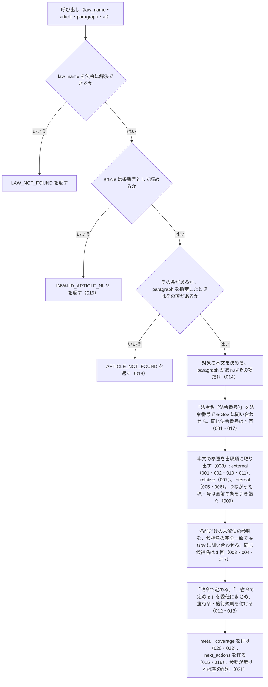

# 機能: get_article_references（条文本文が引用している参照と委任を取り出す）

- 機能 ID: EGOV
- 種類: ツール
- 版: current
- 承認日: 2026-09-28（PR #50）
- 起こした元: v0.15.1 の `src/tools/definitions.ts`、`src/tools/handlers.ts`、`src/services/law-service.ts`、`src/services/reference-extractor.ts`、`src/services/law-relations.ts`、`src/services/law-service.references.test.ts`、`src/services/reference-extractor.test.ts`、`src/tools/handlers.test.ts`
- 関連する Issue: houki-egov-mcp #20（施行令・施行規則の関連付けと条文内の参照抽出。v0.10.1 の条の引き継ぎを含む）

この文書は「このツールは何をするか」を書きます。どう実装しているか（関数名・テーブル名）は書きません。

## アクター

- MCP クライアント（Claude などの LLM、または CLI から呼ぶ人）。`law_name` と `article`（任意で `paragraph`・`at`）を渡して、その条（または項）の本文が引用している他法令の条・同一法令内の条項号・「政令で定める」などの委任を受け取り、`next_actions` で次に読む条を知る

## 入力

| 引数        | 必須 | 内容                                                                         |
| ----------- | ---- | ---------------------------------------------------------------------------- |
| `law_name`  | 必須 | 法令名または略称。例: `"所得税法"`、`"所法"`、`"所得税法施行令"`             |
| `article`   | 必須 | 条番号。例: `"57の2"`、`"第57条の2"`、`"第五十七条の二"`                     |
| `paragraph` | 任意 | 項番号（1 始まり）。指定するとその項の本文だけを対象にする。省略すると条全体 |
| `at`        | 任意 | 時点指定。`YYYY-MM-DD`（`get_law` と同じ）                                   |

## 処理の流れ

呼び出しを受けてから応答を返すまでに、何をどの順で確かめるかを示します。図の中の番号は「できること」の仕様 ID の末尾 3 桁です。

## できること

### SPEC-EGOV-GET-ARTICLE-REFERENCES-001 「法令名（法令番号）第N条…」は法令番号で解決し、law_id 付きの external で返す

本文に「法令名（法令番号）」が出てきたときは、その法令番号で e-Gov に問い合わせて法令を引く。同じ法令番号が本文に何度出ても、問い合わせる対象としては 1 回に数える。法令番号が本文に無ければ、法令番号では問い合わせない。

引けた法令について、「法令名（法令番号）」に続く条・項・号を、`references` の要素として次の形で返す。

| フィールド                        | 内容                                                                           |
| --------------------------------- | ------------------------------------------------------------------------------ |
| `kind`                            | `external`                                                                     |
| `raw`                             | 本文の表記（例: `雇用保険法（昭和四十九年法律第百十六号）第十条第五項第一号`） |
| `law_name` / `law_num` / `law_id` | e-Gov の法令名・法令番号・法令 ID                                              |
| `article`                         | 条番号を `get_law` に渡せる形にしたもの（例: `"10"`、`"30の3"`）               |
| `paragraph`                       | 項番号（数値）                                                                 |
| `item`                            | 号番号（文字列。例: `"1"`）                                                    |
| `resolved`                        | `true`                                                                         |

条・項・号のうち本文に無いものは付けない。

例: 所得税法 第57条の2 第2項の「雇用保険法（昭和四十九年法律第百十六号）第十条第五項第一号」は、`law_name: "雇用保険法"`、`law_id: "349AC0000000116"`、`article: "10"`、`paragraph: 5`、`item: "1"`、`resolved: true`。同じ項の「母子及び父子並びに寡婦福祉法（昭和三十九年法律第百二十九号）第三十一条第一号」は `article: "31"`、`item: "1"`。

### SPEC-EGOV-GET-ARTICLE-REFERENCES-002 同じ本文に法令番号付きで出た法令名は、法令番号の無い参照でも同じ法令として解決する

SPEC-EGOV-GET-ARTICLE-REFERENCES-001 で法令番号から引けた法令の名前が、本文の別の箇所で法令番号なしに条を伴って出てきたときも、その法令への `external`（`resolved: true`、`law_id` 付き）として返す。

例: 同じ本文に「雇用保険法（昭和四十九年法律第百十六号）」があるとき、「雇用保険法第六十条の二第一項」は `law_name: "雇用保険法"`、`law_id: "349AC0000000116"`、`article: "60の2"`、`paragraph: 1`、`resolved: true`。

### SPEC-EGOV-GET-ARTICLE-REFERENCES-003 名前だけの参照は、候補名と e-Gov の法令名の完全一致で解決する

法令番号が付かず、まだ解決していない「…法」「…令」「…規則」「…条例」＋条の参照は、その名前（本文から切った候補名）で e-Gov に問い合わせる。e-Gov の法令名が候補名と完全一致した法令があれば、その参照の `law_name`・`law_num`・`law_id` を埋めて `resolved: true` にする。

例: 所得税法 第57条の2 の「職業能力開発促進法第三十条の三」は、`law_name: "職業能力開発促進法"`、`law_id: "344AC0000000064"`、`article: "30の3"`、`resolved: true`。

### SPEC-EGOV-GET-ARTICLE-REFERENCES-004 解決できなかった名前の参照は resolved: false で返す

SPEC-EGOV-GET-ARTICLE-REFERENCES-001〜003 のどれでも法令を特定できなかった「…法」「…令」「…規則」「…条例」＋条の参照は、`kind: "external"`、`law_name` に本文から切った候補名、`resolved: false` で返す。`law_id` は付けない。条・項・号は SPEC-EGOV-GET-ARTICLE-REFERENCES-001 と同じ形で付ける。

例: e-Gov に無い「架空法第一条」は `law_name: "架空法"`、`article: "1"`、`resolved: false`。

### SPEC-EGOV-GET-ARTICLE-REFERENCES-005 法令名の無い条・項・号は、同一法令内の internal で返す

法令名が前に付かない「第N条第N項第N号」（どれかが欠けてもよい）は、`kind: "internal"`、`raw`、`article`・`paragraph`・`item`（本文にあるものだけ）で返す。`law_name` と `resolved` は付けない。

例: 「第二十八条第二項」は `{ kind: "internal", raw: "第二十八条第二項", article: "28", paragraph: 2 }`、「第二十八条第一項」は `{ kind: "internal", raw: "第二十八条第一項", article: "28", paragraph: 1 }`。

### SPEC-EGOV-GET-ARTICLE-REFERENCES-006 条も項も無い号だけの参照には、その文が属する項の番号を付ける

SPEC-EGOV-GET-ARTICLE-REFERENCES-005 の internal のうち、条も項も書かない「第N号」には、その文が属する項の番号を `paragraph` に入れる（項が複数ある条では `get_law` が `paragraph` を求めるため）。

例: 所得税法 第57条の2 第2項 第1号の本文の「第三号」は `{ kind: "internal", raw: "第三号", item: "3", paragraph: 2 }`。

### SPEC-EGOV-GET-ARTICLE-REFERENCES-007 「前項」「同法第N条」などは relative で返し、解決しない

「同」「前」「次」に「法・令・規則・条・項・号・款・節・章・編」が続く語（例: `前項`・`同項`・`同号`・`次条`）、「前N条」「前N項」「前N号」、それらに条・項・号が続くもの（例: `同法第三十一条の十`・`同条第四項`・`同条第二項`）は、`{ kind: "relative", raw, resolved: false }` で返す。指している条・法令は特定しない。

例: 所得税法 第57条の2 第1項の本文からは、`第二十八条第二項`（internal）に続いて `同項`・`同項`・`同条第四項`・`同条第二項` の 4 件が relative で並ぶ。

### SPEC-EGOV-GET-ARTICLE-REFERENCES-008 references は本文の出現順に並ぶ

`references` は、取り出した種類（external・relative・internal）によらず、本文に出てきた順に並べる。`paragraph` を省いて条全体を対象にしたときは、項の順に並べる。

例: 所得税法 第57条の2 第2項の本文からは、`前項`・`第二十八条第一項`・`雇用保険法（昭和四十九年法律第百十六号）第十条第五項第一号`・`母子及び父子並びに寡婦福祉法（昭和三十九年法律第百二十九号）第三十一条第一号`・`同法第三十一条の十`・`同号` の順。

### SPEC-EGOV-GET-ARTICLE-REFERENCES-009 条を書かない項・号が直前の参照に 1 語でつながっていれば、直前の参照の条を引き継ぐ

条を書かない項・号の参照（例: `第六項第五号`）が、直前の参照と「及び」「又は」「並びに」「若しくは」「、」「から」のどれか 1 語だけでつながっているときは、直前の参照の条を `article` に入れ、`article_from` に直前の参照の `raw` を入れる。

- 号だけの参照で直前の参照に項があるときは、項も引き継ぐ
- 直前の参照が他法令の `external` なら、その法令の `external` として返す（`law_name`・`law_num`・`law_id`・`resolved` を引き継ぐ）
- 直前の参照が `relative` か、条を持たないときは引き継がない
- つながっていない項・号は引き継がない（同じ条の項・号のまま）

例: 「第二条第二項第二号及び第六項第五号」の後半は `{ kind: "internal", raw: "第六項第五号", article: "2", paragraph: 6, item: "5", article_from: "第二条第二項第二号" }`。「第二条第六項第四号及び第五号」の後半は `article: "2"`、`paragraph: 6`、`item: "5"`、`article_from: "第二条第六項第四号"`。施行規則の「法第七条第一項又は第三項」の後半は、親の法律への `external` で `article: "7"`、`paragraph: 3`、`article_from: "法第七条第一項"`、`resolved: true`。「第二条の規定にかかわらず、第三項の定めによる。」の「第三項」は引き継がず `{ kind: "internal", raw: "第三項", paragraph: 3 }`。

### SPEC-EGOV-GET-ARTICLE-REFERENCES-010 施行令・施行規則の本文の「法第N条」は、親の法律への external で返す

`law_name` が施行令・施行規則（名前の末尾が「施行令」「施行規則」）に解決され、末尾を落とした親の法律が e-Gov に実在するときは、本文の「法第N条…」をその親の法律への `external`（`resolved: true`、`law_id` 付き）として返す。親の法律が分からない本文（法律の本文など）では、「法第N条」は候補名 `法` の `resolved: false` の参照になる。

例: `law_name: "所得税法施行令"`、`article: "167の3"` では、「法第五十七条の二第二項第一号」が `law_name: "所得税法"`、`law_id: "340AC0000000033"`、`article: "57の2"`、`paragraph: 2`、`item: "1"`、`resolved: true` の external になる。

### SPEC-EGOV-GET-ARTICLE-REFERENCES-011 既知の法令名の直前が漢字なら、その法令への参照とはみなさない

解決済みの法令名（SPEC-EGOV-GET-ARTICLE-REFERENCES-002・010）が本文に出ても、その直前の文字が漢字なら、より長い名前の一部とみなしてその法令への参照にしない。直前の漢字を含めた長い名前を候補名にした参照（SPEC-EGOV-GET-ARTICLE-REFERENCES-003・004）として扱う。

例: 所得税法を既知の法令名として持っていても、「旧所得税法第九条」は `law_name: "旧所得税法"`、`article: "9"`、`resolved: false` の external になる。

### SPEC-EGOV-GET-ARTICLE-REFERENCES-012 「政令で定める」「…省令で定める」を委任として出現回数でまとめ、施行令・施行規則を付ける

本文の「政令で定める」「…省令で定める」（例: `財務省令で定める`）は、`references` ではなく `delegations` に入れる。同じ文言は 1 件にまとめ、`count` に出現回数を入れる。要素は次のフィールドを持つ。

| フィールド   | 内容                                                                                                                                                        |
| ------------ | ----------------------------------------------------------------------------------------------------------------------------------------------------------- |
| `kind`       | `delegation`                                                                                                                                                |
| `raw`        | 文言（例: `政令で定める`・`財務省令で定める`）                                                                                                              |
| `count`      | 出現回数                                                                                                                                                    |
| `target`     | 政令は `enforcement_order`、省令は `enforcement_rule`                                                                                                       |
| `target_law` | 委任先の法令。`relation`（`target` と同じ値）・`law_id`・`title`・`url`。法律の本文では、その法律の施行令（政令）・施行規則（省令）。委任先の条は特定しない |

例: 所得税法 第57条の2 全体では、`財務省令で定める`（`target_law` は所得税法施行規則 `340M50000040011`、`relation: "enforcement_rule"`）と `政令で定める`（`target_law` は所得税法施行令 `340CO0000000096`、`relation: "enforcement_order"`）の 2 件。「財務省令で定める」が 2 回、「政令で定める」が 1 回出る本文では、`財務省令で定める` の `count` が 2、`政令で定める` の `count` が 1。

### SPEC-EGOV-GET-ARTICLE-REFERENCES-013 施行令の本文の「政令で定める」は、その施行令自身への委任として self: true を付ける

委任先の法令が `law_name` の法令そのものになるとき（施行令の本文の「政令で定める」）は、`target_law` に `self: true` を付ける。

例: `law_name: "所得税法施行令"`、`article: "167の3"` の「政令で定める」は、`target_law` が所得税法施行令（`340CO0000000096`）で `self: true`。

### SPEC-EGOV-GET-ARTICLE-REFERENCES-014 paragraph を指定すると、その項の本文だけを対象にする

`paragraph` を指定したときは、その項の本文だけから参照と委任を取り出す。ほかの項の参照・委任は返さない。

例: `law_name: "所得税法"`、`article: "57の2"`、`paragraph: 1` では、`references` の `raw` は `["第二十八条第二項", "同項"]` で、`delegations` は空の配列（委任は第 2 項にしか無い）。

### SPEC-EGOV-GET-ARTICLE-REFERENCES-015 解決できた参照ごとに get_law の引数を next_actions で付ける

`next_actions` には、`resolved: true` の `external` と `internal` の参照ごとに `action: "get_law"` を 1 件入れる。`example` はそのまま `get_law` の inputSchema を通る引数で、次のとおり。

- `law_name`: external は参照先の法令名、internal は `law_name` に指定した法令の正式名称
- `article`: 参照の条。条を持たない internal は、指定した条
- `paragraph` / `item`: 参照にあるときだけ

`relative` と `resolved: false` の参照からは `next_actions` を作らない。

例: 所得税法 第57条の2 全体では、`get_law` の `example` は順に `{ law_name: "所得税法", article: "28", paragraph: 2 }`・`{ law_name: "雇用保険法", article: "10", paragraph: 5, item: "1" }`・`{ law_name: "職業能力開発促進法", article: "30の3" }`・`{ law_name: "所得税法", article: "57の2", paragraph: 2, item: "3" }`。

### SPEC-EGOV-GET-ARTICLE-REFERENCES-016 委任ごとに search_fulltext の引数を next_actions で付け、自身への委任からは作らない

`next_actions` には、SPEC-EGOV-GET-ARTICLE-REFERENCES-015 の `get_law` に続けて、`target_law` を持つ委任ごとに `action: "search_fulltext"` を 1 件入れる。`example` はそのまま `search_fulltext` の inputSchema を通る `{ keyword: "<委任先の法令名> <呼び名><条の漢数字表記>" }`。呼び名は、委任先の法令の本文が `law_name` の法令を指すときの書き方で、`law_name` が法律なら `法`。`target_law.self` が `true` の委任からは作らない。

例: 所得税法 第57条の2 では、`{ keyword: "所得税法施行規則 法第五十七条の二" }` と `{ keyword: "所得税法施行令 法第五十七条の二" }` の 2 件。所得税法施行令 第167条の3 では、「政令で定める」が `self: true` なので、`next_actions` の `action` は `["get_law"]` だけ。

### SPEC-EGOV-GET-ARTICLE-REFERENCES-017 同じ法令番号・同じ候補名は、1 回の呼び出しで 1 回しか e-Gov に問い合わせない

1 回の呼び出しの中では、同じ法令番号（SPEC-EGOV-GET-ARTICLE-REFERENCES-001）と同じ法令名（SPEC-EGOV-GET-ARTICLE-REFERENCES-003 の候補名・委任先の法令名・親の法律名）は、それぞれ e-Gov に 1 回しか問い合わせない。

例: 所得税法 第57条の2 全体では、法令番号での問い合わせは `昭和四十九年法律第百十六号` の 1 回だけで、法令名での問い合わせに同じ名前は重ならない。

### SPEC-EGOV-GET-ARTICLE-REFERENCES-018 指定した条・項が無ければエラー `ARTICLE_NOT_FOUND`

`article` の条がその法令に無いとき、または `paragraph` を指定してその項が条に無いときは、エラー `ARTICLE_NOT_FOUND` を返す。

例: `law_name: "所得税法"`、`article: "999"` と、`law_name: "所得税法"`、`article: "57の2"`、`paragraph: 9` は、どちらも `code: "ARTICLE_NOT_FOUND"`。

### SPEC-EGOV-GET-ARTICLE-REFERENCES-019 条番号として読めない article はエラー `INVALID_ARTICLE_NUM`

`article` が `"30"`・`"30の2"`・`"第三十条"`・`"第三十条の二"` のような条番号の形で読めないときは、エラー `INVALID_ARTICLE_NUM` を返す。

例: `article: "三〇"` は `code: "INVALID_ARTICLE_NUM"`。

### SPEC-EGOV-GET-ARTICLE-REFERENCES-020 応答に coverage を常に付け、網羅性を主張しない

成功の応答には `coverage: { method: "regex", note }` を常に付ける。`note` は、本文の文字列から正規表現で取れた参照だけを返していること、「前項」「同法」「同条」などを解決していないこと、法令名の候補が e-Gov に無かった参照は `resolved: false` のままであること、委任先の条を特定していないこと、網羅性は保証しないこと（「網羅性は保証しません」）を書く。

### SPEC-EGOV-GET-ARTICLE-REFERENCES-021 参照も委任も無い本文からは空の配列を返す

対象の本文に参照も委任も無いときは、エラーにせず、`references` と `delegations` を空の配列にして返す。

例: 「この法律は、公布の日から施行する。」からは `references: []`、`delegations: []`。

### SPEC-EGOV-GET-ARTICLE-REFERENCES-022 meta に対象の条を利用者向けの表記で返す

成功の応答の `meta.article` には対象の条番号を `get_law` に渡せる表記で入れ、`paragraph` を指定したときは `meta.paragraph` にその項番号を入れる。

例: `article: "57の2"` では `meta.article` は `"57の2"`。`paragraph: 1` を指定したときは `meta.paragraph` が `1`。

## できないこと

- 「前項」「同法」「同条」「次条」などが指す条・法令を特定すること（`relative` で `resolved: false` のまま返す）
- 委任先の条を特定すること（`target_law` は法令単位。条は `search_fulltext` や `get_toc` で探す）
- 条文の見出し（条見出し・条名）から参照を取り出すこと（本文の文だけを対象にする）
- 参照先の条文の本文を返すこと（`next_actions` で `get_law` を案内するだけ）
- 引用している参照が網羅されていると保証すること（正規表現で取れた範囲だけ）
- 逆方向の参照（この条を引用している他の条）を返すこと

## 未決

初版起こしで見つけた、意図か不具合かを人が決める項目です。決まったら「できること」に ID を振るか、`specs/changes/` の差分にします。

意図か不具合かの判断が要る項目は houki-egov-mcp の Issue に移し、ここには題と Issue の番号だけを残します。今の振る舞いのままでよくテストが無いだけの項目は、受入テストを書いてから「できること」に ID を振ります。

1. **法令に解決できない `law_name`。** 略称辞書にも e-Gov の法令名検索にも当たらないときは、エラー `LAW_NOT_FOUND` を返し、`hint` に表記を確かめる案内、`next_actions` に `resolve_abbreviation` と `search_law` を入れる。テストが無い。ID を振るのは受入テストを書いてから。
2. **houki-egov-mcp の管轄外の略称を渡したとき。** 略称辞書で通達など別の MCP の管轄と分かる名前（例: `消基通`）は、エラー `OUT_OF_SCOPE` を返し、`next_actions` で管轄の MCP を案内する。テストが無い。ID を振るのは受入テストを書いてから。
3. **e-Gov からの取得に失敗したとき。** 条文の取得、法令番号・法令名の問い合わせのどこで失敗しても、タイムアウトは `SOURCE_TIMEOUT`、429 は `SOURCE_RATE_LIMITED`、接続できないときは `SOURCE_UNAVAILABLE`、5xx などは `SOURCE_API_ERROR` を返し、途中まで取り出した参照は返さない。テストが無い。ID を振るのは受入テストを書いてから。
4. **`ARTICLE_NOT_FOUND` と `INVALID_ARTICLE_NUM` の `hint`・`next_actions`。** 条が無いときは `get_toc` を `next_actions` で案内し、項が無いときは `next_actions` を付けず `hint` で項番号が 1 始まりであることと `paragraph` を省けば条全体になることを書く。`INVALID_ARTICLE_NUM` の `hint` は受け付ける条番号の形の例。テストが無い。ID を振るのは受入テストを書いてから。
5. **略称辞書の正式名称で、名前だけの参照を解決すること。** 略称辞書のうち houki-egov-mcp 管轄で `law_id` を持つ法令の正式名称が本文に条を伴って出てきたときは、e-Gov に問い合わせずにその法令への `external`（`resolved: true`）として返す。取り出し方のテストは辞書の名前を渡しておらず、ツールのテストでも確かめていない。テストが無い。ID を振るのは受入テストを書いてから。
6. **候補名の問い合わせの上限。** SPEC-EGOV-GET-ARTICLE-REFERENCES-003 で e-Gov に問い合わせる候補名は、1 回の呼び出しで 20 種類まで。21 種類めからは問い合わせず `resolved: false` のまま返し、上限に達したことは応答に書かない。テストが無い。ID を振るのは受入テストを書いてから。
7. **委任先の法令が e-Gov に無いとき。** 施行令・施行規則が実在しない法律の「政令で定める」は、`target_law` を付けずに `delegations` に入れ、`search_fulltext` の `next_actions` も作らない。テストが無い。ID を振るのは受入テストを書いてから。
8. **`next_actions` の重複を除くこと。** `example` が同じ案内は 1 回だけ入れる（同じ条を 2 回引用しても `get_law` は 1 件）。テストが無い。ID を振るのは受入テストを書いてから。
9. **複数の項にまたがる同じ委任の文言。** 条全体を対象にしたとき、別の項に出た同じ文言（例: 第 1 項と第 2 項の「政令で定める」）は 1 件にまとめて `count` を合算する。取り出し方のテストは 1 つの文字列でしか確かめていない。テストが無い。ID を振るのは受入テストを書いてから。
10. **応答のフィールドのうちテストで確かめていないもの。** `meta` の `law_id`・`title`・`law_num`・`retrieved_at`・`url`・`at`、`target_law.url`、`next_actions` の `reason`、`article` に `"第五十七条の二"` のような漢数字の条番号を渡したときの `meta.article`、`law_name` が施行令・施行規則のときの `search_fulltext` の呼び名（施行令なら `令`、施行規則なら `規則`）。テストが無い。ID を振るのは受入テストを書いてから。
11. **`at` の形を確かめない。** → houki-egov-mcp #47
12. **法令名の解決で e-Gov の検索に失敗すると `LAW_NOT_FOUND` になる。** → houki-egov-mcp #46
13. **法令名が完全一致しないとき、部分一致の先頭の法令を採る。** → houki-egov-mcp #45
14. **「附則第三条」が本則の条への internal になる。** → houki-egov-mcp #51
15. **施行規則の本文の「令第N条」「規則第N条」を解決しない。** → houki-egov-mcp #63
16. **省令の種類を問わず、委任先を施行規則にする。** → houki-egov-mcp #63
17. **法令番号で完全一致しないとき、検索結果の先頭を採る。** → houki-egov-mcp #45
