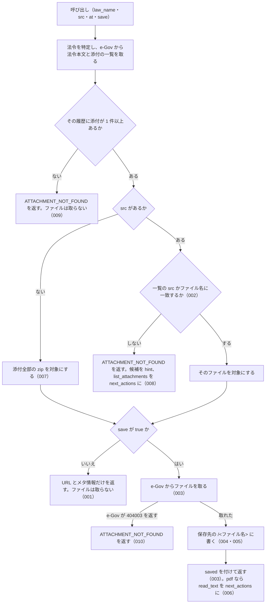

# 機能: get_attachment（添付ファイル 1 件か、まとめた zip の URL を返し、求められたら保存する）

- 機能 ID: EGOV
- 種類: ツール
- 版: current
- 承認日: 2026-09-28（PR #50）。差分 `20260928-undecided-to-issues` は 2026-09-28（PR #68）。差分 `20260928-untested-behaviors` は 2026-09-28（PR #76）。差分 `20261001-t1-argument-guards` は 2026-10-01（PR #84）。差分 `20261001-t2-error-codes` は 2026-10-01（PR #85）。差分 `20261001-t3-normalize` は 2026-10-01（PR #86）
- 起こした元: v0.15.1 の `src/tools/definitions.ts`、`src/tools/handlers.ts`、`src/services/law-files.ts`、`src/services/file-store.ts`、`src/services/egov-client.ts`、`src/services/law-service.ts`（法令名の解決・管轄の確認）、`src/config.ts`、`src/services/law-files.test.ts`、`src/services/file-store.test.ts`
- 関連する Issue: houki-egov-mcp #19（添付ファイルと法令本文ファイル）

この文書は「このツールは何をするか」を書きます。どう実装しているか（関数名・テーブル名）は書きません。

## アクター

- MCP クライアント（Claude などの LLM、または CLI から呼ぶ人）。`law_name` と、`list_attachments` で選んだ `src`（省けば添付全部の zip）を渡して、そのファイルの URL とメタ情報を受け取る。`save: true` を付けたときは、サーバーが保存したファイルの絶対パスを受け取る
- MCP サーバーを起動する人。環境変数 `HOUKI_EGOV_FILES_DIR` で保存先のディレクトリを決める

## 入力

| 引数       | 必須 | 内容                                                                                                                                                                           |
| ---------- | ---- | ------------------------------------------------------------------------------------------------------------------------------------------------------------------------------ |
| `law_name` | 必須 | 法令名または略称                                                                                                                                                               |
| `src`      | 任意 | `list_attachments` が返す `attachments[].src`（例: `"./pict/H11HO127-001.jpg"`）。ファイル名だけ（`"H11HO127-001.jpg"`）でもよい。省くと、その法令履歴の添付ファイル全部の zip。空文字・空白だけは省いたときと同じ（SPEC-EGOV-GET-ATTACHMENT-025） |
| `at`       | 任意 | 時点。`YYYY-MM-DD` 形式（SPEC-EGOV-GET-ATTACHMENT-024）。`list_attachments` と同じ時点を渡す |
| `save`     | 任意 | `true` でファイルを取得して保存する。既定は `false`（URL とメタ情報だけを返し、ファイルは取らない）                                                                            |

保存先のパスは引数では指定できない。inputSchema に無い引数を渡したときの扱いは common_errors に書く。

## 処理の流れ

呼び出しを受けてから応答を返すまでに、何をどの順で確かめるかを示します。図の中の番号は「できること」の仕様 ID の末尾 3 桁です。

## できること

### SPEC-EGOV-GET-ATTACHMENT-001 save を付けないときは、ファイルを取らずに URL とメタ情報を返す

`save` を省くか `false` にしたときは、e-Gov からファイルを取らず、次のフィールドを持つ応答を返す。`saved` は付けない。`note` には、保存するには `save: true` を付けるよう書く。

| フィールド                   | 内容                                                                                            |
| ---------------------------- | ----------------------------------------------------------------------------------------------- |
| `meta`                       | 法令と法令履歴の情報。`law_revision_id` を含む（`list_attachments` の `meta` と同じフィールド） |
| `kind`                       | `file`（`src` を指定したとき）または `zip`（`src` を省いたとき）                                |
| `src`                        | 対象のファイルの `src`（一覧にある形。例: `./pict/H11HO127-002.jpg`）。zip では `null`          |
| `file_name`                  | ファイル名。例: `H11HO127-002.jpg`                                                              |
| `file_type` / `content_type` | 拡張子から決めた種別と Content-Type                                                             |
| `url`                        | 認証なしで開ける取得 URL                                                                        |
| `location`                   | 法令の中の置き場所（例: `title` が `別記第二`）。zip と、本文に見つからないファイルでは `null`  |
| `note`                       | 説明                                                                                            |

### SPEC-EGOV-GET-ATTACHMENT-002 src はファイル名だけでも引ける

`src` が一覧のどの `src` とも一致しないときは、`src` の末尾のファイル名を一覧の `file_name` と照らし、一致したファイルを対象にする。応答の `src` は一覧にある形（例: `H11HO127-001.jpg` を渡すと `./pict/H11HO127-001.jpg`）になる。

### SPEC-EGOV-GET-ATTACHMENT-003 save: true でファイルを取得して保存し、パスとサイズを返す

`save: true` のときは、e-Gov から対象のファイルを取得して保存し、応答に `saved` を付ける。e-Gov には一覧にある形の `src` を渡す。

- `saved.path`: 書いたファイルの絶対パス
- `saved.bytes`: 書いたバイト数
- `saved.response_content_type`: e-Gov の応答の Content-Type（例: `image/jpeg`）。`content_type`（拡張子から決めたもの）とは別に返す
- `note`: 「<ファイル名>（<サイズ>）を <パス> に保存しました。」

### SPEC-EGOV-GET-ATTACHMENT-004 保存先は <保存先のディレクトリ>/<law_revision_id>/<ファイル名>

保存するファイルは、保存先のディレクトリの下に法令履歴 ID ごとのディレクトリを作って置く。環境変数 `HOUKI_EGOV_FILES_DIR` があれば、それを保存先のディレクトリにする。ファイル名は、1 件なら `file_name`（例: `<HOUKI_EGOV_FILES_DIR>/411AC0000000127_19990813_000000000000000/H11HO127-001.jpg`）、zip なら `<law_revision_id>.zip`。

### SPEC-EGOV-GET-ATTACHMENT-005 保存するファイル名にはディレクトリの部分を残さない

保存するファイル名とディレクトリ名は、パスの区切り（`/` と `\`）より前を捨てて末尾の名前だけにし、先頭の `.` を除き、英数字・`_`・`.`・`-`・かな・漢字以外の文字を `_` にする。何も残らなければ `file` にする。例: `./pict/H11HO127-001.jpg` → `H11HO127-001.jpg`、`../../etc/passwd` → `passwd`、`..\..\x.pdf` → `x.pdf`、`...` → `file`、`a b/c:d.pdf` → `c_d.pdf`。保存先のディレクトリの外には書かない。

### SPEC-EGOV-GET-ATTACHMENT-006 pdf を保存したら pdf-reader-mcp の read_text を案内する

pdf のファイルを `save: true` で保存したときは、`content_type` を `application/pdf` にし、`next_actions` の先頭に `pdf-reader-mcp:read_text`（`example` は `{ path: <saved.path> }`）を入れる。

### SPEC-EGOV-GET-ATTACHMENT-007 src を省くと、添付ファイル全部の zip を対象にする

`src` を省いたときは、その法令履歴の添付ファイル全部をまとめた zip を対象にする。応答は `kind: "zip"`・`src: null`・`file_name: "<law_revision_id>.zip"`・`content_type: "application/zip"`。`save: true` のときは e-Gov に `src` を付けずに取得し、`<law_revision_id>.zip` の名前で保存する。

### SPEC-EGOV-GET-ATTACHMENT-008 一覧に無い src はエラーにし、選び直す道を案内する

`src` が一覧のどの `src` にも `file_name` にも一致しないときは、e-Gov からファイルを取らずに、エラー `ATTACHMENT_NOT_FOUND` を返す。`hint` にその履歴の添付ファイルの `src` を最大 10 件書き（11 件以上なら末尾に `…`）、`next_actions` の先頭に `list_attachments` を入れる。

### SPEC-EGOV-GET-ATTACHMENT-009 添付が 1 件も無い法令はエラーにする

その法令履歴に添付ファイルが 1 件も無い（`attached_files_info` が空で、本文に `Fig` 要素も無い）ときは、`save` の値にかかわらず e-Gov からファイルを取らずに、エラー `ATTACHMENT_NOT_FOUND` を返す。

### SPEC-EGOV-GET-ATTACHMENT-010 e-Gov に実体が無いファイルはエラーにする

`save: true` で取得したとき、e-Gov が 400 または 404 で code `404003`（添付ファイルが無い）を返したら、エラー `ATTACHMENT_NOT_FOUND` を返す。一覧には載っているが e-Gov に実体が無いファイルがこれに当たる。`detail.status` に HTTP ステータス、`detail.cause` に e-Gov の応答本文（`404003` を含む）を入れる。

### SPEC-EGOV-GET-ATTACHMENT-011 save なしで pdf を指したときは pdf-reader-mcp の read_url を案内する

`save` を省くか `false` にして、`file_type` が `pdf` のファイルを指したときは、`next_actions` に `pdf-reader-mcp:read_url` の 1 件だけを入れる。`example` は `{ url: <応答の url> }`。`attached_files_info` に無く本文にだけある pdf でも同じ。pdf 以外のファイル（例: jpg）と zip では `next_actions` を付けない。

例: `src: "./pict/b.pdf"` → `next_actions: [{ action: "pdf-reader-mcp:read_url", reason: …, example: { url: "https://laws.e-gov.go.jp/api/2/attachment/<law_revision_id>?src=.%2Fpict%2Fb.pdf" } }]`。

### SPEC-EGOV-GET-ATTACHMENT-012 save なしの zip の note

`src` を省き `save` を付けないときの `note` は、`添付ファイル <件数> 件をまとめた zip の URL です。` で始まり、保存するには `save: true` を付けるよう書く。`<件数>` は `list_attachments` の `count` と同じ（`attached_files_info` と本文の図を合わせ、重複を除いた件数）。

例: `attached_files_info` に 2 件、本文にだけある図が 1 件の法令 → `添付ファイル 3 件をまとめた zip の URL です。ファイルをディスクに置くには save: true を付けてください。`

### SPEC-EGOV-GET-ATTACHMENT-013 save なしの 1 件の note には保存先のディレクトリを書く

`src` を指定し `save` を付けないときの `note` は、`<file_name> の URL です。認証なしで開けます。ファイルをディスクに置くには save: true を付けてください（<保存先のディレクトリ> 以下に保存します）。` になる。`<保存先のディレクトリ>` は SPEC-EGOV-GET-ATTACHMENT-004 の保存先のディレクトリ（法令履歴 ID のディレクトリより上）。

例: `HOUKI_EGOV_FILES_DIR=/tmp/xx-files`、`src: "./pict/a.jpg"` → `a.jpg の URL です。認証なしで開けます。ファイルをディスクに置くには save: true を付けてください（/tmp/xx-files 以下に保存します）。`

### SPEC-EGOV-GET-ATTACHMENT-014 時点（at）を渡すと、その時点の法令履歴の添付を対象にする

`at` を渡したときは、その時点の法令履歴の本文と添付の一覧から対象のファイルを選ぶ。`meta.law_revision_id` はその時点の履歴 ID、`url` と `saved.path` にもその履歴 ID を使い、`meta.at` に渡した `at` を入れる。`at` を渡さないときは `meta.at` は付かない。

例: `at: "2019-04-01"` で e-Gov がその時点の履歴 ID `LID1_20190401_X` を返す → `meta.law_revision_id: "LID1_20190401_X"`、`meta.at: "2019-04-01"`、`url: "https://laws.e-gov.go.jp/api/2/attachment/LID1_20190401_X?src=.%2Fpict%2Fa.jpg"`。

### SPEC-EGOV-GET-ATTACHMENT-015 一覧に無い src のエラーで案内する list_attachments にも at を入れる

SPEC-EGOV-GET-ATTACHMENT-008 のエラーの `next_actions` の `list_attachments` の `example` は `{ law_name: <渡した law_name> }` で、`at` を渡したときは `at` も入れる。

例: `law_name: "テスト法"`、`src: "./pict/zz.jpg"`、`at: "2019-04-01"` → `example: { law_name: "テスト法", at: "2019-04-01" }`。`at` を渡さないときは `{ law_name: "テスト法" }`。

### SPEC-EGOV-GET-ATTACHMENT-016 特定できない法令と管轄外の資料はエラーにする

- 法令名が略称辞書で別の MCP サーバーの管轄の資料（例: `所基通` = 所得税基本通達）に当たるときは、エラー `OUT_OF_SCOPE` を返す。`next_actions` は `delegate_to_mcp`（`example` は `{ mcp: "houki-nta" }`）
- 法令名から法令を特定できないときは、エラー `LAW_NOT_FOUND` を返す。`next_actions` は `resolve_abbreviation`（`example` は `{ abbr: <law_name> }`）と `search_law`（`example` は `{ keyword: <law_name> }`）

どちらも `save` の値にかかわらず、e-Gov から法令本文も添付ファイルも取らない。

### SPEC-EGOV-GET-ATTACHMENT-017 添付が無いときのエラーの hint と next_actions

SPEC-EGOV-GET-ATTACHMENT-009 のエラーは、`hint` に別の時点（`at`）の履歴には添付が付いていることがある旨を書き、`next_actions` に `get_law_revisions` の 1 件を入れる。`example` は `{ law_name: <渡した law_name> }`（`at` を渡していても `at` は入れない）。

例: `law_name: "テスト法"`、`at: "2019-04-01"` で、その履歴に添付が無い → `hint: "attached_files_info が空で、本文に Fig 要素もありません。別の時点（at）の履歴には付いていることがあります"`、`next_actions: [{ action: "get_law_revisions", reason: …, example: { law_name: "テスト法" } }]`。

### SPEC-EGOV-GET-ATTACHMENT-018 e-Gov が 404003 以外の 4xx を返したときは SOURCE_API_ERROR

`save: true` の取得で e-Gov が 4xx（429 を除く）を返し、SPEC-EGOV-GET-ATTACHMENT-010 に当たらないときは、エラー `SOURCE_API_ERROR`（`retryable: false`）を返す。`detail.status` に HTTP ステータス、`detail.url` に取得した URL を入れる。400 と 404 のときは、`detail.cause` に e-Gov の応答本文も入れる。

例:
- 400 で本文 `{"code":"400039","message":"m"}` → `{ code: "SOURCE_API_ERROR", retryable: false, detail: { status: 400, url: "https://laws.e-gov.go.jp/api/2/attachment/REV1?src=.%2Fpict%2Fa.jpg", cause: "{\"code\":\"400039\",\"message\":\"m\"}" } }`
- 404 で本文 `Not Found`（JSON でない）→ `SOURCE_API_ERROR`、`retryable: false`、`detail.cause: "Not Found"`
- 403 → `SOURCE_API_ERROR`、`retryable: false`、`detail.status: 403`（`detail.cause` は付かない）

### SPEC-EGOV-GET-ATTACHMENT-019 e-Gov の 429・5xx・時間切れ・ネットワークの失敗

`save: true` の取得で次のときは、それぞれのエラーを返す。`detail.url` には取得した URL を入れる。

| e-Gov の応答        | `code`                | `retryable` |
| ------------------- | --------------------- | ----------- |
| 429                 | `SOURCE_RATE_LIMITED` | `true`      |
| 時間切れ            | `SOURCE_TIMEOUT`      | `true`      |
| 5xx（例: 500）      | `SOURCE_API_ERROR`    | `true`      |

429・5xx・応答が来ないネットワークの失敗のときは、最大 3 回取り直す（最初の 1 回と合わせて最大 4 回）。途中で成功すれば保存して成功応答を返す。時間切れと、429 以外の 4xx は取り直さない。

例:
- 4 回とも 429 → e-Gov への問い合わせは 4 回で、`SOURCE_RATE_LIMITED`（`detail.status: 429`）
- 1 回目が 500、2 回目が 200 → `saved` 付きの成功応答

### SPEC-EGOV-GET-ATTACHMENT-020 環境変数が無いときの保存先

`HOUKI_EGOV_FILES_DIR` が無いか空文字のときは、保存先のディレクトリを `<XDG_CACHE_HOME>/houki-egov-mcp/files` にする。`XDG_CACHE_HOME` も無いか空文字のときは `<ホームディレクトリ>/.cache/houki-egov-mcp/files` にする。

例:
- `HOUKI_EGOV_FILES_DIR` 無し、`XDG_CACHE_HOME=/tmp/xdg` → `saved.path` は `/tmp/xdg/houki-egov-mcp/files/<law_revision_id>/a.jpg`
- どちらも無く、ホームディレクトリが `/tmp/home` → `saved.path` は `/tmp/home/.cache/houki-egov-mcp/files/<law_revision_id>/a.jpg`

### SPEC-EGOV-GET-ATTACHMENT-021 同じ法令履歴の同じファイル名を保存すると上書きする

同じ法令履歴の同じファイル名を `save: true` でもう一度保存すると、前のファイルを新しい中身で上書きし、エラーにしない。`saved.path` は前と同じで、`saved.bytes` は新しい中身のバイト数になる。

例: 中身 `ONE`（3 バイト）で保存したあと、同じ `src` を中身 `TWO!`（4 バイト）で保存 → 2 回目の `saved.bytes` は `4`、ファイルの中身は `TWO!`。

### SPEC-EGOV-GET-ATTACHMENT-022 一覧に updated があるファイルでは、応答にも updated を付ける

対象のファイルが `attached_files_info` に載っていて `updated` を持つときは、応答に `updated` を付ける（値は `attached_files_info` の `updated`）。本文にだけあるファイルと zip では `updated` を付けない。`save` の有無は問わない。

例: `attached_files_info` の `./pict/a.jpg` の `updated` が `2024-07-25T00:20:13+09:00` → 応答の `updated: "2024-07-25T00:20:13+09:00"`。本文にだけある `./pict/body-only.pdf` → `updated` は付かない。

### SPEC-EGOV-GET-ATTACHMENT-023 law_name が空文字・空白だけのときは略称辞書と e-Gov に問い合わせずに `INVALID_ARGUMENT` を返す

空文字は inputSchema の `minLength: 1` の検査（SPEC-EGOV-COMMON-ERRORS-025）で止まり、`INVALID_ARGUMENT`（`tool: "get_attachment"`、`detail.issues: [{ path: "law_name", message: "空文字は指定できません" }]`）を返す。空白（半角スペース・全角スペース・タブ・改行）だけのときは、ツールの処理が略称辞書と e-Gov に問い合わせる前に、SPEC-EGOV-COMMON-ERRORS-026 の形の `INVALID_ARGUMENT`（`tool: "get_attachment"`、`error: "law_name が空です"`、`detail.issues: [{ path: "law_name", message: "空白だけは指定できません" }]`、`hint` に法令名か略称を渡すよう書く）を返す。

例: `law_name: ""` は `code: "INVALID_ARGUMENT"`・`detail.issues[0].message: "空文字は指定できません"`。`law_name: "　"`（全角スペース）と `law_name: " \n"` は `code: "INVALID_ARGUMENT"`・`error: "law_name が空です"`。どれも略称辞書と e-Gov への問い合わせは 0 回。

### SPEC-EGOV-GET-ATTACHMENT-024 `at` は `YYYY-MM-DD` の形だけを受け付け、形に合わない値と暦に無い日付は `INVALID_ARGUMENT`

`at` は SPEC-EGOV-COMMON-ERRORS-024 に従う。tools/list の inputSchema の `at` は `pattern: "^[0-9]{4}-[0-9]{2}-[0-9]{2}$"` を持ち、形に合わない値は inputSchema の検査で `INVALID_ARGUMENT`（`tool: "get_attachment"`、`detail.issues: [{ path: "at", message: "YYYY-MM-DD の形で指定してください" }]`）になる。形は合うが暦に無い日付は、ツールの処理が e-Gov に問い合わせる前に `INVALID_ARGUMENT`（`detail.issues: [{ path: "at", message: "暦に無い日付です" }]`）を返す。

例: `law_name: "戸籍法施行規則", src: "H11HO127-001.jpg", at: "2024/04/01"` は `code: "INVALID_ARGUMENT"`・`detail.issues[0].path: "at"` で、e-Gov への問い合わせは 0 回。`at: "20240401"`・`at: "2024-4-1"` も同じ。`at: "2026-02-30"` は `detail.issues[0].message: "暦に無い日付です"` で、e-Gov への問い合わせは 0 回。`at: "2024-04-01"` は SPEC-EGOV-GET-ATTACHMENT-014 のとおり。

### SPEC-EGOV-GET-ATTACHMENT-025 `src` が空文字・空白だけのときは `src` を省いたときと同じに扱う

任意の `src` が空文字、または空白（半角スペース・全角スペース・タブ・改行）だけのときは、`src` を渡さなかったときと同じく、その法令履歴の添付ファイル全部の zip を対象にする（`save` が `false` なら zip の URL とメタ情報、`true` なら zip の保存）。`ATTACHMENT_NOT_FOUND` にはしない。前後に空白の付いた `src`（`" H11HO127-001.jpg "`）は、空白を除いた名前で一覧と突き合わせる。

例: `law_name: "戸籍法施行規則", src: ""` と `src: "   "` は、どちらも `src` を省いたときと同じ zip の応答（v0.15.4 では空白だけは `ATTACHMENT_NOT_FOUND` だった）。

### SPEC-EGOV-GET-ATTACHMENT-026 法令名の検索が通信の失敗で終わったときは `LAW_NOT_FOUND` ではなく `SOURCE_*` を返す

`law_name` が略称辞書に law_id 付きで無く、e-Gov の法令名検索で law_id を決めるとき、その検索が通信の失敗（接続できない・時間切れ・5xx・429・429 以外の 4xx）で終わったときは、SPEC-EGOV-COMMON-ERRORS-027 の表の code（`SOURCE_UNAVAILABLE` / `SOURCE_TIMEOUT` / `SOURCE_API_ERROR` / `SOURCE_RATE_LIMITED`）を、表の `retryable` と `detail` 付きで返す（SPEC-EGOV-COMMON-ERRORS-029）。`LAW_NOT_FOUND`（SPEC-EGOV-GET-ATTACHMENT-016）は、検索が成功して 0 件だったときだけ返す。`SOURCE_*` のときの `next_actions` に `resolve_abbreviation` / `search_law` は入れない。

例: 法令名の検索が 503 を返す状態で `{ law_name: "架空の法律", src: "./pict/a.jpg" }` を渡すと、`code: "SOURCE_API_ERROR"`、`retryable: true`、`detail.status: 503`（v0.15.4 では `LAW_NOT_FOUND` だった）。検索が時間切れなら `SOURCE_TIMEOUT`、接続できなければ `SOURCE_UNAVAILABLE`（`detail.cause: "ENOTFOUND"` など）、400 なら `SOURCE_API_ERROR`・`retryable: false`。検索が 0 件で成功したときは `LAW_NOT_FOUND` のまま。

### SPEC-EGOV-GET-ATTACHMENT-027 上限（50 MB）を超えるファイルは `FILE_TOO_LARGE` で断り、Content-Length で分かるときは本文を読まない

`save: true` の取得で、ファイルが 50 MB（52,428,800 バイト）を超えているときは、エラー `FILE_TOO_LARGE`（`retryable: false`）を返し、保存しない（SPEC-EGOV-COMMON-ERRORS-030）。`INVALID_ARGUMENT` にはしない。大きさは次の順で確かめる。

1. e-Gov の応答ヘッダーに Content-Length があり、その値が上限を超えていれば、本文を読まずにエラーにする（`detail.bytes` は Content-Length の値）
2. Content-Length が無いか上限以下のときは本文を読み、読み終えた大きさが上限を超えていればエラーにする（`detail.bytes` は読み終えた大きさ）。途中で打ち切らない

`error` は `ファイルが大きすぎます: <大きさ>（上限 50.0 MB）`、`hint` は `保存せず url をそのまま使ってください`、`detail.url` は取得した URL。

例: Content-Length が `52428801` のとき、`{ law_name: "民法", src: "./pict/big.pdf", save: true }` は `code: "FILE_TOO_LARGE"`、`retryable: false`、`detail.bytes: 52428801` で、本文は読まず、ファイルは書かない（v0.15.4 では全部読んでから `INVALID_ARGUMENT` だった）。Content-Length が無く本文が 52,428,801 バイトのときも `FILE_TOO_LARGE`。Content-Length が `52428800`（ちょうど 50 MB）は保存する。

### SPEC-EGOV-GET-ATTACHMENT-028 `law_name` の全角英数字・ダッシュ類・全角空白は半角に揃えてから略称辞書と照合する

`law_name` を略称辞書で引くときは、houki-abbreviations の `resolveAbbreviation(name, { normalize: true })` の規則（全角英数字を半角に、ダッシュ類 `－` `‐` `‑` `–` `—` `―` `−` を `-` に、全角チルダを `~` に、全角空白を半角空白にし、前後の空白を除く。大文字と小文字は区別する）で揃えてから照合する。管轄の判定（`OUT_OF_SCOPE`）も同じ規則で引く。辞書に無いときに e-Gov の法令名検索へ渡す値は、前後の空白を除いた渡した値のままで、揃えない。

例: `{ law_name: "ＰＬ法", src: "./pict/a.jpg" }` は `製造物責任法の添付を引き、一覧に無ければ `ATTACHMENT_NOT_FOUND`（`LAW_NOT_FOUND` ではない）`（v0.15.4 では辞書に無い扱いで、e-Gov の法令名検索に `ＰＬ法` を渡して `LAW_NOT_FOUND` だった）。`law_name: "労基法　"`（末尾が全角空白）も `労働基準法` として引く。

## できないこと

- ファイルの中身（バイト列や base64）を応答に入れること
- 保存先のパスやファイル名を引数で決めること（決めるのはサーバーを起動する人の環境変数だけ）
- 保存したファイルを消すこと
- pdf の本文を読むこと（pdf-reader-mcp に `url` か `saved.path` を渡す）
- 添付ファイルの一覧を返すこと（`list_attachments`）

## 未決

初版起こしで見つけた、意図か不具合かを人が決める項目です。決まったら「できること」に ID を振るか、`specs/changes/` の差分にします。

意図か不具合かの判断が要る項目は houki-egov-mcp の Issue に移し、ここには題と Issue の番号だけを残します。今の振る舞いのままでよくテストが無いだけの項目は、受入テストを書いてから「できること」に ID を振ります。

3. **ファイル名だけで引いたとき、同じファイル名が複数あると先のものを返す。** → houki-egov-mcp #66
6. **save なしで pdf を指したときの案内と、zip の note。** → SPEC-EGOV-GET-ATTACHMENT-011・SPEC-EGOV-GET-ATTACHMENT-012・SPEC-EGOV-GET-ATTACHMENT-013
7. **時点（at）を渡したとき。** → SPEC-EGOV-GET-ATTACHMENT-014・SPEC-EGOV-GET-ATTACHMENT-015
8. **特定できない法令と管轄外の資料。** → SPEC-EGOV-GET-ATTACHMENT-016
9. **添付が無いときのエラーの hint と next_actions。** → SPEC-EGOV-GET-ATTACHMENT-017
10. **e-Gov からの取得に失敗したときの、404003 以外の code。** → SPEC-EGOV-GET-ATTACHMENT-018・SPEC-EGOV-GET-ATTACHMENT-019
11. **既定の保存先と、同じファイルの上書き。** → SPEC-EGOV-GET-ATTACHMENT-020・SPEC-EGOV-GET-ATTACHMENT-021
12. **応答の `updated`。** → SPEC-EGOV-GET-ATTACHMENT-022
