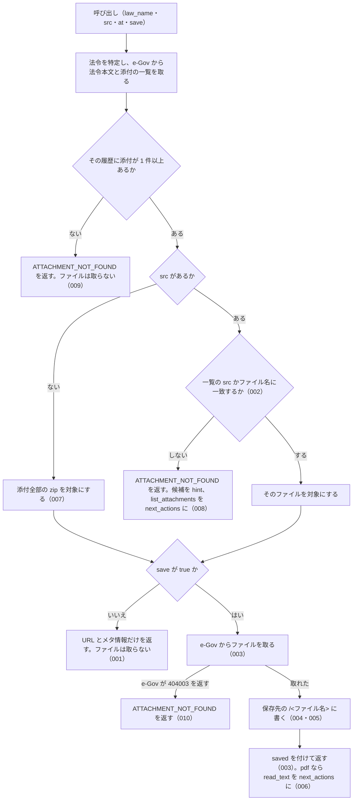

# 機能: get_attachment（添付ファイル 1 件か、まとめた zip の URL を返し、求められたら保存する）

- 機能 ID: EGOV
- 種類: ツール
- 版: current
- 承認日: 2026-09-28（PR #50）
- 起こした元: v0.15.1 の `src/tools/definitions.ts`、`src/tools/handlers.ts`、`src/services/law-files.ts`、`src/services/file-store.ts`、`src/services/egov-client.ts`、`src/services/law-service.ts`（法令名の解決・管轄の確認）、`src/config.ts`、`src/services/law-files.test.ts`、`src/services/file-store.test.ts`
- 関連する Issue: houki-egov-mcp #19（添付ファイルと法令本文ファイル）

この文書は「このツールは何をするか」を書きます。どう実装しているか（関数名・テーブル名）は書きません。

## アクター

- MCP クライアント（Claude などの LLM、または CLI から呼ぶ人）。`law_name` と、`list_attachments` で選んだ `src`（省けば添付全部の zip）を渡して、そのファイルの URL とメタ情報を受け取る。`save: true` を付けたときは、サーバーが保存したファイルの絶対パスを受け取る
- MCP サーバーを起動する人。環境変数 `HOUKI_EGOV_FILES_DIR` で保存先のディレクトリを決める

## 入力

| 引数       | 必須 | 内容                                                                                                                                                                           |
| ---------- | ---- | ------------------------------------------------------------------------------------------------------------------------------------------------------------------------------ |
| `law_name` | 必須 | 法令名または略称                                                                                                                                                               |
| `src`      | 任意 | `list_attachments` が返す `attachments[].src`（例: `"./pict/H11HO127-001.jpg"`）。ファイル名だけ（`"H11HO127-001.jpg"`）でもよい。省くと、その法令履歴の添付ファイル全部の zip |
| `at`       | 任意 | 時点。`YYYY-MM-DD` 形式。`list_attachments` と同じ時点を渡す                                                                                                                   |
| `save`     | 任意 | `true` でファイルを取得して保存する。既定は `false`（URL とメタ情報だけを返し、ファイルは取らない）                                                                            |

保存先のパスは引数では指定できない。inputSchema に無い引数を渡したときの扱いは common_errors に書く。

## 処理の流れ

呼び出しを受けてから応答を返すまでに、何をどの順で確かめるかを示します。図の中の番号は「できること」の仕様 ID の末尾 3 桁です。

## できること

### SPEC-EGOV-GET-ATTACHMENT-001 save を付けないときは、ファイルを取らずに URL とメタ情報を返す

`save` を省くか `false` にしたときは、e-Gov からファイルを取らず、次のフィールドを持つ応答を返す。`saved` は付けない。`note` には、保存するには `save: true` を付けるよう書く。

| フィールド                   | 内容                                                                                            |
| ---------------------------- | ----------------------------------------------------------------------------------------------- |
| `meta`                       | 法令と法令履歴の情報。`law_revision_id` を含む（`list_attachments` の `meta` と同じフィールド） |
| `kind`                       | `file`（`src` を指定したとき）または `zip`（`src` を省いたとき）                                |
| `src`                        | 対象のファイルの `src`（一覧にある形。例: `./pict/H11HO127-002.jpg`）。zip では `null`          |
| `file_name`                  | ファイル名。例: `H11HO127-002.jpg`                                                              |
| `file_type` / `content_type` | 拡張子から決めた種別と Content-Type                                                             |
| `url`                        | 認証なしで開ける取得 URL                                                                        |
| `location`                   | 法令の中の置き場所（例: `title` が `別記第二`）。zip と、本文に見つからないファイルでは `null`  |
| `note`                       | 説明                                                                                            |

### SPEC-EGOV-GET-ATTACHMENT-002 src はファイル名だけでも引ける

`src` が一覧のどの `src` とも一致しないときは、`src` の末尾のファイル名を一覧の `file_name` と照らし、一致したファイルを対象にする。応答の `src` は一覧にある形（例: `H11HO127-001.jpg` を渡すと `./pict/H11HO127-001.jpg`）になる。

### SPEC-EGOV-GET-ATTACHMENT-003 save: true でファイルを取得して保存し、パスとサイズを返す

`save: true` のときは、e-Gov から対象のファイルを取得して保存し、応答に `saved` を付ける。e-Gov には一覧にある形の `src` を渡す。

- `saved.path`: 書いたファイルの絶対パス
- `saved.bytes`: 書いたバイト数
- `saved.response_content_type`: e-Gov の応答の Content-Type（例: `image/jpeg`）。`content_type`（拡張子から決めたもの）とは別に返す
- `note`: 「<ファイル名>（<サイズ>）を <パス> に保存しました。」

### SPEC-EGOV-GET-ATTACHMENT-004 保存先は <保存先のディレクトリ>/<law_revision_id>/<ファイル名>

保存するファイルは、保存先のディレクトリの下に法令履歴 ID ごとのディレクトリを作って置く。環境変数 `HOUKI_EGOV_FILES_DIR` があれば、それを保存先のディレクトリにする。ファイル名は、1 件なら `file_name`（例: `<HOUKI_EGOV_FILES_DIR>/411AC0000000127_19990813_000000000000000/H11HO127-001.jpg`）、zip なら `<law_revision_id>.zip`。

### SPEC-EGOV-GET-ATTACHMENT-005 保存するファイル名にはディレクトリの部分を残さない

保存するファイル名とディレクトリ名は、パスの区切り（`/` と `\`）より前を捨てて末尾の名前だけにし、先頭の `.` を除き、英数字・`_`・`.`・`-`・かな・漢字以外の文字を `_` にする。何も残らなければ `file` にする。例: `./pict/H11HO127-001.jpg` → `H11HO127-001.jpg`、`../../etc/passwd` → `passwd`、`..\..\x.pdf` → `x.pdf`、`...` → `file`、`a b/c:d.pdf` → `c_d.pdf`。保存先のディレクトリの外には書かない。

### SPEC-EGOV-GET-ATTACHMENT-006 pdf を保存したら pdf-reader-mcp の read_text を案内する

pdf のファイルを `save: true` で保存したときは、`content_type` を `application/pdf` にし、`next_actions` の先頭に `pdf-reader-mcp:read_text`（`example` は `{ path: <saved.path> }`）を入れる。

### SPEC-EGOV-GET-ATTACHMENT-007 src を省くと、添付ファイル全部の zip を対象にする

`src` を省いたときは、その法令履歴の添付ファイル全部をまとめた zip を対象にする。応答は `kind: "zip"`・`src: null`・`file_name: "<law_revision_id>.zip"`・`content_type: "application/zip"`。`save: true` のときは e-Gov に `src` を付けずに取得し、`<law_revision_id>.zip` の名前で保存する。

### SPEC-EGOV-GET-ATTACHMENT-008 一覧に無い src はエラーにし、選び直す道を案内する

`src` が一覧のどの `src` にも `file_name` にも一致しないときは、e-Gov からファイルを取らずに、エラー `ATTACHMENT_NOT_FOUND` を返す。`hint` にその履歴の添付ファイルの `src` を最大 10 件書き（11 件以上なら末尾に `…`）、`next_actions` の先頭に `list_attachments` を入れる。

### SPEC-EGOV-GET-ATTACHMENT-009 添付が 1 件も無い法令はエラーにする

その法令履歴に添付ファイルが 1 件も無い（`attached_files_info` が空で、本文に `Fig` 要素も無い）ときは、`save` の値にかかわらず e-Gov からファイルを取らずに、エラー `ATTACHMENT_NOT_FOUND` を返す。

### SPEC-EGOV-GET-ATTACHMENT-010 e-Gov に実体が無いファイルはエラーにする

`save: true` で取得したとき、e-Gov が 400 または 404 で code `404003`（添付ファイルが無い）を返したら、エラー `ATTACHMENT_NOT_FOUND` を返す。一覧には載っているが e-Gov に実体が無いファイルがこれに当たる。`detail.status` に HTTP ステータス、`detail.cause` に e-Gov の応答本文（`404003` を含む）を入れる。

## できないこと

- ファイルの中身（バイト列や base64）を応答に入れること
- 保存先のパスやファイル名を引数で決めること（決めるのはサーバーを起動する人の環境変数だけ）
- 保存したファイルを消すこと
- pdf の本文を読むこと（pdf-reader-mcp に `url` か `saved.path` を渡す）
- 添付ファイルの一覧を返すこと（`list_attachments`）

## 未決

初版起こしで見つけた、意図か不具合かを人が決める項目です。決まったら「できること」に ID を振るか、`specs/changes/` の差分にします。

意図か不具合かの判断が要る項目は houki-egov-mcp の Issue に移し、ここには題と Issue の番号だけを残します。今の振る舞いのままでよくテストが無いだけの項目は、受入テストを書いてから「できること」に ID を振ります。

1. **50 MB を超えるファイルを `INVALID_ARGUMENT` で返す。** → houki-egov-mcp #49
2. **`src` が空文字のときは zip、空白だけのときは `ATTACHMENT_NOT_FOUND`。** → houki-egov-mcp #53
3. **ファイル名だけで引いたとき、同じファイル名が複数あると先のものを返す。** → houki-egov-mcp #66
4. **e-Gov の法令検索が失敗したときも `LAW_NOT_FOUND` を返す。** → houki-egov-mcp #46
5. **`at` の形を確かめない。** → houki-egov-mcp #47
6. **save なしで pdf を指したときの案内と、zip の note。** `save` なしで pdf のファイルを指したときは `next_actions` に `pdf-reader-mcp:read_url`（`example` は `{ url }`）を入れる。zip のときの `note` は「添付ファイル <件数> 件をまとめた zip の URL です。」で始まる。1 件のときの `note` には保存先のディレクトリを書く。テストが無い。ID を振るのは受入テストを書いてから。
7. **時点（at）を渡したとき。** その時点の法令履歴の添付を対象にし、`meta.at` に渡した `at` を入れ、SPEC-EGOV-GET-ATTACHMENT-008 の `next_actions` の `list_attachments` の `example` にも `at` を入れる。このツールで確かめるテストが無い。テストが無い。ID を振るのは受入テストを書いてから。
8. **特定できない法令と管轄外の資料。** 法令名から法令を特定できないときは `LAW_NOT_FOUND`、略称辞書で別の MCP サーバーの管轄の資料に当たるときは `OUT_OF_SCOPE` を返す。このツールで確かめるテストが無い。テストが無い。ID を振るのは受入テストを書いてから。
9. **添付が無いときのエラーの hint と next_actions。** SPEC-EGOV-GET-ATTACHMENT-009 のエラーの `hint` は別の時点の履歴には付いていることがある旨で、`next_actions` は `get_law_revisions`。テストは code だけを確かめている。テストが無い。ID を振るのは受入テストを書いてから。
10. **e-Gov からの取得に失敗したときの、404003 以外の code。** 400・404 で code が `404003` でないときは `SOURCE_API_ERROR`（`retryable: false`、`detail.cause` に応答本文）、429 は `SOURCE_RATE_LIMITED`、時間切れは `SOURCE_TIMEOUT`、5xx は `SOURCE_API_ERROR`（`retryable: true`）を返す。429 と 5xx とネットワークの失敗は、返す前に取り直す。テストが無い。ID を振るのは受入テストを書いてから。
11. **既定の保存先と、同じファイルの上書き。** `HOUKI_EGOV_FILES_DIR` が無いときの保存先は `${XDG_CACHE_HOME}/houki-egov-mcp/files`（`XDG_CACHE_HOME` が無ければ `~/.cache/houki-egov-mcp/files`）。同じ法令履歴の同じファイル名を保存すると、前のファイルを上書きする。テストが無い。ID を振るのは受入テストを書いてから。
12. **応答の `updated`。** 一覧に `updated` があるファイルでは、応答にも `updated` を付ける。テストが無い。ID を振るのは受入テストを書いてから。
