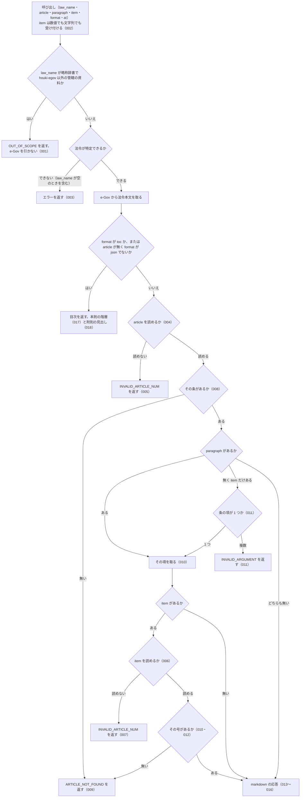

# 機能: get_law（法令の条・項・号を 1 つ取得する。条を省くと目次を返す）

- 機能 ID: EGOV
- 種類: ツール
- 版: current
- 承認日: 2026-09-28（PR #50）
- 起こした元: v0.15.1 の `src/tools/definitions.ts`、`src/tools/handlers.ts`、`src/services/law-service.ts`、`src/services/law-tree.ts`、`src/formatters/markdown.ts`、`src/utils/article-num.ts`、`src/server.test.ts`、`src/tools/handlers.test.ts`、`src/services/law-tree.test.ts`、`src/formatters/markdown.test.ts`、`src/utils/article-num.test.ts`、`CHANGELOG.md`
- 関連する Issue: houki-egov-mcp #16（Markdown の条・号の表示）、#17（漢数字の条番号・号番号）、#24（本則と附則を分ける）

この文書は「このツールは何をするか」を書きます。どう実装しているか（関数名・テーブル名）は書きません。

## アクター

- MCP クライアント（Claude などの LLM、または CLI から呼ぶ人）。`law_name` と `article`（任意で `paragraph`・`item`）を渡して、e-Gov 法令 API v2 から取った法令の条・項・号の本文を受け取る。`article` を省くと、その法令の目次を受け取る

## 入力

| 引数        | 必須 | 内容                                                                                                                                              |
| ----------- | ---- | ------------------------------------------------------------------------------------------------------------------------------------------------- |
| `law_name`  | 必須 | 法令名または略称。例: `"消費税法"`、`"消法"`、`"労基法"`、`"民法"`                                                                                |
| `article`   | 任意 | 条番号。例: `"30"`、`"30の2"`、`"第30条の2"`、`"第三十条"`、`"三十の二"`、`"３０"`。省くと目次を返す（`format` が `json` のときを除く）           |
| `paragraph` | 任意 | 項番号（数値）。省くと条全体                                                                                                                      |
| `item`      | 任意 | 号番号。数値（`8`）か文字列（`"8"`・`"8の2"`・`"第8号の2"`・`"八の二"`）。枝番号の号は文字列で指定する。項が複数ある条では `paragraph` も指定する |
| `format`    | 任意 | `markdown`（既定。条文）、`toc`（目次だけ）、`json`（構造化）                                                                                     |
| `at`        | 任意 | 時点。`YYYY-MM-DD`。その時点の条文を取る                                                                                                          |

## 処理の流れ

呼び出しを受けてから応答を返すまでに、何をどの順で確かめるかを示します。図の中の番号は「できること」の仕様 ID の末尾 3 桁です。

## できること

### SPEC-EGOV-GET-LAW-001 通達などの略称は OUT_OF_SCOPE を返し、e-Gov を引かない

`law_name` が略称辞書で houki-egov-mcp 以外の管轄（通達は houki-nta など）と分かる名前のときは、エラー `OUT_OF_SCOPE` を返す。e-Gov には問い合わせない。

例: `{ law_name: "消基通", article: "2", paragraph: 1, item: "8の2" }` は `code: "OUT_OF_SCOPE"` を返す。

### SPEC-EGOV-GET-LAW-002 item は数値でも文字列でも受け付ける

`item` には数値も文字列も渡せる。文字列の `item`（例: `"8の2"`）を渡しても、引数の検査のエラー（`INVALID_ARGUMENT`）にはならない。

### SPEC-EGOV-GET-LAW-003 law_name が空のときはエラーを返す

`law_name` が空文字のときは、エラーの応答（`error` を持つ）を返す。

### SPEC-EGOV-GET-LAW-004 条番号は算用数字・漢数字・全角数字のどれでも指定できる

`article` は次の書き方を受け付け、同じ条として扱う。

- 算用数字: `"30"`
- 枝番号は「の」でつなぐ: `"30の2"`、`"57の4"`
- 前の「第」と「条」を付けてもよい: `"第30条"`、`"第30条の2"`
- 位取りの漢数字（千の位まで）: `"三十"`、`"第三十条"`、`"第三十条の二"`、`"三十の二"`、`"第千五十条"`、`"第十条"`
- 全角数字: `"３０"`、`"第３０条の２"`
- 前後の空白は除く: `"  30  "`

### SPEC-EGOV-GET-LAW-005 読めない条番号は受け付けない

`article` を条番号として読めないときは、エラー `INVALID_ARTICLE_NUM` を返す。読めないのは次のような書き方である。

- 位ごとに並べた漢数字: `"第三〇条"`
- 漢数字と算用数字の混在: `"三0"`
- 「の」以外の区切り: `"30-2"`
- 「の」の後が空: `"30の"`

### SPEC-EGOV-GET-LAW-006 号番号は数値・算用数字・漢数字・全角数字のどれでも指定できる

`item` は次の書き方を受け付ける。

- 数値: `8`
- 文字列: `"8"`、`"8の2"`、`"第8号の2"`、`" 12の8 "`（前後の空白は除く）
- 位取りの漢数字: `"八"`、`"八の二"`、`"第八号の二"`
- 全角数字: `"１２の８"`

### SPEC-EGOV-GET-LAW-007 読めない号番号は受け付けない

`item` を号番号として読めないときは、エラー `INVALID_ARTICLE_NUM` を返す。読めないのは次のような値である。

- 位取りとして読めない漢数字: `"八八"`
- 1 未満の数値と整数でない数値: `0`、`1.5`
- 「の」以外の区切り: `"8-2"`
- 空文字: `""`

### SPEC-EGOV-GET-LAW-008 条番号で条を取り出す（枝番号の条を含む）

`article` で指定した条を法令本文から取り出して返す。枝番号の条（`"30の2"`）も取り出せる。

### SPEC-EGOV-GET-LAW-009 存在しない条・号は ARTICLE_NOT_FOUND を返す

`article` の条が法令に無いとき、または `item` の号がその項に無いときは、エラー `ARTICLE_NOT_FOUND` を返す。

例: 第8号と第8号の2しかない項で `item: 9` を指定すると `ARTICLE_NOT_FOUND`。

### SPEC-EGOV-GET-LAW-010 paragraph で項を、paragraph と item で号を取り出す

`paragraph` を指定したときは、その条の中の項だけを返す。`paragraph` と `item` を指定したときは、その項の中の号だけを返す。

### SPEC-EGOV-GET-LAW-011 item だけを指定したとき、項が 1 つの条はその項の号を返し、項が複数の条は INVALID_ARGUMENT を返す

`paragraph` を省いて `item` を指定したとき、条の項が 1 つだけなら、その項の号として探す（「消費税法施行令第14条の3第1号」のように、項が 1 つの条では第1項を書かないため）。条の項が複数あるときは、どの項の号か決まらないので、エラー `INVALID_ARGUMENT` を返す。

### SPEC-EGOV-GET-LAW-012 枝番号の号を取り出す

`item` に枝番号の号（`"8の2"` など）を指定すると、その号だけを返す。第8号と第8号の2がある項で `item: "8の2"` を指定したときは第8号の2だけを返し、第8号の本文は含めない。`item: 8` のときは第8号を返す。

### SPEC-EGOV-GET-LAW-013 markdown の応答の見出し

`format` を省くか `markdown` にしたとき、応答の Markdown の 1 行目は、指定した粒度に応じて次の見出しである。

- 条だけ: `# <法令名> 第<条>条`。枝番号の条は `# 租税特別措置法 第70条の6`（`第70の6条` にはしない）
- 項まで: `# 消費税法 第30条第2項`
- 号まで: `# 消費税法 第2条第1項第8号`。枝番号の号は `# 消費税法 第2条第1項第8号の2`（`第8_2号` にはしない）

条に見出し（例: `（仕入れに係る消費税額の控除）`）があるときは、見出しの行の次に置く。

### SPEC-EGOV-GET-LAW-014 号の行と、号の下のイ・ロ・ハの書き方

markdown の応答では、号を 1 号 1 行で書く。

- 行の先頭に e-Gov の号の表記（`八`、`八の二` などの漢数字）をそのまま置き、半角空白の後に本文を続ける。算用数字（`8`、`8_2`）に置き換えない
- 号の本文が複数の欄（見出し語と定義文など）に分かれているときは、欄の間を全角空白で区切る。例: `八 資産の譲渡等　事業として対価を得て行われる資産の譲渡及び貸付け並びに役務の提供をいう。`
- 号の表記が無い号は、番号を「の」でつないで置く（例: `3の2 本文`）
- 号の下のイ・ロ・ハは Markdown の箇条書きにする。深さ 1 は `- イ …`、深さ 2 は `  - （１） …`
- 号の中のそのほかの要素（列記など）は、前後の本文と行を分ける

### SPEC-EGOV-GET-LAW-015 2 項目以降の項には項番号の行を付ける

markdown の応答で、第2項以降の項は本文の前に `**第<項>項**` の行を置く。

例: 消費税法 第30条第2項は `**第2項**` の行の次に `次の各号に定める方法により計算した金額とする。` を置き、その後に号の行を続ける。

### SPEC-EGOV-GET-LAW-016 表は Markdown の表にする

markdown の応答では、項の直下の表（所得税法 第89条第1項の税率表など）と、号・イロハの中の表を Markdown の表にする。

- 表の前後に空行を入れる。号・イロハの中の表は箇条書きに合わせて字下げする
- 表に見出し行が無いときは、見出し行を空欄（`|  |  |`）にし、1 行目もデータとして出す
- 表に見出し行があるときはそれを見出しにする。表の題は表の前、備考は表の後に出す
- 結合されたセルは結合先を空欄にして列をそろえる。セルの中の `|` は `\|` にする

### SPEC-EGOV-GET-LAW-017 目次は本則の階層を返す

`format` が `toc` のとき、または `article` を省き `format` が `json` でないときは、条文の代わりに目次を返す。目次は本則の編・章・節などの階層と条を箇条書きにし、附則の条は本則の中に混ぜない。条は `第<条>条` と条の見出しで書き、枝番号の条は `- 第70条の6 （農地等についての相続税の納税猶予等）` のように書く。

### SPEC-EGOV-GET-LAW-018 目次の附則は見出しだけを返す

目次を返すとき（SPEC-EGOV-GET-LAW-017）、法令に附則があれば、本則を `## 本則` の節に、附則を `## 附則（<本数> 本・条 <条数> 件）` の節に分ける。附則は 1 本 1 行の見出しで書き、附則の中の条は載せない。見出しの行は次の形である。

- 制定時の附則: `- 附則(1) 制定時（抄） — 条 2 件`
- 改正法の附則: `- 附則(2) 平成元年六月二八日法律第三九号（抄） — 条 1 件 ／ 改正法: 消費税法の一部を改正する法律`（改正法の題名が分かるときだけ `／ 改正法:` を付ける）
- 条を立てず項だけの附則: `- 附則(3) 平成二年六月二二日法律第三六号 — 項のみ`

附則が無い法令では `## 本則` と `## 附則` の見出しを付けない。

## できないこと

- 編・章・節や附則 1 本をまとめて取ること（`get_law_range`）
- 附則の中の条を指定して取ること、目次に附則の中の条を載せること（目次の附則は見出しだけ。附則の条まで見るのは `get_toc` の `suppl: "full"`）
- 削除された条をまとめた範囲（e-Gov の `534:535` など）に含まれる 1 つの条番号（`"534"`）で引くこと（`ARTICLE_NOT_FOUND` になる）
- 1 回の呼び出しで複数の条・項・号を取ること
- 条文の中の参照（他の条・他の法令）を解決すること（`get_article_references`）
- 改正履歴を返すこと（`get_law_revisions`）
- 通達・判例など e-Gov 以外の資料を返すこと（`OUT_OF_SCOPE` を返す）
- 条文に解釈や判断を加えること

## 未決

初版起こしで見つけた、意図か不具合かを人が決める項目です。決まったら「できること」に ID を振るか、`specs/changes/` の差分にします。

意図か不具合かの判断が要る項目は houki-egov-mcp の Issue に移し、ここには題と Issue の番号だけを残します。今の振る舞いのままでよくテストが無いだけの項目は、受入テストを書いてから「できること」に ID を振ります。

1. **ツールの呼び出しを通したテストが無い。** SPEC-EGOV-GET-LAW-004〜018 は、条番号・号番号の読み取り、条・項・号の探し方、Markdown の組み立てをそれぞれ単体で確かめたテストに基づく。e-Gov の応答を差し替えて `get_law` を呼び、応答の全体を確かめるテストは無い（`get_law` を呼ぶテストは、e-Gov に問い合わせない SPEC-EGOV-GET-LAW-001〜003 の経路だけ）。テストが無い。ID を振るのは受入テストを書いてから。
2. **応答の外形と `meta`。** 応答は `{ format, markdown, meta }`（`format` は `markdown` または `toc`）か `{ format: "json", data, meta }` の JSON である。`meta` は `law_id`・`title`・`law_num`・`retrieved_at`・`url`（e-Gov 法令検索の URL）と、条文のときは `at`。テストが無い。ID を振るのは受入テストを書いてから。
3. **markdown と目次の末尾。** 本文の後に `---`、`出典：e-Gov法令検索（デジタル庁）`、`URL: <e-Gov 法令検索の URL>`、`at` を渡したときは `時点: <at>`、`取得日時: <取得日時>` の行を置く。目次の 1 行目は `# <法令名> — 目次`。テストが無い。ID を振るのは受入テストを書いてから。
4. **json の応答。** `data.article_num`（e-Gov 形式の条番号。例: `30_2`）、`data.paragraph_num`（`paragraph` の値）、`data.item_num`（`item` の値をそのまま。CHANGELOG v0.6.0 のとおり読み取った後の形にしない）、`data.node`（指定した粒度の条・項・号の構造）を返す。テストが無い。ID を振るのは受入テストを書いてから。
5. **`format: "json"` で `article` を省いたとき。** エラー `INVALID_ARGUMENT` を返し、`hint` に `format: "toc"` か `get_toc` を使うよう書き、`next_actions` に `get_toc` を入れる。テストが無い。ID を振るのは受入テストを書いてから。
6. **法令が特定できないとき。** エラー `LAW_NOT_FOUND` を返し、`next_actions` に `resolve_abbreviation` と `search_law`（どちらも `law_name` を例に入れる）を入れる。空の `law_name` もこの経路を通る（SPEC-EGOV-GET-LAW-003 のテストは `error` があることだけを確かめている）。テストが無い。ID を振るのは受入テストを書いてから。
7. **存在しない項。** `paragraph` の項が条に無いときは `ARTICLE_NOT_FOUND` を返し、`hint` に項番号は 1 始まりであることを書く。テストが無い。ID を振るのは受入テストを書いてから。
8. **e-Gov から本文を取れなかったとき。** HTTP 429 は `SOURCE_RATE_LIMITED`、時間切れは `SOURCE_TIMEOUT`、5xx は `SOURCE_API_ERROR`（`retryable: true`）、そのほかの HTTP エラーは `SOURCE_API_ERROR`（`retryable: false`）、名前解決・接続の失敗は `SOURCE_UNAVAILABLE` を返す。テストが無い。ID を振るのは受入テストを書いてから。
9. **`OUT_OF_SCOPE` の `next_actions`。** `next_actions` に `delegate_to_mcp`（`example.mcp` に管轄の MCP の名前）を入れ、`error` に正式名称と管轄を書く。テストが無い。ID を振るのは受入テストを書いてから。
10. **`format: "toc"` で `article` を渡したとき。** `article` を使わずに目次を返す。テストが無い。ID を振るのは受入テストを書いてから。
11. **`at` による時点指定。** `at` を e-Gov にそのまま渡し、その時点の本文を返す。同じ法令でも `at` が違えば別の本文として扱う。テストが無い。ID を振るのは受入テストを書いてから。
12. **法令名が完全一致しないとき、e-Gov の検索の先頭の法令を使う。** 略称辞書に法令 ID が無い名前は e-Gov の法令名検索で引き、題名が完全一致する法令が無ければ検索結果の 1 件目を黙って使う。求めたものと違う法令の条文を返しうる。完全一致しないときにエラーや候補の一覧を返すべきかを決める必要がある。
13. **法令名の検索で e-Gov に問い合わせられなかったとき `LAW_NOT_FOUND` になる。** 法令名の検索が HTTP エラーや接続の失敗で終わっても、`SOURCE_*` ではなく `LAW_NOT_FOUND` を返す（本文の取得の失敗は `SOURCE_*`）。`retryable` も付かない。問い合わせの失敗を `SOURCE_*` にすべきかを決める必要がある。
14. **空の `law_name` の code。** 空の `law_name` は `LAW_NOT_FOUND` になる。`search_law` は空の `keyword` に `INVALID_ARGUMENT` を返す。どちらの code にするかを決める必要がある。
15. **条の探し方が本則に限られていない。** `article` の条は法令本文の全体から先に見つかったものを返し、本則と附則を区別しない。本則に無い条番号で附則の条が返りうる（`get_law` の応答には附則の条である印が付かない）。本則に限るか、附則の条である印を付けるかを決める必要がある。
16. **削除された条の範囲表記を `article` に渡せる。** `article: "534:535"` や `"五百三十四:五百三十五"` を受け付け、範囲表記の条（本文は「削除」）を返す（`get_law_range` の `from_article` のための読み取りを共有しているため）。inputSchema の description には書いていない。`get_law` でも受け付ける入力として約束するかを決める必要がある。
17. **目次の `meta` に `at` が付かない。** 条文の応答の `meta` には `at` が付くが、目次（`format: "toc"`、または `article` 省略）の `meta` には付かない（Markdown の `時点:` の行は付く）。そろえるかを決める必要がある。
18. **`item` だけを指定して項を補ったとき、json の `paragraph_num` が付かない。** SPEC-EGOV-GET-LAW-011 で項が 1 つの条の号を返したとき、`data.paragraph_num` は無く、`data.node` は号である。補った項番号（`1`）を返すべきかを決める必要がある。
19. **`paragraph` に 0・負の数・小数を渡したとき。** inputSchema は `number` とだけ書いており、0 や `1.5` も検査を通って `ARTICLE_NOT_FOUND`（項が見つからない）になる。`item` の同じ値は `INVALID_ARTICLE_NUM` になる。`INVALID_ARGUMENT` にするかを決める必要がある。
20. **`at` の形を確かめない。** description は `YYYY-MM-DD` と書くが、形を確かめずに e-Gov に渡す。形の違う値は e-Gov のエラー（`SOURCE_API_ERROR`）になりうる。`INVALID_ARGUMENT` にするかを決める必要がある。
