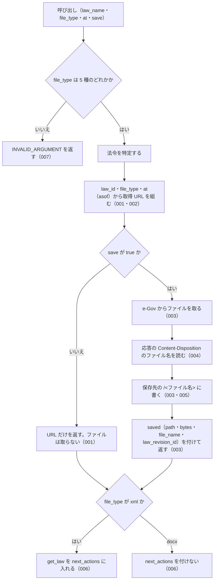

# 機能: get_law_file（法令本文を 1 つのファイルで取る URL を返し、求められたら保存する）

- 機能 ID: EGOV
- 種類: ツール
- 版: current
- 承認日: 2026-09-28（PR #50）。差分 `20260928-undecided-to-issues` は 2026-09-28（PR #68）。差分 `20260928-untested-behaviors` は 2026-09-28（PR #PR-SPEC）
- 起こした元: v0.15.1 の `src/tools/definitions.ts`、`src/tools/handlers.ts`、`src/services/law-files.ts`、`src/services/file-store.ts`、`src/services/egov-client.ts`、`src/services/law-service.ts`（法令名の解決・管轄の確認）、`src/constants.ts`、`src/config.ts`、`src/services/law-files.test.ts`、`src/services/file-store.test.ts`
- 関連する Issue: houki-egov-mcp #19（添付ファイルと法令本文ファイル）

この文書は「このツールは何をするか」を書きます。どう実装しているか（関数名・テーブル名）は書きません。

## アクター

- MCP クライアント（Claude などの LLM、または CLI から呼ぶ人）。`law_name` と `file_type` を渡して、法令本文 1 つ分のファイル（xml / json / html / rtf / docx）を取る URL を受け取る。`save: true` を付けたときは、サーバーが保存したファイルの絶対パスと、そのファイルの法令履歴 ID を受け取る
- MCP サーバーを起動する人。環境変数 `HOUKI_EGOV_FILES_DIR` で保存先のディレクトリを決める

## 入力

| 引数        | 必須 | 内容                                                                                                  |
| ----------- | ---- | ----------------------------------------------------------------------------------------------------- |
| `law_name`  | 必須 | 法令名または略称。例: `"民法"`、`"消法"`                                                              |
| `file_type` | 必須 | ファイル種別。`xml`（法令標準 XML）/ `json`（e-Gov の JSON）/ `html` / `rtf` / `docx`（Word）のどれか |
| `at`        | 任意 | 時点。`YYYY-MM-DD` 形式。その時点以前で最新の法令履歴の本文になる                                     |
| `save`      | 任意 | `true` でファイルを取得して保存する。既定は `false`（URL だけを返し、ファイルは取らない）             |

保存先のパスは引数では指定できない。inputSchema に無い引数を渡したときの扱いは common_errors に書く。

## 処理の流れ

呼び出しを受けてから応答を返すまでに、何をどの順で確かめるかを示します。図の中の番号は「できること」の仕様 ID の末尾 3 桁です。

## できること

### SPEC-EGOV-GET-LAW-FILE-001 save を付けないときは、ファイルを取らずに URL を返す

`save` を省くか `false` にしたときは、e-Gov からファイルを取らず、次のフィールドを持つ応答を返す。`saved` は付けない。

| フィールド     | 内容                                                                                                                                                           |
| -------------- | -------------------------------------------------------------------------------------------------------------------------------------------------------------- |
| `meta`         | 法令の情報（`law_id`・`title`・`law_num`・`retrieved_at`・`url`、`at` を渡したときは `at`）                                                                    |
| `file_type`    | 渡した `file_type`                                                                                                                                             |
| `content_type` | 種別から決めた Content-Type。`docx` は `application/vnd.openxmlformats-officedocument.wordprocessingml.document`                                               |
| `url`          | 認証なしで開ける取得 URL。`https://laws.e-gov.go.jp/api/2/law_file/<file_type>/<law_id>`（例: `https://laws.e-gov.go.jp/api/2/law_file/docx/129AC0000000089`） |
| `note`         | 説明                                                                                                                                                           |

### SPEC-EGOV-GET-LAW-FILE-002 時点（at）は URL の asof になる

`at` を渡したときは、取得 URL に `asof=<at>` を付ける（例: `https://laws.e-gov.go.jp/api/2/law_file/html/129AC0000000089?asof=2020-04-01`）。`meta.at` は渡した `at` になる。

### SPEC-EGOV-GET-LAW-FILE-003 save: true でファイルを取得し、法令履歴 ID の名前で保存する

`save: true` のときは、e-Gov から法令本文のファイルを取得し、e-Gov の応答の Content-Disposition にあるファイル名（`<law_revision_id>.<拡張子>` の形）で保存して、応答に `saved` を付ける。

- `saved.file_name`: Content-Disposition のファイル名。例: `129AC0000000089_20260624_508AC0000000045.xml`
- `saved.law_revision_id`: ファイル名の拡張子より前。例: `129AC0000000089_20260624_508AC0000000045`
- `saved.path`: 書いたファイルの絶対パス。`<保存先のディレクトリ>/<law_revision_id>/<ファイル名>`。環境変数 `HOUKI_EGOV_FILES_DIR` があれば、それを保存先のディレクトリにする
- `saved.bytes`: 書いたバイト数

### SPEC-EGOV-GET-LAW-FILE-004 Content-Disposition のファイル名の読み方

`saved.file_name` は、Content-Disposition の `filename="…"` の中身を使う（例: `attachment; filename="129AC0000000089_20260624_508AC0000000045.docx"` → `129AC0000000089_20260624_508AC0000000045.docx`）。`filename*=UTF-8''…` の形は URL デコードする（`a%20b.pdf` → `a b.pdf`）。Content-Disposition が無いときや `filename` を含まないとき（例: `inline`）は `null` になる。

### SPEC-EGOV-GET-LAW-FILE-005 保存するファイル名にはディレクトリの部分を残さない

保存するファイル名とディレクトリ名は、パスの区切り（`/` と `\`）より前を捨てて末尾の名前だけにし、先頭の `.` を除き、英数字・`_`・`.`・`-`・かな・漢字以外の文字を `_` にする。何も残らなければ `file` にする。例: `../../etc/passwd` → `passwd`、`..\..\x.pdf` → `x.pdf`、`...` → `file`、`a b/c:d.pdf` → `c_d.pdf`。保存先のディレクトリの外には書かない。

### SPEC-EGOV-GET-LAW-FILE-006 xml では条文を読む get_law を案内する

`file_type` が `xml` のときは、`next_actions` の先頭に `get_law` を入れる（xml は法令全体の大きなファイルで、条文を読むだけなら `get_law` / `get_law_range` のほうが小さく済むため）。`docx` のときは `next_actions` を付けない。

### SPEC-EGOV-GET-LAW-FILE-007 file_type は 5 種のどれかでなければならない

`file_type` の inputSchema は `enum: ["xml", "json", "html", "rtf", "docx"]` で、これ以外の値（例: `txt`）は受け付けない。ツールの処理でも、`file_type` がこの 5 種のどれでもないときは、エラー `INVALID_ARGUMENT` を返す（`hint` に 5 種を書く）。

### SPEC-EGOV-GET-LAW-FILE-008 save なしでは、e-Gov への問い合わせは法令名の解決だけ

`save` を省くか `false` にしたときは、e-Gov には法令名の解決のための法令検索だけを問い合わせる。法令本文（`/law_data`）・改正履歴（`/law_revisions`）・法令本文のファイル（`/law_file`）は問い合わせない。`at` を渡したときも同じ。

例: `{ law_name: "民法", file_type: "xml", at: "2020-04-01" }` → e-Gov への問い合わせは法令検索（`law_title: "民法"`）の 1 回だけで、応答の `url` は `https://laws.e-gov.go.jp/api/2/law_file/xml/129AC0000000089?asof=2020-04-01`。

### SPEC-EGOV-GET-LAW-FILE-009 json でも get_law を案内し、html・rtf では案内しない

`file_type` が `xml` か `json` のときは、`next_actions` に `get_law` の 1 件を入れる。`example` は `{ law_name: <渡した law_name>, article: "1" }`。`html`・`rtf`・`docx` のときは `next_actions` を付けない。`save` の有無は問わない。

例:
- `{ law_name: "民法", file_type: "json" }` → `next_actions: [{ action: "get_law", reason: …, example: { law_name: "民法", article: "1" } }]`、`content_type: "application/json"`
- `{ law_name: "民法", file_type: "html" }` → `next_actions` は付かない（`content_type: "text/html"`）
- `{ law_name: "民法", file_type: "rtf", save: true }` → `next_actions` は付かない（`content_type: "application/rtf"`）

### SPEC-EGOV-GET-LAW-FILE-010 save なしの note は、どの時点の履歴かと保存先のディレクトリを書く

`save` を付けないときの `note` は、`<meta.title> の本文を <file_type> で取る URL です。認証なしで開けます（<時点の説明>）。ファイルをディスクに置くには save: true を付けてください（<保存先のディレクトリ> 以下に保存します）。` になる。

- `<時点の説明>` は、`at` を渡したとき `時点 <at> 以前で最新の履歴`、渡さないとき `現時点で最新の履歴`
- `<保存先のディレクトリ>` は、SPEC-EGOV-GET-LAW-FILE-003 の保存先のディレクトリ（法令履歴 ID のディレクトリより上）

例: `HOUKI_EGOV_FILES_DIR=/tmp/glf-files`、`{ law_name: "民法", file_type: "xml", at: "2020-04-01" }` → `民法 の本文を xml で取る URL です。認証なしで開けます（時点 2020-04-01 以前で最新の履歴）。ファイルをディスクに置くには save: true を付けてください（/tmp/glf-files 以下に保存します）。`

### SPEC-EGOV-GET-LAW-FILE-011 保存したときの note

`save: true` で保存したときの `note` は、`<saved.file_name>（<サイズ>）を <saved.path> に保存しました。` になる。`<サイズ>` は、1024 バイト未満なら `<バイト数> B`、1 MiB 未満なら KiB を小数 1 桁にした `<n> KB`、それ以上は MiB を小数 1 桁にした `<n> MB`。

例: Content-Disposition のファイル名が `129AC0000000089_20260624_508AC0000000045.docx` で 3 バイト → `129AC0000000089_20260624_508AC0000000045.docx（3 B）を <保存先のディレクトリ>/129AC0000000089_20260624_508AC0000000045/129AC0000000089_20260624_508AC0000000045.docx に保存しました。`

### SPEC-EGOV-GET-LAW-FILE-012 特定できない法令と管轄外の資料はエラーにする

- 法令名が略称辞書で別の MCP サーバーの管轄の資料（例: `所基通` = 所得税基本通達）に当たるときは、エラー `OUT_OF_SCOPE` を返す。`next_actions` は `delegate_to_mcp`（`example` は `{ mcp: "houki-nta" }`）
- 法令名から法令を特定できないときは、エラー `LAW_NOT_FOUND` を返す。`next_actions` は `resolve_abbreviation`（`example` は `{ abbr: <law_name> }`）と `search_law`（`example` は `{ keyword: <law_name> }`）

どちらも `save: true` でも、e-Gov から法令本文のファイルを取らない。

例: `{ law_name: "所基通", file_type: "xml" }` → `OUT_OF_SCOPE`。`{ law_name: "無い法", file_type: "xml", save: true }`（法令検索で 0 件）→ `LAW_NOT_FOUND`。

### SPEC-EGOV-GET-LAW-FILE-013 file_type の検査は、法令の特定より先に行う

`file_type` が 5 種のどれでもないときは、法令名が管轄外の資料でも特定できない法令でも、SPEC-EGOV-GET-LAW-FILE-007 の `INVALID_ARGUMENT` を返す。このとき e-Gov には何も問い合わせない（法令検索もしない）。

例: `{ law_name: "所基通", file_type: "txt" }` → `INVALID_ARGUMENT`（`OUT_OF_SCOPE` ではない）。`{ law_name: "無い法", file_type: "txt" }` → `INVALID_ARGUMENT`（`LAW_NOT_FOUND` ではない）で、e-Gov への問い合わせは 0 回。

### SPEC-EGOV-GET-LAW-FILE-014 ファイルの取得に失敗したときの code

`save: true` の取得（`https://laws.e-gov.go.jp/api/2/law_file/<file_type>/<law_id>`）が失敗したときは、次のエラーを返す。どれも `detail.url` に取得した URL（`at` があれば `?asof=<at>` 付き）を入れる。

| e-Gov の応答                        | `code`                | `retryable` | そのほか                           |
| ----------------------------------- | --------------------- | ----------- | ---------------------------------- |
| 429                                 | `SOURCE_RATE_LIMITED` | `true`      | `detail.status: 429`               |
| 時間切れ                            | `SOURCE_TIMEOUT`      | `true`      | `detail.status` は付かない         |
| 5xx（例: 502）                      | `SOURCE_API_ERROR`    | `true`      | `detail.status` に HTTP ステータス |
| 429 以外の 4xx（例: 400・404）      | `SOURCE_API_ERROR`    | `false`     | `detail.status` に HTTP ステータス |

例: `{ law_name: "民法", file_type: "xml", at: "2020-04-01", save: true }` で e-Gov が 404 を返す → `{ code: "SOURCE_API_ERROR", retryable: false, detail: { status: 404, url: "https://laws.e-gov.go.jp/api/2/law_file/xml/129AC0000000089?asof=2020-04-01" } }`。

### SPEC-EGOV-GET-LAW-FILE-015 429・5xx・ネットワークの失敗は取り直してから返す

`save: true` の取得で e-Gov が 429 か 5xx を返したとき、または応答が来ないネットワークの失敗のときは、最大 3 回取り直す（最初の 1 回と合わせて最大 4 回）。途中で成功すれば保存して成功応答を返す。4 回とも失敗したときは SPEC-EGOV-GET-LAW-FILE-014 の code を返す。

時間切れと、429 以外の 4xx は取り直さない（e-Gov への問い合わせは 1 回）。

例:
- 4 回とも 502 → e-Gov への問い合わせは 4 回で、`SOURCE_API_ERROR`（`retryable: true`、`detail.status: 502`）
- 400 → 問い合わせは 1 回

### SPEC-EGOV-GET-LAW-FILE-016 環境変数が無いときの保存先

`HOUKI_EGOV_FILES_DIR` が無いか空文字のときは、保存先のディレクトリを `<XDG_CACHE_HOME>/houki-egov-mcp/files` にする。`XDG_CACHE_HOME` も無いか空文字のときは `<ホームディレクトリ>/.cache/houki-egov-mcp/files` にする。SPEC-EGOV-GET-LAW-FILE-010 の `note` に書く保存先のディレクトリも同じ。

例:
- `HOUKI_EGOV_FILES_DIR` 無し、`XDG_CACHE_HOME=/tmp/xdg` → `saved.path` は `/tmp/xdg/houki-egov-mcp/files/129AC0000000089_20260624_508AC0000000045/129AC0000000089_20260624_508AC0000000045.docx`
- どちらも無く、ホームディレクトリが `/tmp/home` → `saved.path` は `/tmp/home/.cache/houki-egov-mcp/files/<law_revision_id>/<ファイル名>`、`save` なしの `note` は `（/tmp/home/.cache/houki-egov-mcp/files 以下に保存します）` を含む

### SPEC-EGOV-GET-LAW-FILE-017 同じファイルを保存すると上書きする

同じ名前のファイル（同じ `saved.law_revision_id` と `saved.file_name`）を `save: true` でもう一度保存すると、前のファイルを新しい中身で上書きし、エラーにしない。`saved.path` は前と同じで、`saved.bytes` は新しい中身のバイト数になる。

例: 中身 `ONE`（3 バイト）で `129AC0000000089_20260624_508AC0000000045.docx` を保存したあと、中身 `TWO!`（4 バイト）で同じファイル名を保存 → 2 回目の `saved.bytes` は `4`、ファイルの中身は `TWO!`。

## できないこと

- ファイルの中身（バイト列や base64）を応答に入れること
- 保存先のパスやファイル名を引数で決めること（決めるのはサーバーを起動する人の環境変数だけ）
- 条・項を選んで一部だけのファイルを取ること（ファイルは法令全体。一部を読むのは `get_law` / `get_law_range`）
- `save` なしで、その URL がどの法令履歴の本文を返すかを知らせること（`saved.law_revision_id` は保存したときだけ）
- 添付ファイル（別表・様式の図）を取ること（`list_attachments` / `get_attachment`）

## 未決

初版起こしで見つけた、意図か不具合かを人が決める項目です。決まったら「できること」に ID を振るか、`specs/changes/` の差分にします。

意図か不具合かの判断が要る項目は houki-egov-mcp の Issue に移し、ここには題と Issue の番号だけを残します。今の振る舞いのままでよくテストが無いだけの項目は、受入テストを書いてから「できること」に ID を振ります。

1. **Content-Disposition が無いと、`saved.law_revision_id` に法令 ID が入る。** → houki-egov-mcp #66
2. **50 MB を超えるファイルを `INVALID_ARGUMENT` で返す。** → houki-egov-mcp #49
3. **e-Gov の法令検索が失敗したときも `LAW_NOT_FOUND` を返す。** → houki-egov-mcp #46
4. **`at` の形を確かめない。** → houki-egov-mcp #47
5. **テスト名「/law_data は引かない」と、テストが確かめていること。** → SPEC-EGOV-GET-LAW-FILE-008
6. **json・html・rtf の `next_actions`。** → SPEC-EGOV-GET-LAW-FILE-009
7. **`save` なしの `note` の中身。** → SPEC-EGOV-GET-LAW-FILE-010・SPEC-EGOV-GET-LAW-FILE-011
8. **特定できない法令と管轄外の資料。** → SPEC-EGOV-GET-LAW-FILE-012・SPEC-EGOV-GET-LAW-FILE-013
9. **e-Gov からの取得に失敗したときの code。** → SPEC-EGOV-GET-LAW-FILE-014・SPEC-EGOV-GET-LAW-FILE-015
10. **既定の保存先と、同じファイルの上書き。** → SPEC-EGOV-GET-LAW-FILE-016・SPEC-EGOV-GET-LAW-FILE-017
11. **Content-Disposition に `filename` と `filename*` の両方があるとき。** → houki-egov-mcp #66
