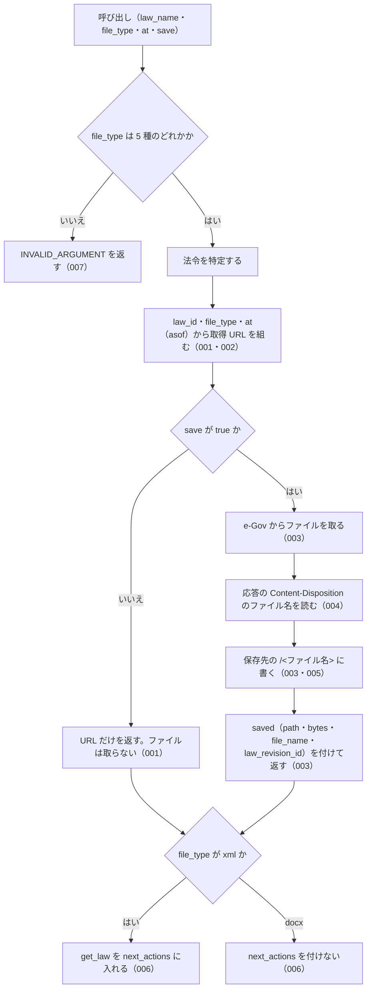

# 機能: get_law_file（法令本文を 1 つのファイルで取る URL を返し、求められたら保存する）

- 機能 ID: EGOV
- 種類: ツール
- 版: current
- 承認日: 2026-09-28（PR #50）
- 起こした元: v0.15.1 の `src/tools/definitions.ts`、`src/tools/handlers.ts`、`src/services/law-files.ts`、`src/services/file-store.ts`、`src/services/egov-client.ts`、`src/services/law-service.ts`（法令名の解決・管轄の確認）、`src/constants.ts`、`src/config.ts`、`src/services/law-files.test.ts`、`src/services/file-store.test.ts`
- 関連する Issue: houki-egov-mcp #19（添付ファイルと法令本文ファイル）

この文書は「このツールは何をするか」を書きます。どう実装しているか（関数名・テーブル名）は書きません。

## アクター

- MCP クライアント（Claude などの LLM、または CLI から呼ぶ人）。`law_name` と `file_type` を渡して、法令本文 1 つ分のファイル（xml / json / html / rtf / docx）を取る URL を受け取る。`save: true` を付けたときは、サーバーが保存したファイルの絶対パスと、そのファイルの法令履歴 ID を受け取る
- MCP サーバーを起動する人。環境変数 `HOUKI_EGOV_FILES_DIR` で保存先のディレクトリを決める

## 入力

| 引数        | 必須 | 内容                                                                                                  |
| ----------- | ---- | ----------------------------------------------------------------------------------------------------- |
| `law_name`  | 必須 | 法令名または略称。例: `"民法"`、`"消法"`                                                              |
| `file_type` | 必須 | ファイル種別。`xml`（法令標準 XML）/ `json`（e-Gov の JSON）/ `html` / `rtf` / `docx`（Word）のどれか |
| `at`        | 任意 | 時点。`YYYY-MM-DD` 形式。その時点以前で最新の法令履歴の本文になる                                     |
| `save`      | 任意 | `true` でファイルを取得して保存する。既定は `false`（URL だけを返し、ファイルは取らない）             |

保存先のパスは引数では指定できない。inputSchema に無い引数を渡したときの扱いは common_errors に書く。

## 処理の流れ

呼び出しを受けてから応答を返すまでに、何をどの順で確かめるかを示します。図の中の番号は「できること」の仕様 ID の末尾 3 桁です。

## できること

### SPEC-EGOV-GET-LAW-FILE-001 save を付けないときは、ファイルを取らずに URL を返す

`save` を省くか `false` にしたときは、e-Gov からファイルを取らず、次のフィールドを持つ応答を返す。`saved` は付けない。

| フィールド     | 内容                                                                                                                                                           |
| -------------- | -------------------------------------------------------------------------------------------------------------------------------------------------------------- |
| `meta`         | 法令の情報（`law_id`・`title`・`law_num`・`retrieved_at`・`url`、`at` を渡したときは `at`）                                                                    |
| `file_type`    | 渡した `file_type`                                                                                                                                             |
| `content_type` | 種別から決めた Content-Type。`docx` は `application/vnd.openxmlformats-officedocument.wordprocessingml.document`                                               |
| `url`          | 認証なしで開ける取得 URL。`https://laws.e-gov.go.jp/api/2/law_file/<file_type>/<law_id>`（例: `https://laws.e-gov.go.jp/api/2/law_file/docx/129AC0000000089`） |
| `note`         | 説明                                                                                                                                                           |

### SPEC-EGOV-GET-LAW-FILE-002 時点（at）は URL の asof になる

`at` を渡したときは、取得 URL に `asof=<at>` を付ける（例: `https://laws.e-gov.go.jp/api/2/law_file/html/129AC0000000089?asof=2020-04-01`）。`meta.at` は渡した `at` になる。

### SPEC-EGOV-GET-LAW-FILE-003 save: true でファイルを取得し、法令履歴 ID の名前で保存する

`save: true` のときは、e-Gov から法令本文のファイルを取得し、e-Gov の応答の Content-Disposition にあるファイル名（`<law_revision_id>.<拡張子>` の形）で保存して、応答に `saved` を付ける。

- `saved.file_name`: Content-Disposition のファイル名。例: `129AC0000000089_20260624_508AC0000000045.xml`
- `saved.law_revision_id`: ファイル名の拡張子より前。例: `129AC0000000089_20260624_508AC0000000045`
- `saved.path`: 書いたファイルの絶対パス。`<保存先のディレクトリ>/<law_revision_id>/<ファイル名>`。環境変数 `HOUKI_EGOV_FILES_DIR` があれば、それを保存先のディレクトリにする
- `saved.bytes`: 書いたバイト数

### SPEC-EGOV-GET-LAW-FILE-004 Content-Disposition のファイル名の読み方

`saved.file_name` は、Content-Disposition の `filename="…"` の中身を使う（例: `attachment; filename="129AC0000000089_20260624_508AC0000000045.docx"` → `129AC0000000089_20260624_508AC0000000045.docx`）。`filename*=UTF-8''…` の形は URL デコードする（`a%20b.pdf` → `a b.pdf`）。Content-Disposition が無いときや `filename` を含まないとき（例: `inline`）は `null` になる。

### SPEC-EGOV-GET-LAW-FILE-005 保存するファイル名にはディレクトリの部分を残さない

保存するファイル名とディレクトリ名は、パスの区切り（`/` と `\`）より前を捨てて末尾の名前だけにし、先頭の `.` を除き、英数字・`_`・`.`・`-`・かな・漢字以外の文字を `_` にする。何も残らなければ `file` にする。例: `../../etc/passwd` → `passwd`、`..\..\x.pdf` → `x.pdf`、`...` → `file`、`a b/c:d.pdf` → `c_d.pdf`。保存先のディレクトリの外には書かない。

### SPEC-EGOV-GET-LAW-FILE-006 xml では条文を読む get_law を案内する

`file_type` が `xml` のときは、`next_actions` の先頭に `get_law` を入れる（xml は法令全体の大きなファイルで、条文を読むだけなら `get_law` / `get_law_range` のほうが小さく済むため）。`docx` のときは `next_actions` を付けない。

### SPEC-EGOV-GET-LAW-FILE-007 file_type は 5 種のどれかでなければならない

`file_type` の inputSchema は `enum: ["xml", "json", "html", "rtf", "docx"]` で、これ以外の値（例: `txt`）は受け付けない。ツールの処理でも、`file_type` がこの 5 種のどれでもないときは、エラー `INVALID_ARGUMENT` を返す（`hint` に 5 種を書く）。

## できないこと

- ファイルの中身（バイト列や base64）を応答に入れること
- 保存先のパスやファイル名を引数で決めること（決めるのはサーバーを起動する人の環境変数だけ）
- 条・項を選んで一部だけのファイルを取ること（ファイルは法令全体。一部を読むのは `get_law` / `get_law_range`）
- `save` なしで、その URL がどの法令履歴の本文を返すかを知らせること（`saved.law_revision_id` は保存したときだけ）
- 添付ファイル（別表・様式の図）を取ること（`list_attachments` / `get_attachment`）

## 未決

初版起こしで見つけた、意図か不具合かを人が決める項目です。決まったら「できること」に ID を振るか、`specs/changes/` の差分にします。

意図か不具合かの判断が要る項目は houki-egov-mcp の Issue に移し、ここには題と Issue の番号だけを残します。今の振る舞いのままでよくテストが無いだけの項目は、受入テストを書いてから「できること」に ID を振ります。

1. **Content-Disposition が無いと、`saved.law_revision_id` に法令 ID が入る。** e-Gov の応答に Content-Disposition のファイル名が無いときは、`<law_id>.<file_type>` の名前で保存する。このとき `saved.file_name` は `null` だが、`saved.law_revision_id` にはこの名前の拡張子より前、つまり法令 ID（例: `129AC0000000089`）が入り、保存先のディレクトリも法令 ID の名前になる。inputSchema の説明と応答の型の説明は `law_revision_id` を法令履歴 ID としている。この場合に `law_revision_id` を `null` にするかを決める必要がある。テストも無い。
2. **50 MB を超えるファイルを `INVALID_ARGUMENT` で返す。** 取得したファイルが 50 MB を超えると保存せず、エラー `INVALID_ARGUMENT`（`hint` は保存せず `url` を使う案内、`detail.url`）を返す。呼び出し側の引数は正しく、大きさは取得してみるまで分からない。上限を確かめるのはファイルを全部取得した後である。この場面の code を何にするかと、取得の前か途中で打ち切るかを決める必要がある。テストも無い。
3. **e-Gov の法令検索が失敗したときも `LAW_NOT_FOUND` を返す。** 法令名を e-Gov の法令検索で特定する段で、ネットワークの失敗や e-Gov の 5xx が起きても、`LAW_NOT_FOUND`（`retryable` なし）を返す。呼び出し側は表記の誤りと一時的な障害を見分けられない。検索の失敗を `SOURCE_API_ERROR` などにして `retryable` を付けるかを決める必要がある。
4. **`at` の形を確かめない。** `at` は形を確かめずに `asof` として URL に入れる。`save` なしでは e-Gov に問い合わせないので、形が違う値でも成功応答の URL が返り、開いたときに初めて失敗が分かる。`at` の形をこのサーバーで確かめて `INVALID_ARGUMENT` にするかを決める必要がある。
5. **テスト名「/law_data は引かない」と、テストが確かめていること。** テスト `save なしは URL だけ。/law_data は引かない` は、法令本文ファイルの取得を呼んでいないことだけを確かめ、法令本文（`/law_data`）を引いていないことは確かめていない。実装は `save` なしのとき法令名の解決（e-Gov の法令検索）だけを行う。テストが無い。ID を振るのは受入テストを書いてから。
6. **json・html・rtf の `next_actions`。** `json` のときも `xml` と同じく `get_law`（`example` は `{ law_name, article: "1" }`）を入れ、`html`・`rtf` のときは付けない。テストは `xml` と `docx` だけを確かめている。テストが無い。ID を振るのは受入テストを書いてから。
7. **`save` なしの `note` の中身。** 時点を渡したときは「時点 <at> 以前で最新の履歴」、渡さないときは「現時点で最新の履歴」の URL である旨と、保存先のディレクトリを書く。保存したときは「<ファイル名>（<サイズ>）を <パス> に保存しました。」。テストが無い。ID を振るのは受入テストを書いてから。
8. **特定できない法令と管轄外の資料。** 法令名から法令を特定できないときは `LAW_NOT_FOUND`、略称辞書で別の MCP サーバーの管轄の資料に当たるときは `OUT_OF_SCOPE` を返す。`file_type` の検査はこれより先に行う。このツールで確かめるテストが無い。テストが無い。ID を振るのは受入テストを書いてから。
9. **e-Gov からの取得に失敗したときの code。** 429 は `SOURCE_RATE_LIMITED`、時間切れは `SOURCE_TIMEOUT`、5xx は `SOURCE_API_ERROR`（`retryable: true`）、それ以外の 4xx は `SOURCE_API_ERROR`（`retryable: false`）を返す。429 と 5xx とネットワークの失敗は、返す前に取り直す。テストが無い。ID を振るのは受入テストを書いてから。
10. **既定の保存先と、同じファイルの上書き。** `HOUKI_EGOV_FILES_DIR` が無いときの保存先は `${XDG_CACHE_HOME}/houki-egov-mcp/files`（`XDG_CACHE_HOME` が無ければ `~/.cache/houki-egov-mcp/files`）。同じ名前のファイルを保存すると上書きする。テストが無い。ID を振るのは受入テストを書いてから。
11. **Content-Disposition に `filename` と `filename*` の両方があるとき。** ヘッダーの先に書かれたほうを使う（RFC 6266 は `filename*` を優先するよう勧めている）。e-Gov は `filename` だけを返す（2026-09-20 の実測）。どちらを優先するかを決める必要がある。テストも無い。
