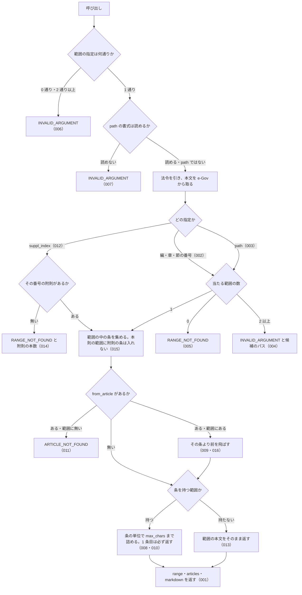

# 機能: get_law_range（編・章・節、または附則 1 本を範囲にして、条を本文ごと返す）

- 機能 ID: EGOV
- 種類: ツール
- 版: current
- 承認日:
- 起こした元: v0.15.1 の `src/tools/definitions.ts`（`get_law_range`）、`src/tools/handlers.ts`、`src/services/law-service.ts`、`src/services/law-tree.ts`、`src/formatters/markdown.ts`、`src/utils/article-num.ts`、`src/constants.ts`、`src/services/law-service.range.test.ts`、`src/services/law-tree.test.ts`、`src/utils/article-num.test.ts`
- 関連する Issue: houki-egov-mcp #22（章・節単位の分割取得）

この文書は「このツールは何をするか」を書きます。どう実装しているか（関数名・テーブル名）は書きません。

## アクター

- MCP クライアント（Claude などの LLM、または CLI から呼ぶ人）。`law_name` と範囲（編・章・節の番号、`get_toc` の `path`、または附則の番号）を渡して、その範囲の条の本文を受け取る。範囲が長くて打ち切られたときは、応答の `next_from_article` を `from_article` に渡して続きを取る

## 入力

範囲の指定は「編・章・節・款・目の番号」「`path`」「`suppl_index`」の 3 通りで、1 回の呼び出しで使えるのはどれか 1 つだけ。

| 引数 | 必須 | 内容 |
|---|---|---|
| `law_name` | 必須 | 法令名または略称。例: `民法`、`会社法`、`消法` |
| `part` | 任意 | 編の番号。`3` / `"3"` / `"三"` / `"第三編"` / 枝番号 `"2の2"` |
| `chapter` | 任意 | 章の番号（書き方は `part` と同じ）。章の番号は編ごとに振り直されるので、編を持つ法令では `part` も渡す |
| `section` | 任意 | 節の番号 |
| `subsection` | 任意 | 款の番号 |
| `division` | 任意 | 目の番号 |
| `path` | 任意 | 範囲のパス。`get_toc` の `toc[].path` をそのまま渡せる。例: `"Part3/Chapter2"` |
| `suppl_index` | 任意 | 附則の番号（1 始まり）。`get_toc` の `suppl_provisions[].index` と同じ |
| `from_article` | 任意 | 範囲の中のこの条から返す。前の応答の `next_from_article` を渡す。例: `"561"`、`"548の4"`、`"第五百六十一条"` |
| `max_chars` | 任意 | 返す条本文の文字数の上限。既定 30,000、2,000〜120,000 |
| `at` | 任意 | 時点指定（`YYYY-MM-DD`） |

## 処理の流れ

呼び出しを受けてから応答を返すまでに、何をどの順で確かめるかを示します。図の中の番号は「できること」の仕様 ID の末尾 3 桁です。

## できること

### SPEC-EGOV-GET-LAW-RANGE-001 指定した範囲の条を本文ごと返し、範囲の内訳を `range` に入れる

指定した範囲の中の条だけを返す。応答は次のフィールドを持つ。

| フィールド | 内容 |
|---|---|
| `range.path` | 本則の範囲のパス（例: `Part1/Chapter1`）。編・章・節の番号で指定したときも付く |
| `range.tag` | 範囲の種類。`Part` / `Chapter` / `Section` / `Subsection` / `Division`、附則は `SupplProvision` |
| `range.titles` | 範囲の見出しの連なり（上位から）。例: `["第一編　総則", "第一章　通則"]` |
| `range.article_count` | 範囲が持つ条の数 |
| `range.returned_count` | 本文を返した条の数 |
| `range.truncated` | 文字数の上限で打ち切ったか |
| `articles` | 返した条の一覧。要素は `num`（e-Gov の条番号。例: `"1"`）・`label`（表示用。例: `第1条`）・`caption`（条見出し。例: `（趣旨）`） |
| `markdown` | 見出し `# <法令名> <範囲の見出し…>` と、条ごとの `## 第N条` の節 |

例: `part: 1, chapter: 1` では、第一編第一章の第1条・第2条だけを返し、`range.path` は `Part1/Chapter1`、`range.tag` は `Chapter`、`range.article_count` と `range.returned_count` は 2、`markdown` の見出しは `# テスト法 第一編　総則 第一章　通則` で、第一編第二章の `## 第3条` は含まない。

### SPEC-EGOV-GET-LAW-RANGE-002 編・章・節の番号はいくつかの書き方で受ける

`part` / `chapter` / `section` / `subsection` / `division` は、数値、算用数字の文字列、全角数字、漢数字、「第三編」「第十二章」のような書き方、枝番号（`"2の2"`、`"第二章の二"`、`"第一節の二"`）のどれでも受け、同じ範囲を指す。上位の階層は省いてよく、省いた階層では絞り込まない。

例: `part: "第二編", chapter: "二"` は `part: 2, chapter: 2` と同じ `Part2/Chapter2` を指す。`part: 2, chapter: 2, section: "2の2"` は第二節の二（`Part2/Chapter2/Section2_2`、`range.tag` は `Section`）を指す。

### SPEC-EGOV-GET-LAW-RANGE-003 `path` で範囲を指す

`path` には `get_toc` が返す `toc[].path` をそのまま渡せる。タグの綴りの大文字と小文字は問わない（`part3/chapter2` は `Part3/Chapter2` と同じ）。枝番号は `Chapter4_2` の形で書く。`path` は法令の根からの完全一致で探す。上位を省いたパス（`Chapter2`）や、無い番号を含むパスは範囲に当たらない。

例: `get_toc` の `Part2/Chapter2` を渡すと、`range.path` が `Part2/Chapter2`、`range.titles` が `["第二編　物権", "第二章　占有権"]` の範囲を返す。

### SPEC-EGOV-GET-LAW-RANGE-004 上位を省いた指定が複数の範囲に当たるときは、候補のパスを返す

編・章・節の番号の指定が 2 か所以上の範囲に当たるとき（章の番号は編ごとに振り直されるため、`part` を省いた `chapter` は複数の編の章に当たる）は、エラー `INVALID_ARGUMENT` を返す。`error` に当たった数（`N か所`）を、`hint` に当たった範囲のパスを書き、`next_actions` に候補ごとの `get_law_range` の呼び出し例（`example.path` に候補のパス）を入れる。

例: 第一編と第二編の両方に第二章がある法令で `chapter: 2` だけを渡すと、`error` に `2 か所` を含み、`next_actions` の `example.path` は `["Part1/Chapter2", "Part2/Chapter2"]`。

### SPEC-EGOV-GET-LAW-RANGE-005 範囲が無いときは RANGE_NOT_FOUND を返す

編・章・節の番号または `path` に当たる範囲が無いときは、エラー `RANGE_NOT_FOUND` を返す。`next_actions` の先頭は `get_toc`（目次で番号とパスを確かめる案内）。

例: 第九編の無い法令で `part: 9` を渡すと `RANGE_NOT_FOUND`。

### SPEC-EGOV-GET-LAW-RANGE-006 範囲の指定が無いとき、2 通り以上を同時に指定したときはエラーにする

「編・章・節・款・目の番号」「`path`」「`suppl_index`」のどれも渡さないときは、エラー `INVALID_ARGUMENT`（`error` は `範囲を指定してください`）を返す。2 通り以上を同時に渡したときも、エラー `INVALID_ARGUMENT`（`error` に `1 通りにしてください` と、同時に渡された指定の種類）を返す。

例: `path: "Part1", chapter: 1` は `INVALID_ARGUMENT`。

### SPEC-EGOV-GET-LAW-RANGE-007 読めない `path` はエラーにする

`path` が「タグ名 + 番号」を `/` でつないだ形でないとき（編・章・節・款・目以外のタグ、番号の無い区切り、日本語の表記、空文字）は、エラー `INVALID_ARGUMENT`（`error` に `path の形式が不正です`）を返す。

例: `path: "第一編/第一章"`、`"Book3"`、`"Part"` はどれも `INVALID_ARGUMENT`。

### SPEC-EGOV-GET-LAW-RANGE-008 文字数の上限を超える範囲は条の単位で打ち切り、続きの条番号を返す

返す条本文の文字数（条ごとの見出しを含む）が `max_chars` を超える手前で、条の単位で打ち切る。条の途中では切らない。打ち切ったときは次を返す。

| フィールド | 内容 |
|---|---|
| `range.truncated` | `true` |
| `range.next_from_article` | 続きの最初の条番号。`from_article` にそのまま渡せる |
| `range.first_article` / `range.last_article` | 返した最初と最後の条（例: `第5条` / `第6条`） |
| `range.body_chars` | 返した条本文の文字数（`max_chars` 以下） |
| `range.note` | 何件のうち何件を返したかと、`from_article: "<続きの条番号>"` を付けて呼び直す案内 |
| `range.next_actions` | `get_law_range` の呼び出し例。`reason` は `同じ範囲の続きの条から取れます`、`example` は `law_name`・範囲の `path`（附則なら `suppl_index`）・`from_article` |

`markdown` の末尾にも同じ `note`（`上限で打ち切りました` を含む）を書く。

例: 本文 900・900・2,500 文字の 3 条を持つ節を `max_chars: 2000` で取ると、2 条を返して `truncated: true`、`next_from_article: "7"`、`next_actions[0].example` は `{ law_name, path: "Part2/Chapter2/Section1", from_article: "7" }`。

### SPEC-EGOV-GET-LAW-RANGE-009 `from_article` から続きを返す

`from_article` を渡したとき、範囲の中のその条から返し、それより前の条は返さない。飛ばした条の数を `range.skipped_count` に入れ、`range.note` に `先頭の N 件は from_article より前` のため返していないことを書く。

例: 第5条・第6条・第7条の節に `from_article: "7"` を渡すと、`articles` は第7条だけで、`skipped_count: 2`、`returned_count: 1`。

### SPEC-EGOV-GET-LAW-RANGE-010 1 条だけで上限を超えるときも、その 1 条は返す

返す最初の条が 1 条だけで `max_chars` を超えるときも、その条は返す（空の応答を返さない）。このとき `range.body_chars` は `max_chars` を超える。その 1 条で範囲が終わるなら `truncated` は `false`。

例: 本文 2,500 文字の第7条から `max_chars: 2000` で取ると、第7条を返し、`body_chars` は 2,000 を超え、`truncated: false`。

### SPEC-EGOV-GET-LAW-RANGE-011 範囲に無い条を `from_article` に渡すと ARTICLE_NOT_FOUND を返す

`from_article` の条が範囲の中に無いときは、エラー `ARTICLE_NOT_FOUND` を返す。`hint` に、その範囲が何条から始まるかと、`from_article` には前回の応答の `next_from_article` を渡すよう書く。

例: 第1条・第2条の章に `from_article: "999"` を渡すと `ARTICLE_NOT_FOUND` で、`hint` に `第1条` を含む。

### SPEC-EGOV-GET-LAW-RANGE-012 `suppl_index` で附則 1 本を範囲にする

`suppl_index` を渡したとき、法令の附則を出現順に数えたその番号の附則 1 本を範囲にして、その中の条を返す。`range.suppl_index` にその番号を入れ、`range.path` は付けない。`range.tag` は `SupplProvision`、`range.titles` は `附則(<番号>) <改正法の法令番号、または 制定時><抄なら（抄）>` の 1 件で、`markdown` の見出しは `# <法令名> <その見出し>`。

例: 制定時の附則（抄）を 1 本目に持つ法令で `suppl_index: 1` を渡すと、`range.titles` は `["附則(1) 制定時（抄）"]`、`articles` の条番号は `["1"]`、見出しは `# テスト法 附則(1) 制定時（抄）`。

### SPEC-EGOV-GET-LAW-RANGE-013 条を持たず項だけの附則は、本文をそのまま返す

`suppl_index` で指した附則が条を立てず項だけで書かれているときは、その附則の本文をそのまま `markdown` に入れる。`range.article_count` と `range.returned_count` は 0 で、`range.note` に `条を持たず項だけ` で書かれているため本文をそのまま返したことを書く。

例: 「この法律は、公布の日から施行する。」の 1 項だけの附則では、`markdown` にその文を含み、`article_count: 0`。

### SPEC-EGOV-GET-LAW-RANGE-014 無い附則の番号は RANGE_NOT_FOUND を返す

`suppl_index` の番号の附則が無いとき（0 や、附則の本数より大きい番号）は、エラー `RANGE_NOT_FOUND` を返す。`hint` にその法令の附則の本数（`附則は N 本`）と指定できる番号の範囲を書く（附則の無い法令では附則が無いことを書く）。

例: 附則 2 本の法令で `suppl_index: 99` を渡すと `RANGE_NOT_FOUND` で、`hint` に `附則は 2 本` を含む。

### SPEC-EGOV-GET-LAW-RANGE-015 本則の範囲には附則の条を入れない

本則の編・章・節を範囲にしたときは、その中の条を出現順に返し、附則の条は入れない（附則の条番号が本則の条番号と重なっていても入らない）。

例: 第1条〜第3条と削除条（第4条及び第5条）を持つ第一編を `max_chars: 120000` で取ると、`articles` の条番号は `["1", "2", "3", "4:5"]` で、附則の第1条は入らない。

### SPEC-EGOV-GET-LAW-RANGE-016 削除された条をまとめた条も 1 条として返し、そこから続きを取れる

削除された条をまとめた条（e-Gov の条番号が `4:5` のような範囲表記）も 1 条として扱う。表示は e-Gov の条名と同じ言い方にする（隣り合う 2 条は `第4条及び第5条`、3 条以上は `第170条から第174条まで`）。その条で打ち切ったときは `next_from_article` に範囲表記（`"4:5"`）を返し、それを `from_article` に渡すと続きを返す。`from_article` は漢数字の範囲表記（`"五百三十四:五百三十五"`）も受ける。

例: 第3条だけで上限を超える章を `max_chars: 2000` で取ると、第3条を返して `next_from_article: "4:5"`。続けて `from_article: "4:5"` で取ると、`articles[0].label` と `range.first_article` は `第4条及び第5条`、`markdown` に `## 第4条及び第5条` と `削除` を含み、`skipped_count: 1`。

## できないこと

- 条より細かい単位（項・号）で範囲を指すこと（1 条の項・号は `get_law`）
- 複数の附則や、本則と附則をまたいだ範囲を 1 回で返すこと
- 条の途中で打ち切ること（上限を超えても 1 条目は丸ごと返し、2 条目以降は条の単位で打ち切る）
- 範囲の目次だけを返すこと（目次は `get_toc`）
- `format` を選ぶこと（応答は markdown と `range`・`articles` の両方を常に返す）

## 未決

初版起こしで見つけた、意図か不具合かを人が決める項目です。決まったら「できること」に ID を振るか、`specs/changes/` の差分にします。

意図か不具合かの判断が要る項目は houki-egov-mcp の Issue に移し、ここには題と Issue の番号だけを残します。今の振る舞いのままでよくテストが無いだけの項目は、受入テストを書いてから「できること」に ID を振ります。

1. **法令が見つからないとき・管轄外の名前のとき・e-Gov が失敗したときのエラー。** 略称辞書にも e-Gov の法令検索にも無い `law_name` では `LAW_NOT_FOUND`（`next_actions` に `resolve_abbreviation` と `search_law`）、略称辞書で houki-egov 以外の管轄と分かる名前（通達名など）では `OUT_OF_SCOPE`、e-Gov の 429・タイムアウト・5xx では `SOURCE_RATE_LIMITED` / `SOURCE_TIMEOUT` / `SOURCE_API_ERROR` を返す。`get_law_range` を通したテストが無い。ID を振るのは受入テストを書いてから。
2. **読めない編・章・節の番号。** `part` などに `"総則"`・`0`・`"三〇"` のような読めない値を渡すと、e-Gov に問い合わせる前に `INVALID_ARGUMENT` を返し、`hint` に受け付ける書き方を書く。番号の読み取りの部品のテストはあるが、`get_law_range` を通したテストが無い。ID を振るのは受入テストを書いてから。
3. **読めない `from_article`。** `from_article` が条番号として読めないときは `INVALID_ARTICLE_NUM` を返す。テストが無い。ID を振るのは受入テストを書いてから。
4. **`max_chars` の既定値と範囲外の値。** 省いたときは 30,000 文字。2,000 未満や 120,000 を超える値は tools/call の inputSchema の検査で `INVALID_ARGUMENT` になる。`range.max_chars` に適用した上限を入れる。テストが無い。ID を振るのは受入テストを書いてから。
5. **款・目（`subsection` / `division`）での指定。** 番号の読み方と範囲の探し方は編・章・節と同じだが、款・目を指定したテストが無い。ID を振るのは受入テストを書いてから。
6. **`meta` と markdown の末尾。** 応答の `meta`（`law_id` / `title` / `law_num` / `retrieved_at` / `url` / `at`）と、markdown の末尾の `range.note`・出典・URL・時点・取得日時の行。`at` を渡したときの時点の条文。テストが無い。ID を振るのは受入テストを書いてから。
7. **候補が 6 か所以上に当たるとき。** SPEC-EGOV-GET-LAW-RANGE-004 で、`hint` には全部の候補のパスを書くが、`next_actions` には先頭の 5 件だけを入れる。テストが無い。ID を振るのは受入テストを書いてから。
8. **打ち切ったときの呼び出し例に `max_chars` が入らない。** SPEC-EGOV-GET-LAW-RANGE-008 の `range.next_actions[0].example` は `law_name`・`path`（または `suppl_index`）・`from_article` だけで、呼び出し側が渡した `max_chars` を含まない。例のとおりに呼び直すと既定の 30,000 文字で返り、1 回目と上限が変わる。呼び出し側が渡した `max_chars` を例に入れるか、今の形のままにするかを決める必要がある。
9. **法令名が完全一致しないとき、検索結果の先頭の法令を返す。** 略称辞書に e-Gov の法令 ID が無い `law_name` は e-Gov の法令検索（題名の部分一致）で引き、題名が完全一致する法令が無ければ先頭の 1 件の範囲を返す。求めた法令と違う法令の条文を、違うことを知らせずに返しうる。完全一致しないときは `LAW_NOT_FOUND` や候補の一覧にするか、今の動きのまま応答に知らせを付けるかを決める必要がある。
