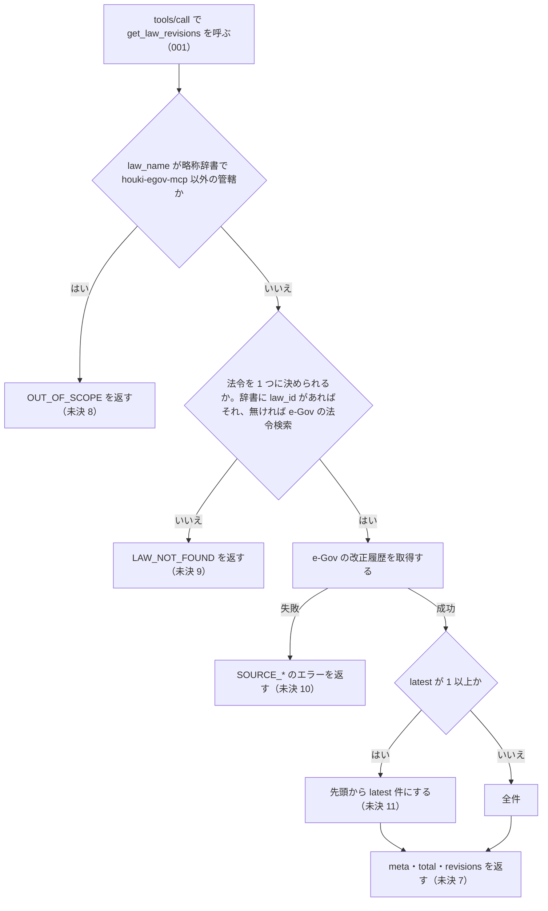

# 機能: get_law_revisions（法令の改正履歴を取得する）

- 機能 ID: EGOV
- 種類: ツール
- 版: current
- 承認日: 2026-09-28（PR #50）
- 起こした元: v0.15.1 の `src/tools/handlers.ts`（`handleGetLawRevisions`）、`src/tools/definitions.ts`、`src/services/law-service.ts`（`getLawRevisionsByName`・`resolveLawId`・`checkAbbreviationScope`・`egovHttpErrorToLawError`）、`src/services/egov-client.ts`、`src/tools/handlers.test.ts`
- 関連する Issue: なし

この文書は「このツールは何をするか」を書きます。どう実装しているか（関数名・テーブル名）は書きません。

## アクター

- MCP クライアント（Claude などの LLM、または CLI から呼ぶ人）。`law_name` を渡して、その法令の改正の一覧（改正ごとの公布日・施行日・改正法令の番号と題名・その版の状態）を受け取る

## 入力

| 引数       | 必須 | 内容                                                   |
| ---------- | ---- | ------------------------------------------------------ |
| `law_name` | 必須 | 法令名または略称。例: `"消費税法"`、`"消法"`、`"民法"` |
| `latest`   | 任意 | 先頭から何件を返すか。省略すると全件                   |

## 処理の流れ

呼び出しを受けてから応答を返すまでに、何をどの順で確かめるかを示します。図の中の番号は「できること」の仕様 ID の末尾 3 桁です。今の版でテストがある振る舞いは 001 だけで、それ以外の分岐は「未決」の項目番号を括弧に入れています。

## できること

### SPEC-EGOV-GET-LAW-REVISIONS-001 get_law_revisions という名前のツールとして呼べる

MCP サーバーは `get_law_revisions` という名前のツールを持ち、`tools/call` でこの名前を指定して呼べる。

## できないこと

- 改正前・改正後の条文の本文や、条ごとの新旧の差分を返すこと（時点の本文は `get_law` の `at`）
- 改正法令そのものの本文を返すこと（`amendment_law_id` を `get_law` に渡す）
- 施行日・公布日・状態で絞り込むこと（`latest` で先頭から件数を絞るだけ）
- ローカル DB から返すこと（呼び出しごとに e-Gov を引く）
- 1 回の呼び出しで複数の法令の改正履歴を返すこと

## 未決

初版起こしで見つけた、意図か不具合かを人が決める項目です。決まったら「できること」に ID を振るか、`specs/changes/` の差分にします。

意図か不具合かの判断が要る項目は houki-egov-mcp の Issue に移し、ここには題と Issue の番号だけを残します。今の振る舞いのままでよくテストが無いだけの項目は、受入テストを書いてから「できること」に ID を振ります。

1. **状態の値が説明と違う。** tool description は「状態（現行/旧法/未施行）」と書くが、`revisions[].current_revision_status` は e-Gov の値をそのまま返し、`CurrentEnforced` / `PreviousEnforced` / `UnEnforced` などの英語の値になる（2026-09-28 に `消法` で確かめた）。description を値に合わせるか、日本語の説明を別のフィールドで付けるかを決める必要がある。
2. **`latest` の「最新」が何の順か決まっていない。** ツールは並べ替えず、e-Gov が返した順の先頭から `latest` 件を返す。2026-09-28 に `消法`・`latest: 3` で確かめると、施行日の新しい順で、まだ施行されていない改正（`UnEnforced`、施行日 2030-06-19 など）が先頭に来た。「最新」を施行日の新しい順（未施行を含む）とするのか、公布日の順や施行済みのものだけとするのか、e-Gov の順に頼るのでよいかを決める必要がある。
3. **`latest` の値を確かめない。** `latest` が 0 や負の数なら全件を返し、`2.5` のような小数は整数に切り捨てた件数（2 件）になる。エラーにしない。0 以下と小数を `INVALID_ARGUMENT` にするか、今のままにするかを決める必要がある。
4. **辞書に無い法令名は、e-Gov の法令検索の先頭の法令に決めてしまう。** `law_name` が略称辞書に無いときは e-Gov の法令名検索（最大 5 件）を引き、法令名が完全に一致するものが無ければ 1 件目の法令の改正履歴を返す。別の法令になっても応答の `meta.title` で分かるだけで、候補が複数あったことは返さない。完全一致しないときに `LAW_NOT_FOUND` や候補の一覧を返すかを決める必要がある。
5. **法令を決めるための e-Gov の検索に失敗すると `LAW_NOT_FOUND` になる。** 辞書に無い法令名で e-Gov の法令検索が失敗した（タイムアウト・レート制限など）ときは、`SOURCE_*` のエラーではなく `LAW_NOT_FOUND` を返す。改正履歴の取得の失敗（未決 10）とエラーの code を揃えるかを決める必要がある。
6. **e-Gov が返さなかった改正のフィールド。** `amendment_enforcement_comment` などは e-Gov の値が無ければ `null` になることも、フィールドが付かないこともある（e-Gov の応答のまま）。どちらかに揃えるかを決める必要がある。
7. **応答の形。** 応答は `meta`（`law_id`・`title`・`law_num`・`retrieved_at`（呼び出した日時）・`url`（`https://laws.e-gov.go.jp/law/<law_id>`））、`total`（`latest` で絞る前の件数）、`revisions`（要素は `law_revision_id`・`amendment_promulgate_date`・`amendment_enforcement_date`・`amendment_enforcement_comment`・`amendment_law_num`・`amendment_law_title`・`amendment_law_id`・`current_revision_status`）を持つ。例: `消法` は `meta.law_id: "363AC0000000108"`、`total: 65`（2026-09-28 時点）。テストが無い。ID を振るのは受入テストを書いてから。
8. **管轄外の名前は `OUT_OF_SCOPE`。** `law_name` が略称辞書で houki-egov-mcp 以外の管轄（例: `消基通` は houki-nta）のときは、e-Gov を引かずにエラー `OUT_OF_SCOPE` を返し、`next_actions[0]` に `action: "delegate_to_mcp"`、`example: { mcp: <管轄の MCP> }` を入れる。テストが無い。ID を振るのは受入テストを書いてから。
9. **法令が見つからないときは `LAW_NOT_FOUND`。** 略称辞書にも e-Gov の法令検索にも該当が無いときは、エラー `LAW_NOT_FOUND` を返し、`next_actions` に `resolve_abbreviation`（`example: { abbr: <law_name> }`）と `search_law`（`example: { keyword: <law_name> }`）を入れる。テストが無い。ID を振るのは受入テストを書いてから。
10. **改正履歴の取得に失敗したときのエラー。** e-Gov が 429 を返せば `SOURCE_RATE_LIMITED`、タイムアウトなら `SOURCE_TIMEOUT`、500 番台なら `SOURCE_API_ERROR`、接続できなければ `SOURCE_UNAVAILABLE` を返し、どれも `retryable: true`。500 番台以外の HTTP エラーは `SOURCE_API_ERROR` で `retryable: false`。テストが無い。ID を振るのは受入テストを書いてから。
11. **`latest` で件数を絞る。** `latest` が 1 以上なら先頭から `latest` 件を返し、`total` は絞る前の件数のまま。省略すると全件を返す。テストが無い。ID を振るのは受入テストを書いてから。
12. **略称辞書に `law_id` がある名前は e-Gov の法令検索を引かない。** `消法` のように辞書に `law_id` がある名前は、その `law_id` の改正履歴を返し、`meta.title` は辞書の正式名称、`meta.law_num` は辞書の法令番号になる。テストが無い。ID を振るのは受入テストを書いてから。
