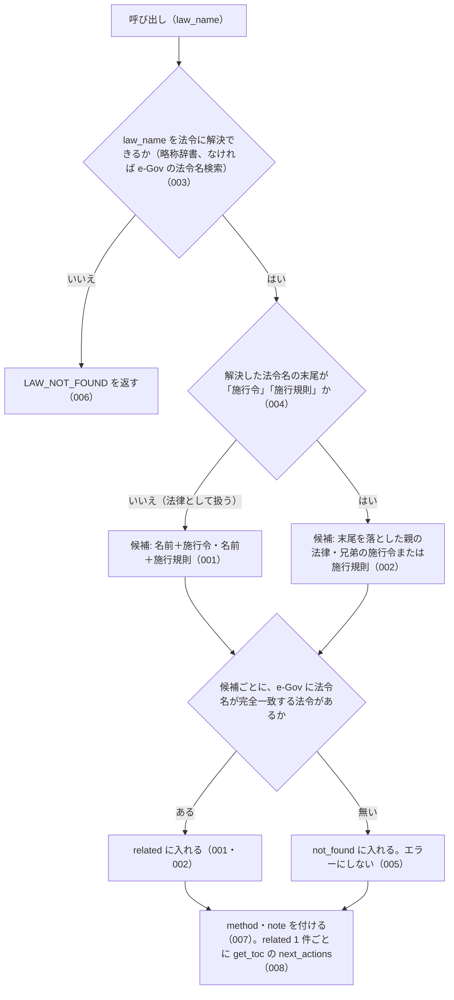

# 機能: get_related_laws（法令名の規則で施行令・施行規則、または親の法律を引く）

- 機能 ID: EGOV
- 種類: ツール
- 版: current
- 承認日: 2026-09-28（PR #50）
- 起こした元: v0.15.1 の `src/tools/definitions.ts`、`src/tools/handlers.ts`、`src/services/law-service.ts`、`src/services/law-relations.ts`、`src/services/law-service.references.test.ts`、`src/services/law-relations.test.ts`、`src/tools/handlers.test.ts`
- 関連する Issue: houki-egov-mcp #20（施行令・施行規則の関連付けと条文内の参照抽出）

この文書は「このツールは何をするか」を書きます。どう実装しているか（関数名・テーブル名）は書きません。

## アクター

- MCP クライアント（Claude などの LLM、または CLI から呼ぶ人）。`law_name` を渡して、その法令の施行令・施行規則（施行令・施行規則を渡したときは親の法律と兄弟）のうち e-Gov に実在するものを `law_id` 付きで受け取る

## 入力

| 引数       | 必須 | 内容                                                                       |
| ---------- | ---- | -------------------------------------------------------------------------- |
| `law_name` | 必須 | 法令名または略称。例: `"所得税法"`、`"所法"`、`"所得税法施行令"`、`"所令"` |

## 処理の流れ

呼び出しを受けてから応答を返すまでに、何をどの順で確かめるかを示します。図の中の番号は「できること」の仕様 ID の末尾 3 桁です。

## できること

### SPEC-EGOV-GET-RELATED-LAWS-001 法律からは、実在する施行令と施行規則を law_id 付きで返す

`law_name` が法律（名前の末尾が「施行令」「施行規則」でない法令）に解決されたときは、名前の末尾に「施行令」を付けた名前と「施行規則」を付けた名前の 2 つを候補にし、この順で e-Gov に問い合わせる。e-Gov の法令名が候補名と完全一致した法令だけを `related` に入れる。

応答は次のフィールドを持つ。

| フィールド  | 内容                                                                                                                                                                                   |
| ----------- | -------------------------------------------------------------------------------------------------------------------------------------------------------------------------------------- |
| `law`       | 解決した法令。`law_id`・`title`（正式名称）・`law_num`（法令番号）                                                                                                                     |
| `related`   | 実在した関連法令の配列。要素は `relation`（施行令は `enforcement_order`、施行規則は `enforcement_rule`、親の法律は `parent_act`）・`law_id`・`title`・`abbr`（略称辞書にあるときだけ） |
| `not_found` | 候補にしたが e-Gov に無かった名前の配列（SPEC-EGOV-GET-RELATED-LAWS-005）                                                                                                              |

例: `law_name: "所得税法"` では、`law` は `{ law_id: "340AC0000000033", title: "所得税法", law_num: "昭和四十年法律第三十三号" }`、`related` は `enforcement_order` の所得税法施行令（`340CO0000000096`、`abbr: "所令"`）と `enforcement_rule` の所得税法施行規則（`340M50000040011`、`abbr: "所規"`）の 2 件で、`not_found` は空の配列。

### SPEC-EGOV-GET-RELATED-LAWS-002 施行令・施行規則からは、親の法律と兄弟を返す

`law_name` が施行令または施行規則に解決されたときは、名前の末尾の「施行令」「施行規則」を落とした親の法律（`parent_act`）を 1 つめの候補にし、施行令なら兄弟の施行規則（`enforcement_rule`）、施行規則なら兄弟の施行令（`enforcement_order`）を 2 つめの候補にする。候補の確かめ方と応答の形は SPEC-EGOV-GET-RELATED-LAWS-001 と同じく、e-Gov の法令名と完全一致したものだけを `related` に入れる。

例: `law_name: "所令"`（所得税法施行令）では、`related` は `parent_act` の所得税法と `enforcement_rule` の所得税法施行規則の 2 件。所得税法施行規則からの候補は、所得税法（`parent_act`）と所得税法施行令（`enforcement_order`）。

### SPEC-EGOV-GET-RELATED-LAWS-003 略称で指定できる

`law_name` には略称を渡してよい。略称辞書に載っている略称は正式名称の法令として扱う。

例: `law_name: "所令"` は所得税法施行令として扱い、SPEC-EGOV-GET-RELATED-LAWS-002 の応答を返す。

### SPEC-EGOV-GET-RELATED-LAWS-004 施行令・施行規則として扱うのは、名前の末尾が「施行令」「施行規則」のものだけ

解決した法令名の末尾が「施行令」または「施行規則」で、その前に名前があるときだけ、施行令・施行規則として扱い、末尾を落とした名前を親の法律とする。名前の途中に「施行令」を含んでいても末尾でなければ、法律と同じ扱い（SPEC-EGOV-GET-RELATED-LAWS-001）になる。

例: `租税条約等の実施に伴う所得税法、法人税法及び地方税法の特例等に関する法律施行令` の親は `租税条約等の実施に伴う所得税法、法人税法及び地方税法の特例等に関する法律`。`国税通則法施行令の一部を改正する政令` と、`施行令` だけの名前は親を持たない。

### SPEC-EGOV-GET-RELATED-LAWS-005 e-Gov に無い候補は not_found に入れ、エラーにしない

候補名と法令名が完全一致する法令が e-Gov に無いときは、その候補を `related` に入れず、`not_found` に `relation` と `title`（候補名）を入れる。候補が 1 つも実在しなくてもエラーにせず、`related` が空の配列の応答を返す。

例: `law_name: "民法"` では、`related` は空の配列、`not_found` は `[{ relation: "enforcement_order", title: "民法施行令" }, { relation: "enforcement_rule", title: "民法施行規則" }]`。

### SPEC-EGOV-GET-RELATED-LAWS-006 法令に解決できない名前はエラー `LAW_NOT_FOUND`

`law_name` が略称辞書にも e-Gov の法令名検索にも当たらないときは、エラー `LAW_NOT_FOUND` を返す。候補を作らず、関連法令を問い合わせない。

例: `law_name: "存在しない法"` は `code: "LAW_NOT_FOUND"`。

### SPEC-EGOV-GET-RELATED-LAWS-007 応答に method と note を常に付ける

成功の応答には、`method: "law_name_rule"` と `note` を常に付ける。`note` は、法令名の末尾に「施行令」「施行規則」を付けた（または落とした）名前で e-Gov に実在するものだけを返していること、「…の施行に関する省令」など別の名前の下位法令・複数の省令・告示は対象外であること、網羅性は保証しないこと（「網羅性は保証しません」）を書く。

### SPEC-EGOV-GET-RELATED-LAWS-008 related 1 件ごとに get_toc を next_actions で案内する

成功の応答の `next_actions` には、`related` の要素 1 件につき `action: "get_toc"` を 1 件、`related` と同じ順で入れる。

例: `law_name: "所得税法"` では、`next_actions` の `action` は `["get_toc", "get_toc"]`。

## できないこと

- 名前の末尾に「施行令」「施行規則」を付ける・落とす以外の規則で下位法令を探すこと（「…の施行に関する省令」「…施行細則」、複数の省令、告示は返さない）
- 関連法令の条文や、どの条がどの条に委任しているかを返すこと（条単位の委任は `get_article_references`、目次は `get_toc`）
- 時点を指定して関連法令を引くこと（引数に時点が無い）
- 通達など houki-egov-mcp の管轄外の資料を関連として返すこと
- 関連法令が網羅されていると保証すること

## 未決

初版起こしで見つけた、意図か不具合かを人が決める項目です。決まったら「できること」に ID を振るか、`specs/changes/` の差分にします。

意図か不具合かの判断が要る項目は houki-egov-mcp の Issue に移し、ここには題と Issue の番号だけを残します。今の振る舞いのままでよくテストが無いだけの項目は、受入テストを書いてから「できること」に ID を振ります。

1. **応答のフィールドのうちテストで確かめていないもの。** `related` の要素の `law_num`・`law_type`・`url`（e-Gov 法令の公開ページの URL）、`meta.retrieved_at`（応答を作った日時）、法令番号が分からないときに `law.law_num` を付けないこと、`next_actions` の `reason`（親の法律なら委任している条を、施行令・施行規則なら委任先の条を探せる旨）と `example: { law_name: <related の title> }`。テストが無い。ID を振るのは受入テストを書いてから。
2. **houki-egov-mcp の管轄外の略称を渡したとき。** 略称辞書で通達など別の MCP の管轄と分かる名前（例: `消基通`）は、エラー `OUT_OF_SCOPE` を返し、`next_actions` で管轄の MCP を案内する。テストが無い。ID を振るのは受入テストを書いてから。
3. **候補を e-Gov に問い合わせている途中で取得に失敗したとき。** タイムアウトは `SOURCE_TIMEOUT`、429 は `SOURCE_RATE_LIMITED`、接続できないときは `SOURCE_UNAVAILABLE`、5xx などは `SOURCE_API_ERROR` を返し、候補ごとの結果は返さない。テストが無い。ID を振るのは受入テストを書いてから。
4. **`LAW_NOT_FOUND` の `hint` と `next_actions`。** `hint` は略称辞書・e-Gov 法令検索で該当が無い旨、`next_actions` は `resolve_abbreviation` と `search_law` の 2 件。テストが無い。ID を振るのは受入テストを書いてから。
5. **法令名の解決で e-Gov の検索に失敗すると `LAW_NOT_FOUND` になる。** → houki-egov-mcp #46
6. **法令名が完全一致しないとき、部分一致の先頭の法令を採る。** → houki-egov-mcp #45
7. **末尾が「施行令」「施行規則」でない政令・省令を渡したとき。** → houki-egov-mcp #63
