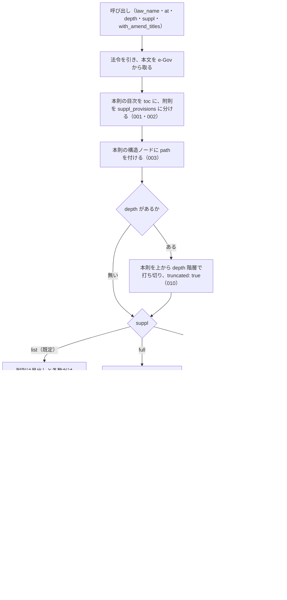

# 機能: get_toc（法令の目次を、本則と附則に分けて返す）

- 機能 ID: EGOV
- 種類: ツール
- 版: current
- 承認日: 2026-09-28（PR #50）。差分 `20260928-undecided-to-issues` は 2026-09-28（PR #68）。差分 `20260928-untested-behaviors` は 2026-09-28（PR #PR-SPEC）
- 起こした元: v0.15.1 の `src/tools/definitions.ts`（`get_toc`）、`src/tools/handlers.ts`、`src/services/law-service.ts`、`src/services/law-tree.ts`、`src/formatters/markdown.ts`、`src/services/law-service.suppl-toc.test.ts`、`src/services/law-service.range.test.ts`、`src/services/law-tree.test.ts`、`src/formatters/markdown.test.ts`
- 関連する Issue: houki-egov-mcp #24（本則と附則を分ける）、#22（`toc[].path`）

この文書は「このツールは何をするか」を書きます。どう実装しているか（関数名・テーブル名）は書きません。

## アクター

- MCP クライアント（Claude などの LLM、または CLI から呼ぶ人）。`law_name` を渡して、法令の編・章・節・条の目次（本則）と、改正法ごとの附則の目次を受け取る。受け取った `toc[].path` や `suppl_provisions[].index` を `get_law_range` に渡して、範囲の本文を取る

## 入力

| 引数                | 必須 | 内容                                                                       |
| ------------------- | ---- | -------------------------------------------------------------------------- |
| `law_name`          | 必須 | 法令名または略称。例: `民法`、`消法`                                       |
| `at`                | 任意 | 時点指定（`YYYY-MM-DD`）                                                   |
| `depth`             | 任意 | 本則の構造階層（編・章・節・款・目）を上から何階層まで返すか。省くと全階層 |
| `suppl`             | 任意 | 附則をどこまで返すか。`list`（既定）/ `full` / `none`                      |
| `with_amend_titles` | 任意 | `true` のとき附則に改正法の題名を付ける。既定は `false`                    |

## 処理の流れ

呼び出しを受けてから応答を返すまでに、何をどの順で行うかを示します。図の中の番号は「できること」の仕様 ID の末尾 3 桁です。

## できること

### SPEC-EGOV-GET-TOC-001 本則を `toc`、附則を `suppl_provisions` に分けて返す

応答の `toc` には本則（編・章・節・款・目と条）だけを入れ、附則の条は入れない。附則は `suppl_provisions` に改正法ごとに 1 件ずつ入れる。

例: 本則が第一章（第1条・第2条）で附則を 3 本持つ法令では、`toc` は第一章の 1 件で、その `children` の条番号は `["1", "2"]`。附則の条はここに現れず、`suppl_provisions` は 3 件。

### SPEC-EGOV-GET-TOC-002 `toc` のノードの形

`toc` の各ノードは次のフィールドを持つ。構造ノードは法令の階層どおりに `children` に入れ子になる。

| フィールド | 内容                                                                                                  |
| ---------- | ----------------------------------------------------------------------------------------------------- |
| `tag`      | `Part`（編）/ `Chapter`（章）/ `Section`（節）/ `Subsection`（款）/ `Division`（目）/ `Article`（条） |
| `num`      | e-Gov の番号。枝番号の条は `30_2`                                                                     |
| `title`    | 構造ノードは見出し（例: `第三章　税額控除等`）、条は条名（例: `第三十条`）                            |
| `caption`  | 条の見出し（例: `（仕入れに係る消費税額の控除）`）。条にだけ付く                                      |
| `path`     | 本則の構造ノードにだけ付く範囲のパス（SPEC-EGOV-GET-TOC-003）                                         |
| `children` | 子のノードの配列                                                                                      |

### SPEC-EGOV-GET-TOC-003 本則の構造ノードに、`get_law_range` にそのまま渡せる `path` を付ける

本則の編・章・節・款・目のノードに、法令の根からのタグと番号を `/` でつないだ `path` を付ける（例: `Part1`、`Part1/Chapter2`、`Part2/Chapter2/Section1_2`）。この値は `get_law_range` の `path` にそのまま渡せる。条のノードと、附則の中のノードには `path` を付けない（附則の範囲は `suppl_provisions[].index` で指す）。

例: 第二編第二章のノードの `path` は `Part2/Chapter2` で、これを `get_law_range` の `path` に渡すと、`range.titles` が `["第二編　物権", "第二章　占有権"]` の範囲が返る。

### SPEC-EGOV-GET-TOC-004 既定（`suppl: "list"`）では附則の見出しと条数だけを返す

`suppl` を省くか `list` にしたとき、`suppl_provisions` の各要素の `children` は空配列にする（附則の中の条は返さない）。応答の `suppl` には次を入れる。

| フィールド            | 内容                                                                                        |
| --------------------- | ------------------------------------------------------------------------------------------- |
| `suppl.mode`          | 適用した `suppl` の値（`list`）                                                             |
| `suppl.count`         | この法令が持つ附則の本数                                                                    |
| `suppl.article_count` | 附則の中の条の総数                                                                          |
| `suppl.note`          | 何を返したかの 1 行。`list` のときは、中の条まで要るなら `suppl: "full"` を指定するよう書く |

### SPEC-EGOV-GET-TOC-005 `suppl_provisions` の各要素の形

`suppl_provisions` の各要素は次のフィールドを持つ。

| フィールド       | 内容                                                                                               |
| ---------------- | -------------------------------------------------------------------------------------------------- |
| `index`          | 附則の出現順の番号（1 始まり）。`get_law_range` の `suppl_index` に渡せる                          |
| `label`          | 見出し。全角空白を詰めた `附則`                                                                    |
| `amend_law_num`  | どの改正法の附則かを示す法令番号（例: `平成元年六月二八日法律第三九号`）。制定時の附則には付かない |
| `extract`        | 抄（改正法の附則の一部だけを載せた形）なら `true`                                                  |
| `article_count`  | その附則が持つ条の数                                                                               |
| `paragraph_only` | 条を立てず項だけで書かれた附則なら `true`（このとき `article_count` は 0、`children` は空配列）    |
| `children`       | 附則の中の目次。`suppl: "full"` のときだけ中身が入る                                               |

附則を持たない法令では `suppl_provisions` は空配列。

例: 1 本目が制定時の附則（抄）、2 本目が改正法の附則、3 本目が項だけの附則のとき、1 本目は `amend_law_num` を持たず `extract: true`、2 本目は `amend_law_num: "平成元年六月二八日法律第三九号"`、3 本目は `paragraph_only: true`。

### SPEC-EGOV-GET-TOC-006 `suppl: "full"` では附則の中の条まで返す

`suppl` を `full` にしたとき、`suppl_provisions` の各要素の `children` に、その附則の中の条のノードを入れる。`suppl.mode` は `full`。

例: 条を 2 本持つ改正法の附則の `children` の条番号は `["1", "2"]`。

### SPEC-EGOV-GET-TOC-007 `suppl: "none"` では附則を返さず、本数と条数だけを返す

`suppl` を `none` にしたとき、`suppl_provisions` は空配列にし、markdown に附則の節を出さない。`suppl.count` と `suppl.article_count` はこのときも数えて返す。

例: 附則 3 本・条 3 件の法令では、`suppl_provisions: []`、`suppl.count: 3`、`suppl.article_count: 3`。

### SPEC-EGOV-GET-TOC-008 既定では改正履歴を引かない

`with_amend_titles` を省くか `false` にしたときは、e-Gov の改正履歴を問い合わせない。附則に `amend_law_title` は付かない。

### SPEC-EGOV-GET-TOC-009 `with_amend_titles: true` で附則に改正法の題名を付ける

`with_amend_titles` を `true` にしたとき、e-Gov の改正履歴（`get_law_revisions` と同じ応答）を 1 回だけ引き、附則の `amend_law_num` と改正履歴の改正法の法令番号を照合して、一致した附則に `amend_law_title` を付ける。附則の法令番号（`平成元年六月二八日法律第三九号`）と改正履歴の法令番号（`平成元年法律第三十九号`）の、公布の月日の有無と漢数字の書き方の違いは吸収して照合する。制定時の附則（`amend_law_num` が無いもの）は照合しない。

応答の `suppl.amend_law_titles` に次を入れる。

| フィールド  | 内容                                                                         |
| ----------- | ---------------------------------------------------------------------------- |
| `matched`   | 題名を付けた附則の数                                                         |
| `unmatched` | 改正履歴に該当が無く題名を付けられなかった附則の数（制定時の附則は数えない） |
| `revisions` | 照合に使った改正履歴の件数                                                   |
| `source`    | `law_revisions`                                                              |

題名を付けられなかった附則があるときは、`suppl.note` に残りの本数（`残り N 本`）と、改正履歴に該当が無かったことを書く。

例: 制定時の附則 1 本、改正履歴に載っている改正法の附則 1 本、載っていない古い改正法の附則 1 本の法令では、2 本目にだけ `amend_law_title: "消費税法の一部を改正する法律"` が付き、`suppl.amend_law_titles` は `{ matched: 1, unmatched: 1, revisions: 1, source: "law_revisions" }`。

### SPEC-EGOV-GET-TOC-010 `depth` で本則の階層を上から打ち切る

`depth` に 1 以上の数を渡したとき、本則の構造階層（編・章・節・款・目）を上から `depth` 階層までにし、それより下は `children` を空配列にする。条は階層として数えない（`depth` が構造階層の深さ以上なら条まで残る）。枝を刈ったときは応答の `truncated` を `true` にする。附則の本数（`suppl_provisions` の件数）は `depth` で変わらない。

例: 編 > 章 > 節 > 条の法令で、`depth: 1` は編だけ（編の `children` は空配列）、`depth: 2` は編と章、`depth: 3` は節まで（節の `children` は空配列）、`depth: 4` は条まで返す。章だけの法令に `depth: 1` を渡すと、章の `children` が空配列になり `truncated: true`。

### SPEC-EGOV-GET-TOC-011 markdown の目次

応答の `markdown` は次の形の文字列である。

- 附則を 1 本以上返すときは、`## 本則` の節と `## 附則（<本数> 本・条 <条の合計> 件）` の節に分ける。附則を返さないとき（附則の無い法令、`suppl: "none"`）はどちらの見出しも付けず、本則の箇条書きだけを書く
- 本則は階層ごとに字下げした箇条書き。構造ノードは見出し、条は `第N条` の表記（枝番号は `第70条の6`）の後に条見出しを付ける（例: `- 第70条の6 （農地等についての相続税の納税猶予等）`）
- 附則は 1 本 1 行で `- 附則(<index>) <改正法の法令番号、または 制定時><抄なら（抄）> — <条 N 件、または 項のみ>`。改正法の題名が付いたときは末尾に ` ／ 改正法: <題名>` を付ける。附則の中の条は 1 段下げて書く

例: `- 附則(1) 制定時（抄） — 条 2 件`、`- 附則(2) 平成元年六月二八日法律第三九号（抄） — 条 1 件 ／ 改正法: 消費税法の一部を改正する法律`、`- 附則(3) 平成二年六月二二日法律第三六号 — 項のみ`。

### SPEC-EGOV-GET-TOC-012 法令が見つからないときは LAW_NOT_FOUND を返す

略称辞書にも e-Gov の法令検索にも当たらない `law_name` では、エラー `LAW_NOT_FOUND` を返す。`error` は `法令が見つかりません: <law_name>`。`next_actions` は 2 件で、1 件目は `resolve_abbreviation`（`example.abbr` に `law_name`）、2 件目は `search_law`（`example.keyword` に `law_name`）。

例: `law_name: "存在しない法"`（法令検索の結果が 0 件）では、`code: "LAW_NOT_FOUND"`、`error: "法令が見つかりません: 存在しない法"`、`next_actions` の `action` は `["resolve_abbreviation", "search_law"]`、`next_actions[0].example` は `{ abbr: "存在しない法" }`、`next_actions[1].example` は `{ keyword: "存在しない法" }`。

### SPEC-EGOV-GET-TOC-013 houki-egov の管轄外の名前には OUT_OF_SCOPE を返す

略称辞書で houki-egov 以外の管轄と分かる `law_name`（通達名など）では、e-Gov に問い合わせずにエラー `OUT_OF_SCOPE` を返す。`error` に正式名称と管轄の MCP 名を書き、`next_actions[0]` は `action: "delegate_to_mcp"`、`example.mcp` に管轄の MCP 名を入れる。

例: `law_name: "消基通"` では、`code: "OUT_OF_SCOPE"`、`error` は `「消費税法基本通達」は houki-nta の管轄です` で始まり、`next_actions[0]` は `{ action: "delegate_to_mcp", example: { mcp: "houki-nta" } }`（`reason` も付く）、`detail.cause` は `source_mcp_hint=houki-nta`。

### SPEC-EGOV-GET-TOC-014 法令本文の取得で e-Gov が失敗したときのエラー

法令を引けた後、e-Gov から法令本文を取るところで失敗したときは、次のエラーを返す。

| e-Gov の失敗                                | `code`                | `retryable` | `next_actions` の `action`         |
| ------------------------------------------- | --------------------- | ----------- | ---------------------------------- |
| 429                                         | `SOURCE_RATE_LIMITED` | `true`      | `retry_later`                      |
| タイムアウト                                | `SOURCE_TIMEOUT`      | `true`      | `retry_later`、`visit_egov_site`   |
| 5xx                                         | `SOURCE_API_ERROR`    | `true`      | `retry_later`、`visit_egov_site`   |

429 と 5xx では `detail.status` に HTTP の状態コードを入れる。

例: 本文の取得が 503 で失敗すると、`code: "SOURCE_API_ERROR"`、`error: "e-Gov API がサーバーエラーを返しました（503）"`、`retryable: true`、`detail.status: 503`。429 では `code: "SOURCE_RATE_LIMITED"`、`error: "e-Gov API がレート制限を返しました（429）"`。タイムアウトでは `code: "SOURCE_TIMEOUT"`、`error: "e-Gov API がタイムアウトしました"`。

### SPEC-EGOV-GET-TOC-015 応答の `meta`

応答の `meta` は次のフィールドを持つ。

| フィールド     | 内容                                                                   |
| -------------- | ---------------------------------------------------------------------- |
| `law_id`       | e-Gov の法令 ID                                                        |
| `title`        | 法令名                                                                 |
| `law_num`      | 法令番号                                                               |
| `retrieved_at` | 取得日時（ISO 8601 の UTC。例: `2026-09-27T20:31:59.713Z`）            |
| `url`          | e-Gov 法令検索の法令のページ。`https://laws.e-gov.go.jp/law/<law_id>` |
| `at`           | 渡した `at`。`at` を省いたときは付かない                               |

例: 法令 ID `999AC0000000001`・法令名 `テスト法`・法令番号 `令和七年法律第一号` の法令では、`meta` は `{ law_id: "999AC0000000001", title: "テスト法", law_num: "令和七年法律第一号", retrieved_at: <ISO 8601>, url: "https://laws.e-gov.go.jp/law/999AC0000000001" }` で、`at` を持たない。

### SPEC-EGOV-GET-TOC-016 `node_count` は返した本則の目次のノード数

応答の `node_count` は、返した `toc` のノード（編・章・節・款・目と条）を入れ子の中まで数えた数である。附則のノードは数えない。`depth` で刈ったときは、刈った後の `toc` のノード数になる。

例: 第一編 > 第一章（第1条・第2条）・第二章 > 第一節（第3条）の本則と附則 2 本を持つ法令では、`node_count: 7`（編 1・章 2・節 1・条 3）、`truncated: false`。同じ法令に `depth: 1` を渡すと、`node_count: 1`、`truncated: true`。

### SPEC-EGOV-GET-TOC-017 markdown の見出しと末尾の出典

`markdown` の 1 行目は `# <法令名> — 目次`。目次の後に `---` の行を置き、続けて `出典：e-Gov法令検索（デジタル庁）`、`URL: https://laws.e-gov.go.jp/law/<law_id>`、`at` を渡したときだけ `時点: <at>`、最後に `取得日時: <meta.retrieved_at と同じ値>` の行を書く。

例: `law_name: "テスト法"`（法令 ID `999AC0000000001`）を `at` なしで取ると、`markdown` は `# テスト法 — 目次` で始まり、末尾の 4 行は `---`、`出典：e-Gov法令検索（デジタル庁）`、`URL: https://laws.e-gov.go.jp/law/999AC0000000001`、`取得日時: <meta.retrieved_at>` で、`時点:` の行を含まない。

### SPEC-EGOV-GET-TOC-018 `at` で時点を指定する

`at` を渡したとき、その値を時点として e-Gov の法令本文の取得に渡し、その時点の目次を返す。`meta.at` に渡した値を入れ、`markdown` の末尾に `時点: <at>` の行を書く（`URL:` の行と `取得日時:` の行の間）。

例: `at: "2020-04-01"` を渡すと、e-Gov への本文の取得に時点 `2020-04-01` が渡り、`meta.at` は `"2020-04-01"`、`markdown` の末尾の 3 行は `URL: https://laws.e-gov.go.jp/law/<law_id>`、`時点: 2020-04-01`、`取得日時: <meta.retrieved_at>`。

### SPEC-EGOV-GET-TOC-019 `suppl: "full"` と `depth` を一緒に渡すと、附則の中の目次も打ち切る

`suppl: "full"` と `depth` を一緒に渡したとき、`suppl_provisions` の各要素の `children` にも本則と同じ打ち切りを当てる（構造階層を上から `depth` 階層までにし、それより下は `children` を空配列にする。条は階層として数えない）。`suppl: "list"` と `suppl: "none"` では附則の中身を返さないので、`depth` は附則に効かない。

例: 1 本目が条だけ（第1条）の附則、2 本目が第一章（第1条・第2条）を持つ附則の法令で、`suppl: "full", depth: 1` を渡すと、1 本目の `children` は第1条の 1 件のまま、2 本目の `children` は第一章の 1 件でその `children` は空配列。`depth: 2` では、2 本目の第一章の `children` の条番号は `["1", "2"]`。

### SPEC-EGOV-GET-TOC-020 改正履歴が取れなかったときは、題名なしの目次を返す

`with_amend_titles: true` で e-Gov の改正履歴の取得に失敗したときは、エラーにせず、附則に `amend_law_title` を付けない目次を返す。`suppl.amend_law_titles` は付けない。`suppl.note` の末尾に `。改正法の題名は付けられませんでした（改正履歴の取得に失敗: <失敗の理由>）` を足す。

例: 附則 2 本・条 3 件の法令で改正履歴の取得が 503（理由の文言 `svc down`）で失敗すると、目次は返り、`suppl_provisions` のどの要素にも `amend_law_title` が無く、`suppl.amend_law_titles` は無く、`suppl.note` は `附則 2 本の見出しと条数だけを返しました（条は合計 3 件）。中の条まで要るときは suppl: "full" を指定してください。改正法の題名は付けられませんでした（改正履歴の取得に失敗: svc down）`。

### SPEC-EGOV-GET-TOC-021 `suppl: "none"` のときは `with_amend_titles` を渡しても改正履歴を引かない

`suppl: "none"` と `with_amend_titles: true` を一緒に渡したときは、返す附則が無いので e-Gov の改正履歴を問い合わせない。`suppl.amend_law_titles` は付かず、`suppl.note` は `suppl: "none"` のときの文のまま。

例: 附則 2 本・条 3 件の法令に `suppl: "none", with_amend_titles: true` を渡すと、改正履歴の問い合わせは 0 回で、`suppl` は `{ mode: "none", count: 2, article_count: 3, note: "附則 2 本（条 3 件）は返していません（suppl: \"none\"）" }`。

### SPEC-EGOV-GET-TOC-022 `depth` に 0 以下を渡すと全階層を返す

`depth` に 0 または負の数を渡したときは、`depth` を省いたときと同じく本則の全階層を返し、`truncated` は `false`。

例: `node_count` が 7 の法令に `depth: 0` または `depth: -1` を渡すと、`toc` は `depth` を省いたときと同じで、`node_count: 7`、`truncated: false`。tools/call（`get_toc`）を通しても同じで、エラーにならない。

## できないこと

- 条の本文を返すこと（範囲の本文は `get_law_range`、1 条ずつは `get_law`）
- 附則の中に `path` を付けること（附則は `suppl_provisions[].index` で指す）
- 題名が e-Gov の改正履歴に無い古い改正法に、題名を付けること
- `format` を選ぶこと（応答は markdown と構造化した目次の両方を常に返す）

## 未決

初版起こしで見つけた、意図か不具合かを人が決める項目です。決まったら「できること」に ID を振るか、`specs/changes/` の差分にします。

意図か不具合かの判断が要る項目は houki-egov-mcp の Issue に移し、ここには題と Issue の番号だけを残します。今の振る舞いのままでよくテストが無いだけの項目は、受入テストを書いてから「できること」に ID を振ります。

1. **法令が見つからないとき・管轄外の名前のとき・e-Gov が失敗したときのエラー。** → SPEC-EGOV-GET-TOC-012・SPEC-EGOV-GET-TOC-013・SPEC-EGOV-GET-TOC-014（一部は約束にしていない。差分 `20260928-untested-behaviors` の proposal.md を参照）
2. **`meta`・`node_count` と markdown の末尾。** → SPEC-EGOV-GET-TOC-015・SPEC-EGOV-GET-TOC-016・SPEC-EGOV-GET-TOC-017
3. **`at` で時点を指定したときの目次。** → SPEC-EGOV-GET-TOC-018
4. **`suppl: "full"` と `depth` を一緒に渡したとき。** → SPEC-EGOV-GET-TOC-019
5. **改正履歴の取得に失敗したとき。** → SPEC-EGOV-GET-TOC-020・SPEC-EGOV-GET-TOC-021
6. **`depth` に 0 以下を渡したとき。** → SPEC-EGOV-GET-TOC-022
7. **`depth` の説明と、編を持たない法令での動き。** → houki-egov-mcp #56
8. **`depth` に整数でない数を渡したとき。** → houki-egov-mcp #54
9. **法令名が完全一致しないとき、検索結果の先頭の法令を返す。** → houki-egov-mcp #45
