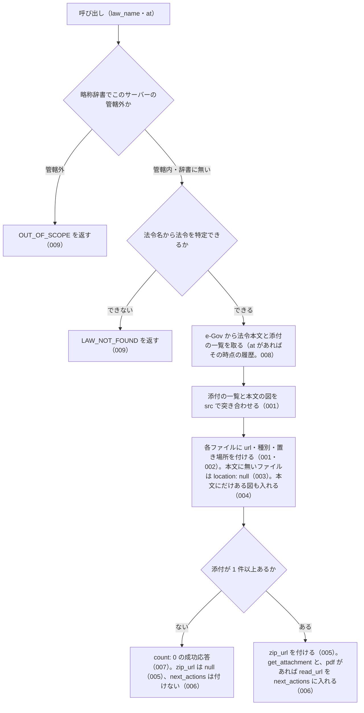

# 機能: list_attachments（法令の添付ファイルの一覧を返す）

- 機能 ID: EGOV
- 種類: ツール
- 版: current
- 承認日:
- 起こした元: v0.15.1 の `src/tools/definitions.ts`、`src/tools/handlers.ts`、`src/services/law-files.ts`、`src/services/law-tree.ts`（図の置き場所）、`src/services/law-service.ts`（法令名の解決・管轄の確認）、`src/services/egov-client.ts`、`src/config.ts`、`src/services/law-files.test.ts`
- 関連する Issue: houki-egov-mcp #19（添付ファイルと法令本文ファイル）

この文書は「このツールは何をするか」を書きます。どう実装しているか（関数名・テーブル名）は書きません。

## アクター

- MCP クライアント（Claude などの LLM、または CLI から呼ぶ人）。`law_name`（と任意で `at`）を渡して、その法令履歴に付いている添付ファイル（別表・様式・別記の図。jpg / pdf）の一覧を受け取る。一覧の `url` をそのまま開くか、pdf-reader-mcp の `read_url` に渡すか、`get_attachment` で保存する

## 入力

| 引数 | 必須 | 内容 |
|---|---|---|
| `law_name` | 必須 | 法令名または略称。例: `"戸籍法施行規則"`、`"国旗及び国歌に関する法律"` |
| `at` | 任意 | 時点。`YYYY-MM-DD` 形式。その時点の法令履歴の添付ファイルの一覧になる |

inputSchema に無い引数を渡したときの扱いは common_errors に書く。

## 処理の流れ

呼び出しを受けてから応答を返すまでに、何をどの順で確かめるかを示します。図の中の番号は「できること」の仕様 ID の末尾 3 桁です。

## できること

### SPEC-EGOV-LIST-ATTACHMENTS-001 添付ファイルの一覧を、取得 URL と種別付きで返す

e-Gov の法令本文に付く添付ファイルの一覧（`attached_files_info`）と、本文の中の図（`Fig` 要素）を `src` で突き合わせ、1 ファイル 1 要素の `attachments` を返す。ファイルの中身は返さない。応答は次のフィールドを持つ。

| フィールド | 内容 |
|---|---|
| `meta.law_revision_id` | 添付ファイルが属する法令履歴 ID。例: `411AC0000000127_19990813_000000000000000` |
| `meta.law_id` / `meta.title` / `meta.law_num` / `meta.retrieved_at` / `meta.url` | 法令 ID・題名・法令番号・取得日時・e-Gov の法令ページの URL |
| `count` | `attachments` の件数 |
| `attachments[].src` | 本文の `Fig` 要素の `src`。例: `./pict/H11HO127-001.jpg`。`get_attachment` の `src` にそのまま渡せる |
| `attachments[].file_name` | `src` の末尾のファイル名。例: `H11HO127-001.jpg` |
| `attachments[].file_type` | 拡張子から決めた種別。例: `jpg`、`pdf` |
| `attachments[].content_type` | 拡張子から決めた Content-Type。`jpg` は `image/jpeg`、`pdf` は `application/pdf` |
| `attachments[].url` | 認証なしで開ける取得 URL。`https://laws.e-gov.go.jp/api/2/attachment/<law_revision_id>?src=<src を URL エンコードしたもの>` |
| `attachments[].updated` | 正誤などで更新された日時（`attached_files_info` の `updated`）。例: `2024-07-25T00:20:13+09:00` |
| `attachments[].location` | 法令の中の置き場所（SPEC-EGOV-LIST-ATTACHMENTS-002） |
| `zip_url` | SPEC-EGOV-LIST-ATTACHMENTS-005 |
| `note` | 件数と種別ごとの内訳の説明 |
| `next_actions` | SPEC-EGOV-LIST-ATTACHMENTS-006 |

### SPEC-EGOV-LIST-ATTACHMENTS-002 各ファイルに、法令の中の置き場所を付ける

`attachments[].location` に、その図が本文のどこに置かれているかを入れる。

- 別記・様式などの中の図: `tag`（`AppdxNote`・`AppdxStyle` など）、`title`（見出し。例: `別記第一`、`附録第十一号様式`）、`related_article`（関係条文。例: `（第一条関係）`）。見出しと関係条文の前後の空白（全角空白を含む）は除き、続く空白は 1 つに詰める（例: `　出生の届書（日本産業規格Ａ列四番）（第五十九条関係）` → `出生の届書（日本産業規格Ａ列四番）（第五十九条関係）`）
- 条の中の図: `tag: "Article"`、`article`（e-Gov 形式の条番号。例: `1`）、`title`（条見出しと見出しの括弧書きを続けたもの。例: `第一条（国旗）`）
- 附則の中の図（別表・様式・条の中でないもの）: `tag: "SupplProvision"`、`amend_law_num`（附則の改正法番号。例: `平成一一年法律第一二七号`）

### SPEC-EGOV-LIST-ATTACHMENTS-003 本文に見つからないファイルは、置き場所を null にして数を知らせる

`attached_files_info` にあるが本文の `Fig` 要素に同じ `src` が無いファイルも `attachments` に入れ、`location` を `null` にする。そのようなファイルがあるときは、`note` に「<件数> 件は attached_files_info にあるが本文の Fig 要素に見つからず」の文を入れる。

### SPEC-EGOV-LIST-ATTACHMENTS-004 本文にだけある図も一覧に入れる

本文に `Fig` 要素があるが `attached_files_info` に無い図も `attachments` に入れる。このファイルには `updated` を付けず、`location` は本文の置き場所（SPEC-EGOV-LIST-ATTACHMENTS-002）を付ける。

### SPEC-EGOV-LIST-ATTACHMENTS-005 添付ファイルをまとめた zip の URL を返す

添付が 1 件以上ある法令では、`zip_url` に、その法令履歴の添付ファイルをまとめて取る URL `https://laws.e-gov.go.jp/api/2/attachment/<law_revision_id>`（`src` を付けない）を入れる。添付が無い法令では `zip_url` は `null`。

### SPEC-EGOV-LIST-ATTACHMENTS-006 1 件の保存と pdf の読み取りを案内する

添付が 1 件以上あるときは `next_actions` に、`get_attachment`（保存するときの呼び方）を入れる。pdf のファイルがあるときは、続けて `pdf-reader-mcp:read_url`（pdf の `url` を渡すと本文を読める）を入れる。添付が無い法令では `next_actions` を付けない。

### SPEC-EGOV-LIST-ATTACHMENTS-007 添付が無い法令は count 0 の成功応答にする

`attached_files_info` が空で本文に `Fig` 要素も無い法令（例: 民法）は、エラーにせず、`count: 0`・空の `attachments`・`zip_url: null` の成功応答を返す。`note` には「添付ファイルはありません」を含む文を入れる。

### SPEC-EGOV-LIST-ATTACHMENTS-008 時点（at）を渡すと、その時点の法令履歴の一覧になる

`at` を渡したときは、その時点の法令履歴の本文と添付の一覧を使う。`meta.law_revision_id` はその時点の履歴 ID、`meta.at` は渡した `at` になる。その履歴の `attached_files_info` が空でも、本文の `Fig` 要素にある図は一覧に入る。

### SPEC-EGOV-LIST-ATTACHMENTS-009 特定できない法令と管轄外の資料はエラーにする

- 法令名が略称辞書で別の MCP サーバーの管轄の資料（例: `所基通` = 所得税基本通達）に当たるときは、エラー `OUT_OF_SCOPE` を返す
- 法令名から法令を特定できないときは、エラー `LAW_NOT_FOUND` を返す

## できないこと

- 添付ファイルの中身（画像・pdf のバイト列や base64）を返すこと。返すのは URL だけで、取得・保存は `get_attachment` が行う
- pdf の添付の本文を読むこと（pdf-reader-mcp の `read_url` に `url` を渡す）
- 図の中身（別表の表の値など）をテキストにすること
- 複数の時点の添付の一覧を比べること（時点ごとに `at` を変えて呼ぶ）

## 未決

初版起こしで見つけた、意図か不具合かを人が決める項目です。決まったら「できること」に ID を振るか、`specs/changes/` の差分にします。

意図か不具合かの判断が要る項目は houki-egov-mcp の Issue に移し、ここには題と Issue の番号だけを残します。今の振る舞いのままでよくテストが無いだけの項目は、受入テストを書いてから「できること」に ID を振ります。

1. **e-Gov の法令検索が失敗したときも `LAW_NOT_FOUND` を返す。** 法令名を e-Gov の法令検索で特定する段で、ネットワークの失敗や e-Gov の 5xx が起きても、失敗を記録するだけで「法令が見つからない」として `LAW_NOT_FOUND`（`retryable` なし）を返す。呼び出し側は表記の誤りと一時的な障害を見分けられない。検索の失敗を `SOURCE_API_ERROR` などにして `retryable` を付けるかを決める必要がある。
2. **`at` の形を確かめない。** `at` は `YYYY-MM-DD` 形式と説明しているが、形を確かめずに e-Gov に渡す。形が違う値や、法令の成立より前の日付を渡したときに e-Gov が返すエラーは、4xx なら `SOURCE_API_ERROR`（`retryable: false`）になり、何が悪いかが呼び出し側に伝わらない。`at` の形をこのサーバーで確かめて `INVALID_ARGUMENT` にするか、成立前の日付をどう返すかを決める必要がある。
3. **一覧の並び順と重複の扱い。** `attached_files_info` の順に並べ、その後ろに本文にだけある図を本文の出現順に並べる。同じ `src` が 2 回出てきたら 1 件にする。テストは件数と先頭の 1 件だけを確かめている。テストが無い。ID を振るのは受入テストを書いてから。
4. **別表・書式・別図・付録の置き場所と、どこにも当たらない図。** `location.tag` は別表（`AppdxTable`）・書式（`AppdxFormat`）・別図（`AppdxFig`）・付録（`Appdx`）にもなり、どこにも当たらない図は `tag: "Law"` になる。附則の中の別表・様式や条では `amend_law_num` も付く。テストは `AppdxNote`・`AppdxStyle`・`Article`・`SupplProvision` だけを確かめている。テストが無い。ID を振るのは受入テストを書いてから。
5. **`meta` の `law_id`・`title`・`law_num`・`retrieved_at`・`url`。** 値を確かめるテストが無い。テストが無い。ID を振るのは受入テストを書いてから。
6. **`next_actions` の `example` の中身。** `get_attachment` の `example` は `{ law_name: <渡した law_name>, src: <一覧の先頭の src>, save: true }`、`pdf-reader-mcp:read_url` の `example` は `{ url: <一覧で最初の pdf の url> }`。テストは `action` の並びだけを確かめている。テストが無い。ID を振るのは受入テストを書いてから。
7. **e-Gov の応答に法令履歴 ID が無いとき。** 法令本文の応答に `law_revision_id` が無いときは、エラー `SOURCE_API_ERROR`（`retryable: false`、`detail.url` に法令本文の API の URL）を返す。テストが無い。ID を振るのは受入テストを書いてから。
8. **法令本文の取得に失敗したときの code。** e-Gov が 429 を返したら `SOURCE_RATE_LIMITED`、時間切れなら `SOURCE_TIMEOUT`、5xx なら `SOURCE_API_ERROR`（いずれも `retryable: true`）、それ以外の 4xx は `SOURCE_API_ERROR`（`retryable: false`）を返す。このツールで確かめるテストが無い。テストが無い。ID を振るのは受入テストを書いてから。
