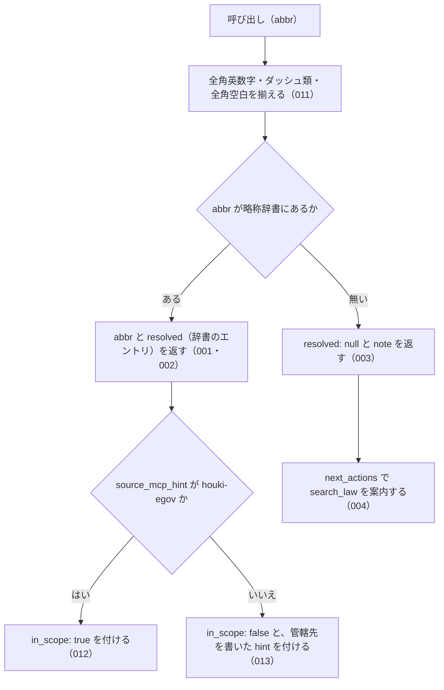

# 機能: resolve_abbreviation（略称から略称辞書のエントリを引く）

- 機能 ID: EGOV
- 種類: ツール
- 版: current
- 承認日: 2026-09-28（PR #50）。差分 `20260928-undecided-to-issues` は 2026-09-28（PR #68）。差分 `20260928-untested-behaviors` は 2026-09-28（PR #76）。差分 `20261001-t1-argument-guards` は 2026-10-01（PR #84）。差分 `20261001-t3-normalize` は 2026-10-01（PR #86）
- 起こした元: v0.15.1 の `src/tools/definitions.ts`、`src/tools/handlers.ts`、`src/errors.ts`、`src/tools/handlers.test.ts`、`src/server.test.ts`（辞書は `@shuji-bonji/houki-abbreviations` 0.x）
- 関連する Issue: なし

この文書は「このツールは何をするか」を書きます。どう実装しているか（関数名・テーブル名）は書きません。

## アクター

- MCP クライアント（Claude などの LLM、または CLI から呼ぶ人）。`abbr` を渡して、その略称が略称辞書のどのエントリ（正式名称・e-Gov の法令 ID・分野・種別・本文を持つ MCP）を指すかを受け取る。辞書の内容を確かめるための診断に使う

## 入力

| 引数   | 必須 | 内容                                             |
| ------ | ---- | ------------------------------------------------ |
| `abbr` | 必須 | 略称。例: `"消法"`、`"所法"`、`"労基法"`、`"民"`。全角英数字・ダッシュ類・全角空白は半角に揃えて照合する（011） |

## 処理の流れ

呼び出しを受けてから応答を返すまでに、何をどの順で確かめるかを示します。図の中の番号は「できること」の仕様 ID の末尾 3 桁です。

## できること

### SPEC-EGOV-RESOLVE-ABBREVIATION-001 辞書にある略称は、`resolved` に辞書のエントリを入れて返す

`abbr` が略称辞書にあるときは、エラーにせず（`isError` を付けず）、`abbr`（渡した値）と `resolved`（辞書のエントリ）を持つ応答を返す。`resolved` は `formal`（正式名称）と `domain`（分野）を持つ。

例: `abbr: "消法"` は `resolved.formal: "消費税法"`・`resolved.domain: "tax"`。`abbr: "労基法"` は `abbr: "労基法"` で、`resolved` は null でない。

### SPEC-EGOV-RESOLVE-ABBREVIATION-002 返すエントリは種別と本文を持つ MCP の名前を持つ

SPEC-EGOV-RESOLVE-ABBREVIATION-001 の `resolved` は、`category`（種別）と `source_mcp_hint`（本文を持つ MCP の名前）を持つ。

例: `abbr: "消法"` は `resolved.category: "law"`・`resolved.source_mcp_hint: "houki-egov"`。

### SPEC-EGOV-RESOLVE-ABBREVIATION-003 辞書に無い略称は、エラーにせず `resolved: null` と `note` を返す

`abbr` が略称辞書に無いときは、エラー（`ABBREVIATION_NOT_FOUND` など）を返さず、`abbr`（渡した値）・`resolved: null`・`note` を持つ応答を返す。`note` は `辞書に該当なし。フル法令名でお試しください`。

例: `abbr: "存在しない法律"` は `resolved: null` で、`note` に `辞書に該当なし` を含む。

### SPEC-EGOV-RESOLVE-ABBREVIATION-004 辞書に無い略称には、`search_law` を試す案内を付ける

SPEC-EGOV-RESOLVE-ABBREVIATION-003 の応答には `next_actions` を付け、先頭の要素の `action` は `search_law` にする。要素の `example` は `{ keyword: <渡した abbr> }`、`reason` は `部分一致で法令を検索できます`。

例: `abbr: "存在しない法律"` の `next_actions[0].action` は `search_law`。

### SPEC-EGOV-RESOLVE-ABBREVIATION-005 正式名称からも、そのエントリを返す

`abbr` が略称辞書のエントリの正式名称（`formal`）と一致するときも、エラーにせず、そのエントリを `resolved` に入れて返す。`resolved.abbr` は辞書の略称で、応答の `abbr` とは違う値になる。

例: `abbr: "消費税法"` は `abbr: "消費税法"`・`resolved.abbr: "消法"`・`resolved.formal: "消費税法"`。`abbr: "所得税法"` は `resolved.abbr: "所法"`、`abbr: "労働基準法"` は `resolved.abbr: "労基法"`。

### SPEC-EGOV-RESOLVE-ABBREVIATION-006 別名からも、そのエントリを返す

`abbr` が略称辞書のエントリの別名（`aliases` の要素）と一致するときも、エラーにせず、そのエントリを `resolved` に入れて返す。

例: `abbr: "消費税"` と `abbr: "インボイス"` は、どちらも `resolved.abbr: "消法"`・`resolved.formal: "消費税法"`。

### SPEC-EGOV-RESOLVE-ABBREVIATION-007 前後の空白を除いてから辞書と照合する

`abbr` の前後にある空白（半角スペース・全角スペース・タブ・改行）を除いてから辞書と照合する。

例: `abbr: " 消法 "`・`abbr: "　消法　"`（前後が全角スペース）・`abbr: "\t消法\n"` は、どれも `resolved.abbr: "消法"`・`resolved.formal: "消費税法"`。

### SPEC-EGOV-RESOLVE-ABBREVIATION-008 応答の abbr は渡した値のまま返す

応答の `abbr` には、前後の空白を除く前の、渡した値をそのまま入れる。辞書にあるときも無いときも同じ。

例: `abbr: " 消法 "` は応答の `abbr` が `" 消法 "`（`resolved.abbr` は `"消法"`）。`abbr: " 存在しない法律 "` は応答の `abbr` が `" 存在しない法律 "` で、`resolved: null`。

### SPEC-EGOV-RESOLVE-ABBREVIATION-009 resolved は略称辞書のエントリをそのまま返す

`resolved` には、略称辞書（`@shuji-bonji/houki-abbreviations`）の `resolveAbbreviation` が返すエントリを、フィールドを足したり除いたりせずにそのまま入れる。SPEC-EGOV-RESOLVE-ABBREVIATION-001・002 のフィールドのほか、エントリが持っていれば `abbr`・`law_id`・`law_num`・`law_type`・`aliases`・`note` も付く。どのフィールドを持つかは辞書のパッケージの版で決まる。

例: `abbr: "消法"` の `resolved` は、`resolveAbbreviation("消法")` の戻り値と同じ内容（深く比べて等しい）。辞書 0.4.1 では `abbr: "消法"`・`formal: "消費税法"`・`law_id: "363AC0000000108"`・`law_num: "昭和六十三年法律第百八号"`・`law_type: "Act"`・`domain: "tax"`・`category: "law"`・`source_mcp_hint: "houki-egov"`・`aliases`（先頭は `消費税`、`インボイス` を含む 10 件）・`note` を持つ。

### SPEC-EGOV-RESOLVE-ABBREVIATION-010 abbr が空文字・空白だけのときは略称辞書を引かずに `INVALID_ARGUMENT` を返す

空文字は inputSchema の `minLength: 1` の検査（SPEC-EGOV-COMMON-ERRORS-025）で止まり、`INVALID_ARGUMENT`（`tool: "resolve_abbreviation"`、`detail.issues: [{ path: "abbr", message: "空文字は指定できません" }]`）を返す。空白（半角スペース・全角スペース・タブ・改行）だけのときは、ツールの処理が略称辞書を引く前に、SPEC-EGOV-COMMON-ERRORS-026 の形の `INVALID_ARGUMENT`（`tool: "resolve_abbreviation"`、`error: "abbr が空です"`、`detail.issues: [{ path: "abbr", message: "空白だけは指定できません" }]`、`hint` に略称・正式名称・別名を渡すよう書く）を返す。

例: `abbr: ""` は `code: "INVALID_ARGUMENT"`・`detail.issues[0].message: "空文字は指定できません"`。`abbr: "　"`（全角スペース）と `abbr: " \n"` は `code: "INVALID_ARGUMENT"`・`error: "abbr が空です"`。どれも略称辞書は引かない。

v0.15.4 では `abbr: ""` に `resolved: null` と `example: { keyword: "" }` の `search_law` の案内（SPEC-EGOV-RESOLVE-ABBREVIATION-003・004 の形）を返していたが、空の `abbr` は辞書に無い略称ではなく引数の誤りなので、003・004 の対象から外れる。

### SPEC-EGOV-RESOLVE-ABBREVIATION-011 `abbr` の全角英数字・ダッシュ類・全角空白は半角に揃えてから辞書と照合する

`abbr` は、houki-abbreviations の `resolveAbbreviation(name, { normalize: true })` の規則（全角英数字を半角に、ダッシュ類 `－` `‐` `‑` `–` `—` `―` `−` を `-` に、全角チルダを `~` に、全角空白を半角空白にし、前後の空白を除く。大文字と小文字は区別する）で揃えてから、略称・正式名称・別名と照合する。応答の `abbr` は渡した値のまま（SPEC-EGOV-RESOLVE-ABBREVIATION-008）。

例: `abbr: "ＰＬ法"` は `resolved.formal: "製造物責任法"` で、応答の `abbr` は `"ＰＬ法"`（v0.15.4 では `resolved: null` だった）。`abbr: "pl法"` は大文字小文字が違うので `resolved: null` のまま。`abbr: "消　法"`（内側が全角空白）は `消 法` として引くので `resolved: null`。

### SPEC-EGOV-RESOLVE-ABBREVIATION-012 houki-egov の管轄のエントリには `in_scope: true` を付ける

解決したエントリの `source_mcp_hint` が `houki-egov` のとき、応答に `in_scope: true` を付ける。`hint` は付けない。

例: `abbr: "消法"` の応答は `resolved.source_mcp_hint: "houki-egov"`、`in_scope: true` で、`hint` は無い。

### SPEC-EGOV-RESOLVE-ABBREVIATION-013 管轄外のエントリには `in_scope: false` と管轄先を書いた `hint` を付ける

解決したエントリの `source_mcp_hint` が `houki-egov` でないとき（通達など）は、`resolved` にエントリを入れたうえで `in_scope: false` を付け、`hint` を `このエントリは <source_mcp_hint> の管轄です。<source_mcp_hint>-mcp で取得してください。` にする。エラー（`OUT_OF_SCOPE`）にはしない。houki-nta-mcp の SPEC-NTA-RESOLVE-ABBREVIATION-003 と同じ形である。

例: `abbr: "消基通"` の応答は `resolved.formal: "消費税法基本通達"`、`resolved.source_mcp_hint: "houki-nta"`、`in_scope: false`、`hint: "このエントリは houki-nta の管轄です。houki-nta-mcp で取得してください。"`（v0.15.4 では `in_scope` と `hint` が無かった）。

## できないこと

- 略称を渡して条文を返すこと（条文は `get_law`。`get_law` も略称を受け付ける）
- 部分一致や似た名前（打ち間違い）から候補を探すこと
- 文章の中から法令名を探すこと
- 1 回の呼び出しで複数の略称を引くこと
- 辞書に無い法令を e-Gov で探すこと（`next_actions` で `search_law` を案内するだけ）

## 未決

初版起こしで見つけた、意図か不具合かを人が決める項目です。決まったら「できること」に ID を振るか、`specs/changes/` の差分にします。

意図か不具合かの判断が要る項目は houki-egov-mcp の Issue に移し、ここには題と Issue の番号だけを残します。今の振る舞いのままでよくテストが無いだけの項目は、受入テストを書いてから「できること」に ID を振ります。

1. **正式名称・別名からも引ける。** → SPEC-EGOV-RESOLVE-ABBREVIATION-005・SPEC-EGOV-RESOLVE-ABBREVIATION-006
2. **前後の空白を除いて引き、応答の `abbr` は渡した値のまま返す。** → SPEC-EGOV-RESOLVE-ABBREVIATION-007・SPEC-EGOV-RESOLVE-ABBREVIATION-008
6. **`resolved` のそのほかのフィールド。** → SPEC-EGOV-RESOLVE-ABBREVIATION-009
