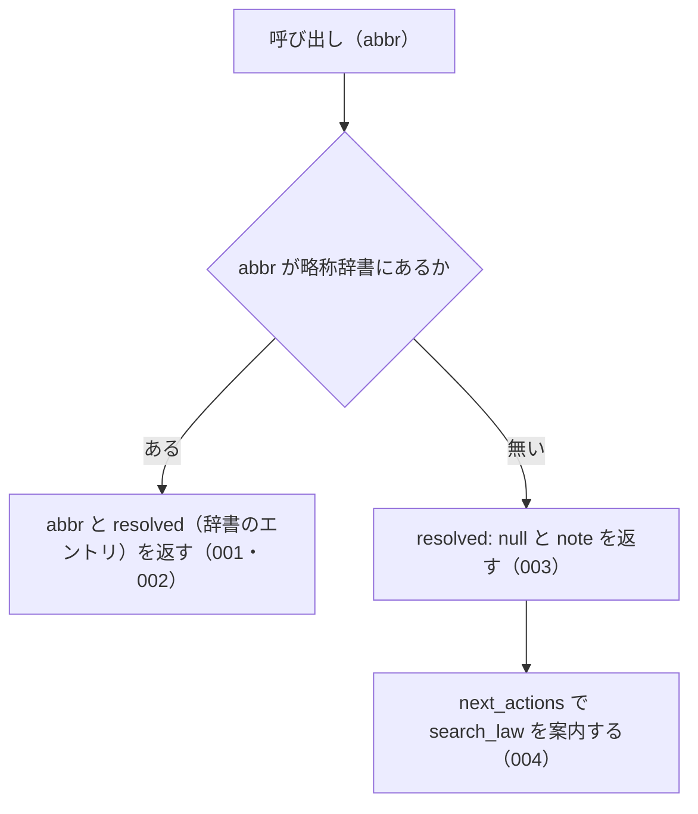

# 機能: resolve_abbreviation（略称から略称辞書のエントリを引く）

- 機能 ID: EGOV
- 種類: ツール
- 版: current
- 承認日:
- 起こした元: v0.15.1 の `src/tools/definitions.ts`、`src/tools/handlers.ts`、`src/errors.ts`、`src/tools/handlers.test.ts`、`src/server.test.ts`（辞書は `@shuji-bonji/houki-abbreviations` 0.x）
- 関連する Issue: なし

この文書は「このツールは何をするか」を書きます。どう実装しているか（関数名・テーブル名）は書きません。

## アクター

- MCP クライアント（Claude などの LLM、または CLI から呼ぶ人）。`abbr` を渡して、その略称が略称辞書のどのエントリ（正式名称・e-Gov の法令 ID・分野・種別・本文を持つ MCP）を指すかを受け取る。辞書の内容を確かめるための診断に使う

## 入力

| 引数 | 必須 | 内容 |
|---|---|---|
| `abbr` | 必須 | 略称。例: `"消法"`、`"所法"`、`"労基法"`、`"民"` |

## 処理の流れ

呼び出しを受けてから応答を返すまでに、何をどの順で確かめるかを示します。図の中の番号は「できること」の仕様 ID の末尾 3 桁です。

## できること

### SPEC-EGOV-RESOLVE-ABBREVIATION-001 辞書にある略称は、`resolved` に辞書のエントリを入れて返す

`abbr` が略称辞書にあるときは、エラーにせず（`isError` を付けず）、`abbr`（渡した値）と `resolved`（辞書のエントリ）を持つ応答を返す。`resolved` は `formal`（正式名称）と `domain`（分野）を持つ。

例: `abbr: "消法"` は `resolved.formal: "消費税法"`・`resolved.domain: "tax"`。`abbr: "労基法"` は `abbr: "労基法"` で、`resolved` は null でない。

### SPEC-EGOV-RESOLVE-ABBREVIATION-002 返すエントリは種別と本文を持つ MCP の名前を持つ

SPEC-EGOV-RESOLVE-ABBREVIATION-001 の `resolved` は、`category`（種別）と `source_mcp_hint`（本文を持つ MCP の名前）を持つ。

例: `abbr: "消法"` は `resolved.category: "law"`・`resolved.source_mcp_hint: "houki-egov"`。

### SPEC-EGOV-RESOLVE-ABBREVIATION-003 辞書に無い略称は、エラーにせず `resolved: null` と `note` を返す

`abbr` が略称辞書に無いときは、エラー（`ABBREVIATION_NOT_FOUND` など）を返さず、`abbr`（渡した値）・`resolved: null`・`note` を持つ応答を返す。`note` は `辞書に該当なし。フル法令名でお試しください`。

例: `abbr: "存在しない法律"` は `resolved: null` で、`note` に `辞書に該当なし` を含む。

### SPEC-EGOV-RESOLVE-ABBREVIATION-004 辞書に無い略称には、`search_law` を試す案内を付ける

SPEC-EGOV-RESOLVE-ABBREVIATION-003 の応答には `next_actions` を付け、先頭の要素の `action` は `search_law` にする。要素の `example` は `{ keyword: <渡した abbr> }`、`reason` は `部分一致で法令を検索できます`。

例: `abbr: "存在しない法律"` の `next_actions[0].action` は `search_law`。

## できないこと

- 略称を渡して条文を返すこと（条文は `get_law`。`get_law` も略称を受け付ける）
- 部分一致や似た名前（打ち間違い）から候補を探すこと
- 文章の中から法令名を探すこと
- 1 回の呼び出しで複数の略称を引くこと
- 辞書に無い法令を e-Gov で探すこと（`next_actions` で `search_law` を案内するだけ）

## 未決

初版起こしで見つけた、意図か不具合かを人が決める項目です。決まったら「できること」に ID を振るか、`specs/changes/` の差分にします。

意図か不具合かの判断が要る項目は houki-egov-mcp の Issue に移し、ここには題と Issue の番号だけを残します。今の振る舞いのままでよくテストが無いだけの項目は、受入テストを書いてから「できること」に ID を振ります。

1. **正式名称・別名からも引ける。** `abbr` が辞書の正式名称（例: `消費税法`）や別名（例: `消費税`、`インボイス`）と一致するときも、そのエントリを `resolved` に入れて返す。`resolved.abbr` は辞書の略称（`消法`）。inputSchema の説明は「略称」だけを挙げている。テストが無い。ID を振るのは受入テストを書いてから。
2. **前後の空白を除いて引き、応答の `abbr` は渡した値のまま返す。** `abbr: " 消法 "` は `消法` のエントリを返し、応答の `abbr` は `" 消法 "`。テストが無い。ID を振るのは受入テストを書いてから。
3. **全角と半角の違いを吸収しない。** `abbr: "ＰＬ法"`（全角英字）は `resolved: null`（辞書にあるのは半角の `PL法`）。辞書のパッケージは全角英数字を半角にして照合する指定（`normalize: true`）を持つが、このツールは使っていない。吸収するかを人が決める。
4. **空の `abbr` に、同じく空の `keyword` で `search_law` を案内する。** `abbr: ""` は `resolved: null` と、`example: { keyword: "" }` の `search_law` の案内を返す。この案内どおりに呼ぶと `search_law` は `INVALID_ARGUMENT`（SPEC-EGOV-SEARCH-LAW-001）を返す。空の `abbr` を `INVALID_ARGUMENT` にするか、案内を付けないかを人が決める。
5. **通達の略称も `resolved` に入れて返す。** `abbr: "消基通"` は `resolved.formal: "消費税法基本通達"`・`resolved.law_id: null`・`resolved.category: "kihon-tsutatsu"`・`resolved.source_mcp_hint: "houki-nta"` を返し、このサーバーの管轄外であることは `source_mcp_hint` でしか分からない。tool の説明は「正式な法令名と law_id を解決する」で、通達を返すことを書いていない。説明を直すか、管轄外の印を付けるかを人が決める。
6. **`resolved` のそのほかのフィールド。** `resolved` は辞書のエントリそのもので、`abbr`・`law_id`・`law_num`・`law_type`・`aliases`・`note` も付く（例: `消法` は `law_id: "363AC0000000108"`・`law_num: "昭和六十三年法律第百八号"`・`law_type: "Act"`）。どのフィールドが付くかは辞書のパッケージの版で決まる。テストが無い。ID を振るのは受入テストを書いてから。
