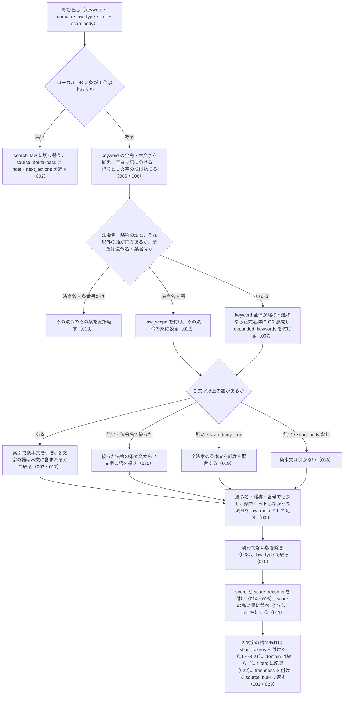

# 機能: search_fulltext（法令の条文本文をキーワードで横断検索する）

- 機能 ID: EGOV
- 種類: ツール
- 版: current
- 承認日:
- 起こした元: v0.15.1 の `src/tools/handlers.ts`（`handleSearchFulltext`）、`src/tools/definitions.ts`、`src/services/law-search.ts`、`src/services/relevance-scoring.ts`、`src/services/freshness.ts`、`src/constants.ts`、`src/tools/handlers.test.ts`、`src/services/law-search.test.ts`、`src/services/relevance-scoring.test.ts`、`src/services/freshness.test.ts`、`src/test-helpers/law-db-fixture.ts`
- 関連する Issue: houki-egov-mcp #23（2 文字の語の扱いと `scan_body`）

この文書は「このツールは何をするか」を書きます。どう実装しているか（関数名・テーブル名）は書きません。

## アクター

- MCP クライアント（Claude などの LLM、または CLI から呼ぶ人）。`keyword` を渡して、ローカル DB（`houki-egov-mcp --bulk-download-everything` で作ったもの）に入っている法令の条文本文から、キーワードを含む条の一覧を受け取る

## 入力

| 引数 | 必須 | 内容 |
|---|---|---|
| `keyword` | 必須 | 検索キーワード。空白で区切ると AND 検索。法令名・略称を含めると（例: `"民法 不法行為"`）その法令の条に絞る。「第30条」を含めると該当条を上位に寄せ、法令名 + 条番号だけ（例: `"民法 第709条"`）ならその条を直接返す |
| `domain` | 任意 | 分野タグ（`tax` など）。受け付けるが絞り込みはしない |
| `law_type` | 任意 | 法令種別で絞る。`Act` / `CabinetOrder` / `ImperialOrdinance` / `MinisterialOrdinance` / `Rule` のどれか |
| `limit` | 任意 | 返す件数。既定 10、最大 30 |
| `scan_body` | 任意 | 既定 `false`。`true` のとき、2 文字の語だけのクエリで索引を使わずに全法令の条本文を端から照合する |

## 処理の流れ

呼び出しを受けてから応答を返すまでに、何をどの順で確かめるかを示します。図の中の番号は「できること」の仕様 ID の末尾 3 桁です。

## できること

### SPEC-EGOV-SEARCH-FULLTEXT-001 ローカル DB に条があれば DB を引いて返す

ローカル DB に条が 1 件以上入っているときは、DB を引いて次のフィールドを持つ応答を返す。

| フィールド | 内容 |
|---|---|
| `keyword` | 前後の空白を除いた `keyword` |
| `source` | `bulk` |
| `count` | `hits` の件数 |
| `hits` | ヒットの配列（SPEC-EGOV-SEARCH-FULLTEXT-003・009） |
| `freshness` | DB の鮮度（SPEC-EGOV-SEARCH-FULLTEXT-023） |
| `filters` | `law_type`（渡した値か `null`）と `domain`（SPEC-EGOV-SEARCH-FULLTEXT-022） |
| `expanded_keywords` / `law_scope` / `short_tokens` | 該当するときだけ付く（SPEC-EGOV-SEARCH-FULLTEXT-007・012・017〜021） |

例: 消費税法の第30条と第30条の2に「適格請求書」がある DB で `{ keyword: "適格請求書" }` を渡すと、`source: "bulk"`、`count: 2`、`hits[0].law_title: "消費税法"` を返す。

### SPEC-EGOV-SEARCH-FULLTEXT-002 ローカル DB に条が無いときは search_law に切り替える

ローカル DB に条が 1 件も無い（`--bulk-download-everything` を実行していない）ときは、条本文を検索せず、法令名のタイトル一致の検索（`search_law` と同じもの）に切り替えて次を返す。

- `source`: `api-fallback`
- `note`: DB が無いため `search_law` に切り替えたことと、`houki-egov-mcp --bulk-download-everything` で DB を作ると本文を検索できることの説明
- `next_actions`: 1 件目は `action: "bulk_download_everything"`（`example.command` が `houki-egov-mcp --bulk-download-everything`）、2 件目は `search_law` の案内
- `fallback`: 切り替えた検索の応答そのもの。切り替えた検索がエラーを返したときはそのエラーの形（`code` など）が入る

例: 条が無い DB で `{ keyword: "" }` を渡すと、`source: "api-fallback"`、`next_actions[0].action: "bulk_download_everything"`、`fallback.code: "INVALID_ARGUMENT"` を返す。

### SPEC-EGOV-SEARCH-FULLTEXT-003 条本文にキーワードを含む条を返す

条本文にキーワードを含む条を、1 件ずつ次のフィールドで返す。

| フィールド | 内容 |
|---|---|
| `match_type` | `article` |
| `law_id` / `law_revision_id` / `law_title` / `law_num` / `law_type` | ヒットした法令とその版 |
| `article_num` | 条番号（表示形式。SPEC-EGOV-SEARCH-FULLTEXT-004） |
| `caption` / `chapter_path` | 条見出しと章節（無ければ `null`） |
| `snippet` | 条本文の一致箇所の抜粋。一致した語を `<b>` と `</b>` で囲む |
| `rank` / `score` / `score_reasons` | 並べ替えの根拠（SPEC-EGOV-SEARCH-FULLTEXT-015） |
| `url` | `https://laws.e-gov.go.jp/law/<law_id>` |

例: `適格請求書` では消費税法の `article_num` が `30` と `30の2` の 2 件を返し、`snippet` はどちらも `<b>適格請求書</b>` を含み、`url` は `https://laws.e-gov.go.jp/law/363AC0000000108`、`score` は 0 より大きく 1 以下。

### SPEC-EGOV-SEARCH-FULLTEXT-004 条番号は本則・附則・別表を区別した表示形式で返す

`hits[].article_num` は次の形で返す。

- 本則: `30`、枝番号は `30の2`
- 附則: `附則(<法令の中での附則の通し番号>) <条番号>`。例: `附則(3) 1`、`附則(137) 51の2`
- 別表: `別表(<番号>)`。例: `別表(2)`

### SPEC-EGOV-SEARCH-FULLTEXT-005 空白で区切った語は AND で探し、記号と 1 文字の語は捨てる

`keyword` を空白で語に分け、すべての語を含む条を探す（AND）。`"` `*` `:` `(` `)` と改行・タブは空白として扱う。1 文字の語は捨てる。語が残らないとき（1 文字だけ・記号だけ・空文字）はエラーにせず、`hits` を空で返す。

例: `税`、`"*:()`、空文字はどれも `hits: []`。

### SPEC-EGOV-SEARCH-FULLTEXT-006 全角英数字・全角空白・大文字の違いを吸収して探す

`keyword` の全角英数字と全角空白は半角に、英大文字は小文字にしてから探す。DB の本文も同じ規則で揃えてあるため、全角で渡しても半角で書かれた本文に当たる。

例: `４５時間` は、本文に `４５時間` とある労働基準法第36条に当たる（`article_num: "36"`）。

### SPEC-EGOV-SEARCH-FULLTEXT-007 略称・通称は正式名称にも OR 展開して探す

`keyword` 全体が略称辞書で houki-egov-mcp の管轄の法令の略称・通称に当たるときは、元の語に加えて正式名称でも探す（OR）。このとき応答に `expanded_keywords: { from: <元の語>, to: <正式名称> }` を付ける。

- 正式名称そのもの（例: `消費税法`）と辞書に無い語（例: `課税仕入れ`）は展開しない。`expanded_keywords` も付けない
- 略称が 2 文字以下（例: `消法`）のときは正式名称だけで探す

例: `労基法` は `労基法` または `労働基準法` で探す。`適格請求書` は `expanded_keywords: { from: "適格請求書", to: "消費税法" }`。`消法` は `expanded_keywords: { from: "消法", to: "消費税法" }` を付け、消費税法がヒットに入る。

### SPEC-EGOV-SEARCH-FULLTEXT-008 同じ法令の現行でない版は返さない

DB に同じ法令の複数の版があるときは、現行の版（または廃止後も効力が残る版）だけを返し、前の版（施行済みで置き換わった版）はヒットに入れない。条本文で探したとき・法令名で探したとき・`scan_body: true` で走査したときのどれでも同じ。

例: 消費税法の現行版と前の版がある DB で `適格請求書` を `limit: 30` で探すと、ヒットの `law_revision_id` は現行版の `363AC0000000108_20231001_000000000000000` の 1 種類だけ。

### SPEC-EGOV-SEARCH-FULLTEXT-009 法令名・略称で当たった法令は law_meta として返す

法令名・DB に記録された略称・法令番号に `keyword` が当たる法令は、条でヒットしていなければ `match_type: "law_meta"` のヒットとして足す。条本文を持たない法令（太政官布告など）もこれで返る。`law_meta` のヒットでは `article_num` / `caption` / `chapter_path` は `null`、`snippet` は法令名、`score_reasons` に `law_meta (法令名・略称・番号でヒット)` が入る。同じ法令の同じ版がすでに条でヒットしていれば `law_meta` のヒットは足さない。2 文字の語だけのクエリ（例: `改暦`）でも、法令名・略称にその語を含む法令を返す。

例: `改暦ノ布告` と `改暦` は、条を持たない `105DF0000000337`（明治五年太政官布告第三百三十七号（改暦ノ布告））を `law_meta` の 1 件で返す。DB の略称 `改暦の布告` でも同じ法令を返し、`score_reasons` に `abbrev_match` が入る。

### SPEC-EGOV-SEARCH-FULLTEXT-010 law_type で法令種別を絞る

`law_type` を渡したときは、その法令種別の法令のヒットだけを返す。応答の `filters.law_type` に渡した値を入れる（渡さなければ `null`）。

例: `改暦ノ布告` は `law_type: "Act"` で 0 件、`law_type: "CabinetOrder"` で 1 件。`{ keyword: "適格請求書", law_type: "CabinetOrder" }` は `count: 0`、`filters.law_type: "CabinetOrder"`。

### SPEC-EGOV-SEARCH-FULLTEXT-011 limit で返す件数を絞る

`limit` を渡したときは、score の高い順に並べたうえで先頭の `limit` 件だけを返す。

例: `{ keyword: "適格請求書", limit: 1 }` は `count: 1`（`limit` なしなら 2 件）。

### SPEC-EGOV-SEARCH-FULLTEXT-012 法令名と語を並べたクエリは、その法令の条に絞る

`keyword` が 2 語以上で、そのうち法令名・略称に当たる語と、それ以外の語の両方を含むときは、法令名の語を検索対象の法令の指定として扱い、残りの語でその法令の条本文だけを探す。法令名の語は本文に含まれていなくてよい。応答に `law_scope`（要素は `token`・`law_title`・`law_id`）を付ける。

- 法令名として扱う語は、略称辞書の正式名称・略称と一致する語（houki-egov-mcp の管轄のもの）と、DB の法令名と完全に一致する語。辞書の通称（例: `適格請求書`）は法令名として扱わない
- 1 語だけのクエリと、すべての語が法令名のクエリ（例: `消費税法 労基法`）には `law_scope` を付けず、絞らない（条番号を含むときは SPEC-EGOV-SEARCH-FULLTEXT-013）
- 指定した法令以外の条はヒットしない

例: `労基法 労働時間` は `law_scope[0]` が `{ token: "労基法", law_title: "労働基準法", law_id: "322AC0000000049" }` で、労働基準法第36条の 1 件を返す。`労基法 課税仕入れ` は 0 件（「課税仕入れ」は消費税法にしかない）。

### SPEC-EGOV-SEARCH-FULLTEXT-013 法令名と条番号だけのクエリは、その条を直接返す

`keyword` が法令名・略称と「第N条」「第N条のM」だけでできているときは、本文を検索せずにその法令のその条を返す。応答に `law_scope` を付け、ヒットの `score_reasons` に `article_num_match` が入り、`snippet` は条本文の冒頭（最大 120 文字）。その条が無ければ 0 件。

例: `労基法 第36条` は労働基準法第36条の 1 件（`snippet` は `使用者は` を含む）。`消費税法 第30条の2` は `article_num: "30の2"`。`労基法 第999条` は 0 件。

### SPEC-EGOV-SEARCH-FULLTEXT-014 キーワードに「第N条」があれば、その条のヒットを上位に寄せる

`keyword` に算用数字の「第N条」「第N条のM」（「第30の2条」のような書き方も含む）があるときは、本文の検索語には使わず、条番号が一致するヒットの `score` を 0.3 上げ、`score_reasons` に `article_num_match` を入れる。全角数字の「第３０条」も同じに扱う。漢数字の「第三十条」は条番号として扱わない。

例: `適格請求書 第30条` は、1 件目が `article_num: "30"` で `score_reasons` に `article_num_match` を含む。第30条の2のヒットには `article_num_match` が付かない。

### SPEC-EGOV-SEARCH-FULLTEXT-015 ヒットごとに 0〜1 の score とその内訳を付ける

各ヒットの `score` は 0 以上 1 以下の数で、`score_reasons` にその内訳を入れる。

- 基礎点: 検索の一致度（`rank`、負の数）から `1 / (1 + 10 / |rank|)` で出す。`score_reasons` の先頭に `fts rank <rank> → base <基礎点>` を入れる
- `title_exact_match`（+0.3）: 法令名が `keyword` と一致する（全角と半角・大文字と小文字・空白の違いは無視する）
- `abbrev_match`（+0.2）: 法令の略称（DB に記録された略称と、略称辞書の略称・通称）が `keyword` と一致する
- `article_num_match`（+0.3）: SPEC-EGOV-SEARCH-FULLTEXT-014
- `article_caption_match`（+0.1）: 条見出しが `keyword` を含む。「第30条」のような条番号だけのクエリでは付けない
- `supplementary_provision`（−0.15）: 附則の条。附則でない条には付けない

合計が 1 を超えるときは 1、0 を下回るときは 0 にする。

例: 基礎点 0.5 のヒットで、法令名が一致すれば 0.8、略称が一致すれば 0.7、附則の条なら 0.35。

### SPEC-EGOV-SEARCH-FULLTEXT-016 ヒットは score の高い順に並べる

`hits` は `score` の高い順に並べる。`score` が同じときは検索の一致度の高い順（`rank` の小さい順）に並べる。

### SPEC-EGOV-SEARCH-FULLTEXT-017 3 文字以上の語があるときは、索引で引いた条を 2 文字の語で絞る

条本文の索引は 3 文字以上の語しか載せない。3 文字以上の語と 2 文字の語が混ざったクエリでは、3 文字以上の語で索引を引き、その条の本文に 2 文字の語がすべて含まれるものだけを返す（AND）。応答の `short_tokens` は `body_search: "fts_then_filter"`、`tokens`（2 文字の語）、`truncated: false`。このときは `scan_body: true` を渡しても同じ。

例: `適格請求書 保存` は第30条だけを返し（「保存」は第30条の本文にだけある）、`short_tokens.tokens` は `["保存"]`。`適格請求書 判例` は 0 件。

### SPEC-EGOV-SEARCH-FULLTEXT-018 2 文字の語だけのクエリは、既定では条本文を引かずにそのことを返す

法令名で絞っておらず 3 文字以上の語も無いクエリ（例: `控除`）で `scan_body` を渡さないときは、条本文を引かず、法令名・略称・番号の照合（SPEC-EGOV-SEARCH-FULLTEXT-009）の結果だけを返す。応答の `short_tokens` は次のとおり。

- `tokens`: 2 文字の語。`fts_min_token_length`: `3`
- `body_search`: `not_searched`
- `hits_by_match_type`: `{ article: 0, law_meta: <法令名で当たった件数> }`
- `note`: 語が 3 文字未満で索引に載らないことと、条の本文は引いていないこと（`trigram` の語と「条の本文は引いていません」を含む）
- `next_actions`: 2 件。1 件目は `search_fulltext` に法令名を添える形（`example: { keyword: "民法 <語>" }`）、2 件目は `scan_body: true` で走査する形（`example: { keyword: <語を空白でつないだもの>, scan_body: true }`）

例: `控除` は `hits` がすべて `law_meta`、`short_tokens.next_actions` の `example` は `{ keyword: "民法 控除" }` と `{ keyword: "控除", scan_body: true }`。

### SPEC-EGOV-SEARCH-FULLTEXT-019 scan_body: true のときは全法令の条本文を端から照合する

SPEC-EGOV-SEARCH-FULLTEXT-018 と同じクエリで `scan_body: true` を渡したときは、索引を使わずに全法令の条本文から 2 文字の語をすべて含む条を探して返す。`snippet` は条本文の一致位置の前後の抜粋。応答の `short_tokens` は `body_search: "like_all_articles"`、`note` に `scan_body: true` を含み、`next_actions` は付けない。`hits_by_match_type` で、返したヒットのうち条本文で当たった件数と法令名で当たった件数が分かる。

例: `{ keyword: "控除", scan_body: true }` は消費税法第30条を `match_type: "article"` で返し、`short_tokens` は `truncated: false`、`hits_by_match_type.article: 1`。`{ keyword: "改暦", scan_body: true }` は `hits_by_match_type: { article: 0, law_meta: 1 }`（「改暦」は法令名にだけある）。

### SPEC-EGOV-SEARCH-FULLTEXT-020 法令名で絞ったクエリの 2 文字の語は、その法令の条本文から探す

SPEC-EGOV-SEARCH-FULLTEXT-012 で法令を絞り、残りが 2 文字の語だけのときは、`scan_body` を渡さなくても、絞った法令の条本文から 2 文字の語をすべて含む条を探して返す。応答の `short_tokens` は `body_search: "like_in_law_scope"`。

例: `労基法 協定` は労働基準法第36条の 1 件を返し、`short_tokens.hits_by_match_type` は `{ article: 1, law_meta: 0 }`。

### SPEC-EGOV-SEARCH-FULLTEXT-021 2 文字の語を含まないクエリには short_tokens を付けない

クエリに 2 文字の語が無いとき（3 文字以上の語だけ、または 1 文字の語だけ）は、応答に `short_tokens` を付けない。

例: `適格請求書` と `税` には `short_tokens` が付かない。

### SPEC-EGOV-SEARCH-FULLTEXT-022 domain は受け付けるが絞り込まない

`domain` を渡してもヒットは絞らない。応答の `filters.domain` に `requested`（渡した値か `null`）、`applied: false`、`note`（絞り込みがまだ効かないことの説明。`Phase 2-13` を含む）を入れる。`domain` を渡さないときも `applied: false` を入れる。

例: `{ keyword: "適格請求書", domain: "tax" }` は `filters.domain.requested: "tax"`、`applied: false`。

### SPEC-EGOV-SEARCH-FULLTEXT-023 DB の鮮度を freshness で返す

`source: "bulk"` の応答の `freshness` に、DB を最後に同期した日からの鮮度を入れる。DB に同期の記録が無いときは `null`。

| フィールド | 内容 |
|---|---|
| `last_sync_date` | 最後に同期を終えた日（`YYYY-MM-DD`） |
| `last_full_dl_at` | 最後に全件を取り込んだ日時 |
| `days_since_sync` | `last_sync_date` からの経過日数 |
| `staleness` | 経過日数が 7 日未満なら `fresh`、30 日未満なら `stale`、30 日以上なら `outdated` |
| `warning` | `outdated` のときだけ付く。`bulk DB が <日数> 日前のデータです` と、`houki-egov-mcp --sync`（最終同期から 90 日を超えていれば `--bulk-download-everything`）の実行の案内 |

鮮度が `outdated` でも DB を引いた結果を返す。

例: 最終同期が 1 日前なら `staleness: "fresh"`、`days_since_sync: 1`、`warning` なし。ちょうど 7 日前なら `stale`。38 日前なら `outdated` で、`warning` に `日前` と `bulk-download` を含む。

## できないこと

- 条文の本文を丸ごと返すこと（`snippet` だけ。本文は `get_law` / `get_law_range`）
- ローカル DB を作ること・更新すること（CLI の `--bulk-download-everything` / `--sync`）
- `domain` で分野を絞ること（SPEC-EGOV-SEARCH-FULLTEXT-022）
- 漢数字の「第三十条」を条番号として扱うこと（本文の語として探す）
- 1 文字の語で探すこと
- 前の版（施行済みで置き換わった版）や未施行の版の条を探すこと、時点を指定して探すこと
- 部分一致以外の探し方（似た語・読み仮名・同義語）。展開するのは略称辞書にある略称・通称から正式名称への 1 つだけ

## 未決

初版起こしで見つけた、意図か不具合かを人が決める項目です。決まったら「できること」に ID を振るか、`specs/changes/` の差分にします。

意図か不具合かの判断が要る項目は houki-egov-mcp の Issue に移し、ここには題と Issue の番号だけを残します。今の振る舞いのままでよくテストが無いだけの項目は、受入テストを書いてから「できること」に ID を振ります。

1. **空の `keyword` の扱いが DB の有無で変わる。** DB に条があるときは、空の `keyword`（空白だけを含む）でもエラーにせず `source: "bulk"`・`hits: []` を返す。DB が無いときは切り替え先の `search_law` が `INVALID_ARGUMENT` を返すが、ツールの応答は `source: "api-fallback"` の通常の応答で、エラーは `fallback` の中に入る（ツールとしてのエラーにならない）。空の `keyword` をツールのエラー `INVALID_ARGUMENT` にするか、今のままにするかを決める必要がある。
2. **tool description と引数の説明に古い版番号が残っている。** `domain` の説明は「v0.5.0 では受け付けるが絞り込みは行わない」、応答の `filters.domain.note` も「v0.5.0 では未実効」と書くが、今の版は v0.15.1。文言を今の版に合わせるか、`domain` の扱い自体を決め直すかを決める必要がある。
3. **通称の OR 展開で、正式名称を本文に書いた他の法令の条まで当たる。** `インボイス` や `適格請求書` のような通称は、正式名称（`消費税法`）でも本文を探すため、本文に「消費税法」と書いた他の法令の条も当たる（テストの DB には該当する本文が無いので表に出ていない）。通称の展開を法令名の照合だけに使うか、本文の検索にも使うかを決める必要がある。
4. **2 文字の語だけのときの `next_actions` の例は常に「民法」を添える。** `short_tokens.next_actions[0].example` は、クエリの語が何であっても `民法 <語>` になる（例: `控除` でも `民法 控除`）。例として固定の法令名を出すのでよいか、語から法令を選ぶか、法令名を空けた形にするかを決める必要がある。
5. **`limit` の範囲。** `limit` は 1 未満なら 1、30 を超えれば 30 にして使い、省略時は 10 件を返す。範囲外の値をエラーにせず丸めていることは応答に出ない。テストが無い。ID を振るのは受入テストを書いてから。
6. **DB を開けないときの切り替え。** DB のファイルを開けない（権限・ディスクなど）ときも、SPEC-EGOV-SEARCH-FULLTEXT-002 と同じく `search_law` に切り替え、`note` の理由を「bulk DB を開けなかったため」にして返す。テストが無い。ID を振るのは受入テストを書いてから。
7. **DB が無いときに `keyword` があれば `search_law` の結果が `fallback` に入ること。** SPEC-EGOV-SEARCH-FULLTEXT-002 のテストは空の `keyword`（`fallback` がエラーになる形）だけで、e-Gov を引いて法令名で当たった結果が `fallback` に入る形と、`law_type`・`limit` が切り替え先に渡ることは確かめていない。テストが無い。ID を振るのは受入テストを書いてから。
8. **走査の打ち切り。** `scan_body: true` と法令名で絞った 2 文字の語の検索は 150 件で打ち切り、打ち切ったときは `short_tokens.truncated: true` にし、`note` に打ち切った旨を足す。`truncated: true` になる場合のテストが無い。ID を振るのは受入テストを書いてから。
9. **`keyword` の前後の空白。** 応答の `keyword` は前後の空白を除いた値になる。テストが無い。ID を振るのは受入テストを書いてから。
