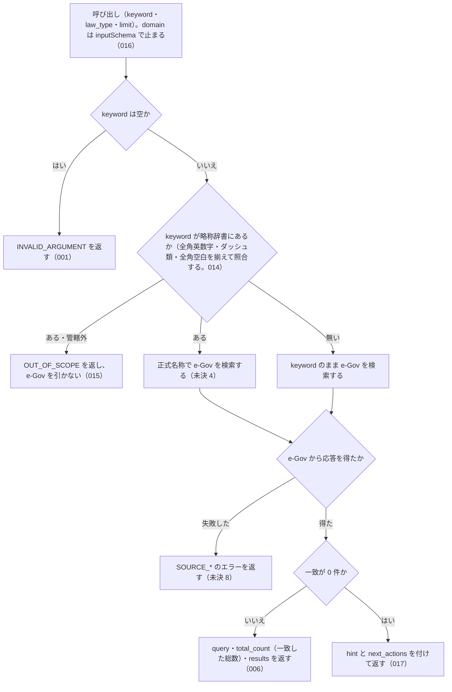

# 機能: search_law（法令をタイトルのキーワード・略称で検索する）

- 機能 ID: EGOV
- 種類: ツール
- 版: current
- 承認日: 2026-09-28（PR #50）。差分 `20260928-undecided-to-issues` は 2026-09-28（PR #68）。差分 `20260928-untested-behaviors` は 2026-09-28（PR #76）。差分 `20261001-t1-argument-guards` は 2026-10-01（PR #84）。差分 `20261001-t3-normalize` は 2026-10-01（PR #86）。差分 `20261003-search-explain-attachment` は 2026-10-03（PR #96）。差分 `20261003-law-type-and-reference-actions` は 2026-10-03（PR #99）
- 起こした元: v0.15.1 の `src/tools/definitions.ts`、`src/tools/handlers.ts`、`src/services/law-service.ts`、`src/services/egov-client.ts`、`src/errors.ts`、`src/tools/handlers.test.ts`、`src/server.test.ts`
- 関連する Issue: なし

この文書は「このツールは何をするか」を書きます。どう実装しているか（関数名・テーブル名）は書きません。

## アクター

- MCP クライアント（Claude などの LLM、または CLI から呼ぶ人）。`keyword`（法令名の一部または略称）を渡して、e-Gov 法令API v2 で法令名が一致する法令の一覧（法令 ID・題名・法令番号・種別・e-Gov の URL）を受け取る

## 入力

| 引数       | 必須 | 内容                                                                                                                                      |
| ---------- | ---- | ----------------------------------------------------------------------------------------------------------------------------------------- |
| `keyword`  | 必須 | 検索キーワード。法令名の一部（例: `"消費税"`、`"労働基準"`）か略称（例: `"消法"`、`"労基法"`）                                            |
| `law_type` | 任意 | 法令種別で絞り込む。`Constitution` / `Act` / `CabinetOrder` / `ImperialOrder` / `MinisterialOrdinance` / `Rule` のどれか（SPEC-EGOV-SEARCH-LAW-018。e-Gov の `law_type` の値と同じ） |
| `limit`    | 任意 | 取得件数。既定は 10。1 以上 50 以下の整数（SPEC-EGOV-SEARCH-LAW-013） |

## 処理の流れ

呼び出しを受けてから応答を返すまでに、何をどの順で確かめるかを示します。図の中の番号は「できること」の仕様 ID の末尾 3 桁です。ID の無い枝はテストが無い振る舞いで、「未決」に書いています。

## できること

### SPEC-EGOV-SEARCH-LAW-001 空の keyword は検索せずにエラー `INVALID_ARGUMENT` を返す

`keyword` が空文字のときは、inputSchema の `minLength: 1` の検査（SPEC-EGOV-COMMON-ERRORS-025）で止まり、e-Gov を検索せずにエラー `INVALID_ARGUMENT` を返す。本文は inputSchema の検査のエラーの形（SPEC-EGOV-COMMON-ERRORS-013・014・020・021・022）で、`tool: "search_law"`、`detail.issues` は `[{ path: "keyword", message: "空文字は指定できません" }]`。

例: `keyword: ""` は `isError: true`・`code: "INVALID_ARGUMENT"`・`tool: "search_law"`・`error: "引数が tools/list の inputSchema に合いません: keyword: 空文字は指定できません"` で、e-Gov への問い合わせは 0 回。

### SPEC-EGOV-SEARCH-LAW-002 略称は正式名称に置き換えて検索し、`query.resolved` に正式名称を入れる

`keyword` が略称辞書の略称と一致するときは、その正式名称を e-Gov の `/laws` の `law_title` に渡して検索し、応答の `query.resolved` に正式名称を入れる。

例: `keyword: "消法"` は、e-Gov に `law_title=消費税法` で問い合わせ、応答は `query.keyword: "消法"`・`query.resolved: "消費税法"`。e-Gov が `消費税法`・`消費税法施行令` の 2 件を返せば、`results` の先頭は `title: "消費税法"`。

### SPEC-EGOV-SEARCH-LAW-003 辞書に無い keyword はそのまま検索し、`query.resolved` を付けない

`keyword` が略称辞書の略称・正式名称・別名のどれとも一致しないときは、`keyword` をそのまま `law_title` に渡して検索し、応答の `query` に `resolved` のキーを付けない。

例: `keyword: "消費税法施行"` は、e-Gov に `law_title=消費税法施行` で問い合わせ、応答の `query` は `{ "keyword": "消費税法施行" }`（`resolved` のキーが無い）。

### SPEC-EGOV-SEARCH-LAW-004 正式名称・別名も、辞書の正式名称に置き換えて検索する

`keyword` が略称辞書のエントリの正式名称や別名と一致するときも、SPEC-EGOV-SEARCH-LAW-002 と同じく、そのエントリの正式名称で検索し、`query.resolved` に正式名称を入れる。

例: `keyword: "消費税"`（`消法` の別名）と `keyword: "インボイス"`（`消法` の別名）は、どちらも e-Gov に `law_title=消費税法` で問い合わせ、`query.resolved: "消費税法"`。`query.keyword` は渡した `"消費税"`・`"インボイス"` のまま。

### SPEC-EGOV-SEARCH-LAW-005 前後の空白を除いてから略称辞書と照合し、`query.keyword` は渡した値のまま返す

`keyword` の前後の空白を除いてから略称辞書と照合し、除いた後の文字列で検索する。応答の `query.keyword` には、除く前の渡した値をそのまま入れる。

例: `keyword: " 消法 "` は `query.keyword: " 消法 "`・`query.resolved: "消費税法"` で、e-Gov への問い合わせは `law_title=消費税法`。

### SPEC-EGOV-SEARCH-LAW-006 成功時の応答の形

成功したときは、エラーにせず（`isError` を付けず）、`content[0].text` に次の形の JSON の文字列を返す。

| フィールド     | 内容                                                                                                   |
| -------------- | ------------------------------------------------------------------------------------------------------ |
| `query`        | `keyword`（渡した値）。`law_type`（渡したときだけ）、`resolved`（SPEC-EGOV-SEARCH-LAW-002）            |
| `total_count`  | e-Gov で一致した法令の総数（e-Gov の応答の `total_count`。`limit` で切る前の件数）。`results` の件数とは限らない |
| `results`      | e-Gov が返した法令の配列。e-Gov が返した順。件数は `limit` 以下                                        |
| `hint`         | 一致が 0 件のときの案内の文（SPEC-EGOV-SEARCH-LAW-017）。1 件以上のときは `null`                      |
| `next_actions` | 一致が 0 件のときの次の手（SPEC-EGOV-SEARCH-LAW-017）。1 件以上のときは `[]`                            |

`results` の要素は次のフィールドを持つ。

| フィールド          | 内容                                                           |
| ------------------- | -------------------------------------------------------------- |
| `law_id`            | 法令 ID                                                        |
| `title`             | 法令名                                                         |
| `law_num`           | 法令番号                                                       |
| `law_type`          | 法令種別（`Act` など。e-Gov の値のまま）                       |
| `promulgation_date` | 公布日（`YYYY-MM-DD`）。e-Gov の応答に無ければ付かない         |
| `url`               | `https://laws.e-gov.go.jp/law/<law_id>`                        |

出力の形式を選ぶ引数（`format` など）は無い。`format` を渡すと、inputSchema に無い引数として `INVALID_ARGUMENT`（`detail.issues[0].path: "format"`）を返す。

例: `keyword: "消法"` で e-Gov が消費税法（法令 ID `363AC0000000108`、法令番号 `昭和六十三年法律第百八号`、公布日 `1988-12-30`）を返すと、`results[0]` は `law_id: "363AC0000000108"`・`title: "消費税法"`・`law_num: "昭和六十三年法律第百八号"`・`law_type: "Act"`・`promulgation_date: "1988-12-30"`・`url: "https://laws.e-gov.go.jp/law/363AC0000000108"`、`hint: null`、`next_actions: []`。`keyword: "保険", limit: 2`（辞書に無い）は、2026-10-03 10:20 JST の e-Gov が `/laws?law_title=保険` に `total_count: 278` を返すので、`total_count: 278`・`results` は 2 件（v0.17.0 では `total_count: 2`。同じ時刻に houki-egov-dev 0.17.0 で確かめた）。e-Gov が 0 件を返すと（`keyword: "存在しない"`）、`total_count: 0`・`results: []` で、エラーにせず SPEC-EGOV-SEARCH-LAW-017 の `hint` と `next_actions` を付ける。

### SPEC-EGOV-SEARCH-LAW-007 空白だけの keyword も検索せずにエラー `INVALID_ARGUMENT` を返す

`keyword` が空白（半角スペース・全角スペース・タブ・改行）だけのときは、e-Gov に問い合わせずにエラー `INVALID_ARGUMENT` を返す。本文は SPEC-EGOV-COMMON-ERRORS-026 の形で、`tool: "search_law"`、`error: "keyword が空です"`、`detail.issues` は `[{ path: "keyword", message: "空白だけは指定できません" }]`、`hint` には検索したい法令名・略称・キーワードを指定するよう書く（例: `"消費税"`、`"労基"`）。

例: `keyword: "   "` と `keyword: "\t\n"` は、どちらも `isError: true`・`code: "INVALID_ARGUMENT"`・`tool: "search_law"`・`error: "keyword が空です"`・`detail.issues[0].path: "keyword"` で、e-Gov への問い合わせは 0 回。

### SPEC-EGOV-SEARCH-LAW-008 law_type を e-Gov の検索に渡し、`query.law_type` に入れる

`law_type` を渡すと、e-Gov の `/laws` の `law_type` に同じ値を渡して問い合わせ、応答の `query.law_type` に渡した値を入れる。種別での絞り込みは e-Gov が行う。`law_type` を渡さないときは、問い合わせに `law_type` を付けず、応答の `query` に `law_type` のキーを付けない。

例: `keyword: "労働基準", law_type: "Act"` は、e-Gov に `law_title=労働基準&law_type=Act` で問い合わせ、`query.law_type: "Act"`。e-Gov が `労働基準法` の 1 件を返せば、`results` は `title: "労働基準法"`・`law_type: "Act"` の 1 件。`keyword: "消法"`（`law_type` なし）の応答の `query` には `law_type` のキーが無い。

### SPEC-EGOV-SEARCH-LAW-009 e-Gov が 429 を返したら `SOURCE_RATE_LIMITED` を返す

e-Gov が 429 を返し続けたときは、エラー `SOURCE_RATE_LIMITED` を返す。`retryable: true`、`detail` は `status: 429` と `url`（問い合わせた URL）、`next_actions[0].action` は `retry_later`。

例: `keyword: "err429"` で e-Gov が常に 429 を返すと、`isError: true`・`code: "SOURCE_RATE_LIMITED"`・`retryable: true`・`detail.status: 429`・`detail.url: "https://laws.e-gov.go.jp/api/2/laws?law_title=err429&limit=10"`。

### SPEC-EGOV-SEARCH-LAW-010 e-Gov への問い合わせがタイムアウトしたら `SOURCE_TIMEOUT` を返す

e-Gov への問い合わせが時間切れで打ち切られたときは、エラー `SOURCE_TIMEOUT` を返す。`retryable: true`、`detail` は `url`（問い合わせた URL）だけを持ち `status` を持たない。`next_actions` は `retry_later` と `visit_egov_site` の順。

例: `keyword: "errabort"` で問い合わせが打ち切られる（`fetch` が `name: "AbortError"` の例外で失敗する）と、`isError: true`・`code: "SOURCE_TIMEOUT"`・`retryable: true`・`detail.url: "https://laws.e-gov.go.jp/api/2/laws?law_title=errabort&limit=10"`。

### SPEC-EGOV-SEARCH-LAW-011 e-Gov が 5xx を返したら `retryable: true` の `SOURCE_API_ERROR` を返す

e-Gov が 500 以上の status を返し続けたときは、エラー `SOURCE_API_ERROR` を `retryable: true` で返す。`detail` は `status` と `url`、`next_actions` は `retry_later` と `visit_egov_site` の順。

例: `keyword: "err503"` で e-Gov が常に 503 を返すと、`isError: true`・`code: "SOURCE_API_ERROR"`・`retryable: true`・`detail.status: 503`・`error: "e-Gov API がサーバーエラーを返しました（503）"`。

### SPEC-EGOV-SEARCH-LAW-012 e-Gov が 429 以外の 4xx を返したら `retryable: false` の `SOURCE_API_ERROR` を返す

e-Gov が 429 以外の 400〜499 の status を返したときは、エラー `SOURCE_API_ERROR` を `retryable: false` で返す。`detail` は `status` と `url`。

例: `keyword: "err400"` で e-Gov が 400 を返すと、`isError: true`・`code: "SOURCE_API_ERROR"`・`retryable: false`・`detail.status: 400`・`detail.url: "https://laws.e-gov.go.jp/api/2/laws?law_title=err400&limit=10"`。404 でも同じく `retryable: false`（`detail.status: 404`）。

### SPEC-EGOV-SEARCH-LAW-013 `limit` は 1 以上 50 以下の整数で、範囲の外は `INVALID_ARGUMENT` にして丸めない

tools/list の inputSchema の `limit` は `type: "integer"`、`minimum: 1`、`maximum: 50` を持つ（SPEC-EGOV-COMMON-ERRORS-023）。0・負の数・小数・51 以上・数値でない値を渡すと、inputSchema の検査で `INVALID_ARGUMENT`（`tool: "search_law"`、`detail.issues[0].path: "limit"`）を返し、e-Gov に問い合わせない。50 以下に切り詰めたり、既定の 10 に戻したりしない。1 以上 50 以下の整数は、その件数を e-Gov に渡す。

例: `keyword: "消費税", limit: 100` は `code: "INVALID_ARGUMENT"`、`detail.issues` は `[{ path: "limit", message: "50 以下で指定してください" }]` で、e-Gov への問い合わせは 0 回（v0.15.4 では 100 件返っていた）。`limit: 0` は `[{ path: "limit", message: "1 以上で指定してください" }]`、`limit: 2.5` は `[{ path: "limit", message: "整数で指定してください" }]`、`limit: "10"` も `整数で指定してください`。`limit: 50` は e-Gov の `/laws` を `limit=50` で引く。`limit: 1` は `limit=1` で引く。

### SPEC-EGOV-SEARCH-LAW-014 `keyword` の略称の照合で全角英数字・ダッシュ類・全角空白を吸収する

`keyword` を略称辞書と照合するとき（SPEC-EGOV-SEARCH-LAW-002）は、houki-abbreviations の `resolveAbbreviation(name, { normalize: true })` の規則（全角英数字を半角に、ダッシュ類を `-` に、全角チルダを `~` に、全角空白を半角空白にし、前後の空白を除く。大文字と小文字は区別する）で揃えてから照合する。辞書に当たれば正式名称を e-Gov に渡し、当たらなければ前後の空白を除いた渡した値のまま `law_title` に渡す（揃えない）。応答の `query.keyword` は渡した値のまま。

例: `keyword: "ＰＬ法"` は e-Gov に `law_title=製造物責任法` で問い合わせ、`query.keyword: "ＰＬ法"`・`query.resolved: "製造物責任法"`（v0.15.4 では `law_title=ＰＬ法` で問い合わせて 0 件だった）。

### SPEC-EGOV-SEARCH-LAW-015 houki-egov の管轄でない略称は `OUT_OF_SCOPE` を返し、e-Gov を引かない

`keyword` が略称辞書で houki-egov 以外の管轄（通達は houki-nta など）と分かる名前のときは、エラー `OUT_OF_SCOPE` を返し、e-Gov には問い合わせない。本文は `get_law` の SPEC-EGOV-GET-LAW-001・032 と同じ（`error` に正式名称と管轄、`hint` に管轄先の MCP、`next_actions` に `delegate_to_mcp`）。

例: `keyword: "消基通"` は `code: "OUT_OF_SCOPE"` で、e-Gov への問い合わせは 0 回（v0.15.4 では `law_title=消費税法基本通達` で問い合わせて `results: []` だった）。`keyword: "消費税"`（辞書に無い）は今までどおり e-Gov を検索する。

### SPEC-EGOV-SEARCH-LAW-016 `domain` は引数に無く、渡すと `INVALID_ARGUMENT` にする

tools/list の `search_law` の inputSchema は `domain` を持たない（0.17.0 までは受け付けたが、e-Gov の検索にも結果の選別にも使っていなかった）。`domain` を渡すと、inputSchema に無い引数として SPEC-EGOV-COMMON-ERRORS-004 の `INVALID_ARGUMENT`（`tool: "search_law"`、`detail.issues: [{ path: "domain", message: "inputSchema に無い引数です" }]`）を返し、e-Gov に問い合わせない。

例: `{ keyword: "労働基準", domain: "tax", law_type: "Act" }` は `code: "INVALID_ARGUMENT"`、`detail.issues[0].path: "domain"`（v0.17.0 では `domain` を使わずに検索し、労働分野の `労働基準法` を返していた）。`{ keyword: "労働基準", law_type: "Act" }` は今までどおり検索する。

### SPEC-EGOV-SEARCH-LAW-017 一致が 0 件のときは、法令の題名だけを探したことと次の手を返す

e-Gov の検索が成功して 0 件だったときは、エラーにせず（`total_count: 0`・`results: []`）、次の `hint` と `next_actions` を付ける。

- `hint`: `「<検索した名前>」を題名に含む法令は e-Gov にありません。search_law は法令の題名だけを探します。条文の本文にある語なら search_fulltext、略称なら resolve_abbreviation を試してください`。`<検索した名前>` は e-Gov に渡した `law_title`（略称なら正式名称）
- `next_actions`（この順）:
  1. `law_type` を渡したときだけ、`{ action: "search_law", reason: "法令種別を外して探せます", example: { keyword: <渡した keyword>, limit: <渡した limit（渡したときだけ）> } }`
  2. `{ action: "search_fulltext", reason: "条文の本文から語を探せます（ローカル DB がある場合）", example: { keyword: <前後の空白を除いた keyword> } }`
  3. `{ action: "resolve_abbreviation", reason: "略称・通称かどうかを確かめられます", example: { abbr: <前後の空白を除いた keyword> } }`

例: `{ keyword: "存在しない" }` は `total_count: 0`、`results: []`、`hint` は `「存在しない」を題名に含む法令は e-Gov にありません。…` で始まり、`next_actions` の `action` は `["search_fulltext", "resolve_abbreviation"]`。`{ keyword: "存在しない", law_type: "Act" }` は `["search_law", "search_fulltext", "resolve_abbreviation"]` で、1 件目の `example` は `{ keyword: "存在しない" }`。v0.17.0 では `hint` も `next_actions` も無かった。

### SPEC-EGOV-SEARCH-LAW-018 `law_type` の選択肢は e-Gov の `law_type` の値と同じで、勅令は `ImperialOrder`

tools/list の `search_law` の inputSchema の `law_type` は、`enum: ["Constitution", "Act", "CabinetOrder", "ImperialOrder", "MinisterialOrdinance", "Rule"]` を持つ。どれも e-Gov 法令 API v2 の `/laws` の `law_type` が受け付け、応答の `results[].law_type` に入る値である。`ImperialOrdinance` は選択肢に無く、渡すと inputSchema の検査で `INVALID_ARGUMENT`（`tool: "search_law"`、`detail.issues: [{ path: "law_type", message: "Constitution・Act・CabinetOrder・ImperialOrder・MinisterialOrdinance・Rule のどれかで指定してください" }]`）を返し、e-Gov に問い合わせない。

例: `{ keyword: "健康保険法", law_type: "ImperialOrder" }` は、e-Gov に `law_title=健康保険法&law_type=ImperialOrder` で問い合わせ、`results` に健康保険法施行令（`215IO0000000243`、大正十五年勅令第二百四十三号、`law_type: "ImperialOrder"`）が入る。`{ keyword: "健康保険法", law_type: "ImperialOrdinance" }` は `code: "INVALID_ARGUMENT"`・`detail.issues[0].path: "law_type"` で、e-Gov への問い合わせは 0 回（v0.17.0 では inputSchema を通り、e-Gov が 400・`400001` を返して `SOURCE_API_ERROR`・`retryable: false` だった。2026-10-03 10:19 JST に houki-egov-dev 0.17.0 で確かめた）。`{ keyword: "日本国憲法", law_type: "Constitution" }` は日本国憲法（`321CONSTITUTION`）を返す（v0.17.0 では `Constitution` が選択肢に無く `INVALID_ARGUMENT`）。

2026-10-03 10:18 JST に e-Gov の `/laws?law_type=<値>&limit=1` で確かめた値: `Constitution` 1 件、`ImperialOrder` 74 件、`Rule` 453 件（いずれも 200）、`ImperialOrdinance` は 400・`{"code":"400001","message":"法令種別（law_type、law_num_type）が誤っています。"}`。

## できないこと

- 条文の本文を検索すること（本文の全文検索は `search_fulltext`）
- 条文を返すこと（条文の取得は `get_law`）
- 通達を検索すること（通達は e-Gov に収録されていない）
- 略称辞書の内容を確かめること（`resolve_abbreviation`）
- 時点を指定して、その時点の法令名で検索すること

## 未決

初版起こしで見つけた、意図か不具合かを人が決める項目です。決まったら「できること」に ID を振るか、`specs/changes/` の差分にします。

意図か不具合かの判断が要る項目は houki-egov-mcp の Issue に移し、ここには題と Issue の番号だけを残します。今の振る舞いのままでよくテストが無いだけの項目は、受入テストを書いてから「できること」に ID を振ります。

4. **略称を正式名称に置き換えて検索する。** → SPEC-EGOV-SEARCH-LAW-002・SPEC-EGOV-SEARCH-LAW-003・SPEC-EGOV-SEARCH-LAW-004・SPEC-EGOV-SEARCH-LAW-005
5. **成功時の応答の形。** → SPEC-EGOV-SEARCH-LAW-006
6. **空白だけの `keyword`。** → SPEC-EGOV-SEARCH-LAW-007
7. **`law_type` で絞り込む。** → SPEC-EGOV-SEARCH-LAW-008
8. **e-Gov への問い合わせに失敗したときのエラー。** → SPEC-EGOV-SEARCH-LAW-009・SPEC-EGOV-SEARCH-LAW-010・SPEC-EGOV-SEARCH-LAW-011・SPEC-EGOV-SEARCH-LAW-012（一部は約束にしていない。差分 `20260928-untested-behaviors` の proposal.md を参照）
