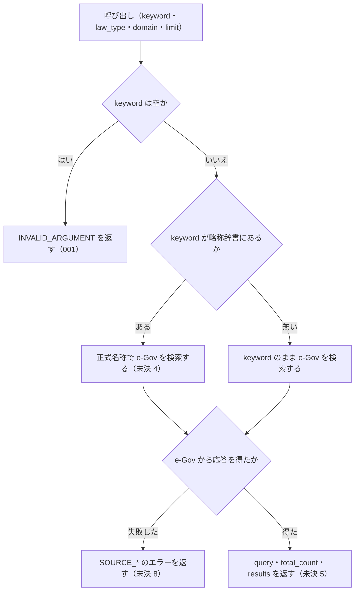

# 機能: search_law（法令をタイトルのキーワード・略称で検索する）

- 機能 ID: EGOV
- 種類: ツール
- 版: current
- 承認日:
- 起こした元: v0.15.1 の `src/tools/definitions.ts`、`src/tools/handlers.ts`、`src/services/law-service.ts`、`src/services/egov-client.ts`、`src/errors.ts`、`src/tools/handlers.test.ts`、`src/server.test.ts`
- 関連する Issue: なし

この文書は「このツールは何をするか」を書きます。どう実装しているか（関数名・テーブル名）は書きません。

## アクター

- MCP クライアント（Claude などの LLM、または CLI から呼ぶ人）。`keyword`（法令名の一部または略称）を渡して、e-Gov 法令API v2 で法令名が一致する法令の一覧（法令 ID・題名・法令番号・種別・e-Gov の URL）を受け取る

## 入力

| 引数 | 必須 | 内容 |
|---|---|---|
| `keyword` | 必須 | 検索キーワード。法令名の一部（例: `"消費税"`、`"労働基準"`）か略称（例: `"消法"`、`"労基法"`） |
| `law_type` | 任意 | 法令種別で絞り込む。`Act` / `CabinetOrder` / `ImperialOrdinance` / `MinisterialOrdinance` / `Rule` のどれか |
| `domain` | 任意 | 分野タグ。`tax` / `labor` / `accounting` / `commercial` / `civil` / `administrative` のどれか（v0.15.1 では絞り込みに使われない。未決 1） |
| `limit` | 任意 | 取得件数。既定は 10。inputSchema の説明では最大 50（v0.15.1 では上限をかけない。未決 2） |

## 処理の流れ

呼び出しを受けてから応答を返すまでに、何をどの順で確かめるかを示します。図の中の番号は「できること」の仕様 ID の末尾 3 桁です。ID の無い枝はテストが無い振る舞いで、「未決」に書いています。

## できること

### SPEC-EGOV-SEARCH-LAW-001 空の keyword は検索せずにエラー `INVALID_ARGUMENT` を返す

`keyword` が空文字のときは、e-Gov を検索せずにエラー `INVALID_ARGUMENT` を返す。本文は `error`（`keyword が空です`）と `code` と `hint` を持ち、`hint` には検索したい法令名・略称・キーワードを指定するよう書く（例: `"消費税"`、`"労基"`）。

## できないこと

- 条文の本文を検索すること（本文の全文検索は `search_fulltext`）
- 条文を返すこと（条文の取得は `get_law`）
- 通達を検索すること（通達は e-Gov に収録されていない）
- 略称辞書の内容を確かめること（`resolve_abbreviation`）
- 時点を指定して、その時点の法令名で検索すること

## 未決

初版起こしで見つけた、意図か不具合かを人が決める項目です。決まったら「できること」に ID を振るか、`specs/changes/` の差分にします。

意図か不具合かの判断が要る項目は houki-egov-mcp の Issue に移し、ここには題と Issue の番号だけを残します。今の振る舞いのままでよくテストが無いだけの項目は、受入テストを書いてから「できること」に ID を振ります。

1. **`domain` を受け付けるが絞り込みに使わない。** inputSchema の説明は「分野タグで絞り込み（略称辞書ベース）」だが、v0.15.1 では `domain` を e-Gov の検索にも結果の選別にも使わず、応答の `query` にも入れない。`keyword: "労働基準", domain: "tax", law_type: "Act"` で `労働基準法`（労働分野）が返る。`search_fulltext` のように「受け付けるが絞り込まない」と応答で知らせるか、絞り込みを実装するか、引数から外すかを人が決める。
2. **`limit` の上限 50 をかけない。** inputSchema の説明は「最大: 50」だが、`limit` の値をそのまま e-Gov に渡す。`keyword: "法", limit: 100` で 100 件返る。0・負の数・小数を渡したときの扱いも決めていない。上限で切り詰めるか、`INVALID_ARGUMENT` にするか、説明を直すかを人が決める。
3. **`total_count` は返した件数で、一致した法令の総数ではない。** `total_count` は `results` の件数と同じで、`limit` で切られる前の一致件数ではない。名前から総数と読める。総数を返すか、名前・説明を直すかを人が決める。
4. **略称を正式名称に置き換えて検索する。** `keyword` が略称辞書の略称・正式名称・別名と一致するときは、正式名称で e-Gov を検索し、応答の `query.resolved` に正式名称を入れる（例: `keyword: "消法"` → `query.resolved: "消費税法"`、`results` の先頭は `消費税法`）。辞書に無いときは `query.resolved` を付けない。前後の空白を除いてから照合する。テストが無い。ID を振るのは受入テストを書いてから。
5. **成功時の応答の形。** 応答は `query`（`keyword` は渡した値のまま、`law_type`、`resolved`）・`total_count`・`results` を持つ。`results` の要素は `law_id`・`title`・`law_num`・`law_type`・`promulgation_date`（`YYYY-MM-DD`）・`url`（`https://laws.e-gov.go.jp/law/<law_id>`）。json の文字列で返し、`format` の引数は無い。テストが無い。ID を振るのは受入テストを書いてから。
6. **空白だけの `keyword`。** 前後の空白を除いて空になるときも、SPEC-EGOV-SEARCH-LAW-001 と同じエラー `INVALID_ARGUMENT` を返す。テストが無い。ID を振るのは受入テストを書いてから。
7. **`law_type` で絞り込む。** `law_type` を e-Gov の検索に渡し、その種別の法令だけを返す。応答の `query.law_type` に渡した値を入れる（例: `keyword: "労働基準", law_type: "Act"` は `労働基準法` の 1 件）。テストが無い。ID を振るのは受入テストを書いてから。
8. **e-Gov への問い合わせに失敗したときのエラー。** 429 は `SOURCE_RATE_LIMITED`（`retryable: true`）、タイムアウトは `SOURCE_TIMEOUT`（`retryable: true`）、5xx は `SOURCE_API_ERROR`（`retryable: true`）、そのほかの HTTP エラーは `SOURCE_API_ERROR`（`retryable: false`）、名前解決や接続の失敗は `SOURCE_UNAVAILABLE`（`retryable: true`）を返し、`detail` に `status`・`url` または `cause` を入れる。search_law の経路でのテストが無い。ID を振るのは受入テストを書いてから。
9. **通達の略称を渡すと、e-Gov を検索して 0 件を返す。** `keyword: "消基通"` は辞書の正式名称 `消費税法基本通達` で e-Gov を検索し、`total_count: 0`・`results: []` を返す。`get_law` は通達の略称に `OUT_OF_SCOPE` を返すが、search_law は管轄外であることも、houki-nta-mcp で取れることも知らせない。`OUT_OF_SCOPE` にするか、0 件の応答に案内を付けるかを人が決める。
10. **0 件のときに次の手を案内しない。** 一致する法令が無いときは `total_count: 0`・`results: []` だけを返し、`hint` や `next_actions`（`search_fulltext` や `resolve_abbreviation` を試す案内など）を付けない。案内を付けるかを人が決める。
