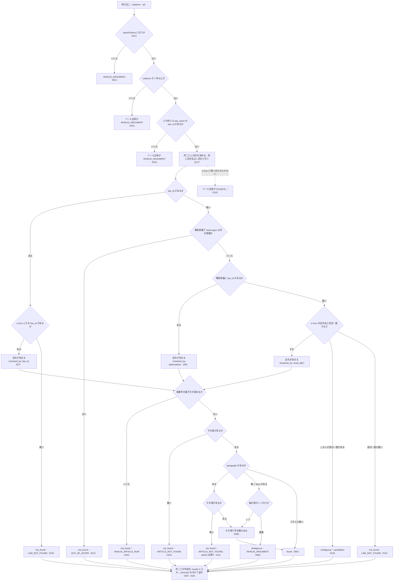

# 機能: verify_citations（法令の引用のリストをまとめて実在確認する）

- 機能 ID: EGOV
- 種類: ツール
- 版: current
- 承認日:
- 起こした元: v0.15.1 の `src/tools/definitions.ts`（`verify_citations` の定義）、`src/tools/handlers.ts`、`src/services/law-service.ts`、`src/utils/article-num.ts`、`src/services/law-tree.ts`、`src/errors.ts`、`src/constants.ts`、`src/services/law-service.verify.test.ts`、`src/tools/handlers.test.ts`
- 関連する Issue: houki-egov-mcp #18（引用の実在確認。出典は houki-hub #20 の機能 3 / houki-hub #21）

この文書は「このツールは何をするか」を書きます。どう実装しているか（関数名・テーブル名）は書きません。

## アクター

- MCP クライアント（Claude などの LLM、または CLI から呼ぶ人）。回答に添える法令の引用（法令名または `law_id`、条、任意で項・号）の配列を渡して、件ごとに「e-Gov の法令にその条・項・号があるか」の判定を受け取る

## 入力

| 引数 | 必須 | 内容 |
|---|---|---|
| `citations` | 必須 | 確かめたい引用の配列。1 件以上 50 件まで。要素は下の表 |
| `at` | 任意 | 時点。`YYYY-MM-DD` の形。全件に同じ時点を使う |

`citations` の要素:

| 引数 | 必須 | 内容 |
|---|---|---|
| `law_name` | `law_id` が無ければ必須 | 法令名または略称。例: `"所得税法"`、`"所法"` |
| `law_id` | `law_name` が無ければ必須 | e-Gov の law_id。例: `"340AC0000000033"`。`law_name` と両方あれば `law_id` を使う |
| `article` | 必須 | 条番号。例: `"30"`、`"30の2"`、`"第三十条の二"` |
| `paragraph` | 任意 | 項番号（数値）。省くと条までを確かめる |
| `item` | 任意 | 号番号。数値（`8`）または文字列（`"8"`・`"8の2"`・`"八の二"`） |
| `label` | 任意 | 引用元の表示文字列。判定には使わず、応答の `input` にそのまま返す |

## 処理の流れ

呼び出しを受けてから応答を返すまでに、何をどの順で確かめるかを示す。図の中の番号は「できること」の仕様 ID の末尾 3 桁。

## できること

### SPEC-EGOV-VERIFY-CITATIONS-001 引数の形は inputSchema で確かめる

inputSchema は、トップレベルにも `citations` の要素にも `additionalProperties: false` を持ち、`citations` の `maxItems` は 50 である。inputSchema に無い引数（例: `citations` の要素に `note`）を渡すと検証で弾かれ、ツールの処理に進まない。

### SPEC-EGOV-VERIFY-CITATIONS-002 citations が空ならツール全体をエラーにする

`citations` が空の配列のときは、件ごとの判定を返さず、ツール全体のエラー `INVALID_ARGUMENT` を返す。`hint` に、`law_name` か `law_id` と `article` を持つ引用を 1 件以上入れるよう書く。

### SPEC-EGOV-VERIFY-CITATIONS-003 law_name と law_id のどちらも無い件があればツール全体をエラーにする

`law_name` と `law_id` のどちらも無い件が 1 件でもあるときは、件ごとの判定を返さず、ツール全体のエラー `INVALID_ARGUMENT` を返す。`error` にその件の位置を `citations[1]` の形で挙げる（複数あれば `, ` でつなぐ）。

### SPEC-EGOV-VERIFY-CITATIONS-004 存在しない引用が混ざっていても件ごとの判定を返す

存在しない引用・曖昧な引用が混ざっていても、ツール全体はエラーにせず、`results` に入力と同じ数の判定を入力の順に返す。各件は次を持つ。

- `index`: `citations` の中の位置（0 始まり）
- `input`: 渡した引用そのまま（`label` も含む）
- `status`: `found`（指定した粒度まで実在した）/ `not_found`（法令・条・項・号のどれかが無い）/ `ambiguous`（どの法令・どの項を指すか決まらない）

### SPEC-EGOV-VERIFY-CITATIONS-005 found の件に付くもの

`status` が `found` の件は次を持つ。`next_actions` は付かない。条文本文は返さない。

| フィールド | 内容 |
|---|---|
| `law` | `law_id`・`title`（正式名称）・`law_num`（法令番号）・`law_type`・`url` |
| `resolved_by` | 法令をどう引いたか。`law_id` / `abbreviation` / `exact_title` |
| `article` | `num`（e-Gov の形の条番号。例: `"57_2"`）・`label`（例: `"第57条の2"`）・`caption`（条見出し。例: `"（給与所得者の特定支出の控除の特例）"`） |
| `paragraph` | 実在を確かめた項番号（項を確かめたときだけ） |
| `item` | 実在を確かめた号番号（e-Gov の形。例: `"1"`。号を確かめたときだけ） |

例: `{ law_name: "所得税法", article: "57の2", paragraph: 2, item: 1, label: "所法57の2②一" }` は、`law.law_id: "340AC0000000033"`、`law.law_num: "昭和四十年法律第三十三号"`、`article.num: "57_2"`、`paragraph: 2`、`item: "1"` の `found` になり、`input.label` は `"所法57の2②一"` のまま返る。

### SPEC-EGOV-VERIFY-CITATIONS-006 略称は略称辞書で正式名称に直してから照合する

`law_name` が略称辞書にあり、辞書が houki-egov の管轄で `law_id` を持つときは、その法令で照合する。`resolved_by` は `abbreviation`、`law.title` は正式名称である。

例: `{ law_name: "所法", article: "9" }` は `resolved_by: "abbreviation"`、`law.title: "所得税法"` の `found` になる。

### SPEC-EGOV-VERIFY-CITATIONS-007 law_id を書いた件はその法令で照合する

`law_id` を書いた件は、e-Gov からその law_id の法令を取って照合する。`resolved_by` は `law_id`。

### SPEC-EGOV-VERIFY-CITATIONS-008 項が 1 つだけの条は、項を書かずに号を指定できる

`paragraph` を省いて `item` を指定したとき、その条の項が 1 つだけなら、その項の号として確かめる。`found` の件の `paragraph` は `1` になる。

例: `{ law_id: "340AC0000000033", article: "9", item: 2 }` は `paragraph: 1`、`item: "2"` の `found` になる。

### SPEC-EGOV-VERIFY-CITATIONS-009 項が複数ある条で号だけを指定した件は ambiguous にする

`paragraph` を省いて `item` を指定したとき、その条に項が複数あれば、どの項の号か決まらないので `status: "ambiguous"`、`code: "INVALID_ARGUMENT"` を返す。

### SPEC-EGOV-VERIFY-CITATIONS-010 条が無い件は ARTICLE_NOT_FOUND にする

法令は決まったがその条が無いときは、`status: "not_found"`、`code: "ARTICLE_NOT_FOUND"` を返す。`article` は付かない。`next_actions` の先頭は `get_toc`（目次で正しい条番号を確かめる案内）である。

### SPEC-EGOV-VERIFY-CITATIONS-011 項が無い件は ARTICLE_NOT_FOUND にし、実在した条は残す

条はあるが指定した項が無いときは、`status: "not_found"`、`code: "ARTICLE_NOT_FOUND"` を返す。条は実在したので `article` は付ける。`reason` に `第<項番号>項はありません` を含める。

### SPEC-EGOV-VERIFY-CITATIONS-012 法令名が引けない件は LAW_NOT_FOUND にする

`law_name` が略称辞書に `law_id` 付きで無く、e-Gov の法令名に完全一致も部分一致も無いときは、`status: "not_found"`、`code: "LAW_NOT_FOUND"` を返す。

### SPEC-EGOV-VERIFY-CITATIONS-013 法令名が完全一致せず部分一致がある件は ambiguous にして候補を返す

`law_name` が e-Gov の法令名に完全一致せず、部分一致する法令があるときは、`status: "ambiguous"` を返し、`candidates` に候補の法令（`law_id`・`title`・`law_num`・`law_type`・`url`）を入れる。この件には `code` を付けない。

例: `{ law_name: "所得税法施行", article: "1" }` は、`candidates` の `title` が `["所得税法施行令", "所得税法施行規則"]` の `ambiguous` になる。

### SPEC-EGOV-VERIFY-CITATIONS-014 houki-egov の管轄外の引用は OUT_OF_SCOPE にする

`law_name` が略称辞書で houki-egov 以外の管轄（通達など）と分かるときは、e-Gov を引かず、`status: "not_found"`、`code: "OUT_OF_SCOPE"` を返す。

例: `{ law_name: "消基通", article: "1" }` は `OUT_OF_SCOPE` の `not_found` になる。

### SPEC-EGOV-VERIFY-CITATIONS-015 e-Gov が知らない law_id の件は LAW_NOT_FOUND にする

`law_id` を書いた件で、e-Gov がその law_id を知らないとき（400 または 404 を返したとき）は、ツール全体をエラーにせず、その件を `status: "not_found"`、`code: "LAW_NOT_FOUND"` にする。

### SPEC-EGOV-VERIFY-CITATIONS-016 summary に件数の内訳と all_found を付ける

応答は `results` のほかに次を持つ。

- `summary`: `total`（件数）・`found`・`not_found`・`ambiguous`（status ごとの件数）・`all_found`（全件が `found` のときだけ `true`）
- `method`: `"per_citation_lookup"`

例: 10 件のうち found 3・not_found 5・ambiguous 2 なら `summary` は `{ total: 10, found: 3, not_found: 5, ambiguous: 2, all_found: false }`。2 件とも found なら `{ total: 2, found: 2, not_found: 0, ambiguous: 0, all_found: true }`。

### SPEC-EGOV-VERIFY-CITATIONS-017 同じ法令名が並んでも e-Gov への問い合わせは 1 回にまとめる

1 回の呼び出しの中で同じ `law_name` の件が複数あっても、その法令名での e-Gov の法令名検索は 1 回だけ行う。

### SPEC-EGOV-VERIFY-CITATIONS-018 条番号の書き方が読めない件は INVALID_ARTICLE_NUM にする

`article` が条番号として読めない書き方（例: 位ごとに並べた漢数字 `"三〇"`）のときは、ツール全体をエラーにせず、その件を `status: "not_found"`、`code: "INVALID_ARTICLE_NUM"` にする。

### SPEC-EGOV-VERIFY-CITATIONS-019 e-Gov に問い合わせられなかったときはツール全体をエラーにする

e-Gov に問い合わせられなかったとき（例: 名前解決に失敗して接続できない）は、件ごとの判定を返さず、ツール全体のエラーを返す。接続できないときの `code` は `SOURCE_UNAVAILABLE`、`retryable` は `true`。「問い合わせられなかった」件を `not_found` と書かないためである。

## できないこと

- 引用した条文が主張を支えるかどうかを判定すること（確かめるのは条・項・号が e-Gov の法令にあるかだけ）
- 条文本文を返すこと（本文は `get_law`）
- 51 件以上の引用を 1 回で確かめること
- 通達・判例など houki-egov の管轄外の文書の引用を確かめること（`OUT_OF_SCOPE` を返すだけ）
- 件ごとに別の時点を指定すること（`at` は全件に同じ時点を使う）

## 未決

初版起こしで見つけた、意図か不具合かを人が決める項目です。決まったら「できること」に ID を振るか、`specs/changes/` の差分にします。

意図か不具合かの判断が要る項目は houki-egov-mcp の Issue に移し、ここには題と Issue の番号だけを残します。今の振る舞いのままでよくテストが無いだけの項目は、受入テストを書いてから「できること」に ID を振ります。

### 判断が要る項目

1. **附則の条にも一致する。** 条を探すとき、本則だけでなく法令全体（附則を含む）から最初に一致した条を採る。本則に無い条番号でも、附則に同じ番号の条があれば `found` になり、`article.label` は `第N条` のまま附則であることが分からない。本則の条だけを探すのか、附則に一致したときに印を付けるのかを決める必要がある。
2. **`at` の形を確かめず、e-Gov の 400 を「law_id が無い」と書くことがある。** `at` は説明に `YYYY-MM-DD` とあるが形を確かめない。本文を取るときに e-Gov が 400 か 404 を返すと、原因が `at` の形や時点（その時点に法令がまだ無い）であっても、その件を `LAW_NOT_FOUND`（`reason` は「e-Gov に law_id … の法令がありません」）にする。また `at` は法令名の検索と略称辞書の引き当てには使わない。`at` の形を先に確かめるか、時点に法令が無いことを別の `code` や `reason` で言うかを決める必要がある。
3. **ツール全体をエラーにする場面が説明より広い。** description・JSDoc・README は「タイムアウト・接続不能・5xx」のときにツール全体をエラーにすると書くが、実際は 429（`SOURCE_RATE_LIMITED`）、法令名の検索が返した 400・404 などの 4xx（`SOURCE_API_ERROR`）、e-Gov と関係の無い処理中の例外（`SOURCE_API_ERROR`、`retryable: true`）でもツール全体をエラーにし、それまでに判定できた件も返さない。説明を実際に合わせるのか、処理中の例外を `SOURCE_*` と別の code にするのかを決める必要がある。
4. **`paragraph` の値を確かめない。** `paragraph` は inputSchema で `number` なので、`0`・負の数・`1.5` も通り、`ARTICLE_NOT_FOUND`（「第1.5項はありません」）になる。号番号の不正な値は `INVALID_ARTICLE_NUM` にするのと扱いが違う。inputSchema で 1 以上の整数に限るか、`INVALID_ARTICLE_NUM` にするかを決める必要がある。
5. **法令名の完全一致を探すのは部分一致の上位 50 件の中だけ。** 略称辞書に `law_id` が無い法令名は、e-Gov の部分一致検索の結果を最大 50 件取り、その中から完全一致を探す。部分一致が 50 件を超え、完全一致の法令がその 50 件に入らなければ、実在する法令名でも `ambiguous` になる。e-Gov の検索結果の順と件数でこれが起きうるかを確かめ、起きるなら引き方を変えるかを決める必要がある。

### テストが無い項目

6. **応答の `note` と `meta`。** 応答は `note`（条・項・号の実在だけを確かめ、主張を支えるかは判定しないこと、部分一致の候補は最大 5 件で `code` を付けないこと、問い合わせられなかったときは `SOURCE_*` を返すことの注記）と、`meta.retrieved_at`（ISO 8601 の日時）、`at` を渡したときの `meta.at` を持つ。テストが無い。ID を振るのは受入テストを書いてから。
7. **`at` で時点を指定したときの判定。** `at` を渡すと、その時点の本文で条・項・号を確かめる。テストが無い。ID を振るのは受入テストを書いてから。
8. **号が無い件。** 項（または項が 1 つだけの条）はあるが指定した号が無いときは、`status: "not_found"`、`code: "ARTICLE_NOT_FOUND"` を返し、`article` と `paragraph` を付け、`reason` に「第N項に第M号はありません（号は K 個）」の形で書く。テストが無い。ID を振るのは受入テストを書いてから。
9. **号番号の書き方が読めない件。** `item` が号番号として読めない（`0`・小数・読めない文字列）ときは、その件を `status: "not_found"`、`code: "INVALID_ARTICLE_NUM"` にする。テストが無い。ID を振るのは受入テストを書いてから。
10. **found 以外の件の `next_actions` の中身。** 条が無い件の先頭が `get_toc` であることだけがテストされている。項・号が無い件と条番号・号番号が読めない件は `get_toc`、法令名が引けない件は `resolve_abbreviation` と `search_law`、部分一致の候補がある件と e-Gov が知らない law_id の件は `search_law`、管轄外の件は `delegate_to_mcp`（`example.mcp` に管轄の MCP。例: `houki-nta`）、項が複数ある条で号だけを指定した件は `add_paragraph`（`paragraph: 1` を足した引数の例付き）を入れる。テストが無い。ID を振るのは受入テストを書いてから。
11. **部分一致の候補は最大 5 件。** `candidates` に入れる候補は部分一致のうち先頭の 5 件までで、`reason` には部分一致の全件数を書く。テストが無い。ID を振るのは受入テストを書いてから。
12. **`law_name` と `law_id` の両方を書いた件。** `law_id` だけで法令を決め、`law_name` は照合に使わない（食い違っていても知らせない）。テストが無い。ID を振るのは受入テストを書いてから。
13. **空白だけの `law_name` / `law_id`。** 前後の空白を除いて空になる `law_name` / `law_id` は、無いものとして SPEC-EGOV-VERIFY-CITATIONS-003 のエラーにする。テストが無い。ID を振るのは受入テストを書いてから。
14. **同じ `law_id` が並んだとき。** 同じ `law_id` の件が複数あっても、その law_id の法令を決める問い合わせは 1 回にまとめる。テストが無い。ID を振るのは受入テストを書いてから。
15. **タイムアウト・5xx・429 のときのツール全体のエラー。** タイムアウトは `SOURCE_TIMEOUT`、5xx は `SOURCE_API_ERROR`、429 は `SOURCE_RATE_LIMITED` で、どれも `retryable: true`。テストがあるのは接続できないとき（`SOURCE_UNAVAILABLE`）だけ。テストが無い。ID を振るのは受入テストを書いてから。
16. **削除された条をまとめた範囲表記。** `article` に `"534:535"` の形を渡すと、e-Gov のその範囲の条として照合し、`article.label` は `"第534条及び第535条"` の形になる。テストが無い。ID を振るのは受入テストを書いてから。
17. **漢数字・全角数字・「第…条」の条番号。** `article` の `"第三十条の二"`・`"３０"`・`"第30条"` を e-Gov の形に直して照合する。テストが無い（条番号の変換そのもののテストはあるが、このツールの応答としてのテストが無い）。ID を振るのは受入テストを書いてから。
18. **略称辞書に law_id が無い法令名の完全一致。** 略称辞書に `law_id` が無い法令名（辞書に無い名前、または辞書の正式名称）は、e-Gov の法令名と完全一致する法令で照合し、`resolved_by` は `exact_title` になる（例: `電子帳簿保存法` → `410AC0000000025`）。テストが無い。ID を振るのは受入テストを書いてから。
